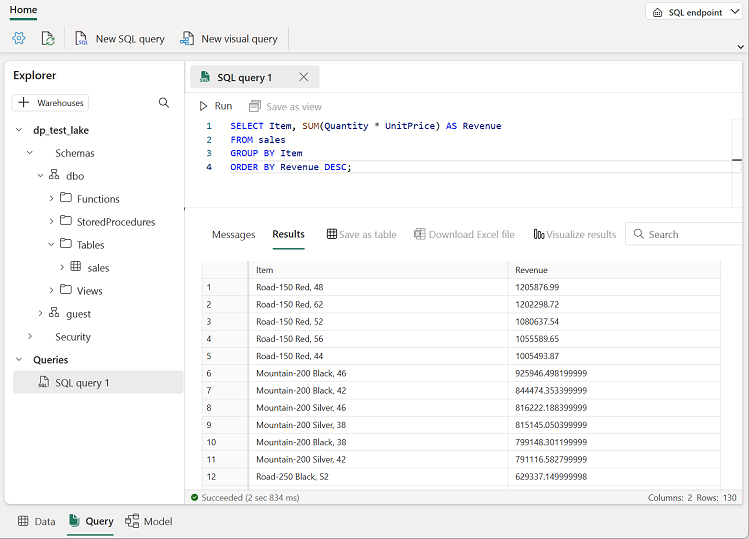
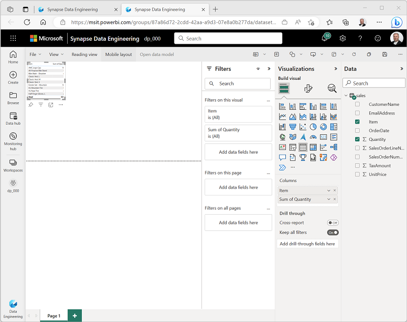
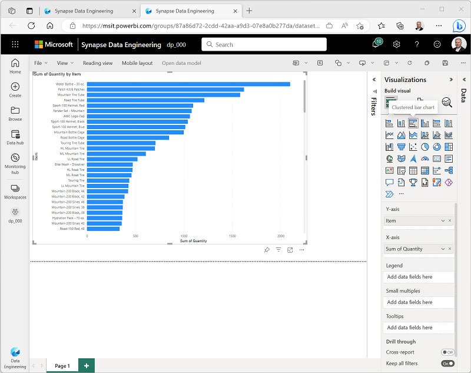

---
lab:
  title: Microsoft Fabric Lakehouse 만들기
  module: Get started with lakehouses in Microsoft Fabric
---

# Lakehouse 만들기

대규모 데이터 분석 솔루션은 일반적으로 데이터가 관계형 테이블에 저장되고 SQL을 *사용하여 쿼리되는 데이터 웨어*하우스를 중심으로 구축되었습니다. 저비용 스토리지 및 클라우드 규모의 분산 컴퓨팅 기술의 가용성과 함께 "빅 데이터"( *새 데이터 자산의 높은 볼륨*, *다양성* 및 *속도* 특징)의 성장은 분석 데이터 스토리지에 대한 대체 접근 방식인 *데이터 레이크*로 이어졌습니다. 데이터 레이크에서 데이터는 스토리지에 고정 스키마를 부과하지 않고 파일로 저장됩니다. 데이터 엔지니어와 분석가는 데이터 레이크 하우스*에서 데이터를 결합하여 *이러한 접근 방식의 최상의 기능을 활용하려고 합니다. 데이터 레이크의 파일에 데이터가 저장되고 관계형 스키마가 메타데이터 계층으로 적용되어 기존 SQL 의미 체계를 사용하여 쿼리할 수 있습니다.

Microsoft Fabric에서 Lakehouse는 오픈 소스 Delta Lake 테이블 형식을 기반으로 테이블 및 뷰와 같은 관계형 개체에 대한 메타스토어와 함께 OneLake* 저장소(Azure Data Lake* Store Gen2 기반*)에서 확장성이 뛰어난 파일 스토리지*를 제공합니다. Delta Lake를 사용하면 SQL을 사용하여 쿼리할 수 있는 레이크하우스의 테이블 스키마를 정의할 수 있습니다.

이 랩을 완료하는 데 약 **30**분이 소요됩니다.

> **참고**: 이 연습을 완료하려면 Microsoft Fabric 평가판[이 필요합니다](https://learn.microsoft.com/fabric/get-started/fabric-trial).

## 작업 영역 만들기

패브릭에서 데이터를 사용하기 전에 패브릭 평가판을 사용하도록 설정된 작업 영역을 만듭니다.

1. [Microsoft Fabric 홈페이지](https://app.fabric.microsoft.com)의 Synapse `https://app.fabric.microsoft.com`데이터 엔지니어** 선택합니다**.
1. 왼쪽 메뉴 모음에서 **작업 영역**을 선택합니다(아이콘은 와 유사함).
1. 선택한 이름으로 새 작업 영역을 만들고 패브릭 용량(*평가판*, *프리미엄* 또는 *패브릭*)이 포함된 **고급** 섹션에서 라이선스 모드를 선택합니다.
1. 새 작업 영역이 열리면 비어 있어야 합니다.

    

## 레이크하우스 만들기

이제 작업 영역이 있으므로 데이터 파일에 대한 데이터 레이크하우스를 만들어야 합니다.

1. **Synapse 데이터 엔지니어** 홈페이지에서 원하는 이름으로 새 **Lakehouse**를 만듭니다.

    1분 정도 지나면 새 레이크하우스가 만들어집니다.

    

1. 새 레이크하우스를 보고 왼쪽의 **레이크하우스 탐색기** 창을 통해 레이크하우스의 테이블과 파일을 찾아볼 수 있습니다.
    - **Tables** 폴더에는 SQL 의미 체계를 사용하여 쿼리할 수 있는 테이블이 포함되어 있습니다. Microsoft Fabric 레이크하우스의 테이블은 Apache Spark에서 일반적으로 사용되는 오픈 소스 *Delta Lake* 파일 형식을 기반으로 합니다.
    - **Files** 폴더에는 관리되는 델타 테이블과 연결되지 않은 레이크하우스의 OneLake 스토리지에 데이터 파일이 포함되어 있습니다. 이 폴더에 *바로 가기*를 만들어 외부에 저장된 데이터를 참조할 수도 있습니다.

    현재 레이크하우스에는 테이블이나 파일이 없습니다.

## 파일 업로드하기

Fabric은 파워 쿼리를 기반으로 시각적 도구를 사용하여 정의할 수 있는 데이터 외부 원본 및 데이터 흐름(Gen 2)을 복사하는 파이프라인에 대한 기본 제공 지원을 포함하여 레이크하우스에 데이터를 로드하는 여러 가지 방법을 제공합니다. 그러나 소량의 데이터를 수집하는 가장 간단한 방법 중 하나는 로컬 컴퓨터(또는 해당하는 경우 랩 VM)에서 파일 또는 폴더를 업로드하는 것입니다.

1. [sales.csv](https://raw.githubusercontent.com/MicrosoftLearning/dp-data/main/sales.csv) 파일을 `https://raw.githubusercontent.com/MicrosoftLearning/dp-data/main/sales.csv`다운로드하여 로컬 컴퓨터(또는 해당하는 경우 랩 VM)에 sales.csv** 저장**합니다.

   > **참고**: 파일을 다운로드하려면 브라우저에서 새 탭을 열고 URL에 붙여넣습니다. 데이터가 포함된 페이지의 아무 곳이나 마우스 오른쪽 단추로 클릭하고 다른 이름으로** 저장을 선택하여 **페이지를 CSV 파일로 저장합니다.

2. Lakehouse가 포함된 웹 브라우저 탭으로 돌아가서 **Lakehouse 탐색기** 창의 파일** 폴더에 **대한 **...** 메뉴에서 새 하위 폴더**를 선택하고 **데이터**라는 **하위 폴더를 만듭니다.
3. 새 데이터 폴더에 대한 ...** 메뉴에서 파일** 업로드** 및 **업로드를 선택한 **다음 로컬 컴퓨터(또는 해당하는 경우 랩 VM)에서 sales.csv** 파일을 업로드**합니다.** **** 
4. 파일이 업로드된 후 파일/데이터 폴더를 **선택하고 다음과 같이 sales.csv** 파일이 업로드되었는지 확인 **** 합니다.

    

5. **sales.csv** 파일을 선택하여 해당 콘텐츠의 미리 보기를 확인합니다.

## 바로 가기 탐색

대부분의 시나리오에서 레이크하우스에서 작업해야 하는 데이터는 다른 위치에 저장될 수 있습니다. 레이크하우스의 OneLake 스토리지에 데이터를 수집하는 방법에는 여러 가지가 있지만, 또 다른 옵션은 바로 가기를 *만드는 것입니다*. 바로 가기를 사용하면 데이터 복사와 관련된 데이터 불일치의 오버헤드 및 위험 없이 분석 솔루션에 외부 소스 데이터를 포함할 수 있습니다.

1. 파일 폴더의 **...** 메뉴에서 새 바로 가기**를 선택합니다**.** ** 
2. 사용 가능한 데이터 원본 형식에서 바로 가기를 확인합니다. 그런 다음 바로 가기를 **만들지 않고 새 바로 가기** 대화 상자를 닫습니다.

## 테이블에 파일 데이터 로드

업로드한 판매 데이터는 데이터 분석가와 엔지니어가 Apache Spark 코드를 사용하여 직접 작업할 수 있는 파일에 있습니다. 그러나 많은 시나리오에서 SQL을 사용하여 쿼리할 수 있도록 파일의 데이터를 테이블로 로드할 수 있습니다.

1. 홈페이지에서 **파일/데이터** 폴더를 **선택하여 포함된 sales.csv** 파일을 볼 **수** 있습니다.
2. sales.csv 파일의 **...** 메뉴에서 테이블**로 로드를 선택합니다**.** ** 
3. 테이블**로 로드 대화 상자에서 **테이블 이름을 판매**로 **설정하고 로드 작업을 확인합니다. 그런 다음 테이블이 만들어지고 로드될 때까지 기다립니다.

    > **팁**: 판매** 테이블이 **자동으로 표시되지 않으면 테이블** 폴더의 **...** 메뉴에서 새로 고침**을 **선택합니다**.

3. **Lakehouse 탐색기** 창에서 생성된 판매** 테이블을 선택하여 **데이터를 봅니다.

    

4. 판매** 테이블의 ****...** 메뉴에서 파일** 보기를 선택하여 **이 테이블의 기본 파일을 확인합니다.

    

    델타 테이블에 대한 파일은 Parquet* 형식으로 저장*되며 테이블에 적용된 트랜잭션의 세부 정보가 기록되는 _delta_log** 하위 **폴더를 포함합니다.

## SQL을 사용하여 테이블 쿼리

레이크하우스를 만들고 그 안에 테이블을 정의하면 SQL 엔드포인트가 자동으로 만들어지며 SQL 문을 사용하여 `SELECT` 테이블을 쿼리할 수 있습니다.

1. Lakehouse 페이지의 오른쪽 위에서 Lakehouse**에서 **SQL 분석 엔드포인트**로 **전환합니다. 그런 다음 레이크하우스에 대한 SQL 분석 엔드포인트가 테이블을 쿼리할 수 있는 시각적 인터페이스에서 열릴 때까지 잠시 기다립니다.

2. **새 SQL 쿼리** 단추를 사용하여 새 쿼리 편집기를 열고 다음 SQL 쿼리를 입력합니다.

    ```sql
   SELECT Item, SUM(Quantity * UnitPrice) AS Revenue
   FROM sales
   GROUP BY Item
   ORDER BY Revenue DESC;
    ```

3. 사용 하 여 **는 &#9655; 단추를 실행** 하여 쿼리를 실행하고 각 제품의 총 수익을 표시해야 하는 결과를 봅니다.

    

## 시각적 쿼리 만들기

많은 데이터 전문가가 SQL에 익숙하지만 Power BI 환경을 사용하는 데이터 분석가는 파워 쿼리 기술을 적용하여 시각적 쿼리를 만들 수 있습니다.

1. 도구 모음에서 새 시각적 쿼리**를 선택합니다**.
2. **다음과 같이 영업** 테이블을 열리는 새 시각적 쿼리 편집기 창으로 끌어 파워 쿼리를 만듭니다. 

    

3. **열 관리 메뉴에서 열**** 선택을 선택합니다**. 그런 다음 SalesOrderNumber** 및 **SalesOrderLineNumber** 열만 **선택합니다.

    

4. **[변환**] 메뉴에서 [그룹화** 기준]을 선택합니다**. 그런 다음, 다음 **기본** 설정을 사용하여 데이터를 그룹화합니다.

    - **그룹화 기준**: SalesOrderNumber
    - **새 열 이름**: LineItems
    - **작업**: 고유 값 개수
    - **열**: SalesOrderLineNumber

    완료되면 시각적 쿼리 아래의 결과 창에 각 판매 주문에 대한 품목 수가 표시됩니다.

    

## 보고서 만들기

Lakehouse의 테이블은 Power BI를 사용하여 보고하기 위한 기본 의미 체계 모델에 자동으로 추가됩니다.


1. SQL 엔드포인트 페이지의 맨 아래에서 모델** 탭을 **선택합니다. 의미 체계 모델에 대한 데이터 모델 스키마가 표시됩니다.

    

    > **참고**: 이 연습에서는 의미 체계 모델이 단일 테이블로 구성됩니다. 실제 시나리오에서는 레이크하우스에 여러 테이블을 만들 수 있으며, 각 테이블은 모델에 포함됩니다. 그런 다음 모델에서 이러한 테이블 간의 관계를 정의할 수 있습니다.

2. 메뉴 리본에서 보고** 탭을 **선택합니다. 그런 다음 새 보고서를** 선택합니다**. 보고서를 디자인할 수 있는 새 브라우저 탭이 열립니다.

    

3. 오른쪽의 **데이터** 창에서 판매** 테이블을 확장합니다**. 그런 다음, 다음 필드를 선택합니다.
    - **Item**
    - **수량**

    테이블 시각화가 보고서에 추가됩니다.

    

4. **데이터** 및 **필터** 창을 숨겨 더 많은 공간을 만듭니다. 그런 다음 테이블 시각화가 선택되어 있는지 확인하고 시각화** 창에서 **시각화를 **클러스터형 가로 막대형 차트**로 변경하고 여기에 표시된 대로 크기를 조정합니다.

    

5. **파일** 메뉴에서 **저장**을 선택합니다. 그런 다음 이전에 만든 작업 영역에 보고서를 항목 판매 보고서**로 **저장합니다.
6. 보고서가 포함된 브라우저 탭을 닫고 레이크하우스의 SQL 엔드포인트로 돌아갑니다. 그런 다음 왼쪽의 허브 메뉴 모음에서 작업 영역을 선택하여 다음 항목이 포함되어 있는지 확인합니다.
    - 당신의 호숫가.
    - Lakehouse에 대한 SQL 분석 엔드포인트입니다.
    - Lakehouse의 테이블에 대한 기본 의미 체계 모델입니다.
    - **항목 판매 보고서 보고서**입니다.

## 리소스 정리

이 연습에서는 Lakehouse를 만들고 데이터를 가져왔습니다. Lakehouse가 OneLake 데이터 저장소에 저장된 파일과 테이블로 구성된 방법을 살펴보았습니다. 관리되는 테이블은 SQL을 사용하여 쿼리할 수 있으며 데이터 시각화를 지원하기 위한 기본 의미 체계 모델에 포함됩니다.

레이크하우스 탐색을 완료한 경우 이 연습에 대해 만든 작업 영역을 삭제할 수 있습니다.

1. 왼쪽 막대에서 작업 영역의 아이콘을 선택하여 포함된 모든 항목을 봅니다.
2. 도구 모음의 **...** 메뉴에서 **작업 영역 설정**을 선택합니다.
3. **기타** 섹션에서 **이 작업 영역 제거**를 선택합니다.
