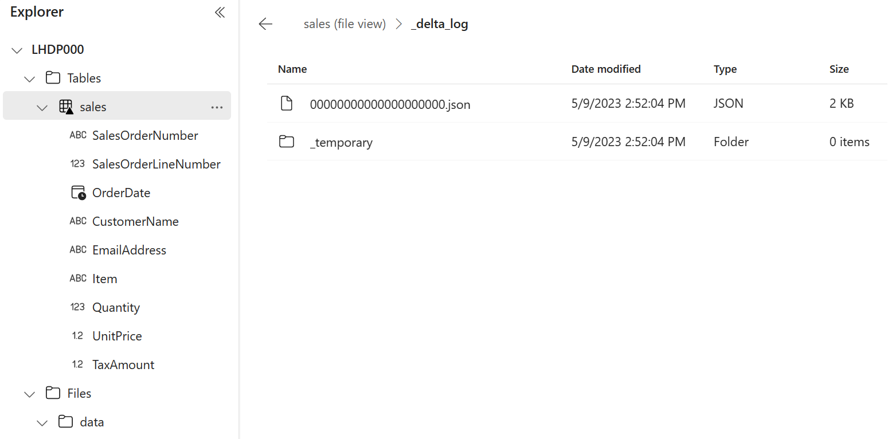

---
lab:
  title: Microsoft Fabric 레이크하우스 만들기
  module: Get started with lakehouses in Microsoft Fabric
---

# Microsoft Fabric 레이크하우스 만들기

대규모 데이터 분석 솔루션은 전통적으로 데이터가 관계형 테이블에 저장되고 SQL을 사용하여 쿼리되는 *데이터 웨어하우스*를 중심으로 빌드되었습니다. 저렴한 스토리지 및 클라우드 규모의 분산 컴퓨팅 기술의 가용성과 함께 "빅 데이터"(새로운 데이터 자산의 높은 *볼륨*, *다양성*, *개발속도*가 특징임)의 성장으로 인해 분석 데이터 스토리지(*데이터 레이크*)에 대한 대안적인 방식이 탄생했습니다. 데이터 레이크에서는 데이터가 고정된 스토리지 스키마를 적용하지 않고 파일로 저장됩니다. 점차적으로 데이터 엔지니어와 분석가는 이 두 가지 방식을 하나의 *데이터 레이크하우스*에 결합하여 두 가지 방식의 혜택을 최대한 활용하려고 합니다. 데이터가 데이터 레이크의 파일에 저장되고 관계형 스키마가 메타데이터 레이어로 적용되어 기존 SQL 의미 체계를 사용하여 쿼리할 수 있습니다.

Microsoft Fabric에서 레이크하우스는 오픈 소스 *Delta Lake* 테이블 형식을 기반으로 하는 테이블 및 뷰와 같은 관계형 개체에 대한 메타스토어가 있는 *OneLake* 스토리지(Azure Data Lake Store Gen2를 기반으로 빌드됨)에서 확장성이 뛰어난 파일 스토리지를 제공합니다. Delta Lake를 사용하면 SQL을 사용하여 쿼리할 수 있는 레이크하우스의 테이블 스키마를 정의할 수 있습니다.

이 랩을 완료하는 데 약 **30**분이 소요됩니다.

> **참고**: 이 연습을 완료하려면 [Microsoft Fabric 평가판](https://learn.microsoft.com/fabric/get-started/fabric-trial)이 필요합니다.

## 작업 영역 만들기

패브릭에서 데이터를 사용하기 전에 패브릭 평가판을 사용하도록 설정된 작업 영역을 만듭니다.

1. 브라우저에서 [Microsoft Fabric 홈페이지](https://app.fabric.microsoft.com/home?experience=fabric)(`https://app.fabric.microsoft.com/home?experience=fabric`)로 이동하고 Fabric 자격 증명을 사용해 로그인합니다.
1. 왼쪽 메뉴 모음에서 **작업 영역**을 선택합니다(아이콘은 와 유사함).
1. 선택한 이름으로 새 작업 영역을 만들고 패브릭 용량(*평가판*, *프리미엄* 또는 *패브릭*)이 포함된 **고급** 섹션에서 라이선스 모드를 선택합니다.
1. 새 작업 영역이 열리면 비어 있어야 합니다.

    

## 레이크하우스 만들기

이제 작업 영역이 있으므로 데이터 파일을 위한 데이터 레이크하우스를 만들 차례입니다.

1. 왼쪽 메뉴 모음에서 **만들기**를 선택합니다. *새* 페이지의 *데이터 엔지니어링* 섹션에서 **레이크하우스**를 선택합니다. 원하는 고유한 이름.

    >**참고**: **만들기** 옵션이 사이드바에 고정되지 않은 경우 먼저 줄임표(**...**) 옵션을 선택해야 합니다.

    1분 정도 지나면 새 레이크하우스가 만들어집니다.

    

1. 새 레이크하우스를 보고 왼쪽의 **레이크하우스 탐색기** 창을 통해 레이크하우스의 테이블과 파일을 찾아볼 수 있습니다.
    - **Tables** 폴더에는 SQL 의미 체계를 사용하여 쿼리할 수 있는 테이블이 포함되어 있습니다. Microsoft Fabric 레이크하우스의 테이블은 Apache Spark에서 일반적으로 사용되는 오픈 소스 *Delta Lake* 파일 형식을 기반으로 합니다.
    - **Files** 폴더에는 관리되는 델타 테이블과 연결되지 않은 레이크하우스의 OneLake 스토리지에 데이터 파일이 포함되어 있습니다. 이 폴더에 *바로 가기*를 만들어 외부에 저장된 데이터를 참조할 수도 있습니다.

    현재 레이크하우스에는 테이블이나 파일이 없습니다.

## 파일 업로드하기

Fabric은 Power Query를 기반으로 하는 시각적 도구를 사용하여 정의할 수 있는 외부 원본 및 데이터 흐름(Gen 2)에서 데이터를 복사하는 파이프라인에 대한 기본 지원을 포함하여 레이크하우스에 데이터를 로드하는 다양한 방법을 제공합니다. 그러나 소량의 데이터를 수집하는 가장 간단한 방법 중 하나는 로컬 컴퓨터(또는 해당하는 경우 랩 VM)에서 파일이나 폴더를 업로드하는 것입니다.

1. `https://raw.githubusercontent.com/MicrosoftLearning/dp-data/main/sales.csv`에서 [sales.csv](https://raw.githubusercontent.com/MicrosoftLearning/dp-data/main/sales.csv) 파일을 다운로드하여 로컬 컴퓨터(또는 해당하는 경우 랩 VM)에 **sales.csv**로 저장합니다.

   > **참고**: 파일을 다운로드하려면 브라우저에서 새 탭을 열고 URL을 붙여넣으세요. 데이터가 포함된 페이지의 아무 곳이나 마우스 오른쪽 단추로 클릭하고 **다른 이름으로 저장**을 선택하여 페이지를 CSV 파일로 저장합니다.

2. 레이크하우스가 포함된 웹 브라우저 탭으로 돌아가서 **레이크하우스 탐색기** 창에 있는 **Files** 폴더에 대한 **...** 메뉴에서 **새 하위 폴더**를 선택하고 **data**라는 하위 폴더를 만듭니다.
3. 새 **data** 폴더에 대한 **...** 메뉴에서 **업로드** 및 **파일 업로드**를 선택한 다음 로컬 컴퓨터(또는 해당하는 경우 랩 VM)에서 **sales.csv** 파일을 업로드합니다.
4. 파일이 업로드된 후 다음과 같이 **Files/data** 폴더를 선택하고 **sales.csv** 파일이 업로드되었는지 확인합니다.

    

5. 콘텐츠를 미리 보려면 **sales.csv** 파일을 선택합니다.

## 바로 가기 살펴보기

많은 시나리오에서 레이크하우스에서 작업해야 하는 데이터는 다른 위치에 저장될 수 있습니다. 레이크하우스의 OneLake 스토리지에 데이터를 수집하는 방법에는 여러 가지가 있지만 대신 *바로 가기*를 만드는 방법도 있습니다. 바로 가기를 사용하면 복사와 관련된 데이터 불일치 위험 및 오버헤드 없이 분석 솔루션에 외부 원본 데이터를 포함할 수 있습니다.

1. **Files** 폴더의 **...** 메뉴에서 **새 바로 가기**를 선택합니다.
2. 바로 가기에 사용 가능한 데이터 원본 유형을 봅니다. 그런 다음 바로 가기를 만들지 않고 **새 바로 가기** 대화 상자를 닫습니다.

## 파일 데이터를 테이블에 로드

업로드한 판매 데이터는 데이터 분석가와 엔지니어가 Apache Spark 코드를 사용하여 직접 작업할 수 있는 파일에 있습니다. 그러나 많은 시나리오에서는 SQL을 사용하여 쿼리할 수 있도록 파일의 데이터를 테이블로 로드할 수 있습니다.

1. **홈** 페이지에서 **Files/Data** 폴더를 선택하면 해당 폴더에 포함된 **sales.csv** 파일을 볼 수 있습니다.
2. **sales.csv** 파일의 **...** 메뉴에서 **테이블에 로드** > **새 테이블**을 선택합니다.
3. **테이블에 로드** 대화 상자에서 테이블 이름을 **sales**로 설정하고 로드 작업을 확인합니다. 그런 다음 테이블이 만들어지고 로드될 때까지 기다립니다.

    > **팁**: **sales** 테이블이 자동으로 표시되지 않으면 **Tables** 폴더의 **...** 메뉴에서 **새로 고침**을 선택합니다.

3. **레이크하우스 탐색기** 창에서 데이터를 보기 위해 만들어진 **sales** 테이블을 선택합니다.

    

4. **sales** 테이블의 **...** 메뉴에서 **파일 보기**를 선택하여 이 테이블의 기본 파일을 확인합니다.

    

    델타 테이블의 파일은 *Parquet* 형식으로 저장되며 테이블에 적용된 트랜잭션의 세부 정보가 기록되는 **_delta_log**라는 하위 폴더를 포함합니다.

## SQL을 사용하여 테이블 쿼리

레이크하우스를 만들고 그 안에 테이블을 정의하면 SQL `SELECT` 문을 사용하여 테이블을 쿼리할 수 있는 SQL 엔드포인트가 자동으로 만들어집니다.

1. 레이크하우스 페이지 오른쪽 상단에서 **레이크하우스**에서 **SQL 분석 엔드포인트**로 전환합니다. 그런 다음 레이크하우스에 대한 SQL 분석 엔드포인트가 테이블을 쿼리할 수 있는 시각적 인터페이스에서 열릴 때까지 잠시 기다립니다.

2. **새 SQL 쿼리** 단추를 사용하여 새 쿼리 편집기를 열고 다음 SQL 쿼리를 입력합니다.

    ```sql
   SELECT Item, SUM(Quantity * UnitPrice) AS Revenue
   FROM sales
   GROUP BY Item
   ORDER BY Revenue DESC;
    ```
> **참고**: 랩 VM에 있고 SQL 쿼리를 입력하는 데 문제가 있는 경우 `https://github.com/MicrosoftLearning/mslearn-fabric/raw/main/Allfiles/Labs/01/Assets/01-Snippets.txt`에서 [01-Snippets.txt](https://github.com/MicrosoftLearning/mslearn-fabric/raw/main/Allfiles/Labs/01/Assets/01-Snippets.txt) 파일을 다운로드하여 VM에 저장할 수 있습니다. 그런 다음 텍스트 파일에서 쿼리를 복사할 수 있습니다.

3. **&#9655; 실행** 단추를 눌러 쿼리를 실행하고 결과를 확인하면 각 제품의 총 수익이 표시됩니다.

    

## 시각적 쿼리 만들기

많은 데이터 전문가가 SQL에 익숙하지만 Power BI 환경이 있는 데이터 분석가는 Power Query 기술을 적용하여 시각적 쿼리를 만들 수 있습니다.

1. 도구 모음에서 **새 SQL 쿼리** 옵션을 확장하고 **새 시각적 쿼리**를 선택합니다.
2. 다음과 같이 Power Query를 만들기 위해 열리는 새 시각적 쿼리 편집기 창으로 **sales** 테이블을 끕니다. 

    

3. **열 관리** 메뉴에서 **열 선택**을 선택합니다. 그런 다음 **SalesOrderNumber** 및 **SalesOrderLineNumber** 열만 선택합니다.

    

4. **변환** 메뉴에서 **Group By**를 선택합니다. 그리고 다음 **기본** 설정을 사용하여 데이터를 그룹화합니다.

    - **그룹화 방법**: SalesOrderNumber
    - **새 열 이름**: LineItems
    - **Operation**: 고유 값 계산
    - **Column**: SalesOrderLineNumber

    완료되면 시각적 쿼리 아래의 결과 창에 각 판매 주문에 대한 항목 수가 표시됩니다.

    

## 리소스 정리

이 연습에서는 레이크하우스를 만들고 해당 하우스로 데이터를 가져왔습니다. 레이크하우스가 OneLake 데이터 저장소에 저장된 파일과 테이블로 구성되는 방식을 살펴보았습니다. 관리형 테이블은 SQL을 사용하여 쿼리할 수 있으며 데이터 시각화를 지원하기 위해 기본 의미 체계 모델에 포함됩니다.

레이크하우스 탐색을 마쳤으면 이 연습을 위해 만든 작업 영역을 삭제할 수 있습니다.

1. 왼쪽 막대에서 작업 영역의 아이콘을 선택하여 포함된 모든 항목을 봅니다.
2. 메뉴에서 **작업 영역 설정**을 선택합니다.
3. **일반** 섹션에서 **이 작업 영역 제거**를 선택합니다.
