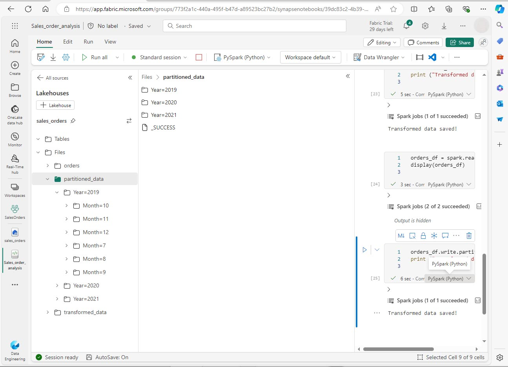

---
lab:
  title: Apache Spark를 사용하여 데이터 분석
  module: Use Apache Spark to work with files in a lakehouse
---

# Fabric에서 Apache Spark를 사용하여 데이터 분석

이 랩에서는 데이터를 Fabric 레이크하우스로 수집하고 이 데이터를 PySpark를 사용하여 읽고 분석합니다.

이 랩을 완료하는 데 약 45분이 걸립니다.

## 필수 조건

* [Microsoft Fabric 평가판](https://www.microsoft.com/microsoft-fabric/getting-started).

## 작업 영역 만들기

Fabric에서 데이터를 사용하려면 작업 영역을 만들어야 합니다.

1. [Microsoft Fabric](https://app.fabric.microsoft.com) 홈페이지(https://app.fabric.microsoft.com)에서 **데이터 엔지니어링** 환경을 선택합니다.
1. 왼쪽 메뉴 모음에서 **작업 영역**(🗇)을 선택한 다음 **새 작업 영역**을 선택합니다.
1. 새 작업 영역에 이름을 지정하고 **고급** 섹션에서 적절한 라이선스 모드를 선택합니다. Microsoft Fabric 평가판을 시작한 경우 평가판을 선택합니다.
1. **적용**을 선택하여 빈 작업 영역을 만듭니다.
 
    

## 레이크하우스 만들기 및 파일 업로드

이제 작업 영역이 있으므로 데이터 파일을 저장할 레이크하우스를 만들 수 있습니다. 새 작업 영역에서 **새로 만들기**와 **레이크하우스**를 선택합니다. 레이크하우스의 이름을 지정한 다음 **만들기**를 선택합니다. 잠시 후 새 레이크하우스가 만들어집니다.

이제 레이크하우스에 데이터를 수집할 수 있습니다. 수집 방법은 여러 가지가 있지만 이번에는 로컬 컴퓨터(또는 해당하는 경우 랩 VM)에 텍스트 파일 폴더를 다운로드하여 이를 레이크하우스에 업로드해 보겠습니다.

1. https://github.com/MicrosoftLearning/dp-data/raw/main/orders.zip에서 데이터 파일을 다운로드합니다.
1. 보관 파일의 압축을 푼 후 CSV 파일 세 개가 들어 있는 *orders* 폴더가 있는지 확인합니다. 파일 이름은 각각 2019.csv, 2020.csv, 2021.csv입니다.
1. 새 레이크하우스로 돌아갑니다. **탐색기** 창에서 **Files** 폴더 옆에 있는 **…** 메뉴를 선택하고 **업로드** 및 **폴더 업로드**를 선택합니다. 로컬 컴퓨터의 orders 폴더(또는 해당하는 경우 랩 VM)로 이동하여 **업로드**를 선택합니다.
1. 파일이 업로드된 후 **Files** 폴더를 확장하고 **orders** 폴더를 선택합니다. 여기에 나온 것처럼 CSV 파일이 업로드되었는지 확인합니다.

    

## Notebook 만들기

이제 데이터를 사용하여 작업할 Fabric Notebook을 만들 수 있습니다. Notebook은 코드를 작성하고 실행할 수 있는 대화형 환경을 제공합니다.

1. 작업 영역을 선택한 다음 **새로 만들기**와 **Notebook**을 선택합니다. 몇 초 후에 단일 셀이 포함된 새 Notebook이 열립니다. Notebook은 코드 또는 markdown(서식이 지정된 텍스트)을 포함할 수 있는 하나 이상의 셀로 구성됩니다.
1. Fabric은 만든 Notebook마다 이름을 할당합니다(예: Notebook 1, Notebook 2 등). 메뉴의 **홈** 탭 위에 있는 이름 패널을 클릭하여 보다 내용을 잘 알 수 있는 이름으로 변경할 수 있습니다.
1. 첫 번째 셀(현재 코드 셀)을 선택한 다음 오른쪽 위에 있는 도구 모음에서 **M↓** 버튼을 사용하여 셀을 Markdown 셀로 변환합니다. 그러면 셀에 포함된 텍스트가 서식이 지정된 텍스트로 표시됩니다.
1. 🖉(편집) 버튼을 사용하여 셀을 편집 모드로 전환한 후 다음과 같이 markdown을 수정합니다.

    ```markdown
   # Sales order data exploration
   Use this notebook to explore sales order data
    ```

    

완료한 다음에는 Notebook의 셀 외부 아무 곳이나 클릭하여 편집을 중지하고 렌더링된 markdown을 확인합니다.

## DataFrame 만들기

이제 작업 영역, 레이크하우스 및 notebook을 만들었으므로 데이터를 사용하여 작업할 준비가 되었습니다. Fabric Notebook의 기본 언어이며 Python의 Spark 최적화 버전인 PySpark를 사용하겠습니다.

>[!NOTE]
> Fabric Notebook은 Scala, R, Spark SQL을 비롯한 여러 프로그래밍 언어를 지원합니다.

1. 왼쪽 표시줄에서 새 작업 영역을 선택합니다. 레이크하우스와 notebook 등 작업 영역에 포함된 항목 목록이 표시됩니다.
2. 레이크하우스를 선택하여 **orders** 폴더를 포함한 탐색기 창을 표시합니다 .
3. 위쪽 메뉴에서 **Notebook 열기**, **기존 notebook**을 선택한 다음 앞에서 만든 notebook을 엽니다. 이제 탐색기 창 옆에 notebook이 열려 있어야 합니다. 레이크하우스를 확장하고 Files 목록을 확장한 다음 orders 폴더를 선택합니다. 업로드한 CSV 파일은 다음과 같이 Notebook 편집기 옆의 목록에 표시됩니다.

    

4. 2019.csv의 ... 메뉴에서 데이터 **데이터 로드** > **Spark**를 선택합니다. 다음 코드가 새 코드 셀에서 자동으로 생성됩니다.

    ```python
    df = spark.read.format("csv").option("header","true").load("Files/orders/2019.csv")
    # df now is a Spark DataFrame containing CSV data from "Files/orders/2019.csv".
    display(df)
    ```

>[!TIP]
> « 아이콘을 사용하여 왼쪽의 레이크하우스 탐색기 창을 숨길 수 있습니다. 이렇게 하면 notebook을 사용할 공간이 더 많이 확보됩니다.

5. 셀 왼쪽에 있는 ▷ **셀 실행**을 선택하여 코드를 실행합니다.

>[!NOTE]
> Spark 코드를 처음 실행할 때는 Spark 세션이 시작됩니다. 몇 초 이상 걸릴 수 있습니다. 동일한 세션 내 후속 실행은 더 빨라집니다.

6. 셀 명령이 완료되면 셀 아래의 출력을 검토합니다. 다음과 같은 출력을 확인할 수 있습니다.
 
    

7. 출력에는 2019.csv 파일의 데이터가 열과 행으로 표시됩니다.  열 머리글에 데이터의 첫 번째 줄이 포함됩니다. 이 문제를 해결하려면 코드의 첫 번째 줄을 다음과 같이 수정해야 합니다.

    ```python
    df = spark.read.format("csv").option("header","false").load("Files/orders/2019.csv")
    ```

8. DataFrame이 첫 번째 행을 데이터로 올바르게 식별할 수 있도록 코드를 다시 실행합니다. 이제 열 이름이 _c0, _c1 등으로 변경되었습니다.

9. 열 이름에 설명 정보를 포함하면 데이터를 이해하는 데 도움이 됩니다. 의미 있는 열 이름을 만들려면 스키마 및 데이터 형식을 정의해야 합니다. 데이터 형식을 정의하기 위해 Spark SQL 형식의 표준 집합도 가져와야 합니다. 기존 코드를 다음으로 바꿉니다.

    ```python
    from pyspark.sql.types import *

    orderSchema = StructType([
        StructField("SalesOrderNumber", StringType()),
        StructField("SalesOrderLineNumber", IntegerType()),
        StructField("OrderDate", DateType()),
        StructField("CustomerName", StringType()),
        StructField("Email", StringType()),
        StructField("Item", StringType()),
        StructField("Quantity", IntegerType()),
        StructField("UnitPrice", FloatType()),
        StructField("Tax", FloatType())
    ])

    df = spark.read.format("csv").schema(orderSchema).load("Files/orders/2019.csv")

    display(df)
    ```
    
10. 셀을 실행하고 출력을 검토합니다.

    

11. DataFrame에는 2019.csv 파일의 데이터만 포함됩니다. 파일 경로에 * 와일드카드를 사용하여 orders 폴더의 모든 파일을 읽도록 코드를 수정합니다.

    ```python
    from pyspark.sql.types import *

    orderSchema = StructType([
        StructField("SalesOrderNumber", StringType()),
        StructField("SalesOrderLineNumber", IntegerType()),
        StructField("OrderDate", DateType()),
        StructField("CustomerName", StringType()),
        StructField("Email", StringType()),
        StructField("Item", StringType()),
        StructField("Quantity", IntegerType()),
        StructField("UnitPrice", FloatType()),
        StructField("Tax", FloatType())
        ])

    df = spark.read.format("csv").schema(orderSchema).load("Files/orders/*.csv")

    display(df)
    ```

12. 수정된 코드를 실행하면 2019년, 2020년, 2021년 판매량이 표시됩니다. 행의 일부 하위 집합만 표시되므로 모든 해에 대한 행이 표시되지는 않을 수 있습니다.

>[!NOTE]
> **...** 를 선택하여 셀의 출력을 숨기거나 표시할 수 있습니다. 선택하여 셀의 출력을 숨기거나 표시할 수 있습니다. 이렇게 하면 notebook 작업이 쉬워집니다.

## DataFrame에서 데이터 탐색

DataFrame 개체는 데이터를 필터링, 그룹화, 조작하는 등 추가 기능을 제공합니다.

### DataFrame 필터링

1. 현재 셀이나 그 출력의 위 또는 아래를 마우스로 가리키면 나타나는 **+ 코드**를 선택하여 코드 셀을 추가합니다. 아니면 리본 메뉴에서 **편집**을 선택하고 + 코드 셀 ** 추가**를 선택합니다.

2.  다음 코드는 데이터를 필터링해 두 개의 열만 반환되도록 합니다. *count*와 *distinct*를 사용하여 레코드 수를 요약합니다.

    ```python
    customers = df['CustomerName', 'Email']

    print(customers.count())
    print(customers.distinct().count())

    display(customers.distinct())
    ```

3. 코드를 실행하고 출력을 확인합니다.

    * 이 코드는 원래 **df** DataFrame의 열 하위 집합을 포함하는 **customers**라는 새 DataFrame을 만듭니다. DataFrame 변환을 수행할 때는 원래 DataFrame을 수정하지 않고 새로 만들어 반환합니다.
    * 동일한 결과를 달성하는 또 다른 방법은 select 메서드를 사용하는 것입니다.

    ```
    customers = df.select("CustomerName", "Email")
    ```

    * DataFrame 함수 *count* 및 *distinct*는 고객 및 고유 고객 수의 합계를 제공하는 데 사용됩니다.

4. 다음과 같이 *select*를 *where* 함수와 함께 사용하여 코드의 첫 번째 줄을 수정합니다.

    ```python
    customers = df.select("CustomerName", "Email").where(df['Item']=='Road-250 Red, 52')
    print(customers.count())
    print(customers.distinct().count())

    display(customers.distinct())
    ```

5. 수정된 코드를 실행하여 Road-250 Red, 52 제품을 구매한 고객만 선택합니다. 여러 함수를 함께 “연결”하여 한 함수의 출력이 다음 함수의 입력이 되도록 할 수 있습니다. 이 경우 *select* 메서드에서 만든 DataFrame은이 필터링 조건을 적용하는 데 사용되는 **where** 메서드의 소스 DataFrame입니다.

### DataFrame의 데이터 집계 및 그룹화

1. 코드 셀을 추가하고 다음 코드를 입력합니다.

    ```python
    productSales = df.select("Item", "Quantity").groupBy("Item").sum()

    display(productSales)
    ```

2. 코드를 실행합니다. 결과에 제품별로 그룹화된 주문 수량의 합계가 표시됩니다. *groupBy* 메서드는 행을 품목 단위로 그룹화하고 그 뒤를 따라오는 *sum* 집계 함수는 나머지 숫자 열, 이 경우 *Quantity*에 적용됩니다.

3. Notebook에 다른 코드 셀을 추가하고 다음 코드를 입력합니다.

    ```python
    from pyspark.sql.functions import *

    yearlySales = df.select(year(col("OrderDate")).alias("Year")).groupBy("Year").count().orderBy("Year")

    display(yearlySales)
    ```

4. 셀을 실행합니다. 출력을 검사합니다. 이제 결과에 연간 판매 주문 수가 표시됩니다.

    * *import* 문을 사용하면 Spark SQL 라이브러리를 사용할 수 있습니다.
    * *select* 메서드는 SQL 연도 함수와 함께 *OrderDate* 필드의 연도 구성 요소를 추출하는 데 사용됩니다.
    * *alias* 메서드는 추출한 연도 값에 열 이름을 할당하는 데 사용됩니다.
    * *groupBy* 메서드는 이렇게 만든 Year 열에 따라 데이터를 그룹화합니다.
    * 각 그룹의 행 수를 계산한 후에는 *orderBy* 메서드를 사용하여 결과 DataFrame을 정렬합니다.

    

## Spark를 사용하여 데이터 파일 변환

데이터 엔지니어와 데이터 과학자는 추가 다운스트림 처리 또는 분석을 위해 데이터를 변환하는 작업을 많이 합니다.

### DataFrame 메서드 및 함수를 사용한 데이터 변환

1. Notebook에 코드 셀을 추가하고 다음을 입력합니다.

    ```python
    from pyspark.sql.functions import *

    # Create Year and Month columns
    transformed_df = df.withColumn("Year", year(col("OrderDate"))).withColumn("Month", month(col("OrderDate")))

    # Create the new FirstName and LastName fields
    transformed_df = transformed_df.withColumn("FirstName", split(col("CustomerName"), " ").getItem(0)).withColumn("LastName", split(col("CustomerName"), " ").getItem(1))

    # Filter and reorder columns
    transformed_df = transformed_df["SalesOrderNumber", "SalesOrderLineNumber", "OrderDate", "Year", "Month", "FirstName", "LastName", "Email", "Item", "Quantity", "UnitPrice", "Tax"]

    # Display the first five orders
    display(transformed_df.limit(5))
    ```

2. 셀을 실행합니다. 원본 주문 데이터에서 다음과 같은 변환이 적용된 새 DataFrame이 만들어집니다.

    - OrderDate 열을 기반으로 Year 및 Month 열이 추가됩니다.
    - CustomerName 열을 기반으로 FirstName 및 LastName 열이 추가됩니다.
    - 열을 필터링하고 재정렬한 뒤 CustomerName 열이 제거됩니다.

3. 출력을 검토하고 데이터가 변환되었는지 확인합니다.

Spark SQL 라이브러리를 사용하여 행 필터링, 열 파생, 제거, 이름 바꾸기, 기타 데이터 수정 적용 등의 작업으로 데이터를 변환할 수 있습니다.

>[!TIP]
> Dataframe 개체에 대해 자세히 알아보려면 [Apache Spark dataframe](https://spark.apache.org/docs/latest/api/python/reference/pyspark.sql/dataframe.html) 설명서를 참조하세요.

### 변환된 데이터 저장

이제 변환된 데이터를 저장하여 추가 분석에 사용할 수 있도록 만들 수 있습니다.

*Parquet*은 데이터를 효율적으로 저장하고 대부분의 대규모 데이터 분석 시스템에서 지원되기 때문에 인기 있는 데이터 스토리지 형식입니다. 실제로 데이터 변환 시 요구 사항이 데이터를 CSV 등 다른 형식에서 Parquet으로 변환하는 것인 경우도 있습니다.

1. 변환된 DataFrame을 Parquet 형식으로 저장하려면 코드 셀을 추가하고 다음 코드를 추가합니다.  

    ```python
    transformed_df.write.mode("overwrite").parquet('Files/transformed_data/orders')

    print ("Transformed data saved!")
    ```

2. 셀을 실행하고 데이터가 저장되었다는 메시지를 기다립니다. 그런 다음 왼쪽 레이크하우스 창의 Files 노드에 대한 ... 메뉴에서 **새로 고침**을 선택합니다. transformed_data 폴더를 선택하여 orders라는 새 폴더가 들어 있는지 확인합니다. 이 폴더에는 하나 이상의 Parquet 파일이 포함됩니다.

3. 다음 코드를 사용하여 셀을 추가합니다.

    ```python
    orders_df = spark.read.format("parquet").load("Files/transformed_data/orders")
    display(orders_df)
    ```

4. 셀을 실행합니다.  *transformed_data/orders* 폴더의 parquet 파일에서 새 DataFrame이 만들어집니다. 결과에 parquet 파일에서 로드된 주문 데이터가 표시되는지 확인합니다.

    

### 분할된 파일에 데이터 저장

대량의 데이터를 처리할 때는 분할을 통해 성능을 크게 높이고 데이터를 더 쉽게 필터링할 수 있습니다.

1. 데이터를 Year 및 Month 단위로 분할하여 dataframe을 저장하는 코드가 있는 셀을 추가합니다.

    ```python
    orders_df.write.partitionBy("Year","Month").mode("overwrite").parquet("Files/partitioned_data")

    print ("Transformed data saved!")
    ```

2.  셀을 실행하고 데이터가 저장되었다는 메시지를 기다립니다. 그런 다음 왼쪽 레이크하우스 창의 Files 노드에 대한 ... Files 노드의 ... 메뉴에서 **새로 고침**을 선택하고 partitioned_orders 폴더를 확장하여 이름이 *Year=xxxx*인 폴더 계층 구조가 들어 있고, 각 폴더에는 이름이 *Month=xxxx*인 폴더가 들어 있는지 확인합니다. 각 월 폴더에는 해당 월의 주문이 포함된 parquet 파일이 포함되어 있습니다.

    

3. 다음 코드를 사용하여 새 셀을 추가하여 orders.parquet 파일에서 새 DataFrame을 로드합니다.

    ```python
    orders_2021_df = spark.read.format("parquet").load("Files/partitioned_data/Year=2021/Month=*")

    display(orders_2021_df)
    ```

4. 셀을 실행하고 결과에 2021년 판매 주문 데이터가 표시되는지 확인합니다. 경로에 지정된 분할 열(Year 및 Month)은 DataFrame에 포함되지 않습니다.

## 테이블 및 SQL 작업

DataFrame 개체의 네이티브 메서드를 사용하면 파일의 데이터를 매우 효과적으로 쿼리 및 분석할 수 있다는 것을 확인했습니다. 그러나 SQL 구문을 사용하여 테이블로 작업하는 것이 더 편할 수도 있습니다. Spark는 관계형 테이블을 정의할 수 있는 메타스토어를 제공합니다. 

Spark SQL 라이브러리는 SQL 문을 사용하여 메타스토어의 테이블을 쿼리하는 기능을 지원합니다. 이 기능을 사용하면 데이터 레이크의 유연성을 관계형 데이터 웨어하우스의 구조화된 데이터 스키마 및 SQL 기반 쿼리와 결합할 수 있습니다. 따라서 "데이터 레이크하우스"라는 용어가 사용됩니다.

### 테이블 만들기

Spark 메타스토어의 테이블은 데이터 레이크의 파일에 대한 관계형 추상화입니다. 테이블은 메타스토어를 통한 *관리*형 테이블로 만들거나 메타데이터와 독립적으로 관리되는 *외부* 테이블로 만들 수 있습니다.

1.  Notebook에 코드 셀을 추가하고 판매 주문 데이터의 DataFrame을 *salesorders*라는 테이블로 저장하는 다음 코드를 입력합니다.

    ```python
    # Create a new table
    df.write.format("delta").saveAsTable("salesorders")

    # Get the table description
    spark.sql("DESCRIBE EXTENDED salesorders").show(truncate=False)
    ```

>[!NOTE]
> 이 예제의 경우 명시적인 경로를 입력하지 않으므로 테이블의 파일은 메타스토어에서 관리됩니다. 또한 이 테이블은 테이블에 관계형 데이터베이스 기능을 추가하는 델타 형식으로 저장됩니다. 여기에는 트랜잭션, 행 버전 관리, 기타 유용한 기능에 대한 지원이 포함됩니다. Fabric의 데이터 레이크하우스에는 델타 형식으로 테이블을 만드는 것이 좋습니다.

2. 코드 셀을 실행하고 새 테이블의 정의를 설명하는 출력을 검토합니다.

3. **레이크하우스** 창의 Tables 폴더에 대한 ... ... 메뉴에서 **새로 고침**을 선택합니다. 그런 다음 **Tables** 노드를 확장하고 **salesorders** 테이블이 만들어졌는지 확인합니다.

    

4. salesorders 테이블의 ... 메뉴에서 **데이터 로드** > **Spark**를 선택합니다. 다음과 유사한 코드가 포함된 새 코드 셀이 추가됩니다.

    ```pyspark
    df = spark.sql("SELECT * FROM [your_lakehouse].salesorders LIMIT 1000")

    display(df)
    ```

5. 새 코드를 실행합니다. 이 코드는 Spark SQL 라이브러리를 사용하여 PySpark 코드의 *salesorder* 테이블에 대한 SQL 쿼리를 포함하고 쿼리 결과를 DataFrame으로 로드합니다.

### 셀에서 SQL 코드를 실행합니다.

PySpark 코드가 포함된 셀에 SQL 문을 포함시키는 것이 유용하겠지만 데이터 분석가는 SQL에서 직접 작업하려는 경우도 많습니다.

1. Notebook에 새 코드 셀을 추가하고 다음 코드를 입력합니다.

    ```SparkSQL
    %%sql
    SELECT YEAR(OrderDate) AS OrderYear,
           SUM((UnitPrice * Quantity) + Tax) AS GrossRevenue
    FROM salesorders
    GROUP BY YEAR(OrderDate)
    ORDER BY OrderYear;
    ```

7. 셀을 실행하고 결과를 검토합니다. 다음과 같은 부분을 확인하세요.

    * 셀의 시작 부분에 있는 **%%sql** 명령(매직이라고 함)은 언어를 PySpark에서 Spark SQL로 변경합니다.
    * SQL 코드는 이전에 만든 *salesorders* 테이블을 참조하세요.
    * SQL 쿼리의 출력은 셀 아래에 결과로 자동으로 표시됩니다.

>[!NOTE]
> Spark SQL 및 DataFrame에 대한 자세한 내용은 [Apache Spark SQL](https://spark.apache.org/sql/) 설명서를 참조하세요.

## Spark를 사용하여 데이터 시각화

차트를 사용하면 수천 개의 데이터 행을 일일이 훑어보는 것보다 훨씬 빠르게 패턴과 추세를 볼 수 있습니다. Fabric의 Notebook에는 기본 제공 차트 보기가 포함되어 있지만, 복잡한 차트용으로 설계된 것은 아닙니다. DataFrames의 데이터에서 차트를 만드는 방식을 더 세밀하게 제어하려면 *matplotlib*이나 *seaborn* 등 Python 그래픽 라이브러리를 사용합니다.

### 결과를 차트로 보기

1. 새 코드 셀을 추가하고 다음 코드를 입력합니다.

    ```python
    %%sql
    SELECT * FROM salesorders
    ```

2. 코드를 실행하여 이전에 만든 salesorders 보기의 데이터를 표시합니다. 셀 아래의 결과 섹션에서 **보기** 옵션을 **테이블**에서 **차트**로 변경합니다.

3.  차트 오른쪽 위에 있는 **차트 사용자 지정** 버튼을 사용하여 다음 옵션을 설정합니다.

    * 차트 종류: 가로 막대형 차트
    * 키: Item
    * 값: Quantity
    * 계열 그룹: 비워 둠
    * 집계: Sum
    * 누적: 선택되지 않음

완료되면 **적용**을 선택합니다.

4. 차트의 모습은 다음과 유사하게 나타납니다.

     

### matplotlib 시작

1. 새 코드 셀을 추가하고 다음 코드를 입력합니다.

    ```python
    sqlQuery = "SELECT CAST(YEAR(OrderDate) AS CHAR(4)) AS OrderYear, \
                    SUM((UnitPrice * Quantity) + Tax) AS GrossRevenue \
                FROM salesorders \
                GROUP BY CAST(YEAR(OrderDate) AS CHAR(4)) \
                ORDER BY OrderYear"
    df_spark = spark.sql(sqlQuery)
    df_spark.show()
    ```

2. 코드를 실행합니다. 이 코드는 연간 수익을 포함하는 Spark DataFrame을 반환합니다. 데이터를 차트로 시각화하기 위해 먼저 matplotlib Python 라이브러리를 사용합니다. 이 라이브러리는 다른 많은 라이브러리의 기반이 되는 핵심 플롯화 라이브러리이며 차트를 만드는 데 많은 유연성을 제공합니다.

3. 새 코드 셀을 추가하고 다음 코드를 추가합니다.

    ```python
    from matplotlib import pyplot as plt

    # matplotlib requires a Pandas dataframe, not a Spark one
    df_sales = df_spark.toPandas()

    # Create a bar plot of revenue by year
    plt.bar(x=df_sales['OrderYear'], height=df_sales['GrossRevenue'])

    # Display the plot
    plt.show()
    ```

4. 셀을 실행하고 결과를 검토합니다. 이는 매년 총 수익과 함께 세로 막대형 차트로 구성됩니다. 코드를 검토하고 다음을 확인합니다.

    * matplotlib 라이브러리에는 Pandas DataFrame이 필요하므로 Spark SQL 쿼리에서 반환되는 Spark DataFrame을 변환해야 합니다.
    * matplotlib 라이브러리의 핵심은 *pyplot* 개체입니다. 이 개체는 대부분의 플롯 기능의 기초가 됩니다.
    * 기본 설정만 사용해도 바로 사용할 만한 차트를 만들 수 있지만, 사용자 지정할 수 있는 범위도 상당합니다.

5.  다음과 같이 차트를 그리도록 코드를 수정합니다.

    ```python
    from matplotlib import pyplot as plt

    # Clear the plot area
    plt.clf()

    # Create a bar plot of revenue by year
    plt.bar(x=df_sales['OrderYear'], height=df_sales['GrossRevenue'], color='orange')

    # Customize the chart
    plt.title('Revenue by Year')
    plt.xlabel('Year')
    plt.ylabel('Revenue')
    plt.grid(color='#95a5a6', linestyle='--', linewidth=2, axis='y', alpha=0.7)
    plt.xticks(rotation=45)

    # Show the figure
    plt.show()
    ```

6. 코드 셀을 다시 실행하고 결과를 확인합니다. 이제 차트를 더 쉽게 파악할 수 있습니다.
7. 플롯은 그림에 포함됩니다. 이전 예제에서는 암시적으로 그림이 작성되었지만 명시적으로 작성할 수도 있습니다. 다음과 같이 차트를 그리도록 코드를 수정합니다.

    ```python
    from matplotlib import pyplot as plt

    # Clear the plot area
    plt.clf()

    # Create a Figure
    fig = plt.figure(figsize=(8,3))

    # Create a bar plot of revenue by year
    plt.bar(x=df_sales['OrderYear'], height=df_sales['GrossRevenue'], color='orange')

    # Customize the chart
    plt.title('Revenue by Year')
    plt.xlabel('Year')
    plt.ylabel('Revenue')
    plt.grid(color='#95a5a6', linestyle='--', linewidth=2, axis='y', alpha=0.7)
    plt.xticks(rotation=45)

    # Show the figure
    plt.show()
    ```

8. 코드 셀을 다시 실행하고 결과를 확인합니다. 그림에 따라 플롯의 모양과 크기가 결정됩니다.
9. 그림에는 각각 고유의 축에 여러 개의 하위 플롯이 포함될 수 있습니다. 다음과 같이 차트를 그리도록 코드를 수정합니다.

    ```python
    from matplotlib import pyplot as plt

    # Clear the plot area
    plt.clf()

    # Create a figure for 2 subplots (1 row, 2 columns)
    fig, ax = plt.subplots(1, 2, figsize = (10,4))

    # Create a bar plot of revenue by year on the first axis
    ax[0].bar(x=df_sales['OrderYear'], height=df_sales['GrossRevenue'], color='orange')
    ax[0].set_title('Revenue by Year')

    # Create a pie chart of yearly order counts on the second axis
    yearly_counts = df_sales['OrderYear'].value_counts()
    ax[1].pie(yearly_counts)
    ax[1].set_title('Orders per Year')
    ax[1].legend(yearly_counts.keys().tolist())

    # Add a title to the Figure
    fig.suptitle('Sales Data')

    # Show the figure
    plt.show()
    ```

10. 코드 셀을 다시 실행하고 결과를 확인합니다. 

>[!NOTE] 
> matplotlib를 사용하여 플롯을 그리는 방법에 대한 자세한 내용은 [matplotlib](https://matplotlib.org/) 설명서를 참조하세요.

### seaborn 라이브러리 사용

*matplotlib*를 사용하면 다양한 차트 유형을 만들 수 있지만 최상의 결과를 얻으려면 복잡한 코드가 필요할 수 있습니다. 따라서 matplotlib의 복잡성을 추상화하고 기능을 향상시키기 위해 matplotlib을 기반으로 여러 새로운 라이브러리가 구축되었습니다. 그러한 라이브러리 중 하나가 seaborn입니다.

1. Notebook에 새 코드 셀을 추가하고 다음 코드를 입력합니다. 

    ```python
    import seaborn as sns

    # Clear the plot area
    plt.clf()

    # Create a bar chart
    ax = sns.barplot(x="OrderYear", y="GrossRevenue", data=df_sales)

    plt.show()
    ```

2. 코드를 실행하면 seaborn 라이브러리를 사용하여 가로 막대형 차트가 만들어집니다.
3. 다음과 같이 코드를 수정합니다.

    ```python
    import seaborn as sns

    # Clear the plot area
    plt.clf()

    # Set the visual theme for seaborn
    sns.set_theme(style="whitegrid")

    # Create a bar chart
    ax = sns.barplot(x="OrderYear", y="GrossRevenue", data=df_sales)

    plt.show()
    ```

4.  수정된 코드를 실행하고, seaborn을 사용하면 플롯에 색상 테마를 설정할 수 있다는 점을 확인합니다.
5.  다음과 같이 코드를 다시 수정합니다.

    ```python
    import seaborn as sns

    # Clear the plot area
    plt.clf()

    # Create a line chart
    ax = sns.lineplot(x="OrderYear", y="GrossRevenue", data=df_sales)

    plt.show()
    ```

6.  수정된 코드를 실행하여 연간 수익을 꺾은선형 차트로 확인합니다.

>[!NOTE]
> seaborn을 사용한 플롯 그리기에 대한 자세한 내용은 [seaborn](https://seaborn.pydata.org/index.html) 설명서를 참조하세요.

## 리소스 정리

이 연습에서는 Spark를 사용하여 Microsoft Fabric의 데이터로 작업하는 방법을 알아보았습니다.

데이터 탐색을 마쳤으면 Spark 세션을 종료하고 이 연습을 위해 만든 작업 영역을 삭제할 수 있습니다.

1.  Notebook 메뉴에서 **세션 중지**를 선택하여 Spark 세션을 종료합니다.
1.  왼쪽 막대에서 작업 영역의 아이콘을 선택하여 포함된 모든 항목을 봅니다.
1.  **작업 영역 설정**을 선택하고 **일반** 섹션에서 아래로 스크롤하여 **이 작업 영역 제거**를 선택합니다.
1.  **삭제**를 선택하여 작업 영역을 삭제합니다.

