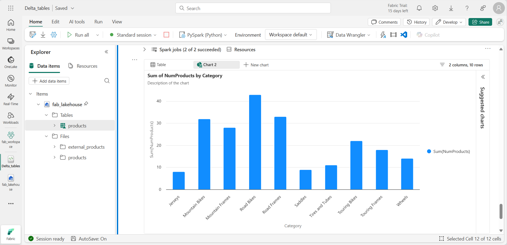

---
lab:
  title: Apache Spark에서 델타 테이블 사용
  module: Work with Delta Lake tables in Microsoft Fabric
---

# Apache Spark에서 델타 테이블 사용

Microsoft Fabric 레이크하우스의 테이블은 오픈 소스 Delta Lake 형식을 기반으로 합니다. Delta Lake는 일괄 처리 및 스트리밍 데이터 모두에 대하여 관계형 의미 체계 지원을 추가합니다. 이 연습에서는 델타 테이블을 만들고 SQL 쿼리를 사용하여 데이터를 탐색합니다.

이 연습을 완료하는 데 약 **45**분 정도 소요됩니다.

> [!Note] 
> 이 연습을 완료하려면 [Microsoft Fabric 테넌트](https://learn.microsoft.com/fabric/get-started/fabric-trial)에 액세스해야 합니다.

## 작업 영역 만들기

Fabric에서 데이터로 작업하기 전에, Fabric 용량을 사용하도록 설정된 테넌트에서 작업 영역을 만듭니다.

1. 브라우저에서 [Microsoft Fabric 홈페이지](https://app.fabric.microsoft.com/home?experience=fabric-developer)(`https://app.fabric.microsoft.com/home?experience=fabric-developer`)로 이동하고 Fabric 자격 증명을 사용해 로그인합니다.
1. 왼쪽 메뉴 모음에서 **작업 영역**을 선택합니다(아이콘은 와 유사함).
1. 선택한 이름으로 새 작업 영역을 만들고 패브릭 용량(*평가판*, *프리미엄* 또는 *패브릭*)이 포함된 **고급** 섹션에서 라이선스 모드를 선택합니다.
1. 새 작업 영역이 열리면 비어 있어야 합니다.

    

## 레이크하우스 만들기 및 파일 업로드

이제 작업 영역이 있으므로 데이터를 위한 데이터 레이크하우스를 만들어야 합니다.

1. 왼쪽 메뉴 모음에서 **만들기**를 선택합니다. *새* 페이지의 *데이터 엔지니어링* 섹션에서 **레이크하우스**를 선택합니다. 원하는 고유한 이름.

    >**참고**: **만들기** 옵션이 사이드바에 고정되지 않은 경우 먼저 줄임표(**...**) 옵션을 선택해야 합니다.

    1분 정도 지나면 새 레이크하우스가 만들어집니다.

    

1. 새 레이크하우스에서는 왼쪽의 **탐색기** 창으로 레이크하우스의 테이블과 파일을 찾아볼 수 있습니다.

이제 레이크하우스에 데이터를 수집할 수 있습니다. 이 작업을 수행하는 방법은 여러 가지가 있지만, 이번에는 로컬 컴퓨터(또는 해당하는 경우 랩 VM)에 텍스트 파일 폴더를 다운로드하여 이를 레이크하우스에 업로드해 보겠습니다. 

1. `https://github.com/MicrosoftLearning/dp-data/raw/main/products.csv`에서 [데이터 파일](https://github.com/MicrosoftLearning/dp-data/raw/main/products.csv)을 다운로드하여 *products.csv*로 저장합니다.
1. 레이크하우스가 포함된 웹 브라우저 탭으로 돌아가서 탐색기 창의 **파일** 폴더 옆에 있는 ... 메뉴를 선택합니다.  *products*라는 **새 하위 폴더**를 만듭니다.
1. products 폴더의 ... 메뉴를 통해 로컬 컴퓨터(나 해당 시 랩 VM)에서 *products.csv* 파일을 **업로드**합니다.
1. 파일을 업로드한 후 **products** 폴더를 선택하여 여기에 나온 대로 파일이 업로드되었는지 확인합니다.

    
  
## DataFrame에서 데이터 탐색

이제 데이터를 사용하여 작업할 Fabric Notebook을 만들 수 있습니다. Notebook은 코드를 작성하고 실행할 수 있는 대화형 환경을 제공합니다.

1. 왼쪽 메뉴 모음에서 **만들기**를 선택합니다. *새* 페이지의 *데이터 엔지니어링* 섹션에서 **Notebook**을 선택합니다.

    **Notebook 1**이라는 새 Notebook이 생성되고 열립니다.

    

1. Fabric은 만든 Notebook마다 이름을 할당합니다(예: Notebook 1, Notebook 2 등). 메뉴의 **홈** 탭 위에 있는 이름 패널을 클릭하여 보다 내용을 잘 알 수 있는 이름으로 변경할 수 있습니다.
1. 첫 번째 셀(현재 코드 셀)을 선택한 다음 오른쪽 위에 있는 도구 모음에서 **M↓** 버튼을 사용하여 셀을 Markdown 셀로 변환합니다. 그러면 셀에 포함된 텍스트가 서식이 지정된 텍스트로 표시됩니다.
1. 🖉(편집) 버튼을 사용하여 셀을 편집 모드로 전환한 후 다음과 같이 markdown을 수정합니다.

    ```markdown
    # Delta Lake tables 
    Use this notebook to explore Delta Lake functionality 
    ```

1. 편집을 중지하려면 Notebook의 셀 외부 아무 곳이나 클릭합니다.
1. **탐색기** 창에서 **데이터 항목 추가**를 선택한 다음, **기존 데이터 원본**을 선택합니다. 이전에 만든 레이크하우스에 연결합니다.
1. 새 코드 셀을 추가하고 다음 코드를 추가하여 정의된 스키마를 사용하여 제품 데이터를 DataFrame으로 읽어 옵니다.

    ```python
   from pyspark.sql.types import StructType, IntegerType, StringType, DoubleType

   # define the schema
   schema = StructType() \
   .add("ProductID", IntegerType(), True) \
   .add("ProductName", StringType(), True) \
   .add("Category", StringType(), True) \
   .add("ListPrice", DoubleType(), True)

   df = spark.read.format("csv").option("header","true").schema(schema).load("Files/products/products.csv")
   # df now is a Spark DataFrame containing CSV data from "Files/products/products.csv".
   display(df)
    ```

> [!TIP]
> 펼침 단추 « 아이콘을 사용하여 탐색기 창을 숨기거나 표시합니다. 이렇게 하면 Notebook 또는 파일 중 하나에 집중할 수 있습니다.

1. 셀 왼쪽의 **셀 실행**(▷) 버튼을 사용하여 실행합니다.

> [!NOTE]
> 이 Notebook에서 코드를 처음 실행한 것이므로 Spark 세션을 시작해야 합니다. 이는 첫 번째 실행이 완료되는 데 1분 정도 걸릴 수 있음을 의미합니다. 후속 실행은 더 빨라질 것입니다.

1. 셀 코드가 완료되면 셀 아래의 출력을 검토합니다. 다음과 유사한 출력을 확인할 수 있습니다.

    
 
## 델타 테이블 만들기

*saveAsTable* 메서드를 사용하여 DataFrame을 델타 테이블로 저장할 수 있습니다. Delta Lake는 관리 테이블과 외부 테이블 만들기를 모두 지원합니다.

   * **관리**형 델타 테이블은 Fabric이 스키마 메타데이터와 데이터 파일을 모두 관리하므로 성능이 향상됩니다.
   * **외부** 테이블을 사용하면 데이터를 외부에 저장할 수 있으며 메타데이터는 Fabric에서 관리합니다.

### 관리되는 테이블 만들기

**Tables** 폴더에 데이터 파일이 만들어집니다.

1. 첫 번째 코드 셀에서 반환된 결과 아래에서 + 코드 아이콘을 사용하여 새 코드 셀을 추가합니다.

> [!TIP]
> + 코드 아이콘을 보려면 마우스를 현재 셀의 출력 바로 아래 왼쪽으로 이동합니다. 아니면 메뉴 모음의 편집 탭에서 **+ 코드 셀 추가**를 선택합니다.

1. 관리형 델타 테이블을 만들기 위해 새 셀을 추가하고 다음 코드를 입력한 후 셀을 실행합니다.

    ```python
   df.write.format("delta").saveAsTable("managed_products")
    ```

1. 탐색기 창에서 Tables 폴더를 **새로 고침**하고 Tables 노드를 확장하여 **managed_products** 테이블이 만들어졌는지 확인합니다.

> [!NOTE]
> 파일 이름 옆에 있는 삼각형 아이콘은 델타 테이블을 나타냅니다.

관리형 테이블의 파일은 레이크하우스의 **Tables** 폴더에 저장됩니다. 테이블에 대한 Parquet 파일과 delta_log 폴더가 저장되어 있는 *managed_products*라는 폴더가 만들어졌습니다.

### 외부 테이블 만들기

레이크하우스가 아닌 다른 곳에 저장할 수 있는 외부 테이블을 만들 수도 있으며, 이 경우 스키마 메타데이터는 레이크하우스에 저장됩니다.

1. 탐색기 창의 ... 메뉴를 **Files** 폴더에 대해 선택하고 **ABFS 경로 복사**를 선택합니다. ABFS 경로는 레이크하우스 Files 폴더에 대한 정규화된 경로입니다.

1. 새 코드 셀에 ABFS 경로를 붙여넣습니다. 다음 코드를 추가하고 잘라내기 및 붙여넣기를 사용하여 코드의 올바른 위치에 abfs_path를 삽입합니다.

    ```python
   df.write.format("delta").saveAsTable("external_products", path="abfs_path/external_products")
    ```

1. 전체 경로는 다음과 유사해야 합니다.

    ```python
   abfss://workspace@tenant-onelake.dfs.fabric.microsoft.com/lakehousename.Lakehouse/Files/external_products
    ```

1. 셀을 **실행** 하여 DataFrame을 Files/external_products 폴더에 외부 테이블로 저장합니다.

1. 탐색기 창에서 Tables 폴더를 **새로 고침**하고 Tables 노드를 확장하여 스키마 메타데이터를 포함하는 external_products 테이블이 만들어졌는지 확인합니다.

1. 탐색기 창의 ... 메뉴를 Files 폴더에 대해 선택하고 **새로 고침**을 선택합니다. 그런 다음 Files 노드를 확장하고 테이블의 데이터 파일에 대해 external_products 폴더가 만들어졌는지 확인합니다.

### 관리 테이블과 외부 테이블 비교

%%sql 매직 명령을 사용하여 관리형 테이블과 외부 테이블의 차이점을 살펴보겠습니다.

1. 새 코드 셀에서 다음 코드를 실행합니다.

    ```python
   %%sql
   DESCRIBE FORMATTED managed_products;
    ```

1. 결과에서 테이블의 위치 속성을 봅니다. 데이터 형식 열에서 위치 값을 클릭하여 전체 경로를 확인합니다. OneLake 스토리지 위치는 /Tables/managed_products로 끝납니다.

1. 여기에 나오는 대로 external_products 테이블의 세부 정보를 표시하도록 DESCRIBE 명령을 수정합니다.

    ```python
   %%sql
   DESCRIBE FORMATTED external_products;
    ```

1. 셀을 실행하고 결과에서 테이블의 위치 속성을 봅니다. 데이터 형식 열을 확장하여 전체 경로를 확인하고 OneLake 스토리지 위치가 /Files/external_products로 끝나는지 확인합니다.

1. 새 코드 셀에서 다음 코드를 실행합니다.

    ```python
   %%sql
   DROP TABLE managed_products;
   DROP TABLE external_products;
    ```

1. 탐색기 창에서 Tables 폴더를 **새로 고침**하여 Tables 노드의 목록에 테이블이 없는지 확인합니다.
1. 탐색기 창에서 Files 폴더를 **새로 고침**하고 external_products 파일이 삭제되지 *않았는지* 확인합니다. Parquet 데이터 파일 및 _delta_log 폴더를 보려면 이 폴더를 선택합니다. 

외부 테이블의 메타데이터가 삭제되었지만 파일은 영향을 받지 않았습니다.

## SQL을 사용하여 델타 테이블 만들기

이제 %%sql 매직 명령을 사용하여 델타 테이블을 만들어 보겠습니다. 

1. 다른 코드 셀을 추가하고 다음 코드를 실행합니다.

    ```python
   %%sql
   CREATE TABLE products
   USING DELTA
   LOCATION 'Files/external_products';
    ```

1. 탐색기 창의 ... **Tables** 폴더의 ... 메뉴에서 **새로 고침**을 선택합니다. 그런 다음 Tables 노드를 확장하여 목록에 *products*라는 새 테이블이 있는지 확인합니다. 그런 다음 테이블을 확장하여 스키마를 봅니다.
1. 다른 코드 셀을 추가하고 다음 코드를 실행합니다.

    ```python
   %%sql
   SELECT * FROM products;
    ```

## 테이블 버전 관리 살펴보기

델타 테이블의 트랜잭션 기록은 delta_log 폴더의 JSON 파일에 저장됩니다. 이 트랜잭션 로그를 사용하여 데이터 버전 관리를 관리할 수 있습니다.

1. Notebook에 새 코드 셀을 추가하고 산악 자전거 가격을 10% 인하하는 다음 코드를 실행합니다.

    ```python
   %%sql
   UPDATE products
   SET ListPrice = ListPrice * 0.9
   WHERE Category = 'Mountain Bikes';
    ```

1. 다른 코드 셀을 추가하고 다음 코드를 실행합니다.

    ```python
   %%sql
   DESCRIBE HISTORY products;
    ```

결과에는 테이블에 기록된 트랜잭션 내역이 표시됩니다.

1. 다른 코드 셀을 추가하고 다음 코드를 실행합니다.

    ```python
   delta_table_path = 'Files/external_products'
   # Get the current data
   current_data = spark.read.format("delta").load(delta_table_path)
   display(current_data)

   # Get the version 0 data
   original_data = spark.read.format("delta").option("versionAsOf", 0).load(delta_table_path)
   display(original_data)
    ```

두 개의 결과 집합이 반환됩니다. 하나는 가격 인하 이후의 데이터를 포함하고 다른 하나는 데이터의 원본 버전을 보여 줍니다.

## SQL 쿼리를 사용하여 델타 테이블 데이터 분석

SQL 매직 명령을 사용하면 Pyspark 대신 SQL 구문을 사용할 수 있습니다. 여기서는 `SELECT` 문을 사용하여 제품 테이블로 임시 보기를 만들어 보겠습니다.

1. 새 코드 셀을 추가하고 다음 코드를 실행하여 임시 보기를 만들고 표시합니다.

    ```python
   %%sql
   -- Create a temporary view
   CREATE OR REPLACE TEMPORARY VIEW products_view
   AS
       SELECT Category, COUNT(*) AS NumProducts, MIN(ListPrice) AS MinPrice, MAX(ListPrice) AS MaxPrice, AVG(ListPrice) AS AvgPrice
       FROM products
       GROUP BY Category;

   SELECT *
   FROM products_view
   ORDER BY Category;    
    ```

1. 새 코드 셀을 추가하고 다음 코드를 실행하여 상위 10개 범주를 제품 수별로 반환합니다.

    ```python
   %%sql
   SELECT Category, NumProducts
   FROM products_view
   ORDER BY NumProducts DESC
   LIMIT 10;
    ```

1. 데이터가 반환되면 **+ 새 차트**를 선택하여 제안된 차트 중 하나를 표시합니다.

    

또는 PySpark를 사용하여 SQL 쿼리를 실행할 수 있습니다.

1. 새 코드 셀을 추가하고 다음 코드를 실행합니다.

    ```python
   from pyspark.sql.functions import col, desc

   df_products = spark.sql("SELECT Category, MinPrice, MaxPrice, AvgPrice FROM products_view").orderBy(col("AvgPrice").desc())
   display(df_products.limit(6))
    ```

## 스트리밍 데이터에 델타 테이블 사용

Delta Lake는 스트리밍 데이터를 지원합니다. 델타 테이블은 Spark 구조적 스트리밍 API를 사용하여 생성된 데이터 스트림의 싱크 또는 원본일 수 있습니다. 이 예제에서는 시뮬레이션된 IoT(사물 인터넷) 시나리오에서 델타 테이블을 일부 스트리밍 데이터의 싱크로 사용해 보겠습니다.

1.  새 코드 셀을 추가하고 다음 코드를 추가 및 실행합니다.

    ```python
    from notebookutils import mssparkutils
    from pyspark.sql.types import *
    from pyspark.sql.functions import *

    # Create a folder
    inputPath = 'Files/data/'
    mssparkutils.fs.mkdirs(inputPath)

    # Create a stream that reads data from the folder, using a JSON schema
    jsonSchema = StructType([
    StructField("device", StringType(), False),
    StructField("status", StringType(), False)
    ])
    iotstream = spark.readStream.schema(jsonSchema).option("maxFilesPerTrigger", 1).json(inputPath)

    # Write some event data to the folder
    device_data = '''{"device":"Dev1","status":"ok"}
    {"device":"Dev1","status":"ok"}
    {"device":"Dev1","status":"ok"}
    {"device":"Dev2","status":"error"}
    {"device":"Dev1","status":"ok"}
    {"device":"Dev1","status":"error"}
    {"device":"Dev2","status":"ok"}
    {"device":"Dev2","status":"error"}
    {"device":"Dev1","status":"ok"}'''

    mssparkutils.fs.put(inputPath + "data.txt", device_data, True)

    print("Source stream created...")
    ```

*원본 스트림 만들기 완료...* 메시지가 표시되는지 확인합니다. 방금 실행한 코드는 가상의 IoT 디바이스의 판독값을 나타내는 일부 데이터가 저장된 폴더를 기반으로 스트리밍 데이터 원본을 만들었습니다.

1. 새 코드 셀에서 다음 코드를 추가하고 실행합니다.

    ```python
   # Write the stream to a delta table
   delta_stream_table_path = 'Tables/iotdevicedata'
   checkpointpath = 'Files/delta/checkpoint'
   deltastream = iotstream.writeStream.format("delta").option("checkpointLocation", checkpointpath).start(delta_stream_table_path)
   print("Streaming to delta sink...")
    ```

이 코드는 스트리밍 디바이스 데이터를 델타 형식으로 iotdevicedata라는 폴더에 작성합니다. 폴더 위치에 대한 경로가 Tables 폴더에 있으므로 해당 폴더에 대한 테이블이 자동으로 만들어집니다.

1. 새 코드 셀에서 다음 코드를 추가하고 실행합니다.

    ```python
   %%sql
   SELECT * FROM IotDeviceData;
    ```

이 코드는 스트리밍 원본의 디바이스 데이터를 포함하는 IotDeviceData 테이블을 쿼리합니다.

1. 새 코드 셀에서 다음 코드를 추가하고 실행합니다.

    ```python
   # Add more data to the source stream
   more_data = '''{"device":"Dev1","status":"ok"}
   {"device":"Dev1","status":"ok"}
   {"device":"Dev1","status":"ok"}
   {"device":"Dev1","status":"ok"}
   {"device":"Dev1","status":"error"}
   {"device":"Dev2","status":"error"}
   {"device":"Dev1","status":"ok"}'''

   mssparkutils.fs.put(inputPath + "more-data.txt", more_data, True)
    ```

이 코드는 스트리밍 원본에 더 많은 가상 디바이스 데이터를 작성합니다.

1. 다음 코드가 포함된 셀을 다시 실행합니다.

    ```python
   %%sql
   SELECT * FROM IotDeviceData;
    ```

이 코드는 이제 스트리밍 원본에 추가된 추가 데이터를 포함해야 하는 IotDeviceData 테이블을 다시 쿼리합니다.

1. 새 코드 셀에서 스트림을 중지하고 셀을 실행하는 코드를 추가합니다.

    ```python
   deltastream.stop()
    ```

## 리소스 정리

이 연습에서는 Microsoft Fabric에서 델타 테이블을 사용하여 작업하는 방법을 알아보았습니다.

레이크하우스 탐색을 마쳤다면 이 연습을 위해 만든 작업 영역을 삭제해도 됩니다.

1. 왼쪽 막대에서 작업 영역의 아이콘을 선택하여 포함된 모든 항목을 봅니다.
1. 도구 모음의 … 메뉴에서 **작업 영역 설정**을 선택합니다.
1. 일반 섹션에서 **이 작업 영역 제거**를 선택합니다.
