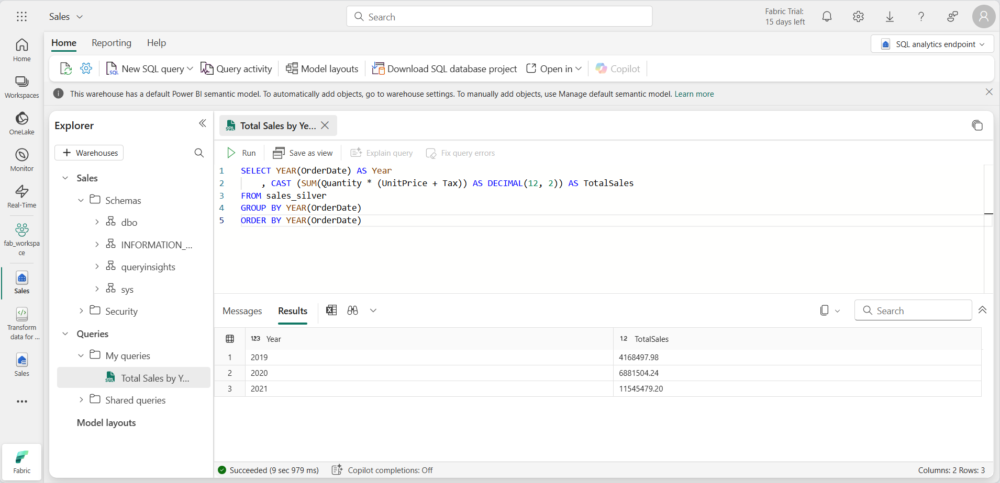

---
lab:
  title: Microsoft Fabric 레이크하우스에서 medallion 아키텍처 만들기
  module: Organize a Fabric lakehouse using medallion architecture design
---

# Microsoft Fabric 레이크하우스에서 medallion 아키텍처 만들기

이 연습에서는 Notebook을 사용하여 Fabric 레이크하우스에서 medallion 아키텍처를 빌드합니다. 작업 영역을 만들고, 레이크하우스를 만들고, bronze 레이어에 데이터를 업로드하고, 데이터를 변환하고, silver Delta 테이블에 로드하고, 데이터를 더 변환하고, gold Delta 테이블에 로드한 다음, 의미 체계 모델을 탐색하고 관계를 만듭니다.

이 연습을 완료하는 데 약 **45**분 정도 소요됩니다.

> **참고**: 이 연습을 완료하려면 [Microsoft Fabric 평가판](https://learn.microsoft.com/fabric/get-started/fabric-trial)이 필요합니다.

## 작업 영역 만들기

패브릭에서 데이터를 사용하기 전에 패브릭 평가판을 사용하도록 설정된 작업 영역을 만듭니다.

1. [Microsoft Fabric 홈페이지](https://app.fabric.microsoft.com/home?experience=fabric)(`https://app.fabric.microsoft.com/home?experience=fabric`)에서 **Synapse 데이터 엔지니어링**을 선택합니다.
2. 왼쪽 메뉴 모음에서 **작업 영역**을 선택합니다(아이콘은 와 유사함).
3. Fabric 용량이 포함된 라이선스 모드(*평가판*, *프리미엄* 또는 *Fabric*)를 선택하여 원하는 이름으로 새 작업 영역을 만듭니다.
4. 새 작업 영역이 열리면 비어 있어야 합니다.

   

5. 작업 영역 설정으로 이동하여 **데이터 모델 편집** 미리 보기 기능을 사용하도록 설정합니다. 이렇게 하면 Power BI 의미 체계 모델을 사용하여 레이크하우스의 테이블 간에 관계를 만들 수 있습니다.

    

    > **참고**: 미리 보기 기능을 사용하도록 설정한 후 브라우저 탭을 새로 고쳐야 할 수 있습니다.

## 레이크하우스 만들기 및 bronze 레이어에 데이터 업로드

이제 작업 영역이 있으므로 분석하려는 데이터에 대한 데이터 레이크하우스를 만들어야 합니다.

1. **Synapse Data Engineering** 홈페이지에서 **Sales**라는 새 **레이크하우스**를 만듭니다.

    1분 정도 지나면 빈 레이크하우스가 새로 만들어집니다. 분석을 위해 일부 데이터를 데이터 레이크하우스에 수집해야 합니다. 이 작업을 수행하는 방법에는 여러 가지가 있지만 이 연습에서는 텍스트 파일을 로컬 컴퓨터(또는 해당하는 경우 랩 VM)에 다운로드한 다음 레이크하우스에 업로드하기만 하면 됩니다.

1. `https://github.com/MicrosoftLearning/dp-data/blob/main/orders.zip`에서 이 연습용 데이터 파일을 다운로드합니다. 파일을 추출하고 로컬 컴퓨터(또는 해당하는 경우 랩 VM)에 원래 이름으로 저장합니다. 3년 동안 판매 데이터를 포함하는 3개의 파일이 있어야 합니다. 2019.csv, 2020.csv 및 2021.csv.

1. 레이크하우스가 포함된 웹 브라우저 탭으로 돌아가 **탐색기** 창의 **파일** 폴더에 대한 **...** 메뉴에서 **새 하위 폴더**를 선택하고 **bronze**라는 폴더를 만듭니다.

1. **bronze** 폴더의 **...** 메뉴에서 **업로드** 및 **파일 업로드**를 선택한 다음 로컬 컴퓨터(또는 해당되는 경우 실습용 VM)에서 3개의 파일(2019.csv, 2020.csv 및 2021.csv)을 레이크하우스로 업로드합니다. 시프트 키를 사용하여 3개 파일을 모두 한 번에 업로드합니다.

1. 파일이 업로드된 후 **bronze** 폴더를 선택합니다. 을 클릭하고 다음과 같이 파일이 업로드되었는지 확인합니다.

    

## 데이터 변환 및 silver Delta 테이블로 로드

이제 레이크하우스의 bronze 레이어에 일부 데이터가 있으므로 Notebook을 사용하여 데이터를 변환하고 silver 레이어의 Delta 테이블에 로드할 수 있습니다.

1. 데이터 레이크에 있는 **bronze** 폴더의 내용을 보는 동안 **홈** 페이지의 **Notebook 열기** 메뉴에서 **새 Notebook**을 선택합니다.

    몇 초 후에 단일 *셀*이 포함된 새 Notebook이 열립니다. Notebook은 *코드* 또는 *markdown*(서식이 지정된 텍스트)을 포함할 수 있는 하나 이상의 셀로 구성됩니다.

2. Notebook이 열리면 Notebook의 왼쪽 위에 있는 **Notebook xxxx** 텍스트를 선택하고 새 이름을 입력하여 이름을 **Silver용 데이터 변환**으로 바꿉니다.

    

3. 간단한 주석 처리 코드가 포함된 Notebook의 기존 셀을 선택합니다. 이 두 줄을 강조 표시하고 삭제합니다. 이 코드는 필요하지 않습니다.

   > **참고**: Notebook을 사용하면 Python, Scala 및 SQL을 비롯한 다양한 언어로 코드를 실행할 수 있습니다. 이 연습에서는 PySpark 및 SQL을 사용합니다. 태그 셀을 추가하여 서식이 지정된 텍스트와 이미지를 제공하여 코드를 문서화할 수도 있습니다.

4. 다음 코드를 셀에 **붙여 넣습니다**.

    ```python
    from pyspark.sql.types import *
    
    # Create the schema for the table
    orderSchema = StructType([
        StructField("SalesOrderNumber", StringType()),
        StructField("SalesOrderLineNumber", IntegerType()),
        StructField("OrderDate", DateType()),
        StructField("CustomerName", StringType()),
        StructField("Email", StringType()),
        StructField("Item", StringType()),
        StructField("Quantity", IntegerType()),
        StructField("UnitPrice", FloatType()),
        StructField("Tax", FloatType())
        ])
    
    # Import all files from bronze folder of lakehouse
    df = spark.read.format("csv").option("header", "true").schema(orderSchema).load("Files/bronze/*.csv")
    
    # Display the first 10 rows of the dataframe to preview your data
    display(df.head(10))
    ```

5. 셀 왼쪽의 ****&#9655;**(*셀 실행*)** 버튼을 사용하여 코드를 실행합니다.

    > **참고**: 이 Notebook에서 Spark 코드를 처음 실행했으므로 Spark 세션을 시작해야 합니다. 이는 첫 번째 실행이 완료되는 데 1분 정도 걸릴 수 있음을 의미합니다. 후속 실행은 더 빨라질 것입니다.

6. 셀 명령이 완료되면 셀 아래의 **출력을 검토**합니다. 다음과 유사한 출력을 확인할 수 있습니다.

    | 색인 | SalesOrderNumber | SalesOrderLineNumber | OrderDate | CustomerName | 전자 메일 | Item | 수량 | 단가 | 세금 |
    | -- | -- | -- | -- | -- | -- | -- | -- | -- | -- |
    | 1 | SO49172 | 1 | 2021-01-01 | Brian Howard | brian23@adventure-works.com | Road-250 Red, 52 | 1 | 2443.35 | 195.468 |
    | 2 |  SO49173 | 1 | 2021-01-01 | Linda Alvarez | linda19@adventure-works.com | Mountain-200 Silver, 38 | 1 | 2071.4197 | 165.7136 |
    | ... | ... | ... | ... | ... | ... | ... | ... | ... | ... |

    실행한 코드는 **bronze** 폴더의 CSV 파일에서 Spark 데이터 프레임으로 데이터를 로드한 다음, 데이터 프레임의 처음 몇 행을 표시했습니다.

    > **참고**: 출력 창의 왼쪽 상단에 있는 **...** 메뉴를 선택하여 셀 출력의 내용을 지우고, 숨기고, 자동 크기 조정할 수 있습니다.

7. 이제 PySpark 데이터 프레임을 사용하여 열을 추가하고 기존 열 중 일부의 값을 업데이트하여 **데이터 유효성 검사 및 정리를 위한 열을 추가**합니다. + 버튼을 사용하여 **새 코드 블록을 추가**하고 셀에 다음 코드를 추가합니다.

    ```python
    from pyspark.sql.functions import when, lit, col, current_timestamp, input_file_name
    
    # Add columns IsFlagged, CreatedTS and ModifiedTS
    df = df.withColumn("FileName", input_file_name()) \
        .withColumn("IsFlagged", when(col("OrderDate") < '2019-08-01',True).otherwise(False)) \
        .withColumn("CreatedTS", current_timestamp()).withColumn("ModifiedTS", current_timestamp())
    
    # Update CustomerName to "Unknown" if CustomerName null or empty
    df = df.withColumn("CustomerName", when((col("CustomerName").isNull() | (col("CustomerName")=="")),lit("Unknown")).otherwise(col("CustomerName")))
    ```

    코드의 첫 번째 줄은 PySpark에서 필요한 함수를 가져옵니다. 그런 다음 원본 파일 이름, 주문이 관심 있는 회계연도 이전으로 플래그가 지정되었는지 여부 및 행이 만들어지고 수정된 시기를 추적할 수 있도록 데이터 프레임에 새 열을 추가합니다.

    마지막으로 CustomerName 열이 null이거나 비어 있는 경우 "알 수 없음"으로 업데이트합니다.

8. 셀을 실행하여 ****&#9655;**(*셀 실행*)** 단추를 사용하여 코드를 실행합니다.

9. 다음으로, Delta Lake 형식을 사용하여 판매 데이터베이스의 **sales_silver** 테이블에 대한 스키마를 정의합니다. 새 코드 블록을 만들고 셀에 다음 코드를 추가합니다.

    ```python
    # Define the schema for the sales_silver table
    
    from pyspark.sql.types import *
    from delta.tables import *
    
    DeltaTable.createIfNotExists(spark) \
        .tableName("sales.sales_silver") \
        .addColumn("SalesOrderNumber", StringType()) \
        .addColumn("SalesOrderLineNumber", IntegerType()) \
        .addColumn("OrderDate", DateType()) \
        .addColumn("CustomerName", StringType()) \
        .addColumn("Email", StringType()) \
        .addColumn("Item", StringType()) \
        .addColumn("Quantity", IntegerType()) \
        .addColumn("UnitPrice", FloatType()) \
        .addColumn("Tax", FloatType()) \
        .addColumn("FileName", StringType()) \
        .addColumn("IsFlagged", BooleanType()) \
        .addColumn("CreatedTS", DateType()) \
        .addColumn("ModifiedTS", DateType()) \
        .execute()
    ```

10. 셀을 실행하여 ****&#9655;**(*셀 실행*)** 단추를 사용하여 코드를 실행합니다.

11. 레이크하우스 탐색기 창의 테이블 섹션에서 **...** 을 선택하고 **새로 고침**을 선택합니다. 이제 새 **sales_silver** 테이블이 나열되어야 합니다. **&#9650;**(삼각형 아이콘)은 Delta 테이블임을 나타냅니다.

    

    > **참고**: 새 테이블이 표시되지 않으면 몇 초 동안 기다렸다가 **새로 고침**을 다시 선택하거나 전체 브라우저 탭을 새로 고칩니다.

12. 이제 Delta 테이블에서 **upsert 작업**을 수행하고, 특정 조건에 따라 기존 레코드를 업데이트하고, 일치하는 항목이 없으면 새 레코드를 삽입합니다. 새 코드 블록을 추가하고 다음 코드를 붙여넣습니다.

    ```python
    # Update existing records and insert new ones based on a condition defined by the columns SalesOrderNumber, OrderDate, CustomerName, and Item.

    from delta.tables import *
    
    deltaTable = DeltaTable.forPath(spark, 'Tables/sales_silver')
    
    dfUpdates = df
    
    deltaTable.alias('silver') \
      .merge(
        dfUpdates.alias('updates'),
        'silver.SalesOrderNumber = updates.SalesOrderNumber and silver.OrderDate = updates.OrderDate and silver.CustomerName = updates.CustomerName and silver.Item = updates.Item'
      ) \
       .whenMatchedUpdate(set =
        {
          
        }
      ) \
     .whenNotMatchedInsert(values =
        {
          "SalesOrderNumber": "updates.SalesOrderNumber",
          "SalesOrderLineNumber": "updates.SalesOrderLineNumber",
          "OrderDate": "updates.OrderDate",
          "CustomerName": "updates.CustomerName",
          "Email": "updates.Email",
          "Item": "updates.Item",
          "Quantity": "updates.Quantity",
          "UnitPrice": "updates.UnitPrice",
          "Tax": "updates.Tax",
          "FileName": "updates.FileName",
          "IsFlagged": "updates.IsFlagged",
          "CreatedTS": "updates.CreatedTS",
          "ModifiedTS": "updates.ModifiedTS"
        }
      ) \
      .execute()
    ```
13. 셀을 실행하여 ****&#9655;**(*셀 실행*)** 단추를 사용하여 코드를 실행합니다.

    이 작업은 특정 열의 값을 기반으로 테이블의 기존 레코드를 업데이트하고 일치하는 항목이 없을 때 새 레코드를 삽입할 수 있기 때문에 중요합니다. 이는 기존 레코드 및 새 레코드에 대한 업데이트를 포함할 수 있는 원본 시스템에서 데이터를 로드할 때 일반적인 요구 사항입니다.

이제 silver Delta 테이블에 추가 변환 및 모델링을 위한 준비가 된 데이터가 있습니다.

## SQL 엔드포인트를 사용하여 silver 레이어의 데이터 탐색

이제 silver 레이어에 데이터가 있으므로 SQL 엔드포인트를 사용하여 데이터를 탐색하고 몇 가지 기본 분석을 수행할 수 있습니다. SQL에 익숙하고 데이터에 대한 몇 가지 기본적인 탐색을 수행하려는 경우 이 옵션을 사용하는 것이 좋습니다. 이 연습에서는 패브릭의 SQL 엔드포인트 보기를 사용하지만 SSMS(SQL Server Management Studio) 및 Azure Data Explorer와 같은 다른 도구를 사용할 수도 있습니다.

1. 작업 영역으로 돌아가서 이제 몇 개의 자산이 나열되었는지 확인합니다. **SQL 엔드포인트**를 선택하여 SQL 엔드포인트 보기에서 레이크하우스를 엽니다.

    

2. 리본에서 **새 SQL 쿼리**를 선택하면 SQL 쿼리 편집기가 열립니다. 레이크하우스 탐색기 창에서 기존 쿼리 이름 옆에 있는 **...** 메뉴 항목을 사용하여 쿼리 이름을 변경할 수 있습니다.

   두 개의 sql 쿼리를 실행하여 데이터를 탐색합니다.

3. 다음 쿼리를 쿼리 편집기에 붙여넣고 **실행**을 선택합니다.

    ```sql
    SELECT YEAR(OrderDate) AS Year
        , CAST (SUM(Quantity * (UnitPrice + Tax)) AS DECIMAL(12, 2)) AS TotalSales
    FROM sales_silver
    GROUP BY YEAR(OrderDate) 
    ORDER BY YEAR(OrderDate)
    ```

    이 쿼리는 sales_silver 테이블에서 각 연도의 총 판매량을 계산합니다. 결과가 다음과 같이 표시됩니다.

    

4. 이제 어떤 고객이 가장 많이 구매하고 있는지 살펴보겠습니다(수량 측면에서). 다음 쿼리를 쿼리 편집기에 붙여넣고 **실행**을 선택합니다.

    ```sql
    SELECT TOP 10 CustomerName, SUM(Quantity) AS TotalQuantity
    FROM sales_silver
    GROUP BY CustomerName
    ORDER BY TotalQuantity DESC
    ```

      이 쿼리는 sales_silver 테이블에서 각 고객이 구매한 항목의 총 수량을 계산한 다음 수량 측면에서 상위 10명의 고객을 반환합니다.

silver 레이어의 데이터 탐색은 기본 분석에 유용하지만, 고급 분석 및 보고를 가능하게 하려면 데이터를 더 자세히 변환하고 별모양 스키마로 모델링해야 합니다. 다음 섹션에서 구성을 완료합니다.

## silver 레이어에 대한 데이터 변환

bronze 레이어에서 데이터를 성공적으로 가져와 변환하고 silver Delta 테이블에 로드했습니다. 이제 새 Notebook을 사용하여 데이터를 추가로 변환하고, 별모양 스키마로 모델링하고, gold Delta 테이블에 로드합니다.

단일 Notebook에서 이 모든 작업을 수행할 수 있었지만, 이 연습에서는 별도의 Notebook을 사용하여 데이터를 bronze에서 silver로 변환한 다음 silver에서 gold로 변환하는 프로세스를 보여 줍니다. 디버깅, 문제 해결 및 재사용에 도움이 될 수 있습니다.

1. **데이터 엔지니어링** 홈 페이지로 돌아가서 **Gold용 데이터 변환**이라는 새 Notebook을 만듭니다.

2. 레이크하우스 탐색기 창에서 **추가**를 선택한 다음, 이전에 만든 **Sales** 레이크하우스를 선택하여 **Sales** 레이크하우스를 추가합니다. 탐색기 창의 **테이블** 섹션에 나열된 **sales_silver** 테이블이 표시되어야 합니다.

3. 기존 코드 블록에서 상용구 텍스트를 제거하고 **다음 코드를 추가**하여 데이터 프레임에 데이터를 로드하고 별모양 스키마 작성을 시작한 다음 실행합니다.

   ```python
    # Load data to the dataframe as a starting point to create the gold layer
    df = spark.read.table("Sales.sales_silver")
    ```

4. **새 코드 블록을 추가**하고 다음 코드를 붙여넣어 날짜 차원 테이블을 만들고 실행합니다.

    ```python
    from pyspark.sql.types import *
    from delta.tables import*
    
    # Define the schema for the dimdate_gold table
    DeltaTable.createIfNotExists(spark) \
        .tableName("sales.dimdate_gold") \
        .addColumn("OrderDate", DateType()) \
        .addColumn("Day", IntegerType()) \
        .addColumn("Month", IntegerType()) \
        .addColumn("Year", IntegerType()) \
        .addColumn("mmmyyyy", StringType()) \
        .addColumn("yyyymm", StringType()) \
        .execute()
    ```

    > **참고**: 언제든지 `display(df)` 명령을 실행하여 작업 진행 상태를 확인할 수 있습니다. 이 경우 'display(dfdimDate_gold)'를 실행하여 dimDate_gold 데이터 프레임의 내용을 확인합니다.

5. 새 코드 블록에서 **다음 코드를 추가하고 실행**하여 날짜 차원인 **dimdate_gold**에 대한 데이터 프레임을 만듭니다.

    ```python
    from pyspark.sql.functions import col, dayofmonth, month, year, date_format
    
    # Create dataframe for dimDate_gold
    
    dfdimDate_gold = df.dropDuplicates(["OrderDate"]).select(col("OrderDate"), \
            dayofmonth("OrderDate").alias("Day"), \
            month("OrderDate").alias("Month"), \
            year("OrderDate").alias("Year"), \
            date_format(col("OrderDate"), "MMM-yyyy").alias("mmmyyyy"), \
            date_format(col("OrderDate"), "yyyyMM").alias("yyyymm"), \
        ).orderBy("OrderDate")

    # Display the first 10 rows of the dataframe to preview your data

    display(dfdimDate_gold.head(10))
    ```

6. 데이터를 변환할 때 Notebook에서 발생하는 일을 이해하고 볼 수 있도록 코드를 새 코드 블록으로 분리합니다. 다른 새 코드 블록에서 **다음 코드를 추가하고 실행**하여 새 데이터가 들어올 때 날짜 차원을 업데이트합니다.

    ```python
    from delta.tables import *
    
    deltaTable = DeltaTable.forPath(spark, 'Tables/dimdate_gold')
    
    dfUpdates = dfdimDate_gold
    
    deltaTable.alias('silver') \
      .merge(
        dfUpdates.alias('updates'),
        'silver.OrderDate = updates.OrderDate'
      ) \
       .whenMatchedUpdate(set =
        {
          
        }
      ) \
     .whenNotMatchedInsert(values =
        {
          "OrderDate": "updates.OrderDate",
          "Day": "updates.Day",
          "Month": "updates.Month",
          "Year": "updates.Year",
          "mmmyyyy": "updates.mmmyyyy",
          "yyyymm": "yyyymm"
        }
      ) \
      .execute()
    ```

    축하합니다! 날짜 차원이 모두 설정됩니다. 이제 고객 차원을 만듭니다.
7. 고객 차원 테이블을 작성하려면 **새 코드 블록을 추가**하고 다음 코드를 붙여넣은 후 실행합니다.

    ```python
    from pyspark.sql.types import *
    from delta.tables import *
    
    # Create customer_gold dimension delta table
    DeltaTable.createIfNotExists(spark) \
        .tableName("sales.dimcustomer_gold") \
        .addColumn("CustomerName", StringType()) \
        .addColumn("Email",  StringType()) \
        .addColumn("First", StringType()) \
        .addColumn("Last", StringType()) \
        .addColumn("CustomerID", LongType()) \
        .execute()
    ```

8. 새 코드 블록에서 **다음 코드를 추가 및 실행**하여 중복 고객을 삭제하고, 특정 열을 선택하고, "CustomerName" 열을 분할하여 "First" 및 "Last" 이름 열을 만듭니다.

    ```python
    from pyspark.sql.functions import col, split
    
    # Create customer_silver dataframe
    
    dfdimCustomer_silver = df.dropDuplicates(["CustomerName","Email"]).select(col("CustomerName"),col("Email")) \
        .withColumn("First",split(col("CustomerName"), " ").getItem(0)) \
        .withColumn("Last",split(col("CustomerName"), " ").getItem(1)) 
    
    # Display the first 10 rows of the dataframe to preview your data

    display(dfdimCustomer_silver.head(10))
    ```

     여기서는 중복 삭제, 특정 열 선택, "CustomerName" 열을 분할하여 "First" 및 "Last" 이름 열을 만드는 등 다양한 변환을 수행하여 새 DataFrame dfdimCustomer_silver를 만들었습니다. 결과는 "CustomerName" 열에서 추출된 별도의 "이름" 및 "성" 열을 포함하여 정리되고 구조화된 고객 데이터가 있는 DataFrame입니다.

9. 다음으로 **고객을 위한 ID 열을 만듭니다**. 새 코드 블록에서 다음을 붙여넣고 실행합니다.

    ```python
    from pyspark.sql.functions import monotonically_increasing_id, col, when, coalesce, max, lit
    
    dfdimCustomer_temp = spark.read.table("Sales.dimCustomer_gold")
    
    MAXCustomerID = dfdimCustomer_temp.select(coalesce(max(col("CustomerID")),lit(0)).alias("MAXCustomerID")).first()[0]
    
    dfdimCustomer_gold = dfdimCustomer_silver.join(dfdimCustomer_temp,(dfdimCustomer_silver.CustomerName == dfdimCustomer_temp.CustomerName) & (dfdimCustomer_silver.Email == dfdimCustomer_temp.Email), "left_anti")
    
    dfdimCustomer_gold = dfdimCustomer_gold.withColumn("CustomerID",monotonically_increasing_id() + MAXCustomerID + 1)

    # Display the first 10 rows of the dataframe to preview your data

    display(dfdimCustomer_gold.head(10))
    ```

    여기서는 dimCustomer_gold 테이블에 이미 있는 중복 항목을 제외하기 위해 왼쪽 안티 조인을 수행한 다음 monotonically_increasing_id() 함수를 사용하여 고유한 CustomerID 값을 생성하여 고객 데이터(dfdimCustomer_silver)를 정리하고 변환합니다.

10. 이제 새 데이터가 들어오면 고객 테이블이 최신 상태로 유지되도록 합니다. **새 코드 블록에서** 다음을 붙여넣고 실행합니다.

    ```python
    from delta.tables import *

    deltaTable = DeltaTable.forPath(spark, 'Tables/dimcustomer_gold')
    
    dfUpdates = dfdimCustomer_gold
    
    deltaTable.alias('silver') \
      .merge(
        dfUpdates.alias('updates'),
        'silver.CustomerName = updates.CustomerName AND silver.Email = updates.Email'
      ) \
       .whenMatchedUpdate(set =
        {
          
        }
      ) \
     .whenNotMatchedInsert(values =
        {
          "CustomerName": "updates.CustomerName",
          "Email": "updates.Email",
          "First": "updates.First",
          "Last": "updates.Last",
          "CustomerID": "updates.CustomerID"
        }
      ) \
      .execute()
    ```

11. 이제 **이러한 단계를 반복하여 제품 차원을 만듭니다**. 새 코드 블록에서 다음을 붙여넣고 실행합니다.

    ```python
    from pyspark.sql.types import *
    from delta.tables import *
    
    DeltaTable.createIfNotExists(spark) \
        .tableName("sales.dimproduct_gold") \
        .addColumn("ItemName", StringType()) \
        .addColumn("ItemID", LongType()) \
        .addColumn("ItemInfo", StringType()) \
        .execute()
    ```

12. **다른 코드 블록을 추가**하여 **product_silver** 데이터 프레임을 만듭니다.
  
    ```python
    from pyspark.sql.functions import col, split, lit
    
    # Create product_silver dataframe
    
    dfdimProduct_silver = df.dropDuplicates(["Item"]).select(col("Item")) \
        .withColumn("ItemName",split(col("Item"), ", ").getItem(0)) \
        .withColumn("ItemInfo",when((split(col("Item"), ", ").getItem(1).isNull() | (split(col("Item"), ", ").getItem(1)=="")),lit("")).otherwise(split(col("Item"), ", ").getItem(1))) 
    
    # Display the first 10 rows of the dataframe to preview your data

    display(dfdimProduct_silver.head(10))
       ```

13. 이제 **dimProduct_gold** 테이블에 대한 ID를 만듭니다. 새 코드 블록에 다음 구문을 추가하고 실행합니다.

    ```python
    from pyspark.sql.functions import monotonically_increasing_id, col, lit, max, coalesce
    
    #dfdimProduct_temp = dfdimProduct_silver
    dfdimProduct_temp = spark.read.table("Sales.dimProduct_gold")
    
    MAXProductID = dfdimProduct_temp.select(coalesce(max(col("ItemID")),lit(0)).alias("MAXItemID")).first()[0]
    
    dfdimProduct_gold = dfdimProduct_silver.join(dfdimProduct_temp,(dfdimProduct_silver.ItemName == dfdimProduct_temp.ItemName) & (dfdimProduct_silver.ItemInfo == dfdimProduct_temp.ItemInfo), "left_anti")
    
    dfdimProduct_gold = dfdimProduct_gold.withColumn("ItemID",monotonically_increasing_id() + MAXProductID + 1)
    
    # Display the first 10 rows of the dataframe to preview your data

    display(dfdimProduct_gold.head(10))
    ```

      이렇게 하면 테이블의 현재 데이터를 기반으로 사용 가능한 다음 제품 ID를 계산하고 이러한 새 ID를 제품에 할당한 다음 업데이트된 제품 정보를 표시합니다.

14. 다른 차원으로 수행한 작업과 마찬가지로 새 데이터가 들어오면 제품 테이블이 최신 상태로 유지되도록 해야 합니다. **새 코드 블록에서** 다음을 붙여넣고 실행합니다.

    ```python
    from delta.tables import *
    
    deltaTable = DeltaTable.forPath(spark, 'Tables/dimproduct_gold')
            
    dfUpdates = dfdimProduct_gold
            
    deltaTable.alias('silver') \
      .merge(
            dfUpdates.alias('updates'),
            'silver.ItemName = updates.ItemName AND silver.ItemInfo = updates.ItemInfo'
            ) \
            .whenMatchedUpdate(set =
            {
               
            }
            ) \
            .whenNotMatchedInsert(values =
             {
              "ItemName": "updates.ItemName",
              "ItemInfo": "updates.ItemInfo",
              "ItemID": "updates.ItemID"
              }
              ) \
              .execute()
      ```

      **차원을 작성했으므로 이제 마지막 단계는 팩트 테이블을 만드는 것입니다.**

15. **새 코드 블록에서** 다음 코드를 붙여넣고 실행하여 **팩트 테이블**을 만듭니다.

    ```python
    from pyspark.sql.types import *
    from delta.tables import *
    
    DeltaTable.createIfNotExists(spark) \
        .tableName("sales.factsales_gold") \
        .addColumn("CustomerID", LongType()) \
        .addColumn("ItemID", LongType()) \
        .addColumn("OrderDate", DateType()) \
        .addColumn("Quantity", IntegerType()) \
        .addColumn("UnitPrice", FloatType()) \
        .addColumn("Tax", FloatType()) \
        .execute()
    ```

16. **새 코드 블록에서** 다음 코드를 붙여넣고 실행하여 판매 데이터를 고객 및 제품 정보(고객 ID, 품목 ID, 주문 날짜, 수량, 단가 및 세금 포함)와 결합하는 **새 데이터 프레임**을 만듭니다.

    ```python
    from pyspark.sql.functions import col
    
    dfdimCustomer_temp = spark.read.table("Sales.dimCustomer_gold")
    dfdimProduct_temp = spark.read.table("Sales.dimProduct_gold")
    
    df = df.withColumn("ItemName",split(col("Item"), ", ").getItem(0)) \
        .withColumn("ItemInfo",when((split(col("Item"), ", ").getItem(1).isNull() | (split(col("Item"), ", ").getItem(1)=="")),lit("")).otherwise(split(col("Item"), ", ").getItem(1))) \
    
    
    # Create Sales_gold dataframe
    
    dffactSales_gold = df.alias("df1").join(dfdimCustomer_temp.alias("df2"),(df.CustomerName == dfdimCustomer_temp.CustomerName) & (df.Email == dfdimCustomer_temp.Email), "left") \
            .join(dfdimProduct_temp.alias("df3"),(df.ItemName == dfdimProduct_temp.ItemName) & (df.ItemInfo == dfdimProduct_temp.ItemInfo), "left") \
        .select(col("df2.CustomerID") \
            , col("df3.ItemID") \
            , col("df1.OrderDate") \
            , col("df1.Quantity") \
            , col("df1.UnitPrice") \
            , col("df1.Tax") \
        ).orderBy(col("df1.OrderDate"), col("df2.CustomerID"), col("df3.ItemID"))
    
    # Display the first 10 rows of the dataframe to preview your data
    
    display(dffactSales_gold.head(10))
    ```

17. 이제 **새 코드 블록**에서 다음 코드를 실행하여 판매 데이터가 최신 상태로 유지되도록 합니다.

    ```python
    from delta.tables import *
    
    deltaTable = DeltaTable.forPath(spark, 'Tables/factsales_gold')
    
    dfUpdates = dffactSales_gold
    
    deltaTable.alias('silver') \
      .merge(
        dfUpdates.alias('updates'),
        'silver.OrderDate = updates.OrderDate AND silver.CustomerID = updates.CustomerID AND silver.ItemID = updates.ItemID'
      ) \
       .whenMatchedUpdate(set =
        {
          
        }
      ) \
     .whenNotMatchedInsert(values =
        {
          "CustomerID": "updates.CustomerID",
          "ItemID": "updates.ItemID",
          "OrderDate": "updates.OrderDate",
          "Quantity": "updates.Quantity",
          "UnitPrice": "updates.UnitPrice",
          "Tax": "updates.Tax"
        }
      ) \
      .execute()
    ```

     여기서는 Delta Lake의 병합 작업을 사용하여 factsales_gold 테이블을 새 판매 데이터(dffactSales_gold)와 동기화하고 업데이트합니다. 이 작업은 주문 날짜, 고객 ID 및 항목 ID를 기존 데이터(silver 테이블)와 새 데이터(DataFrame 업데이트)와 비교하여 일치하는 레코드를 업데이트하고 필요에 따라 새 레코드를 삽입합니다.

이제 보고 및 분석에 사용할 수 있는 큐레이팅되고 모델링된 **gold** 레이어가 있습니다.

## 의미 체계 모델 만들기

이제 작업 영역에서 gold 레이어를 사용하여 보고서를 만들고 데이터를 분석할 수 있습니다. 작업 영역에서 직접 의미 체계 모델에 액세스하여 보고에 대한 관계 및 측정값을 만들 수 있습니다.

레이크하우스를 만들 때 자동으로 생성되는 **기본 의미 체계 모델**은 사용할 수 없습니다. 레이크하우스 탐색기에서 이 연습에서 만든 gold 테이블을 포함하는 새 의미 체계 모델을 만들어야 합니다.

1. 작업 영역에서 **Sales** 레이크하우스로 이동합니다.
2. 레이크하우스 탐색기 보기의 리본에서 **새 의미 체계 모델**을 선택합니다.
3. 새 의미 체계 모델에 **Sales_Gold**라는 이름을 할당합니다.
4. 의미 체계 모델에 포함할 변환된 gold 테이블을 선택하고 **확인**을 선택합니다.
   - dimdate_gold
   - dimcustomer_gold
   - dimproduct_gold
   - factsales_gold

    그러면 다음과 같이 관계 및 측정값을 만들 수 있는 패브릭의 의미 체계 모델이 열립니다.

    

여기에서 사용자 또는 데이터 팀의 다른 구성원은 레이크하우스의 데이터를 기반으로 보고서 및 대시보드를 만들 수 있습니다. 이러한 보고서는 레이크하우스의 gold 레이어에 직접 연결되므로 항상 최신 데이터를 반영합니다.

## 리소스 정리

이 연습에서는 Microsoft Fabric 레이크하우스에서 medallion 아키텍처를 만드는 방법을 알아보았습니다.

레이크하우스 탐색을 마쳤으면 이 연습을 위해 만든 작업 영역을 삭제할 수 있습니다.

1. 왼쪽 막대에서 작업 영역의 아이콘을 선택하여 포함된 모든 항목을 봅니다.
2. 도구 모음의 **...** 메뉴에서 **작업 영역 설정**을 선택합니다.
3. **일반** 섹션에서 **이 작업 영역 제거**를 선택합니다.
