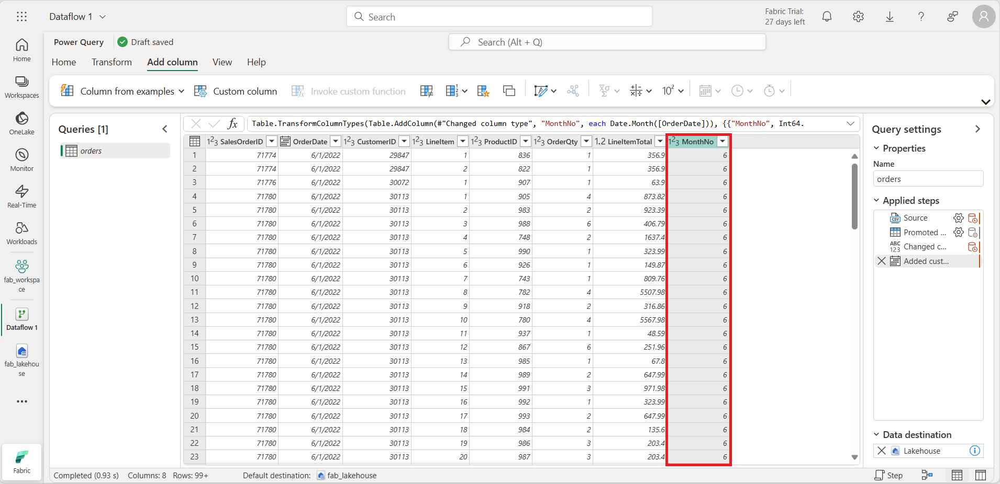
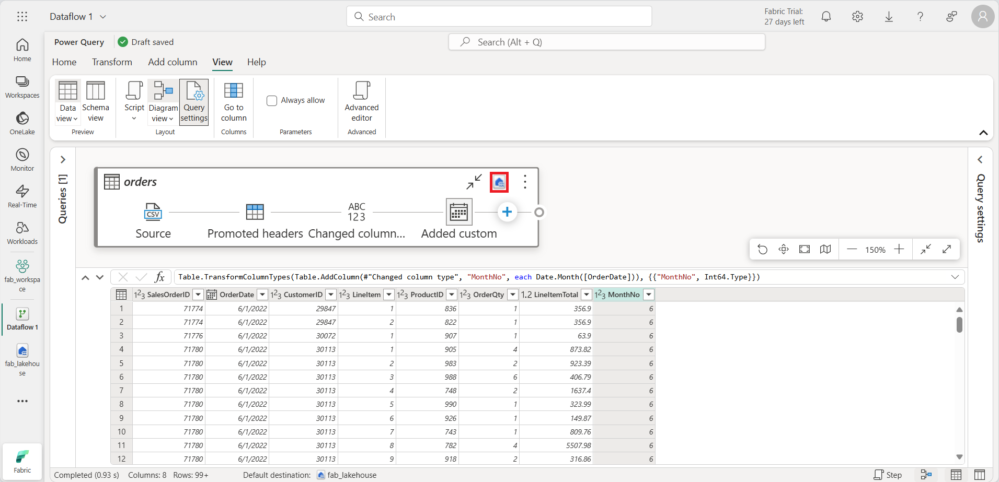

---
lab:
  title: Microsoft Fabric에서 데이터 흐름(Gen2) 만들기 및 사용
  module: Ingest Data with Dataflows Gen2 in Microsoft Fabric
---

# Microsoft Fabric에서 데이터 흐름(Gen2) 만들기

Microsoft Fabric에서 Gen2(데이터 흐름)는 다양한 데이터 원본에 연결하고 파워 쿼리 온라인에서 변환을 수행합니다. 그런 다음 데이터 파이프라인에서 데이터를 레이크하우스 또는 다른 분석 저장소로 수집하거나 Power BI 보고서의 데이터 세트를 정의하는 데 사용할 수 있습니다.

이 랩은 데이터 흐름(Gen2)의 다양한 요소를 도입하고 엔터프라이즈에 존재할 수 있는 복잡한 솔루션을 만들지 않도록 설계되었습니다. 이 랩을 완료하는 데 약 **30**분이 소요됩니다.

> **참고**: 이 연습을 완료하려면 [Microsoft Fabric 평가판](https://learn.microsoft.com/fabric/get-started/fabric-trial)이 필요합니다.

## 작업 영역 만들기

패브릭에서 데이터를 사용하기 전에 패브릭 평가판을 사용하도록 설정된 작업 영역을 만듭니다.

1. [Microsoft Fabric 홈페이지](https://app.fabric.microsoft.com)에서 **Synapse 데이터 엔지니어링**을 선택합니다.
1. 왼쪽 메뉴 모음에서 **작업 영역**을 선택합니다(아이콘은 와 유사함).
1. Fabric 용량이 포함된 라이선스 모드(*평가판*, *프리미엄* 또는 *Fabric*)를 선택하여 원하는 이름으로 새 작업 영역을 만듭니다.
1. 새 작업 영역이 열리면 비어 있어야 합니다.

    

## 레이크하우스 만들기

이제 작업 영역이 있으므로 데이터를 수집할 데이터 레이크하우스를 만들어야 합니다.

1. **Synapse Data Engineering** 홈페이지에서 원하는 이름으로 새 **레이크하우스**를 만듭니다.

    1분 정도 지나면 빈 레이크하우스가 새로 만들어집니다.

 

## 데이터를 수집하는 데이터 흐름(Gen2) 만들기

이제 레이크하우스가 있으므로 일부 데이터를 수집해야 합니다. 이 작업을 수행하는 한 가지 방법은 ETL(추출, 변환 및 로드 *) 프로세스를 캡슐화하는 *데이터 흐름을 정의하는 것입니다.

1. 작업 영역의 홈페이지에서 새 데이터 흐름 Gen2**를 선택합니다**. 몇 초 후에 다음과 같이 새 데이터 흐름에 대한 파워 쿼리 편집기가 열립니다.

 

2. 텍스트/CSV 파일**에서 가져오기를 선택하고 **다음 설정을 사용하여 새 데이터 원본을 만듭니다.
 - **파일에** 대한 링크: *선택됨*
 - **파일 경로 또는 URL**: `https://raw.githubusercontent.com/MicrosoftLearning/dp-data/main/orders.csv`
 - **커넥트ion**: 새 연결 만들기
 - **데이터 게이트웨이**: (없음)
 - **인증 종류**: 익명

3. 다음을 선택하여 **파일 데이터를 미리 볼 수 있는 다음 **, 데이터 원본을 만듭니다**.** 파워 쿼리 편집기에는 다음과 같이 데이터 원본 및 데이터 형식을 지정하는 초기 쿼리 단계 집합이 표시됩니다.

 

4. 도구 모음 리본에서 열** 추가 탭을 **선택합니다. 그런 다음 사용자 지정 열을** 선택하고 **새 열을 만듭니다.

5. *새 열 이름을* 설정하여 `MonthNo` 데이터 형식*을 *정수**로 **설정한 다음, 다음과 같은 수식을 `Date.Month([OrderDate])` 추가합니다.

 

6. 확인을** 선택하여 **열을 만들고 사용자 지정 열을 추가하는 단계가 쿼리에 추가되는 방식을 확인합니다. 결과 열이 데이터 창에 표시됩니다.

 

> **팁:** 오른쪽의 쿼리 설정 창에서 적용된 단계에**는 각 변환 단계가 **포함됩니다. 아래쪽에서 다이어그램 흐름** 단추를 전환**하여 단계의 시각적 다이어그램을 켤 수도 있습니다.
>
> 기어 아이콘을 선택하여 단계를 위 또는 아래로 이동하고, 편집할 수 있으며, 각 단계를 선택하여 미리 보기 창에서 변환이 적용되는지 확인할 수 있습니다.

7. OrderDate 열의 **데이터 형식이 Date**로 **설정되고 새로 만든 열 **MonthNo**의 데이터 형식이 정수**로 **설정되어 있는지 확인하고 확인합니다.**

## 데이터 흐름에 대한 데이터 대상 추가

1. 도구 모음 리본에서 홈** 탭을 **선택합니다. **그런 다음 데이터 대상** 추가 드롭다운 메뉴에서 Lakehouse**를 선택합니다**.

   > **참고:** 이 옵션이 회색으로 표시되면 데이터 대상 집합이 이미 있을 수 있습니다. 파워 쿼리 편집기의 오른쪽에 있는 쿼리 설정 창 아래쪽에 있는 데이터 대상을 확인합니다. 대상이 이미 설정된 경우 기어를 사용하여 변경할 수 있습니다.

2. **데이터 대상** 커넥트 대화 상자에서 연결을 편집하고 Power BI 조직 계정을 사용하여 로그인하여 데이터 흐름이 lakehouse에 액세스하는 데 사용하는 ID를 설정합니다.

 

3. 다음**을 선택하고 **사용 가능한 작업 영역 목록에서 작업 영역을 찾아 이 연습의 시작 부분에 만든 레이크하우스를 선택합니다. 그런 다음, 주문이라는 **새 테이블을 지정합니다.**

   

4. **대상 설정** 선택 페이지에서 추가**를 선택한 **다음 **, 설정을 저장합니다**.
    > **참고:** 파워 쿼리* 편집기를 *사용하여 데이터 형식을 업데이트하는 것이 좋지만 원하는 경우 이 페이지에서 업데이트할 수도 있습니다.

    

5. 메뉴 모음에서 보기를** 열고 **다이어그램 보기를** 선택합니다**. **Lakehouse** 대상은 파워 쿼리 편집기에서 쿼리의 아이콘으로 표시됩니다.

   

6. 게시**를 선택하여 **데이터 흐름을 게시합니다. 그런 다음 데이터 흐름 1** 데이터 흐름이 작업 영역에 만들어질 때까지 기다립니다**.

7. 게시되면 작업 영역에서 데이터 흐름을 마우스 오른쪽 단추로 클릭하고, 속성을** 선택하고**, 데이터 흐름의 이름을 바꿀 수 있습니다.

## 파이프라인에 데이터 흐름 추가

파이프라인에 데이터 흐름을 활동으로 포함할 수 있습니다. 파이프라인은 데이터 수집 및 처리 작업을 오케스트레이션하는 데 사용되므로 예약된 단일 프로세스에서 데이터 흐름을 다른 종류의 작업과 결합할 수 있습니다. 파이프라인은 Data Factory 환경을 포함하여 몇 가지 다른 환경에서 만들 수 있습니다.

1. 패브릭 사용 작업 영역에서 여전히 **데이터 엔지니어 환경에** 있는지 확인합니다. 새로** 만들기, **데이터 파이프라인**을 선택한 **다음 메시지가 표시되면 데이터** 로드라는 **새 파이프라인을 만듭니다.

   파이프라인 편집기가 열립니다.

   

   > **팁**: 데이터 복사 마법사가 자동으로 열리면 닫습니다.

2. 파이프라인 작업** 추가를 선택하고 **파이프라인에 **데이터 흐름** 활동을 추가합니다.

3. 새 **Dataflow1** 활동을 선택한 **상태에서 설정** 탭의 **데이터 흐름 드롭다운 목록에서 데이터 흐름** 1 **(이전에 만든 데이터 흐름)을 선택합니다**.

   

4. 홈 탭에서 **&#128427;**(*저장) 아이콘을 **사용하여 파이프라인을 저장*합니다.**
5. 사용 하 여 **는 &#9655; 단추를 실행** 하여 파이프라인을 실행하고 완료되기를 기다립니다. 몇 분이 걸릴 수 있습니다.

   

6. 왼쪽 가장자리의 메뉴 모음에서 레이크하우스를 선택합니다.
7. 테이블의 **...** 메뉴에서 **새로 고침**을 선택합니다**.** 그런 다음 테이블을** 확장하고 **데이터 흐름에서 **만든 주문** 테이블을 선택합니다.

   

> **팁**: Power BI Desktop *Dataflows 커넥터* 를 사용하여 데이터 흐름으로 수행된 데이터 변환에 직접 연결합니다.
>
> 또한 추가 변환을 수행하고, 새 데이터 세트로 게시하고, 특수 데이터 세트에 대해 의도한 대상 그룹과 함께 배포할 수도 있습니다.
>
>

## 리소스 정리

Microsoft Fabric에서 데이터 흐름 탐색을 완료한 경우 이 연습에 대해 만든 작업 영역을 삭제할 수 있습니다.

1. 브라우저에서 Microsoft Fabric으로 이동합니다.
1. 왼쪽 막대에서 작업 영역의 아이콘을 선택하여 포함된 모든 항목을 봅니다.
1. 도구 모음의 **...** 메뉴에서 **작업 영역 설정**을 선택합니다.
1. **기타** 섹션에서 **이 작업 영역 제거**를 선택합니다.
1. Power BI Desktop에 대한 변경 내용을 저장하거나 이미 저장된 경우 .pbix 파일을 삭제하지 마세요.
