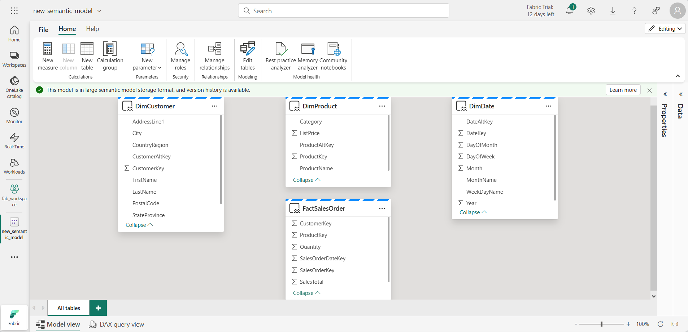

---
lab:
  title: 데이터 웨어하우스에서 데이터 분석
  module: Get started with data warehouses in Microsoft Fabric
---

# 데이터 웨어하우스에서 데이터 분석

Microsoft Fabric에서 데이터 웨어하우스는 대규모 분석을 위한 관계형 데이터베이스를 제공합니다. 레이크하우스에 정의된 테이블의 기본 읽기 전용 SQL 엔드포인트와 달리 데이터 웨어하우스는 전체 SQL 의미 체계를 제공합니다. 테이블에 데이터를 삽입, 업데이트 및 삭제하는 기능을 포함합니다.

이 랩을 완료하는 데 약 **30**분이 걸립니다.

> **참고**: 이 연습을 완료하려면 Microsoft Fabric 평가판[이 필요합니다](https://learn.microsoft.com/fabric/get-started/fabric-trial).

## 작업 영역 만들기

패브릭에서 데이터를 사용하기 전에 패브릭 평가판을 사용하도록 설정된 작업 영역을 만듭니다.

1. Microsoft Fabric 홈페이지에서 [Synapse Data Warehouse**를 선택합니다**.](https://app.fabric.microsoft.com)
1. 왼쪽 메뉴 모음에서 **작업 영역**을 선택합니다(아이콘은 와 유사함).
1. 선택한 이름으로 새 작업 영역을 만들고 패브릭 용량(*평가판*, *프리미엄* 또는 *패브릭*)이 포함된 라이선스 모드를 선택합니다.
1. 새 작업 영역이 열리면 비어 있어야 합니다.

    

## 데이터 웨어하우스 만들기

이제 작업 영역이 있으므로 데이터 웨어하우스를 만들어야 합니다. Synapse Data Warehouse 홈페이지에는 새 웨어하우스를 만드는 바로 가기가 포함되어 있습니다.

1. **Synapse Data Warehouse** 홈페이지에서 원하는 이름으로 새 **웨어하우스**를 만듭니다.

    1분 정도 지나면 새 웨어하우스가 만들어집니다.

    

## 테이블 만들기 및 데이터 삽입

웨어하우스는 테이블 및 기타 개체를 정의할 수 있는 관계형 데이터베이스입니다.

1. 새 웨어하우스에서 T-SQL** 타일로 테이블 만들기를 선택하고 **기본 SQL 코드를 다음 CREATE TABLE 문으로 바꿉니다.

    ```sql
   CREATE TABLE dbo.DimProduct
   (
       ProductKey INTEGER NOT NULL,
       ProductAltKey VARCHAR(25) NULL,
       ProductName VARCHAR(50) NOT NULL,
       Category VARCHAR(50) NULL,
       ListPrice DECIMAL(5,2) NULL
   );
   GO
    ```

2. 사용 하 여**는 &#9655; 단추를 실행**하여 데이터 웨어하우스의 dbo** 스키마에 **DimProduct**라는 **새 테이블을 만드는 SQL 스크립트를 실행합니다.
3. 도구 모음의 **새로 고침** 단추를 사용하여 보기를 새로 고칩니다. 그런 다음 탐색기 창에서 **스키마** > **dbo** > **테이블을** 확장하고 **DimProduct** 테이블이 **만들어졌는지 확인합니다.**
4. 홈** 메뉴 탭에서 **새 SQL 쿼리** 단추를 사용하여 **새 쿼리를 만들고 다음 INSERT 문을 입력합니다.

    ```sql
   INSERT INTO dbo.DimProduct
   VALUES
   (1, 'RING1', 'Bicycle bell', 'Accessories', 5.99),
   (2, 'BRITE1', 'Front light', 'Accessories', 15.49),
   (3, 'BRITE2', 'Rear light', 'Accessories', 15.49);
   GO
    ```

5. 새 쿼리를 실행하여 DimProduct** 테이블에 세 개의 행을 **삽입합니다.
6. 쿼리가 완료되면 데이터** 웨어하우스의 **페이지 아래쪽에 있는 데이터 탭을 선택합니다. **탐색기** 창에서 DimProduct** 테이블을 선택하고 **테이블에 세 개의 행이 추가되었는지 확인합니다.
7. 홈** 메뉴 탭에서 **새 SQL 쿼리** 단추를 사용하여 **새 쿼리를 만듭니다. 그런 다음 Transact-SQL 코드를 `https://raw.githubusercontent.com/MicrosoftLearning/dp-data/main/create-dw.txt` 복사하여 새 쿼리 창에 붙여넣습니다.
<!-- I had to remove the GO command in this query as well -->
8. 간단한 데이터 웨어하우스 스키마를 만들고 일부 데이터를 로드하는 쿼리를 실행합니다. 스크립트를 실행하는 데 약 30초가 걸립니다.
9. 도구 모음의 **새로 고침** 단추를 사용하여 보기를 새로 고칩니다. 그런 다음 탐색기** 창에서 **데이터 웨어하우스의 **dbo** 스키마에 다음 네 개의 테이블이 포함되어 있는지 확인합니다.
    - **DimCustomer**
    - **DimDate**
    - **DimProduct**
    - **FactSalesOrder**

    > **팁**: 스키마를 로드하는 데 시간이 걸리는 경우 브라우저 페이지를 새로 고칩니다.

## 데이터 모델 정의

관계형 데이터 웨어하우스는 *일반적으로 팩* 트 및 *차원* 테이블로 구성됩니다. 팩트 테이블에는 비즈니스 성과(예: 판매 수익)를 분석하기 위해 집계할 수 있는 숫자 측정값이 포함되어 있으며, 차원 테이블에는 데이터를 집계할 수 있는 엔터티의 특성(예: 제품, 고객 또는 시간)이 포함됩니다. Microsoft Fabric 데이터 웨어하우스에서 이러한 키를 사용하여 테이블 간의 관계를 캡슐화하는 데이터 모델을 정의할 수 있습니다.

1. 데이터 웨어하우스의 페이지 아래쪽에서 모델** 탭을 **선택합니다.
2. 모델 창에서 다음과 같이 FactSalesOrder** 테이블이 중간에 있도록 **데이터 웨어하우스의 테이블을 다시 정렬합니다.

    

3. **FactSalesOrder** 테이블에서 ProductKey** 필드를 **끌어 DimProduct** 테이블의 **ProductKey** 필드에 **놓습니다. 그런 다음, 다음 관계 세부 정보를 확인합니다.
    - **표 1**: FactSalesOrder
    - **열**: ProductKey
    - **표 2**: DimProduct
    - **열**: ProductKey
    - **카디널리티**: 다 대 일 (*:1)
    - **교차 필터 방향**: 단일
    - **이 관계를 활성으로 만들기**: 선택됨
    - **참조 무결성** 가정: 선택되지 않음

4. 프로세스를 반복하여 다음 테이블 간에 다 대 일 관계를 만듭니다.
    - **FactOrderSales.CustomerKey** &#8594; **DimCustomer.CustomerKey**
    - **FactOrderSales.SalesOrderDateKey** &#8594; **DimDate.DateKey**

    모든 관계가 정의되면 모델은 다음과 같이 표시됩니다.

    

## 데이터 웨어하우스 테이블 쿼리

데이터 웨어하우스는 관계형 데이터베이스이므로 SQL을 사용하여 테이블을 쿼리할 수 있습니다.

### 쿼리 팩트 및 차원 테이블

관계형 데이터 웨어하우스의 대부분의 쿼리에는 관련 테이블(JOIN 절 사용)에서 데이터 집계 및 그룹화(집계 함수 및 GROUP BY 절 사용)가 포함됩니다.

1. 새 SQL 쿼리를 만들고 다음 코드를 실행합니다.

    ```sql
   SELECT  d.[Year] AS CalendarYear,
            d.[Month] AS MonthOfYear,
            d.MonthName AS MonthName,
           SUM(so.SalesTotal) AS SalesRevenue
   FROM FactSalesOrder AS so
   JOIN DimDate AS d ON so.SalesOrderDateKey = d.DateKey
   GROUP BY d.[Year], d.[Month], d.MonthName
   ORDER BY CalendarYear, MonthOfYear;
    ```

    시간 차원의 특성을 사용하면 팩트 테이블의 측정값을 여러 계층적 수준(이 경우 연도 및 월)으로 집계할 수 있습니다. 이는 데이터 웨어하우스의 일반적인 패턴입니다.

2. 집계에 두 번째 차원을 추가하려면 다음과 같이 쿼리를 수정합니다.

    ```sql
   SELECT  d.[Year] AS CalendarYear,
           d.[Month] AS MonthOfYear,
           d.MonthName AS MonthName,
           c.CountryRegion AS SalesRegion,
          SUM(so.SalesTotal) AS SalesRevenue
   FROM FactSalesOrder AS so
   JOIN DimDate AS d ON so.SalesOrderDateKey = d.DateKey
   JOIN DimCustomer AS c ON so.CustomerKey = c.CustomerKey
   GROUP BY d.[Year], d.[Month], d.MonthName, c.CountryRegion
   ORDER BY CalendarYear, MonthOfYear, SalesRegion;
    ```

3. 수정된 쿼리를 실행하고 결과를 검토합니다. 여기에는 연도, 월 및 판매 지역별로 집계된 판매 수익이 포함됩니다.

## 보기 만들기

Microsoft Fabric의 데이터 웨어하우스에는 관계형 데이터베이스에서 사용할 수 있는 동일한 기능이 많이 있습니다. 예를 들어 뷰* 및 저장 프로시저와 *같은 *데이터베이스 개체를* 만들어 SQL 논리를 캡슐화할 수 있습니다.

1. 뷰를 만들려면 이전에 만든 쿼리를 수정합니다(보기를 만들려면 ORDER BY 절을 제거해야 합니다).

    ```sql
   CREATE VIEW vSalesByRegion
   AS
   SELECT  d.[Year] AS CalendarYear,
           d.[Month] AS MonthOfYear,
           d.MonthName AS MonthName,
           c.CountryRegion AS SalesRegion,
          SUM(so.SalesTotal) AS SalesRevenue
   FROM FactSalesOrder AS so
   JOIN DimDate AS d ON so.SalesOrderDateKey = d.DateKey
   JOIN DimCustomer AS c ON so.CustomerKey = c.CustomerKey
   GROUP BY d.[Year], d.[Month], d.MonthName, c.CountryRegion;
    ```

2. 쿼리를 실행하여 뷰를 만듭니다. 그런 다음 데이터 웨어하우스 스키마를 새로 고치고 새 보기가 탐색기** 창에 **나열되는지 확인합니다.
3. 새 SQL 쿼리를 만들고 다음 SELECT 문을 실행합니다.

    ```SQL
   SELECT CalendarYear, MonthName, SalesRegion, SalesRevenue
   FROM vSalesByRegion
   ORDER BY CalendarYear, MonthOfYear, SalesRegion;
    ```

### 시각적 쿼리 만들기

SQL 코드를 작성하는 대신 그래픽 쿼리 디자이너를 사용하여 데이터 웨어하우스의 테이블을 쿼리할 수 있습니다. 이 환경은 코드 없이 데이터 변환 단계를 만들 수 있는 온라인 파워 쿼리와 비슷합니다. 더 복잡한 작업의 경우 파워 쿼리의 M(매시업) 언어를 사용할 수 있습니다.

1. **홈** 메뉴에서 새 시각적 쿼리**를 선택합니다**.

1. FactSalesOrder**를 캔버스**로 **끌어**옵니다. 테이블의 미리 보기는 아래 미리 보기** 창에 **표시됩니다.

1. DimProduct를** 캔버스**로 **끌어**옵니다. 이제 쿼리에 두 개의 테이블이 있습니다.

2. 캔버스의 **FactSalesOrder** 테이블에서 (+)** 단추를 **사용하여 쿼리를 **병합합니다**.


1. **병합 쿼리** 창에서 병합에 적합한 테이블로 DimProduct**를 선택합니다**. 두 쿼리에서 모두 ProductKey를 선택하고 **기본 **왼쪽 외부 조인 형식을** 그대로 두고 확인을** 클릭합니다**.**

2. **미리 보기**에서 새 **DimProduct** 열이 FactSalesOrder 테이블에 추가되었습니다. 열 이름 오른쪽에 있는 화살표를 클릭하여 열을 확장합니다. ProductName을** 선택하고 **확인을** 클릭합니다**.

    

1. 관리자 요청에 따라 단일 제품에 대한 데이터를 확인하려는 경우 이제 ProductName** 열을 사용하여 **쿼리의 데이터를 필터링할 수 있습니다. **ProductName** 열을 필터링하여 케이블 잠금** 데이터만 확인**합니다.

1. 여기에서 결과 시각화 또는 **Excel에서 열기를 **선택하여 이 단일 쿼리의 결과를** 분석할 수 있습니다**. 이제 관리자가 요청한 내용을 정확하게 확인할 수 있으므로 결과를 더 이상 분석할 필요가 없습니다.

### 데이터 시각화

단일 쿼리 또는 데이터 웨어하우스에서 데이터를 쉽게 시각화할 수 있습니다. 시각화하기 전에 보고서 디자이너에 적합하지 않은 열 및/또는 테이블을 숨깁니다.

1. **탐색기** 창에서 모델** 보기를 선택합니다**. 

1. 보고서를 만들 필요가 없는 팩트 및 차원 테이블에서 다음 열을 숨깁니다. 이렇게 하면 모델에서 열이 제거되지 않고 보고서 캔버스의 보기에서 열이 숨겨지게 됩니다.
   1. FactSalesOrder
      - **SalesOrderDateKey**
      - **CustomerKey**
      - **ProductKey**
   1. DimCustomer
      - **CustomerKey**
      - **CustomerAltKey**
   1. DimDate
      - **DateKey**
      - **DateAltKey**
   1. DimProduct
      - **ProductKey**
      - **ProductAltKey** 

1. 이제 보고서를 작성하고 다른 사용자가 이 데이터 세트를 사용할 수 있도록 할 준비가 되었습니다. 홈 메뉴에서 새 보고서를** 선택합니다**. 그러면 Power BI 보고서를 만들 수 있는 새 창이 열립니다.

1. 데이터 창에서 **FactSalesOrder**를 확장 **** 합니다. 숨긴 열은 더 이상 표시되지 않습니다. 

1. SalesTotal**을 선택합니다**. 그러면 보고서 캔버스**에 열이 **추가됩니다. 열은 숫자 값이므로 기본 시각적 개체는 세로 막대형 차트**입니다**.
1. 캔버스의 세로 막대형 차트가 활성 상태인지(회색 테두리 및 핸들 사용) DimProduct** 테이블에서 범주 **** 를 선택하여 **세로 막대형 차트에 범주를 추가합니다.
1. **시각화 창에서 세로 막대형 차트에서 묶은 가로** 막대형 차트로 **차트 종류를 변경합니다**. 그런 다음 필요에 따라 차트의 크기를 조정하여 범주를 읽을 수 있도록 합니다.

    

1. **시각화** 창에서 시각적** 개체 서식 탭을 선택하고 **일반** 하위 탭**의 **제목** 섹션에서 텍스트를** 범주**별 총 판매액으로 **변경**합니다.

1. **파일** 메뉴에서 **저장**을 선택합니다. 그런 다음 보고서를 이전에 만든 작업 영역에 판매 보고서**로 **저장합니다.

1. 왼쪽의 메뉴 허브에서 작업 영역으로 다시 이동합니다. 이제 작업 영역에 데이터 웨어하우스, 기본 데이터 세트 및 만든 보고서의 세 가지 항목이 저장됩니다.

    

## 리소스 정리

이 연습에서는 여러 테이블을 포함하는 데이터 웨어하우스를 만들었습니다. SQL을 사용하여 테이블에 데이터를 삽입하고 쿼리했습니다. 시각적 쿼리 도구도 사용했습니다. 마지막으로 데이터 웨어하우스의 기본 데이터 세트에 대한 데이터 모델을 향상하고 보고서의 원본으로 사용했습니다.

데이터 웨어하우스 탐색을 완료한 경우 이 연습에 대해 만든 작업 영역을 삭제할 수 있습니다.

1. 왼쪽 막대에서 작업 영역의 아이콘을 선택하여 포함된 모든 항목을 봅니다.
2. 도구 모음의 **...** 메뉴에서 **작업 영역 설정**을 선택합니다.
3. **기타** 섹션에서 **이 작업 영역 제거**를 선택합니다.
