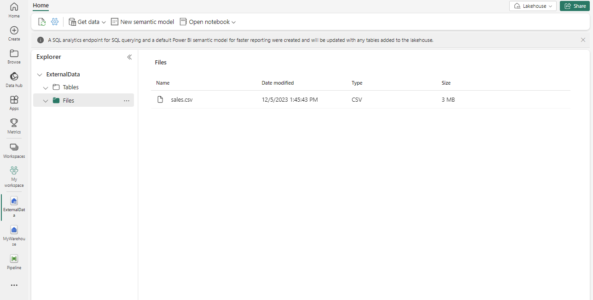

---
lab:
  title: T-SQL을 사용하여 웨어하우스에 데이터 로드
  module: Load data into a warehouse in Microsoft Fabric
---

# 웨어하우스에 데이터 로드

Microsoft Fabric에서 데이터 웨어하우스는 대규모 분석을 위한 관계형 데이터베이스를 제공합니다. 레이크하우스에 정의된 테이블의 기본 읽기 전용 SQL 엔드포인트와 달리 데이터 웨어하우스는 전체 SQL 의미 체계를 제공합니다. 테이블에 데이터를 삽입, 업데이트 및 삭제하는 기능을 포함합니다.

이 랩을 완료하는 데 약 **30**분이 걸립니다.

> **참고**: 이 연습을 완료하려면 Microsoft Fabric 평가판[이 필요합니다](https://learn.microsoft.com/fabric/get-started/fabric-trial).

## 작업 영역 만들기

패브릭에서 데이터를 사용하기 전에 패브릭 평가판을 사용하도록 설정된 작업 영역을 만듭니다.

1. Microsoft Fabric 홈페이지에서 [Synapse Data Warehouse**를 선택합니다**.](https://app.fabric.microsoft.com)
1. 왼쪽 메뉴 모음에서 **작업 영역**을 선택합니다(아이콘은 와 유사함).
1. 선택한 이름으로 새 작업 영역을 만들고 패브릭 용량(*평가판*, *프리미엄* 또는 *패브릭*)이 포함된 라이선스 모드를 선택합니다.
1. 새 작업 영역이 열리면 비어 있어야 합니다.

    

## Lakehouse 만들기 및 파일 업로드

이 시나리오에서는 사용 가능한 데이터가 없으므로 웨어하우스를 로드하는 데 사용할 데이터를 수집해야 합니다. 웨어하우스를 로드하는 데 사용할 데이터 파일에 대한 데이터 레이크하우스를 만듭니다.

1. **Synapse 데이터 엔지니어** 홈페이지에서 원하는 이름으로 새 **Lakehouse**를 만듭니다.

    1분 정도 지나면 빈 레이크하우스가 새로 만들어집니다. 분석을 위해 데이터 레이크하우스에 일부 데이터를 수집해야 합니다. 이 작업을 수행하는 방법에는 여러 가지가 있지만, 이 연습에서는 CVS 파일을 로컬 컴퓨터(또는 해당하는 경우 랩 VM)에 다운로드한 다음 레이크하우스에 업로드합니다.

1. 에서 이 연습 `https://github.com/MicrosoftLearning/dp-data/raw/main/sales.csv`의 파일을 다운로드합니다.

1. 레이크하우스가 포함된 웹 브라우저 탭으로 돌아가서 탐색기** 창의 **파일** 폴더에 **대한 **...** 메뉴에서 파일** 업로드** 및 **업로드를 선택한 **다음, 로컬 컴퓨터(또는 해당하는 경우 랩 VM)에서 sales.csv** 파일을 레이크하우스에 업로드**합니다.

1. 파일이 업로드된 후 파일을** 선택합니다**. 다음과 같이 CSV 파일이 업로드되었는지 확인합니다.

    

## 레이크하우스에서 테이블 만들기

1. 탐색기 창의 ****sales.csv** 파일에 **대한 ...** 메뉴에서 테이블**로 로드를 선택한 다음 **새 테이블을** 선택합니다**.**

1. 새 테이블**로 파일 로드 대화 상자에서 **다음 정보를 제공합니다.
    - **새 테이블 이름:** staging_sales
    - **열 이름에 머리글 사용:** 선택됨
    - **구분 기호:** ,

1. **로드**를 선택합니다.

## 웨어하우스 만들기

이제 필요한 데이터가 있는 작업 영역, Lakehouse 및 판매 테이블이 있으므로 데이터 웨어하우스를 만들어야 합니다. Synapse Data Warehouse 홈페이지에는 새 웨어하우스를 만드는 바로 가기가 포함되어 있습니다.

1. **Synapse Data Warehouse** 홈페이지에서 원하는 이름으로 새 **웨어하우스**를 만듭니다.

    1분 정도 지나면 새 웨어하우스가 만들어집니다.

    

## 팩트 테이블, 차원 및 뷰 만들기

Sales 데이터에 대한 팩트 테이블 및 차원을 만들어 보겠습니다. 또한 Lakehouse를 가리키는 뷰를 만듭니다. 이렇게 하면 로드하는 데 사용할 저장 프로시저의 코드가 간소화됩니다.

1. 작업 영역에서 만든 웨어하우스를 선택합니다.

1. 웨어하우스 **탐색기**에서 새 SQL 쿼리**를 선택한 **다음, 다음 쿼리를 복사하여 실행합니다.

    ```sql
    CREATE SCHEMA [Sales]
    GO
        
    IF NOT EXISTS (SELECT * FROM sys.tables WHERE name='Fact_Sales' AND SCHEMA_NAME(schema_id)='Sales')
        CREATE TABLE Sales.Fact_Sales (
            CustomerID VARCHAR(255) NOT NULL,
            ItemID VARCHAR(255) NOT NULL,
            SalesOrderNumber VARCHAR(30),
            SalesOrderLineNumber INT,
            OrderDate DATE,
            Quantity INT,
            TaxAmount FLOAT,
            UnitPrice FLOAT
        );
    
    IF NOT EXISTS (SELECT * FROM sys.tables WHERE name='Dim_Customer' AND SCHEMA_NAME(schema_id)='Sales')
        CREATE TABLE Sales.Dim_Customer (
            CustomerID VARCHAR(255) NOT NULL,
            CustomerName VARCHAR(255) NOT NULL,
            EmailAddress VARCHAR(255) NOT NULL
        );
        
    ALTER TABLE Sales.Dim_Customer add CONSTRAINT PK_Dim_Customer PRIMARY KEY NONCLUSTERED (CustomerID) NOT ENFORCED
    GO
    
    IF NOT EXISTS (SELECT * FROM sys.tables WHERE name='Dim_Item' AND SCHEMA_NAME(schema_id)='Sales')
        CREATE TABLE Sales.Dim_Item (
            ItemID VARCHAR(255) NOT NULL,
            ItemName VARCHAR(255) NOT NULL
        );
        
    ALTER TABLE Sales.Dim_Item add CONSTRAINT PK_Dim_Item PRIMARY KEY NONCLUSTERED (ItemID) NOT ENFORCED
    GO
    ```

    > **중요:** 데이터 웨어하우스에서 외래 키 제약 조건이 테이블 수준에서 항상 필요한 것은 아닙니다. 외래 키 제약 조건은 데이터 무결성을 보장하는 데 도움이 될 수 있지만 ETL(추출, 변환, 로드) 프로세스에 오버헤드를 추가하고 데이터 로드 속도를 늦출 수도 있습니다. 데이터 웨어하우스에서 외래 키 제약 조건을 사용하기로 한 결정은 데이터 무결성과 성능 간의 장단분에 대해 신중하게 고려해야 합니다.

1. 탐색기**** 에서 Sales >> 테이블** >> 스키마로 이동합니다**. *방금 만든 Fact_Sales*, *Dim_Customer* 및 *Dim_Item* 테이블을 확인합니다.

1. 새 **SQL 쿼리** 편집기를 열고 다음 쿼리를 복사하여 실행합니다. 만든 레이크하우스로 업데이트 *<your lakehouse name>* 합니다.

    ```sql
    CREATE VIEW Sales.Staging_Sales
    AS
    SELECT * FROM [<your lakehouse name>].[dbo].[staging_sales];
    ```

1. 탐색기**** 에서 스키마 >> Sales >> 보기**로 이동합니다**. *만든 Staging_Sales* 보기를 확인합니다.

## 웨어하우스에 데이터 로드

팩트 및 차원 테이블을 만들었으므로 이제 레이크하우스에서 창고로 데이터를 로드하는 저장 프로시저를 만들어 보겠습니다. Lakehouse를 만들 때 만들어진 자동 SQL 엔드포인트로 인해 T-SQL 및 데이터베이스 간 쿼리를 사용하여 웨어하우스에서 레이크하우스의 데이터에 직접 액세스할 수 있습니다.

이 사례 연구에서 간단히 하기 위해 고객 이름과 항목 이름을 기본 키로 사용합니다.

1. 새 **SQL 쿼리** 편집기를 만든 다음, 다음 쿼리를 복사하여 실행합니다.

    ```sql
    CREATE OR ALTER PROCEDURE Sales.LoadDataFromStaging (@OrderYear INT)
    AS
    BEGIN
        -- Load data into the Customer dimension table
        INSERT INTO Sales.Dim_Customer (CustomerID, CustomerName, EmailAddress)
        SELECT DISTINCT CustomerName, CustomerName, EmailAddress
        FROM [Sales].[Staging_Sales]
        WHERE YEAR(OrderDate) = @OrderYear
        AND NOT EXISTS (
            SELECT 1
            FROM Sales.Dim_Customer
            WHERE Sales.Dim_Customer.CustomerName = Sales.Staging_Sales.CustomerName
            AND Sales.Dim_Customer.EmailAddress = Sales.Staging_Sales.EmailAddress
        );
        
        -- Load data into the Item dimension table
        INSERT INTO Sales.Dim_Item (ItemID, ItemName)
        SELECT DISTINCT Item, Item
        FROM [Sales].[Staging_Sales]
        WHERE YEAR(OrderDate) = @OrderYear
        AND NOT EXISTS (
            SELECT 1
            FROM Sales.Dim_Item
            WHERE Sales.Dim_Item.ItemName = Sales.Staging_Sales.Item
        );
        
        -- Load data into the Sales fact table
        INSERT INTO Sales.Fact_Sales (CustomerID, ItemID, SalesOrderNumber, SalesOrderLineNumber, OrderDate, Quantity, TaxAmount, UnitPrice)
        SELECT CustomerName, Item, SalesOrderNumber, CAST(SalesOrderLineNumber AS INT), CAST(OrderDate AS DATE), CAST(Quantity AS INT), CAST(TaxAmount AS FLOAT), CAST(UnitPrice AS FLOAT)
        FROM [Sales].[Staging_Sales]
        WHERE YEAR(OrderDate) = @OrderYear;
    END
    ```
1. 새 **SQL 쿼리** 편집기를 만든 다음, 다음 쿼리를 복사하여 실행합니다.

    ```sql
    EXEC Sales.LoadDataFromStaging 2021
    ```

    > **참고:** 이 경우 2021년의 데이터만 로드합니다. 그러나 이전 연도의 데이터를 로드하도록 수정할 수 있는 옵션이 있습니다.

## 분석 쿼리 실행

일부 분석 쿼리를 실행하여 웨어하우스의 데이터의 유효성을 검사해 보겠습니다.

1. 위쪽 메뉴에서 새 SQL 쿼리**를 선택한 **다음, 다음 쿼리를 복사하여 실행합니다.

    ```sql
    SELECT c.CustomerName, SUM(s.UnitPrice * s.Quantity) AS TotalSales
    FROM Sales.Fact_Sales s
    JOIN Sales.Dim_Customer c
    ON s.CustomerID = c.CustomerID
    WHERE YEAR(s.OrderDate) = 2021
    GROUP BY c.CustomerName
    ORDER BY TotalSales DESC;
    ```

    > **참고:** 이 쿼리는 2021년의 총 판매액별로 고객을 보여줍니다. 지정된 연도의 총 판매액이 가장 높은 고객은 요르단 터너**이며 총 판매량**은 14686.69**입니다**. 

1. 위쪽 메뉴에서 새 SQL 쿼리**를 선택**하거나 동일한 편집기를 다시 사용한 다음 다음 쿼리를 복사하여 실행합니다.

    ```sql
    SELECT i.ItemName, SUM(s.UnitPrice * s.Quantity) AS TotalSales
    FROM Sales.Fact_Sales s
    JOIN Sales.Dim_Item i
    ON s.ItemID = i.ItemID
    WHERE YEAR(s.OrderDate) = 2021
    GROUP BY i.ItemName
    ORDER BY TotalSales DESC;

    ```

    > **참고:** 이 쿼리는 2021년 총 판매액별 상위 셀링 항목을 보여줍니다. 이러한 결과에 따르면 *검은색과 은색의 Mountain-200 자전거* 모델이 2021년 고객들 사이에서 가장 인기 있는 아이템이었습니다.

1. 위쪽 메뉴에서 새 SQL 쿼리**를 선택**하거나 동일한 편집기를 다시 사용한 다음 다음 쿼리를 복사하여 실행합니다.

    ```sql
    WITH CategorizedSales AS (
    SELECT
        CASE
            WHEN i.ItemName LIKE '%Helmet%' THEN 'Helmet'
            WHEN i.ItemName LIKE '%Bike%' THEN 'Bike'
            WHEN i.ItemName LIKE '%Gloves%' THEN 'Gloves'
            ELSE 'Other'
        END AS Category,
        c.CustomerName,
        s.UnitPrice * s.Quantity AS Sales
    FROM Sales.Fact_Sales s
    JOIN Sales.Dim_Customer c
    ON s.CustomerID = c.CustomerID
    JOIN Sales.Dim_Item i
    ON s.ItemID = i.ItemID
    WHERE YEAR(s.OrderDate) = 2021
    ),
    RankedSales AS (
        SELECT
            Category,
            CustomerName,
            SUM(Sales) AS TotalSales,
            ROW_NUMBER() OVER (PARTITION BY Category ORDER BY SUM(Sales) DESC) AS SalesRank
        FROM CategorizedSales
        WHERE Category IN ('Helmet', 'Bike', 'Gloves')
        GROUP BY Category, CustomerName
    )
    SELECT Category, CustomerName, TotalSales
    FROM RankedSales
    WHERE SalesRank = 1
    ORDER BY TotalSales DESC;
    ```

    > **참고:** 이 쿼리의 결과는 총 매출을 기준으로 각 범주(자전거, 헬멧 및 장갑)의 상위 고객을 보여 줍니다. 예를 들어 카슨 **버틀러**는 자전거** 카테고리의 **최고 고객입니다.
    >
    > 차원 테이블에 별도의 범주 열이 `ItemName` 없으므로 문자열 조작을 사용하여 열에서 범주 정보를 추출했습니다. 이 방법은 항목 이름이 일관된 명명 규칙을 따른다고 가정합니다. 항목 이름이 일관된 명명 규칙을 따르지 않는 경우 결과는 각 항목의 실제 범주를 정확하게 반영하지 않을 수 있습니다.

이 연습에서는 여러 테이블이 있는 레이크하우스 및 데이터 웨어하우스를 만들었습니다. 데이터를 수집하고 데이터베이스 간 쿼리를 사용하여 레이크하우스에서 웨어하우스로 데이터를 로드했습니다. 또한 쿼리 도구를 사용하여 분석 쿼리를 수행했습니다.

## 리소스 정리

데이터 웨어하우스 탐색을 완료한 경우 이 연습에 대해 만든 작업 영역을 삭제할 수 있습니다.

1. 왼쪽 막대에서 작업 영역의 아이콘을 선택하여 포함된 모든 항목을 봅니다.
2. 도구 모음의 **...** 메뉴에서 **작업 영역 설정**을 선택합니다.
3. **기타** 섹션에서 **이 작업 영역 제거**를 선택합니다.
