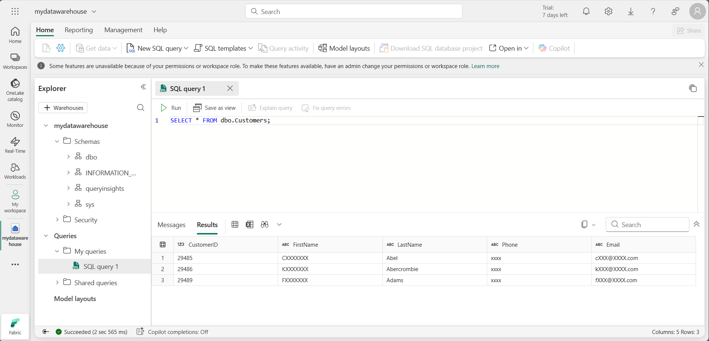
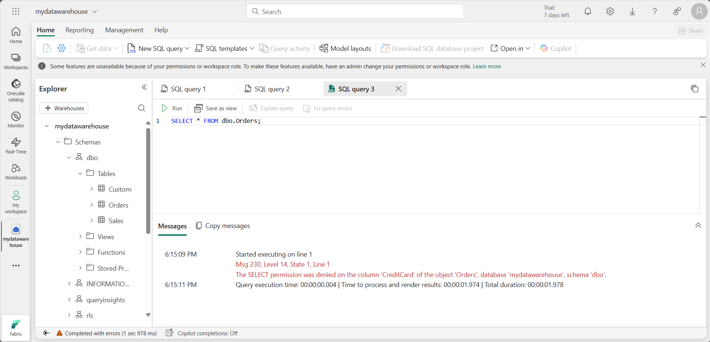

---
lab:
  title: Microsoft Fabric 데이터 웨어하우스 보호
  module: Secure a Microsoft Fabric data warehouse
---

# Microsoft Fabric 데이터 웨어하우스 보호

Microsoft Fabric 권한과 세분화된 SQL 권한이 함께 작동하여 웨어하우스 액세스 및 사용자 권한을 제어합니다. 이 연습에서는 세분화된 권한, 열 수준 보안, 행 수준 보안 및 동적 데이터 마스킹을 사용하여 데이터를 보호합니다.

> **참고**: 이 랩의 연습을 완전히 완료하려면 두 명의 사용자가 필요합니다. 한 사용자에게는 작업 영역 관리자 역할이 할당되고 다른 사용자에게는 작업 영역 뷰어 역할이 할당되어야 합니다. 작업 영역에 역할을 할당하려면 [작업 영역에 대한 액세스 권한 부여](https://learn.microsoft.com/fabric/get-started/give-access-workspaces)를 참조하세요. 동일한 조직의 두 번째 계정에 액세스할 수 없는 경우에도 작업 영역 관리자로서 연습을 진행할 수 있으며, 작업 영역 뷰어 계정으로 수행하는 단계는 건너뛸 수 있습니다. 연습의 스크린샷을 참조하여 작업 영역 뷰어 계정이 액세스할 수 있는 항목을 확인하세요.

이 랩을 완료하는 데 약 **45**분이 소요됩니다.

## 작업 영역 만들기

패브릭에서 데이터를 사용하기 전에 패브릭 평가판을 사용하도록 설정된 작업 영역을 만듭니다.

1. 브라우저에서 [Microsoft Fabric 홈페이지](https://app.fabric.microsoft.com/home?experience=fabric)(`https://app.fabric.microsoft.com/home?experience=fabric`)로 이동하고 Fabric 자격 증명을 사용해 로그인합니다.
1. 왼쪽 메뉴 모음에서 **작업 영역**을 선택합니다(아이콘은 와 유사함).
1. Fabric 용량이 포함된 라이선스 모드(*평가판*, *프리미엄* 또는 *Fabric*)를 선택하여 원하는 이름으로 새 작업 영역을 만듭니다.
1. 새 작업 영역이 열리면 비어 있어야 합니다.

    

> **참고**: 작업 영역을 만들면 자동으로 작업 영역 관리자 역할의 멤버가 됩니다. 환경의 두 번째 사용자를 작업 영역 뷰어 역할에 추가하여 이 연습에서 구성된 기능을 테스트할 수 있습니다. 작업 영역에서 **액세스 관리**를 선택한 다음 **사용자 또는 그룹 추가**를 선택하면 됩니다. 이렇게 하면 두 번째 사용자가 작업 영역 콘텐츠를 볼 수 있습니다.

## 데이터 웨어하우스 만들기

그 다음, 생성한 작업 영역에 데이터 웨어하우스를 만듭니다.

1. 왼쪽 메뉴 모음에서 **만들기**를 선택합니다. *새* 페이지의 *데이터 웨어하우스* 섹션에서 **웨어하우스**를 선택합니다. 원하는 고유한 이름.

    >**참고**: **만들기** 옵션이 사이드바에 고정되지 않은 경우 먼저 줄임표(**...**) 옵션을 선택해야 합니다.

    1분 정도 지나면 새 웨어하우스가 만들어집니다.

    

## 테이블의 열에 동적 데이터 마스킹 규칙 적용

동적 데이터 마스킹 규칙은 테이블 수준의 개별 열에 적용되므로 모든 쿼리가 마스킹의 영향을 받습니다. 기밀 데이터를 볼 수 있는 명시적 권한이 없는 사용자는 쿼리 결과에서 마스킹된 값을 볼 수 있는 반면, 데이터를 볼 수 있는 명시적 권한이 있는 사용자는 해당 값을 가리지 않은 상태로 볼 수 있습니다. 마스크에는 기본, 이메일, 임의 및 사용자 지정 문자열의 네 가지 형식이 있습니다. 이 연습에서는 기본 마스크, 이메일 마스크 및 사용자 지정 문자열 마스크를 적용합니다.

1. 웨어하우스에서 **T-SQL** 타일을 선택하고 다음 T-SQL 문을 사용하여 테이블을 만들고 데이터를 삽입하고 봅니다.  

    ```T-SQL
   CREATE TABLE dbo.Customers
   (   
       CustomerID INT NOT NULL,   
       FirstName varchar(50) MASKED WITH (FUNCTION = 'partial(1,"XXXXXXX",0)') NULL,     
       LastName varchar(50) NOT NULL,     
       Phone varchar(20) MASKED WITH (FUNCTION = 'default()') NULL,     
       Email varchar(50) MASKED WITH (FUNCTION = 'email()') NULL   
   );
   
   INSERT dbo.Customers (CustomerID, FirstName, LastName, Phone, Email) VALUES
   (29485,'Catherine','Abel','555-555-5555','catherine0@adventure-works.com'),
   (29486,'Kim','Abercrombie','444-444-4444','kim2@adventure-works.com'),
   (29489,'Frances','Adams','333-333-3333','frances0@adventure-works.com');
   
   SELECT * FROM dbo.Customers;
    ```

    마스킹 해제된 데이터를 볼 수 없도록 제한된 사용자가 테이블을 쿼리하면 **FirstName** 열에 XXXXXXX가 포함된 문자열의 첫 번째 문자만 표시되고 마지막 문자는 표시되지 않습니다. **Phone** 열에 xxxx가 표시됩니다. **Email** 열에는 이메일 주소의 첫 문자와 그 뒤에 `XXX@XXX.com`이 표시됩니다. 이 방식을 사용하면 중요한 데이터를 기밀로 유지하면서 제한된 사용자가 테이블을 쿼리할 수 있도록 허용합니다.

2. **&#9655; 실행** 단추를 사용하여 데이터 웨어하우스의 **dbo** 스키마에 **Customers**라는 새 테이블을 만드는 SQL 스크립트를 실행합니다.

3. 그런 다음 **탐색기** 창에서 **스키마** > **dbo** > **테이블**을 확장하고 **Customers** 테이블이 만들어졌는지 확인합니다. 작업 영역 작성자인 사용자는 마스킹 해제된 데이터를 볼 수 있는 작업 영역 관리자 역할의 멤버이기 때문에 `SELECT` 문은 마스킹 해제된 데이터를 반환합니다.

    >**참고**: **뷰어** 작업 영역 역할의 구성원인 테스트 사용자로 연결하여 **Customers** 테이블에서 `SELECT` 문을 실행하면 마스킹된 데이터에 대해 다음과 같은 결과가 표시됩니다.
   
    
 
    테스트 사용자에게는 UNMASK 권한이 부여되지 않았으므로 FirstName, Phone, Email 열에 대해 반환된 데이터는 해당 열이 `CREATE TABLE` 문에서 마스크로 정의되었기 때문에 마스킹됩니다.

## 행 수준 보안 적용

RLS(행 수준 보안)를 사용하면 쿼리를 실행하는 사용자의 ID 또는 역할을 기반으로 행에 대한 액세스를 제한할 수 있습니다. 이 연습에서는 인라인 테이블 반환 함수로 정의된 보안 정책과 보안 조건자를 만들어 행에 대한 액세스를 제한합니다.

1. 마지막 연습에서 만든 웨어하우스에서 **새 SQL 쿼리** 드롭다운을 선택하고 **새 SQL 쿼리**를 선택합니다.

2. 테이블을 만들고 데이터를 삽입합니다. 이후 단계에서 행 수준 보안을 테스트할 수 있도록 `username1@your_domain.com`을 환경의 사용자 이름으로 바꾸고 `username2@your_domain.com`을 사용자 이름으로 바꿉니다.

    ```T-SQL
   CREATE TABLE dbo.Sales  
   (  
       OrderID INT,  
       SalesRep VARCHAR(60),  
       Product VARCHAR(10),  
       Quantity INT  
   );
    
   --Populate the table with 6 rows of data, showing 3 orders for each test user. 
   INSERT dbo.Sales (OrderID, SalesRep, Product, Quantity) VALUES
   (1, '<username1>@<your_domain>.com', 'Valve', 5),   
   (2, '<username1>@<your_domain>.com', 'Wheel', 2),   
   (3, '<username1>@<your_domain>.com', 'Valve', 4),  
   (4, '<username2>@<your_domain>.com', 'Bracket', 2),   
   (5, '<username2>@<your_domain>.com', 'Wheel', 5),   
   (6, '<username2>@<your_domain>.com', 'Seat', 5);  
    
   SELECT * FROM dbo.Sales;  
    ```

3. **&#9655; 실행** 단추를 사용하여 데이터 웨어하우스의 **dbo** 스키마에 **Sales**라는 새 테이블을 만드는 SQL 스크립트를 실행합니다.

4. 그런 다음 **탐색기** 창에서 **스키마** > **dbo** > **테이블**을 확장하고 **Sales** 테이블이 만들어졌는지 확인합니다.
5. 새로운 스키마, 함수로 정의된 보안 조건자, 보안 정책을 만듭니다.  

    ```T-SQL
   --Create a separate schema to hold the row-level security objects (the predicate function and the security policy)
   CREATE SCHEMA rls;
   GO
   
   /*Create the security predicate defined as an inline table-valued function.
   A predicate evaluates to true (1) or false (0). This security predicate returns 1,
   meaning a row is accessible, when a row in the SalesRep column is the same as the user
   executing the query.*/   
   --Create a function to evaluate who is querying the table
   CREATE FUNCTION rls.fn_securitypredicate(@SalesRep AS VARCHAR(60)) 
       RETURNS TABLE  
   WITH SCHEMABINDING  
   AS  
       RETURN SELECT 1 AS fn_securitypredicate_result   
   WHERE @SalesRep = USER_NAME();
   GO   
   /*Create a security policy to invoke and enforce the function each time a query is run on the Sales table.
   The security policy has a filter predicate that silently filters the rows available to 
   read operations (SELECT, UPDATE, and DELETE). */
   CREATE SECURITY POLICY SalesFilter  
   ADD FILTER PREDICATE rls.fn_securitypredicate(SalesRep)   
   ON dbo.Sales  
   WITH (STATE = ON);
   GO
    ```

6. **&#9655; 실행** 단추를 사용하여 SQL 스크립트 실행합니다.
7. 그런 다음, **탐색기** 창에서 **스키마** > **rls** > **함수** > **테이블 반환 함수**를 확장하고 함수가 만들어졌는지 확인합니다.
8. Sales 테이블 `INSERT`문에서 `<username1>@<your_domain>.com`을 바꾼 사용자로 Fabric에 로그인합니다. 다음 T-SQL을 실행하여 해당 사용자로 로그인했는지 확인합니다.

    ```T-SQL
   SELECT USER_NAME();
    ```

9. **Sales** 테이블을 쿼리하여 행 수준 보안이 예상대로 작동하는지 확인합니다. 로그인한 사용자에 대해 정의된 보안 조건자의 조건을 충족하는 데이터만 표시되어야 합니다.

    ```T-SQL
   SELECT * FROM dbo.Sales;
    ```

    

## 열 수준 보안 구현

열 수준 보안을 사용하면 테이블의 특정 열에 액세스할 수 있는 사용자를 지정할 수 있습니다. 이는 열 목록과 이를 읽을 수 있거나 읽을 수 없는 사용자 또는 역할을 지정하는 테이블에서 `GRANT` 또는 `DENY` 문을 실행하여 구현됩니다. 액세스 관리를 간소화하려면 개별 사용자 대신 역할에 권한을 할당합니다. 이 연습에서는 테이블을 만들고, 테이블의 열 하위 집합에 대한 액세스 권한을 부여하고, 제한된 열을 본인 이외의 사용자가 볼 수 없는지 테스트합니다.

1. 이전 연습에서 만든 웨어하우스에서 **새 SQL 쿼리** 드롭다운을 선택한 후, **새 SQL 쿼리**를 선택합니다.  

2. 테이블을 만들고 테이블에 데이터를 삽입합니다.

    ```T-SQL
   CREATE TABLE dbo.Orders
   (   
       OrderID INT,   
       CustomerID INT,  
       CreditCard VARCHAR(20)      
   );   
   INSERT dbo.Orders (OrderID, CustomerID, CreditCard) VALUES
   (1234, 5678, '111111111111111'),
   (2341, 6785, '222222222222222'),
   (3412, 7856, '333333333333333');   
   SELECT * FROM dbo.Orders;
    ```

3. 테이블의 열을 볼 수 있는 권한을 거부합니다. T-SQL 문을 사용하면 `<username1>@<your_domain>.com`이 Orders 테이블의 CreditCard 열을 볼 수 없습니다. `DENY` 문에서 `<username1>@<your_domain>.com`을 작업 영역에 대한 **뷰어** 권한이 있는 시스템의 사용자 이름으로 바꿉니다.

    ```T-SQL
   DENY SELECT ON dbo.Orders (CreditCard) TO [<username1>@<your_domain>.com];
    ```

4. 선택 권한을 거부한 사용자로 Fabric에 로그인하여 열 수준 보안을 테스트합니다.

5. Orders 테이블을 쿼리하여 열 수준 보안이 예상대로 작동하는지 확인합니다.

    ```T-SQL
   SELECT * FROM dbo.Orders;
    ```

    

    CreditCard 열에 대한 액세스가 제한되었기 때문에 오류가 발생합니다. OrderID 및 CustomerID 필드만 선택하면 쿼리가 성공합니다.

    ```T-SQL
   SELECT OrderID, CustomerID from dbo.Orders
    ```

## T-SQL을 사용하여 SQL 세분화된 권한 구성

Fabric에는 작업 영역 수준과 항목 수준에서 데이터에 대한 액세스를 제어할 수 있는 권한 모델이 있습니다. 사용자가 Fabric 웨어하우스에서 보안 개체로 수행할 수 있는 작업을 보다 세밀하게 제어해야 하는 경우 표준 SQL DCL(데이터 컨트롤 언어) 명령 `GRANT`,`DENY` 및 `REVOKE`을 사용할 수 있습니다. 이 연습에서는 개체를 만들고 `GRANT` 및 `DENY`를 사용하여 보안을 설정한 다음 쿼리를 실행하여 세부적인 권한 적용 효과를 확인합니다.

1. 이전 연습에서 만든 웨어하우스에서 **새 SQL 쿼리** 드롭다운을 선택합니다. **새 SQL 쿼리**를 선택합니다.  

2. 저장 프로시저와 테이블을 만듭니다. 그런 다음 프로시저를 실행하고 테이블을 쿼리합니다.

    ```T-SQL
   CREATE PROCEDURE dbo.sp_PrintMessage
   AS
   PRINT 'Hello World.';
   GO   
   CREATE TABLE dbo.Parts
   (
       PartID INT,
       PartName VARCHAR(25)
   );
   
   INSERT dbo.Parts (PartID, PartName) VALUES
   (1234, 'Wheel'),
   (5678, 'Seat');
    GO
   
   /*Execute the stored procedure and select from the table and note the results you get
   as a member of the Workspace Admin role. Look for output from the stored procedure on 
   the 'Messages' tab.*/
   EXEC dbo.sp_PrintMessage;
   GO   
   SELECT * FROM dbo.Parts
    ```

3. 테이블에 대한 다음 `DENY SELECT` 권한은 **작업 영역 뷰어** 역할의 멤버인 사용자에게 부여되고 프로시저에 대한 `GRANT EXECUTE` 권한은 동일한 사용자에게 부여됩니다. `<username1>@<your_domain>.com`을 **작업 영역 뷰어** 역할의 멤버인 환경의 사용자 이름으로 바꿉니다.

    ```T-SQL
   DENY SELECT on dbo.Parts to [<username1>@<your_domain>.com];

   GRANT EXECUTE on dbo.sp_PrintMessage to [<username1>@<your_domain>.com];
    ```

4. `<username1>@<your_domain>.com` 대신 `DENY` 및 `GRANT` 문에 지정한 사용자로 Fabric에 로그인합니다. 그런 다음, 저장 프로시저를 실행하고 테이블을 쿼리하여 적용한 세부적인 권한을 테스트합니다.

    ```T-SQL
   EXEC dbo.sp_PrintMessage;
   GO
   
   SELECT * FROM dbo.Parts;
    ```

    

## 리소스 정리

이 연습에서는 테이블의 열에 동적 데이터 마스킹 규칙을 적용하고, 행 수준 보안을 적용하고, 열 수준 보안을 구현하고, T-SQL을 사용하여 SQL 세분화된 권한을 구성했습니다.

1. 왼쪽 탐색 모음에서 작업 영역 아이콘을 선택하면 포함된 모든 항목을 볼 수 있습니다.
2. 상단 도구 모음 메뉴에서 **작업 영역 설정**을 선택합니다.
3. **일반** 섹션에서 **이 작업 영역 제거**를 선택합니다.
