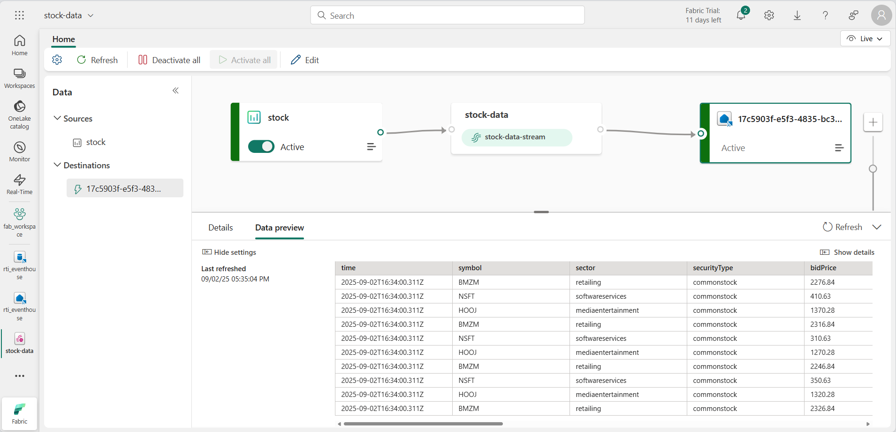
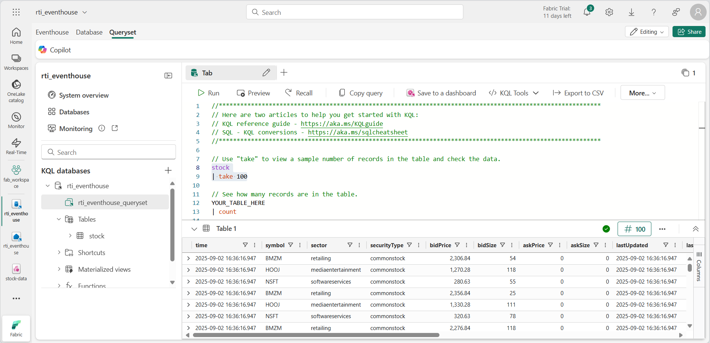

---
lab:
  title: Microsoft Fabric에서 실시간 인텔리전스 시작
  module: Get started with Real-Time Intelligence in Microsoft Fabric
---

# Microsoft Fabric에서 실시간 인텔리전스 시작

Microsoft Fabric은 실시간 인텔리전스를 제공하여 실시간 데이터 스트림에 대한 분석 솔루션을 만들 수 있습니다. 이 연습에서는 Microsoft Fabric의 실시간 인텔리전스 기능을 사용하여 주식 시장 데이터의 실시간 스트림을 수집, 분석 및 시각화합니다.

이 랩을 완료하는 데 약 **30**분이 소요됩니다.

> **참고**: 이 연습을 완료하려면 [Microsoft Fabric 테넌트](https://learn.microsoft.com/fabric/get-started/fabric-trial)가 필요합니다.

## 작업 영역 만들기

Fabric에서 데이터로 작업하기 전에, Fabric 용량을 사용하도록 설정된 작업 영역을 만들어야 합니다.

1. 브라우저에서 [Microsoft Fabric 홈페이지](https://app.fabric.microsoft.com/home?experience=fabric)(`https://app.fabric.microsoft.com/home?experience=fabric`)로 이동하고 Fabric 자격 증명을 사용해 로그인합니다.
1. 왼쪽 메뉴 모음에서 **작업 영역**을 선택합니다(아이콘은 와 유사함).
1. Fabric 용량이 포함된 라이선스 모드(*평가판*, *프리미엄* 또는 *Fabric*)를 선택하여 원하는 이름으로 새 작업 영역을 만듭니다.
1. 새 작업 영역이 열리면 비어 있어야 합니다.

    

## Eventstream 만들기

이제 스트리밍 원본에서 실시간 데이터를 찾고 수집할 준비가 되었습니다. 이렇게 하려면 Fabric 실시간 허브에서 시작합니다.

> **팁**: 실시간 허브를 처음 사용하는 경우 몇 가지 *시작* 팁이 표시될 수 있습니다. 이 팁은 닫을 수 있습니다.

1. 왼쪽 메뉴 모음에서 **실시간** 허브를 선택합니다.

    실시간 허브는 스트리밍 데이터의 원본을 쉽게 찾고 관리할 수 있는 방법을 제공합니다.

    

1. 실시간 허브의 **연결 대상** 섹션에서 **데이터 원본**을 선택합니다.
1. **주식 시장** 샘플 데이터 원본을 찾아 **연결**을 선택합니다. 그런 다음 **연결** 마법사에서 소스 이름을 `stock`(으)로 지정하고 기본 이벤트 스트림 이름을 편집하여 `stock-data`(으)로 변경합니다. 이 데이터와 연결된 기본 스트림의 이름은 자동으로 *stock-data-stream*으로 지정됩니다.

    

1. **다음**을 선택하고 원본 및 이벤트 스트림이 생성될 때까지 기다린 다음 **이벤트 스트림 열기**를 선택합니다. 이벤트 스트림은 디자인 캔버스에 **주식** 원본과 **stock-data-stream**을 표시합니다:

   

## 이벤트 하우스 만들기

이벤트 스트림은 실시간 주식 데이터를 수집하지만 현재 이 데이터로 아무 작업도 하지 않습니다. 캡처한 데이터를 테이블에 저장할 수 있는 이벤트 하우스를 만들어 보겠습니다.

1. 왼쪽 메뉴 모음에서 **만들기**를 선택합니다. *새* 페이지의 *실시간 인텔리전스* 섹션에서 **Eventhouse**를 선택합니다. 원하는 고유한 이름.

    >**참고**: **만들기** 옵션이 사이드바에 고정되지 않은 경우 먼저 줄임표(**...**) 옵션을 선택해야 합니다.

    빈 이벤트 하우스가 새로 표시될 때까지 표시되는 팁이나 프롬프트를 닫습니다.

    

1. 왼쪽 창에서 이벤트 하우스에는 이벤트 하우스와 이름이 같은 KQL 데이터베이스가 포함되어 있습니다. 이 데이터베이스에서 실시간 데이터에 대한 테이블을 만들거나 필요에 따라 추가 데이터베이스를 만들 수 있습니다.
1. 데이터베이스를 선택하고 연관된 *queryset*가 있는지 확인합니다. 이 파일에는 데이터베이스의 테이블 쿼리를 시작하는 데 사용할 수 있는 몇 가지 샘플 KQL 쿼리가 포함되어 있습니다.

    그러나 현재 쿼리할 테이블은 없습니다. 이벤트 스트림에서 새 테이블로 데이터를 가져오면 이 문제를 해결해 보겠습니다.

1. KQL 데이터베이스의 기본 페이지에서 **데이터 가져오기**를 선택합니다.
1. 데이터 원본의 경우 **Eventstream** > **기존 이벤트 스트림**을 선택합니다.
1. **대상 테이블 선택 또는 만들기** 창에서 `stock`(이)라는 새 테이블을 만듭니다. 그런 다음 **데이터 원본 구성** 창에서 작업 영역과 **stock-data** 이벤트 스트림을 선택하고 연결 이름을 `stock-table`(으)로 지정합니다.

   

1. **다음** 단추를 사용하여 데이터를 검사한 다음 구성을 완료하는 단계를 완료합니다. 그런 다음 구성 창을 닫아 주식 테이블이 있는 이벤트 하우스를 확인합니다.

   

    스트림과 테이블 간의 연결이 만들어졌습니다. 이벤트 스트림에서 확인해 보겠습니다.

1. 왼쪽 메뉴 모음에서 **실시간** 허브를 선택한 다음 **내 데이터 스트림** 페이지를 확인합니다. **stock-data-stream**스트림의 **...** 메뉴에서, **이벤트 스트림 열기**를 선택합니다.

    이제 이벤트 스트림에 스트림의 대상이 표시됩니다.

   

    > **팁**: 디자인 캔버스에서 대상을 선택하고 그 아래에 데이터 미리 보기가 표시되지 않으면 **새로 고침**을 선택합니다.

    이 연습에서는 실시간 데이터를 캡처하고 테이블에 로드하는 매우 간단한 이벤트 스트림을 만들었습니다. 실제 솔루션에서는 일반적으로 임시 창(예: 5분 동안 각 주식의 평균 가격을 캡처)을 통해 데이터를 집계하는 변환을 추가합니다.

    이제 캡처된 데이터를 쿼리하고 분석하는 방법을 살펴보겠습니다.

## 캡처된 데이터 쿼리

이벤트 스트림은 실시간 주식 시장 데이터를 캡처하여 KQL 데이터베이스의 테이블에 로드합니다. 이 테이블을 쿼리하여 캡처된 데이터를 볼 수 있습니다.

1. 왼쪽 메뉴 모음에서 이벤트 하우스 데이터베이스를 선택합니다.
1. 데이터베이스에 대한 *queryset*를 선택합니다.
1. 쿼리 창에서 다음과 같이 첫 번째 예제 쿼리를 수정합니다.

    ```kql
    stock
    | take 100
    ```

1. 쿼리 코드를 선택하고 실행하여 테이블에서 100개의 데이터 행을 확인합니다.

    

1. 결과를 검토한 다음 쿼리를 수정하여 지난 5분 동안 각 주식 기호의 평균 가격을 검색합니다.

    ```kql
    stock
    | where ["time"] > ago(5m)
    | summarize avgPrice = avg(todecimal(bidPrice)) by symbol
    | project symbol, avgPrice
    ```

1. 수정된 쿼리를 강조 표시하고 실행하여 결과를 확인합니다.
1. 몇 초 정도 기다렸다가 다시 실행하면 실시간 스트림에서 새 데이터가 테이블에 추가되면서 평균 가격이 변경됩니다.

## 실시간 대시보드 만들기

이제 데이터 스트림으로 채워지는 테이블이 있으므로 실시간 대시보드를 사용하여 데이터를 시각화할 수 있습니다.

1. 쿼리 편집기에서 지난 5분 동안의 평균 주가를 검색하는 데 사용한 KQL 쿼리를 선택합니다.
1. 도구 모음에서 **대시보드에 고정**을 선택합니다. 그런 다음, 다음 설정을 사용하여 **새 대시보드**에 쿼리를 고정합니다.
    - **대시보드 이름**: `Stock Dashboard`
    - **타일 이름**: `Average Prices`
1. 대시보드를 만들어서 엽니다. 다음과 같이 표시되어야 합니다.

    

1. 대시보드 상단에서 **보기** 모드에서 **편집** 모드로 전환합니다.
1. **평균 가격** 타일의 **편집**(*연필*) 아이콘을 선택합니다.
1. **시각적 개체 서식** 창에서 **시각적 개체**를 *테이블*에서 *세로 막대형 차트*로 변경합니다.

    

1. 대시보드 맨 위에서 **변경 내용 적용**을 선택하여 수정된 대시보드를 확인합니다.

    

    이제 실시간 주식 데이터에 대한 실시간 시각적 개체가 있습니다.

## 경고 만들기

Microsoft Fabric의 실시간 인텔리전스에는 실시간 이벤트를 기반으로 작업을 트리거할 수 있는 *Activator*라는 기술이 포함되어 있습니다. 평균 주가가 특정 금액만큼 증가할 때 이를 사용하여 경고해 보겠습니다.

1. 주가 시각적 개체가 포함된 대시보드 창의 도구 모음에서 **경고 설정**을 선택합니다.
1. **경고 설정** 창에서 다음 설정을 사용하여 경고를 만듭니다.
    - **쿼리 실행 간격**: 5분
    - **확인**: 그룹화된 각 이벤트에서
    - **그룹화 필드**: 기호
    - **시기**: avgPrice
    - **조건**: 증가 기준
    - **값**: 100
    - **작업**: 나에게 이메일 보내기
    - **저장 위치**:
        - **작업 영역**: *작업 영역*
        - **항목**:새 항목 만들기
        - **새 항목 이름**: *원하는 고유한 이름*

    

1. 경고를 만들고 저장될 때까지 기다립니다. 그런 다음 경고가 만들어졌음을 확인하는 창을 닫습니다.
1. 왼쪽 메뉴 모음에서 작업 영역의 페이지를 선택합니다(메시지가 표시되면 대시보드에 저장되지 않은 변경 내용 저장).
1. 작업 영역 페이지에서 경고에 대한 Activator를 포함하여 이 연습에서 만든 항목을 확인합니다.
1. Activator를 열고 해당 페이지의 **avgPrice** 노드 아래에서 경고에 대한 고유 식별자를 선택합니다. 그런 다음 **기록** 탭을 확인합니다.

    경고가 트리거되지 않은 경우에는 기록에 데이터가 포함되지 않습니다. 평균 주가가 100을 초과하여 변경되면 Activator가 이메일을 보내고 경고가 기록에 남습니다.

## 리소스 정리

이 연습에서는 이벤트 하우스를 만들고, 이벤트 스트림을 사용하여 실시간 데이터를 수집하고, KQL 데이터베이스 테이블에서 수집된 데이터를 쿼리하고, 실시간 데이터를 시각화하는 실시간 대시보드를 만들고, Activator를 사용하여 경고를 구성했습니다.

Fabric에서 실시간 인텔리전스 탐색을 완료한 경우 이 연습에 대해 만든 작업 영역을 삭제할 수 있습니다.

1. 왼쪽 막대에서 작업 영역의 아이콘을 선택합니다.
2. 도구 모음에서 **작업 영역 설정**을 선택합니다.
3. **일반** 섹션에서 **이 작업 영역 제거**를 선택합니다.
