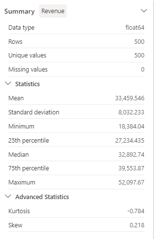
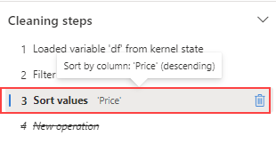

---
lab:
  title: Microsoft Fabric에서 데이터 랭글러를 사용하여 데이터 전처리
  module: Preprocess data with Data Wrangler in Microsoft Fabric
---

# Microsoft Fabric에서 데이터 랭글러를 사용하여 데이터 전처리

이 랩에서는 Microsoft Fabric에서 데이터 랭글러를 사용하여 데이터를 전처리하고 일반적인 데이터 과학 작업 라이브러리를 사용하여 코드를 생성하는 방법을 알아봅니다.

이 랩을 완료하는 데 약 **30**분이 걸립니다.

> **참고**: 이 연습을 완료하려면 [Microsoft Fabric 평가판](https://learn.microsoft.com/fabric/get-started/fabric-trial)이 필요합니다.

## 작업 영역 만들기

패브릭에서 데이터를 사용하기 전에 패브릭 평가판을 사용하도록 설정된 작업 영역을 만듭니다.

1. 브라우저에서 Microsoft Fabric 홈페이지(`https://app.fabric.microsoft.com`)로 이동하고 필요한 경우 Fabric 자격 증명을 사용해 로그인합니다.
1. Fabric 홈페이지에서 **Synapse 데이터 과학**을 선택합니다.
1. 왼쪽 메뉴 모음에서 **작업 영역**을 선택합니다(아이콘은 와 유사함).
1. Fabric 용량이 포함된 라이선스 모드(*평가판*, *프리미엄* 또는 *Fabric*)를 선택하여 원하는 이름으로 새 작업 영역을 만듭니다.
1. 새 작업 영역이 열리면 비어 있어야 합니다.

    

## Notebook 만들기

모델을 학습하기 위해 *Notebook*을 만들 수 있습니다. Notebook은 여러 언어로 코드를 *실험*으로 작성하고 실행할 수 있는 대화형 환경을 제공합니다.

1. **Synapse 데이터 과학** 홈페이지에서 새 **Notebook**을 만듭니다.

    몇 초 후에 단일 *셀*이 포함된 새 Notebook이 열립니다. Notebook은 *코드* 또는 *markdown*(서식이 지정된 텍스트)을 포함할 수 있는 하나 이상의 셀로 구성됩니다.

1. 첫 번째 셀(현재 *코드* 셀)을 선택한 다음 오른쪽 상단에 있는 동적 도구 모음에서 **M&#8595;** 단추를 눌러 셀을 *markdown* 셀로 변환합니다.

    셀이 markdown 셀로 변경되면 포함된 텍스트가 렌더링됩니다.

1. 필요한 경우 **&#128393;**(편집) 단추를 사용하여 셀을 편집 모드로 전환한 다음 내용을 삭제하고 다음 텍스트를 입력합니다.

    ```text
   # Perform data exploration for data science

   Use the code in this notebook to perform data exploration for data science.
    ```

## 데이터 프레임에 데이터 로드

이제 데이터를 가져오는 코드를 실행할 준비가 되었습니다. Azure Open Datasets의 [**OJ Sales 데이터 세트**](https://learn.microsoft.com/en-us/azure/open-datasets/dataset-oj-sales-simulated?tabs=azureml-opendatasets?azure-portal=true)를 사용하여 작업하게 됩니다. 데이터를 로드한 후 데이터를 데이터 랭글러에서 지원하는 구조인 Pandas 데이터 프레임으로 변환합니다.

1. Notebook에서 최신 셀 아래의 **+ 코드** 아이콘을 사용하여 Notebook에 새 코드 셀을 추가합니다.

    > **팁**: **+ 코드** 아이콘을 보려면 마우스를 현재 셀의 출력 바로 아래 왼쪽으로 이동합니다. 아니면 메뉴 모음의 **편집** 탭에서 **+ 코드 셀 추가**를 선택합니다.

1. 데이터 프레임에 데이터 세트를 로드하려면 다음 코드를 입력합니다.

    ```python
   # Azure storage access info for open dataset diabetes
   blob_account_name = "azureopendatastorage"
   blob_container_name = "ojsales-simulatedcontainer"
   blob_relative_path = "oj_sales_data"
   blob_sas_token = r"" # Blank since container is Anonymous access
    
   # Set Spark config to access  blob storage
   wasbs_path = f"wasbs://%s@%s.blob.core.windows.net/%s" % (blob_container_name, blob_account_name, blob_relative_path)
   spark.conf.set("fs.azure.sas.%s.%s.blob.core.windows.net" % (blob_container_name, blob_account_name), blob_sas_token)
   print("Remote blob path: " + wasbs_path)
    
   # Spark reads csv
   df = spark.read.csv(wasbs_path, header=True)
    ```

1. 셀 왼쪽의 **&#9655;셀 실행** 단추를 이용하여 실행합니다. 또는 키보드에서 `SHIFT` + `ENTER`를 눌러 셀을 실행할 수 있습니다.

    > **참고**: 이 세션에서 Spark 코드를 실행한 것은 이번이 처음이기 때문에 Spark 풀이 시작되어야 합니다. 이는 세션의 첫 번째 실행이 완료되는 데 1분 정도 걸릴 수 있음을 의미합니다. 후속 실행은 더 빨라질 것입니다.

1. 셀 출력 아래의 **+ 코드** 아이콘을 사용하여 Notebook에 새 코드 셀을 추가하고 그 안에 다음 코드를 입력합니다.

    ```python
   import pandas as pd

   df = df.toPandas()
   df = df.sample(n=500, random_state=1)
    
   df['WeekStarting'] = pd.to_datetime(df['WeekStarting'])
   df['Quantity'] = df['Quantity'].astype('int')
   df['Advert'] = df['Advert'].astype('int')
   df['Price'] = df['Price'].astype('float')
   df['Revenue'] = df['Revenue'].astype('float')
    
   df = df.reset_index(drop=True)
   df.head(4)
    ```

1. 셀 명령이 완료되면 셀 아래의 출력을 검토합니다. 다음과 유사한 출력을 확인할 수 있습니다.

    |   |WeekStarting|저장|브랜드|수량|Advert|가격|매출|
    |---|---|---|---|---|---|---|---|
    |0|1991-10-17|947|minute.maid|13306|1|2.42|32200.52|
    |1|1992-03-26|1293|dominicks|18596|1|1.94|36076.24|
    |2|1991-08-15|2278|dominicks|17457|1|2.14|37357.98|
    |3|1992-09-03|2175|tropicana|9652|1|2.07|19979.64|
    |...|...|...|...|...|...|...|...|

    출력에는 OJ Sales 데이터 세트의 처음 4개 행이 표시됩니다.

## 요약 통계 보기

이제 데이터를 로드했으므로 다음 단계는 데이터 랭글러를 사용하여 데이터를 전처리하는 것입니다. 전처리는 모든 기계 학습 워크플로에서 중요한 단계입니다. 여기에는 데이터를 정리하고 이를 기계 학습 모델에 제공할 수 있는 형식으로 변환하는 작업이 포함됩니다.

1. Notebook 리본에서 **데이터**를 선택한 다음 **데이터 랭글러 시작** 드롭다운을 선택합니다.

1. `df` 데이터 세트를 선택합니다. 데이터 랭글러가 시작되면 **요약** 패널에 데이터프레임에 대한 설명 개요가 생성됩니다.

1. **수익** 기능을 선택하고 이 기능의 데이터 배포를 관찰합니다.

1. **요약** 측면 패널 세부 정보를 검토하고 통계 값을 관찰합니다.

    

    이를 통해 어떤 인사이트를 얻을 수 있나요? 평균 수익은 약 **$33,459.54**이고 표준 편차는 **$8,032.23**입니다. 이는 수익 값이 평균을 중심으로 약 **$8,032.23** 범위에 분산되어 있음을 나타냅니다.

## 텍스트 데이터 형식 지정

이제 **브랜드** 기능에 몇 가지 변형을 적용하겠습니다.

1. **데이터 랭글러** 대시보드의 그리드에서 `Brand` 기능을 선택합니다.

1. **작업** 패널로 이동하여 **찾기 및 바꾸기**를 펼친 다음 **찾기 및 바꾸기**를 선택합니다.

1. **찾기 및 바꾸기** 패널에서 다음 속성을 변경합니다.

    - **이전 값:** "`.`"
    - **새 값:** "` `"(공백 문자)

    디스플레이 그리드에서 자동으로 미리 보기된 작업 결과를 볼 수 있습니다.

1. **적용**을 선택합니다.

1. **작업** 패널로 돌아가서 **형식**을 확장합니다.

1. **첫 문자를 대문자로 표시**를 선택합니다. **모든 단어를 대문자로 표시** 토글을 켠 다음 **적용**을 선택합니다.

1. **Notebook에 코드 추가**를 선택합니다. 또한 코드를 복사하고 변환된 데이터 세트를 CSV 파일로 저장할 수도 있습니다.

    >**참고:** 코드가 Notebook 셀에 자동으로 복사되어 사용할 준비가 됩니다.

1. 데이터 랭글러에서 생성된 코드는 원래 데이터 프레임을 덮어쓰지 않으므로 10행과 11행을 코드 `df = clean_data(df)`로 바꿉니다. 최종 코드 블록은 다음과 같아야 합니다.

    ```python
   def clean_data(df):
       # Replace all instances of "." with " " in column: 'Brand'
       df['Brand'] = df['Brand'].str.replace(".", " ", case=False, regex=False)
       # Capitalize the first character in column: 'Brand'
       df['Brand'] = df['Brand'].str.title()
       return df
    
   df = clean_data(df)
    ```

1. 코드 셀을 실행하고 `Brand` 변수를 확인합니다.

    ```python
   df['Brand'].unique()
    ```

    결과에는 *Minute Maid*, *Dominicks* 및 *Tropicana* 값이 표시되어야 합니다.

텍스트 데이터를 그래픽으로 조작하고 데이터 랭글러를 사용하여 코드를 쉽게 생성하는 방법을 알아보았습니다.

## 원 핫 인코딩 변환 적용

이제 전처리 단계의 일부로 데이터에 원 핫 인코딩 변환을 적용하는 코드를 생성하겠습니다. 시나리오를 보다 실용적으로 만들기 위해 몇 가지 샘플 데이터를 생성하는 것부터 시작합니다. 이를 통해 실제 상황을 시뮬레이션하고 실행 가능한 기능을 제공할 수 있습니다.

1. `df` 데이터 프레임의 상단 메뉴에서 데이터 랭글러를 시작합니다.

1. 그리드에서 `Brand` 기능을 선택합니다.

1. **작업** 패널에서 **수식**을 확장한 다음 **원 핫 인코딩**을 선택합니다.

1. **원 핫 인코딩** 패널에서 **적용**을 선택합니다.

    데이터 랭글러 디스플레이 그리드의 끝으로 이동합니다. 세 가지 새로운 기능(`Brand_Dominicks`, `Brand_Minute Maid` 및 `Brand_Tropicana`)을 추가하고 `Brand` 기능을 제거했습니다.

1. 코드를 생성하지 않고 데이터 랭글러를 종료합니다.

## 정렬 및 필터링 작업

특정 저장소의 수익 데이터를 검토한 다음 제품 가격을 정렬해야 한다고 가정해 보겠습니다. 다음 단계에서는 데이터 랭글러를 사용하여 `df` 데이터 프레임을 필터링하고 분석합니다.

1. `df` 데이터 프레임에 대한 데이터 랭글러를 시작합니다.

1. **작업** 패널에서 **정렬 및 필터링**을 확장합니다.

1. 
          **필터**를 선택합니다.

1. **필터** 패널에서 다음 조건을 추가합니다.

    - **대상 열**: `Store`
    - **작업**: `Equal to`
    - **값**: `1227`
    - **작업**: `Keep matching rows`

1. **적용**을 선택하고 데이터 랭글러 디스플레이 그리드의 변경 내용을 확인합니다.

1. **수익** 기능을 선택한 다음 **요약** 측면 패널 세부 정보를 검토합니다.

    이를 통해 어떤 인사이트를 얻을 수 있나요? 왜도는 **-0.751**이며, 약간 왼쪽으로 기울어져 있음(음의 기울어짐)을 나타냅니다. 이는 배포의 왼쪽 꼬리가 오른쪽 꼬리보다 약간 길다는 것을 의미합니다. 즉, 수익이 평균보다 현저히 낮은 기간이 많이 있습니다.

1. **작업** 패널로 돌아가서 **정렬 및 필터링**을 확장합니다.

1. **값 정렬**을 선택합니다.

1. **값 정렬** 패널에서 다음 속성을 선택합니다.

    - **열 이름**: `Price`
    - **정렬 순서**: `Descending`

1. **적용**을 선택합니다.

    저장소 **1227**의 최고 제품 가격은 **$2.68**입니다. 몇 개의 기록만으로 가장 높은 제품 가격을 식별하는 것이 더 쉽지만, 수천 개의 결과를 처리할 때는 복잡성을 고려합니다.

## 단계 찾아보기 및 제거

실수로 인해 이전 단계에서 만든 정렬을 제거해야 한다고 가정해 보겠습니다. 다음 단계에 따라 제거합니다.

1. **정리 단계** 패널로 이동합니다.

1. **값 정렬** 단계를 선택합니다.

1. 삭제 아이콘을 선택하여 제거합니다.

    

    > **중요:** 그리드 보기 및 요약은 현재 단계로 제한됩니다.

    변경 내용은 이전 단계인 **필터** 단계로 되돌아갑니다.

1. 코드를 생성하지 않고 데이터 랭글러를 종료합니다.

## 데이터 집계

각 브랜드에서 창출하는 평균 수익을 이해해야 한다고 가정해 보겠습니다. 다음 단계에서는 데이터 랭글러를 사용하여 `df` 데이터 프레임에서 Group By 작업을 수행합니다.

1. `df` 데이터 프레임에 대한 데이터 랭글러를 시작합니다.

1. **작업** 패널로 돌아가서 **Group By 및 집계**를 선택합니다.

1. **Group By할 열** 패널에서 `Brand` 기능을 선택합니다.

1. **집계 추가**를 선택합니다.

1. **집계할 열** 속성에서 `Revenue` 기능을 선택합니다.

1. **집계 유형** 속성으로 `Mean`을 선택합니다.

1. **적용**을 선택합니다.

1. **클립보드에 코드 복사**를 선택합니다.

1. 코드를 생성하지 않고 데이터 랭글러를 종료합니다.

1. `Brand` 변수 변환의 코드를 `clean_data(df)` 함수의 집계 단계에서 생성된 코드와 결합합니다. 최종 코드 블록은 다음과 같아야 합니다.

    ```python
   def clean_data(df):    
       # Replace all instances of "." with " " in column: 'Brand'    
       df['Brand'] = df['Brand'].str.replace(".", " ", case=False, regex=False)    
       # Capitalize the first character in column: 'Brand'    
       df['Brand'] = df['Brand'].str.title()
        
       # Performed 1 aggregation grouped on column: 'Brand'    
       df = df.groupby(['Brand']).agg(Revenue_mean=('Revenue', 'mean')).reset_index()    
        
       return df    
        
   df = clean_data(df)
    ```

1. 셀 코드를 실행합니다.

1. 데이터프레임에서 데이터를 확인합니다.

    ```python
   print(df)
    ```

    Results:

    |   |브랜드|Revenue_mean|
    |---|---|---|
    |0|Dominicks|33206.330958|
    |1|Minute Maid|33532.999632|
    |2|Tropicana|33637.863412|

일부 전처리 작업에 대한 코드를 생성하고 코드를 함수로 Notebook에 다시 복사한 다음, 필요에 따라 실행, 재사용 또는 수정할 수 있습니다.

## Notebook 저장 및 Spark 세션 종료

이제 모델링을 위한 데이터 전처리를 마쳤으므로 의미 있는 이름으로 Notebook을 저장하고 Spark 세션을 종료할 수 있습니다.

1. 전자 필기장 메뉴 모음에서 ⚙️ **설정** 아이콘을 사용하여 전자 필기장 설정을 봅니다.
2. Notebook의 **이름**을 **데이터 랭글러로 데이터 전처리**로 설정한 다음 설정 창을 닫습니다.
3. Notebook 메뉴에서 **세션 중지**를 선택하여 Spark 세션을 종료합니다.

## 리소스 정리

이 연습에서는 Notebook을 만들고 데이터 랭글러를 사용하여 기계 학습 모델에 대한 데이터를 탐색하고 전처리했습니다.

전처리 단계 탐색을 마쳤으면 이 연습을 위해 만든 작업 영역을 삭제할 수 있습니다.

1. 왼쪽 막대에서 작업 영역의 아이콘을 선택하여 포함된 모든 항목을 봅니다.
2. 도구 모음의 **...** 메뉴에서 **작업 영역 설정**을 선택합니다.
3. **일반** 섹션에서 **이 작업 영역 제거**를 선택합니다.
