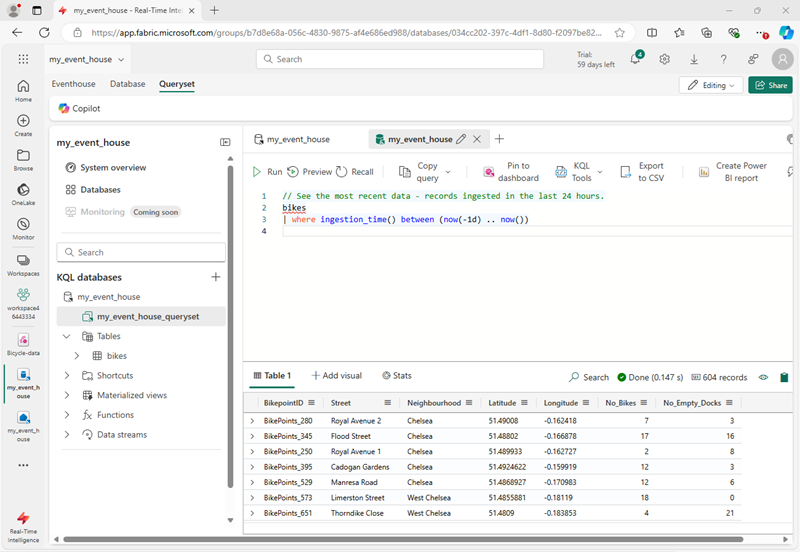

---
lab:
  title: Microsoft Fabric에서 Eventstream 시작
  module: Get started with Eventstream in Microsoft Fabric
---
# Microsoft Fabric에서 Eventstream 시작

Eventstream은 코드 없는 환경을 통해 실시간 이벤트를 캡처, 변환 및 다양한 대상으로 라우팅하는 Microsoft Fabric의 기능입니다. 변환이 필요한 경우 이벤트 데이터 원본, 라우팅 대상 및 이벤트 프로세서를 Eventstream에 추가할 수 있습니다. Microsoft Fabric의 EventStore는 클러스터의 이벤트를 유지 관리하고 특정 시점의 클러스터 또는 워크로드 상태를 이해하는 방법을 제공하는 모니터링 옵션입니다. 클러스터의 각 엔터티 및 엔터티 형식에 사용할 수 있는 이벤트에 대해 EventStore 서비스를 쿼리할 수 있습니다. 즉, 클러스터, 노드, 애플리케이션, 서비스, 파티션, 파티션 복제본 등 다양한 수준에서 이벤트를 쿼리할 수 있습니다. EventStore 서비스에는 클러스터의 이벤트 간에 상관 관계를 지정하는 기능도 있습니다. EventStore 서비스는 서로 영향을 미칠 수 있는 서로 다른 엔터티에서 동시에 기록된 이벤트를 살펴보고 이러한 이벤트를 연결하여 클러스터의 작업에 대한 원인을 식별하는 데 도움을 줍니다. Microsoft Fabric 클러스터 모니터링 및 진단을 위한 또 다른 옵션은 EventFlow를 사용하여 이벤트를 집계하고 수집하는 것입니다.

이 랩을 완료하는 데 약 **30**분이 소요됩니다.

> **참고**: 이 연습을 완료하려면 [Microsoft Fabric 평가판](https://learn.microsoft.com/fabric/get-started/fabric-trial)이 필요합니다.

## 작업 영역 만들기

패브릭에서 데이터를 사용하기 전에 패브릭 평가판을 사용하도록 설정된 작업 영역을 만듭니다.

1. [Microsoft Fabric 홈페이지](https://app.fabric.microsoft.com/home?experience=fabric)(`https://app.fabric.microsoft.com/home?experience=fabric`)에 로그인하고 **Power BI**를 선택합니다.
2. 왼쪽 메뉴 모음에서 **작업 영역**을 선택합니다(아이콘은 와 유사함).
3. Fabric 용량이 포함된 라이선스 모드(*평가판*, *프리미엄* 또는 *Fabric*)를 선택하여 원하는 이름으로 새 작업 영역을 만듭니다.
4. 새 작업 영역이 열리면 다음과 같이 비어 있어야 합니다.

   
5. Power BI 포털 왼쪽 하단에서 **Power BI** 아이콘을 선택하고 **실시간 인텔리전스** 환경으로 전환합니다.

## 실시간 인텔리전스 Eventhouse 만들기

1. Microsoft Fabric의 실시간 인텔리전스 홈페이지에서 선택한 고유의 이름으로 새 **Eventhouse**를 만듭니다.
1. 빈 Eventhouse가 새로 표시될 때까지 표시되는 팁이나 프롬프트를 닫습니다.

    

## KQL 데이터베이스 만들기

1. **실시간 인텔리전스 Eventhouse** 대시보드 내에서 **KQL 데이터베이스 +** 상자를 선택합니다.
1. **새 데이터베이스(기본값)** 를 만들거나 **새 바로 가기 데이터베이스(팔로워)** 를 만들 수 있는 옵션이 있습니다.

    >**참고:** 팔로워 데이터베이스 기능을 사용하면 다른 클러스터에 있는 데이터베이스를 Azure Data Explorer 클러스터에 연결할 수 있습니다. 팔로워 데이터베이스는 읽기 전용 모드로 연결되므로 데이터를 볼 수 있고 리더 데이터베이스에 수집된 데이터에 대한 쿼리를 실행할 수 있습니다. 팔로워 데이터베이스는 리더 데이터베이스의 변경 내용을 동기화합니다. 동기화 때문에, 데이터 가용성에 몇 초에서 몇 분의 데이터 지연이 있습니다. 시간 지연의 길이는 리더 데이터베이스 메타데이터의 전체 크기에 따라 달라집니다. 리더 및 팔로워 데이터베이스는 동일한 스토리지 계정을 사용하여 데이터를 가져옵니다. 스토리지는 리더 데이터베이스가 소유합니다. 팔로워 데이터베이스는 데이터를 수집할 필요 없이 데이터를 볼 수 있습니다. 연결된 데이터베이스는 읽기 전용 데이터베이스이므로 데이터베이스의 데이터, 테이블 및 정책을 수정할 수 없으며 다만, 캐싱 정책, 보안 주체 및 권한은 제외됩니다.

1. 새 데이터베이스를 만들고 이름을 `Eventhouse-DB`로 지정합니다.

## Eventstream 만들기

1. KQL 데이터베이스의 기본 페이지에서 **데이터 가져오기**를 선택합니다.
2. 데이터 원본에 대해 **Eventstream** > **새 Eventstream**을 선택합니다. Eventstream 이름을 지정합니다 `bicycle-data`.

    작업 영역에서 새 이벤트 스트림 만들기는 몇 분 안에 완료됩니다. 일단 설정되면 자동으로 기본 편집기로 리디렉션되어 원본을 이벤트 스트림에 통합할 준비가 됩니다.

    

## Eventstream 원본 설정

1. Eventstream 캔버스에서 **샘플 데이터 사용**을 선택합니다.
2. 원본에 이름을 지정하고 `Bicycles` **자전거** 샘플 데이터를 선택합니다.

    스트림이 매핑되고 **eventstream 캔버스**에 자동으로 표시됩니다.

   

## 대상 추가

1. **이벤트 변환 또는 대상 추가** 드롭다운 목록에서 **Eventhouse**를 선택합니다.
1. **Eventhouse** 창에서 다음 설정 옵션을 구성합니다.
   - **데이터 수집 모드:**: 수집 전 이벤트 처리
   - **대상 이름:**`Bicycle-database`
   - **작업 영역:***이 연습의 시작 부분에서 만든 작업 영역 선택*
   - **Eventhouse**: *eventhouse 선택*
   - **KQL 데이터베이스:** Eventhouse-DB
   - **대상 테이블:** 이름이 지정된 새 테이블 만들기`bike-count`
   - **입력 데이터 형식:** JSON

   

1. **Eventhouse** 창에서 **저장**을 선택합니다. 
1. 도구 모음에서 **게시**를 선택합니다.
1. 데이터 대상이 활성화될 때까지 잠시 1분 정도 기다립니다.

## 캡처된 데이터 보기

만든 eventstream은 자전거 데이터의 샘플 원본에서 데이터를 가져와서 eventhouse의 데이터베이스에 로드합니다. 데이터베이스의 테이블을 쿼리하여 캡처된 데이터를 볼 수 있습니다.

1. 왼쪽 메뉴 모음에서 **Eventhouse-DB** 데이터베이스를 선택합니다.
1. **Eventhouse-DB** KQL 데이터베이스에 대한 **...** 메뉴에서 **쿼리 데이터**를 선택합니다.
1. 쿼리 창에서 다음과 같이 첫 번째 예제 쿼리를 수정합니다.

    ```kql
    ['bike-count']
    | take 100
    ```

1. 쿼리 코드를 선택하고 실행하여 테이블에서 100개의 데이터 행을 확인합니다.

    

## 이벤트 데이터 변환

캡처한 데이터는 원본에서 변경되지 않습니다. 많은 시나리오에서 이벤트 스트림의 데이터를 대상으로 로드하기 전에 변환해야 할 수 있습니다.

1. 왼쪽 메뉴 모음에서 **자전거-데이터** eventstream을 선택합니다.
1. 도구 모음에서 **편집**을 선택하여 eventstream을 편집합니다.

1. **이벤트 변환** 메뉴에서 **그룹 기준**을 선택하여 eventstream에 노드별로 새 **그룹 기준**을 추가합니다.
1. **자전거-데이터** 노드의 출력에서 노드별 새 **그룹 기준** 입력으로 연결을 끌어온 다음 노드별로 **그룹 기준**에서 *연필*아이콘을 사용하여 편집합니다.

   

1. **그룹 기준** 설정 섹션의 속성을 구성합니다.
    - **작업 이름:** GroupByStreet
    - **집계 형식:** SUM *선택*
    - **필드:** No_Bikes *선택* *그런 다음 **추가**를 선택하여 함수* SUM_No_Bikes 만들기
    - **그룹 집계 기준(선택 사항):** Street
    - **시간 창**: 연속
    - **기간**: 5초
    - **오프셋**: 0초

    > **참고**: 이 구성에 따라 eventstream은 5초마다 각 거리의 총 자전거 수를 계산합니다.
      
1. 구성을 저장하고 eventstream 캔버스로 돌아가면 오류가 표시됩니다(변환을 통해 그룹 기준의 출력을 어딘가에 저장해야 하기 때문에 그렇습니다).

1. **GroupByStreet** 노드 오른쪽에 있는 **+** 아이콘을 사용하여 새 **Eventhouse** 노드를 추가합니다.
1. 다음 옵션을 사용하여 새 eventhouse 노드를 구성합니다.
   - **데이터 수집 모드:**: 수집 전 이벤트 처리
   - **대상 이름:**`Bicycle-database`
   - **작업 영역:***이 연습의 시작 부분에서 만든 작업 영역 선택*
   - **Eventhouse**: *이벤트 하우스 선택*
   - **KQL 데이터베이스:** Eventhouse-DB
   - **대상 테이블:** 이름이 지정된 새 테이블 만들기 `bikes-by-street`
   - **입력 데이터 형식:** JSON

   

1. **Eventhouse** 창에서 **저장**을 선택합니다. 
1. 도구 모음에서 **게시**를 선택합니다.
1. 변경 내용이 활성화될 때까지 잠시 1분 정도 기다립니다.

## 변환된 데이터 보기

이제 eventstream에서 테이블로 변환 및 로드된 자전거 데이터를 볼 수 있습니다.

1. 왼쪽 메뉴 모음에서 **Eventhouse-DB** 데이터베이스를 선택합니다.
1. **Eventhouse-DB** KQL 데이터베이스에 대한 **...** 메뉴에서 **쿼리 데이터**를 선택합니다.
1. 쿼리 창에서 다음과 같이 예제 쿼리를 수정합니다.

    ```kql
    ['bikes-by-street']
    | take 100
    ```

1. 쿼리 코드를 선택하고 실행하여 테이블의 처음 100개 행을 확인합니다.

    

    > **팁**: SQL 구문을 사용하여 테이블을 쿼리할 수도 있습니다. 예를 들어 `SELECT TOP 100 * FROM bikes-by-street` 쿼리를 시도합니다.

## 리소스 정리

이 연습에서는 eventstream을 사용하여 데이터베이스에 eventhouse 및 채워진 테이블을 만들었습니다.

KQL 데이터베이스 탐색을 마쳤으면 이 연습을 위해 만든 작업 영역을 삭제할 수 있습니다.

1. 왼쪽 막대에서 작업 영역의 아이콘을 선택합니다.
2. 메뉴에서 **작업 영역 설정**을 선택합니다.
3. **일반** 섹션에서 **이 작업 영역 제거**를 선택합니다.
.
