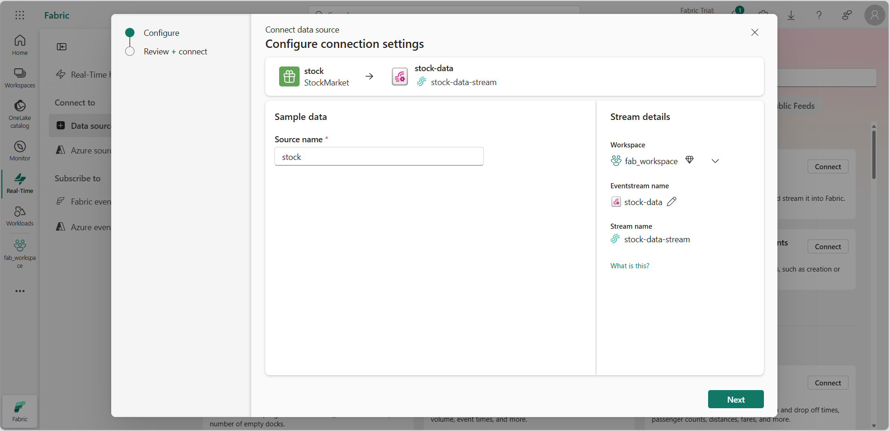
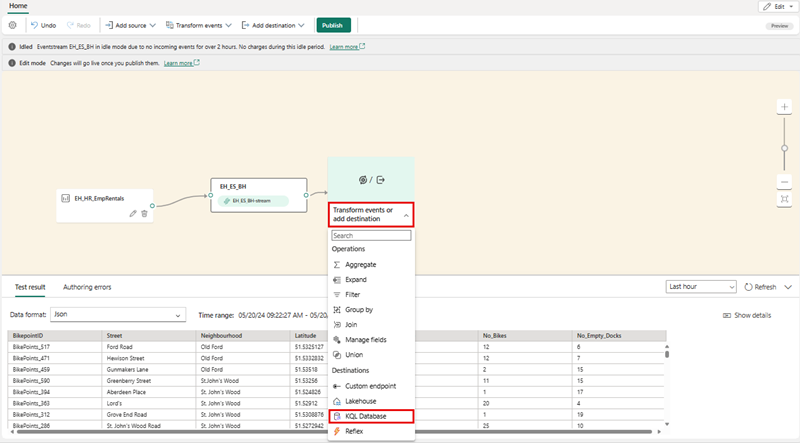
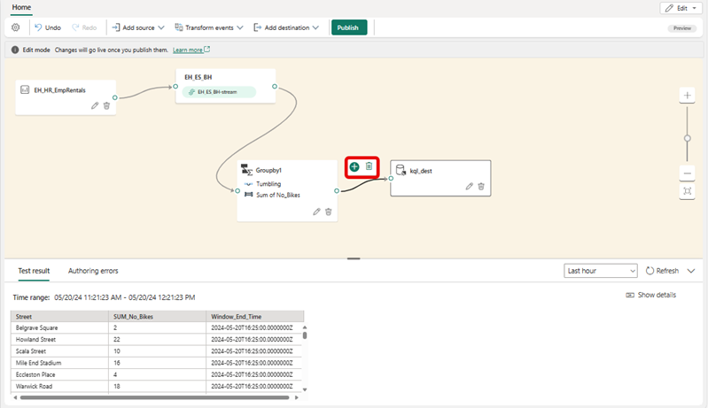
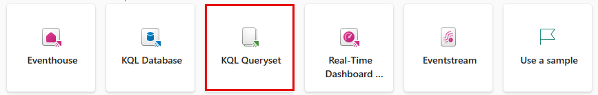
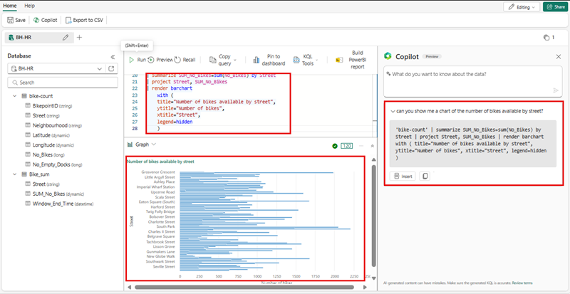

---
lab:
  title: Microsoft Fabric에서 Eventstream 시작
  module: Get started with Eventstream in Microsoft Fabric
---
# Real-Time Intelligence에서 Eventstream 시작

Eventstream은 코드 없는 환경을 통해 실시간 이벤트를 캡처, 변환 및 다양한 대상으로 라우팅하는 Microsoft Fabric의 기능입니다. 변환이 필요한 경우 이벤트 데이터 원본, 라우팅 대상 및 이벤트 프로세서를 Eventstream에 추가할 수 있습니다. Microsoft Fabric의 EventStore는 클러스터의 이벤트를 유지 관리하고 특정 시점의 클러스터 또는 워크로드 상태를 이해하는 방법을 제공하는 모니터링 옵션입니다. 클러스터의 각 엔터티 및 엔터티 형식에 사용할 수 있는 이벤트에 대해 EventStore 서비스를 쿼리할 수 있습니다. 즉, 클러스터, 노드, 애플리케이션, 서비스, 파티션, 파티션 복제본 등 다양한 수준에서 이벤트를 쿼리할 수 있습니다. EventStore 서비스에는 클러스터의 이벤트 간에 상관 관계를 지정하는 기능도 있습니다. EventStore 서비스는 서로 영향을 미칠 수 있는 서로 다른 엔터티에서 동시에 기록된 이벤트를 살펴보고 이러한 이벤트를 연결하여 클러스터의 작업에 대한 원인을 식별하는 데 도움을 줍니다. Microsoft Fabric 클러스터 모니터링 및 진단을 위한 또 다른 옵션은 EventFlow를 사용하여 이벤트를 집계하고 수집하는 것입니다.

이 랩을 완료하는 데 약 **30**분이 소요됩니다.

> **참고**: 이 연습을 완료하려면 [Microsoft Fabric 평가판](https://learn.microsoft.com/fabric/get-started/fabric-trial)이 필요합니다.

## 작업 영역 만들기

패브릭에서 데이터를 사용하기 전에 패브릭 평가판을 사용하도록 설정된 작업 영역을 만듭니다.

1. `https://app.fabric.microsoft.com`에서 [Microsoft Fabric](https://app.fabric.microsoft.com)에 로그인하고 **Power BI**를 선택합니다.
2. 왼쪽 메뉴 모음에서 **작업 영역**을 선택합니다(아이콘은 와 유사함).
3. Fabric 용량이 포함된 라이선스 모드(*평가판*, *프리미엄* 또는 *Fabric*)를 선택하여 원하는 이름으로 새 작업 영역을 만듭니다.
4. 새 작업 영역이 열리면 다음과 같이 비어 있어야 합니다.

   
5. Power BI 포털 왼쪽 하단에서 **Power BI** 아이콘을 선택하고 **실시간 인텔리전스** 환경으로 전환합니다.

## 시나리오

Fabric Eventstream을 사용하면 이벤트 데이터를 한 곳에서 쉽게 관리할 수 있습니다. 실시간 이벤트 데이터를 수집, 변환하여 원하는 형식으로 다양한 대상으로 보낼 수 있습니다. 또한 번거로움 없이 Eventstream을 Azure Event Hubs, KQL 데이터베이스 및 레이크하우스와 연결할 수 있습니다.

이 랩은 주식 시장 데이터라는 샘플 스트리밍 데이터를 기반으로 합니다. 주식 시장 샘플 데이터는 시간, 기호, 가격, 거래량 등과 같은 사전 설정된 스키마 열이 있는 증권 거래소의 데이터 세트입니다. 이 샘플 데이터를 사용하여 주가의 실시간 이벤트를 시뮬레이션하고 KQL 데이터베이스와 같은 다양한 대상을 사용하여 분석합니다.

실시간 인텔리전스 스트리밍 및 쿼리 기능을 사용하여 주식 통계에 대한 주요 질문에 답변합니다. 이 시나리오에서는 KQL 데이터베이스와 같은 일부 구성 요소를 독립적으로 수동으로 만드는 대신 마법사를 최대한 활용할 예정입니다.

이 자습서에서는 다음 작업을 수행하는 방법을 알아봅니다.

- Eventhouse 만들기
- KQL 데이터베이스 만들기
- OneLake에 데이터 복사 사용
- Eventstream 만들기
- Eventstream에서 KQL 데이터베이스로 데이터 스트리밍
- KQL 및 SQL을 사용하여 데이터 탐색\

## 실시간 인텔리전스 Eventhouse 만들기

1. Microsoft Fabric에서 실시간 인텔리전스 옵션을 선택합니다.
1. 메뉴 모음에서 Eventhouse를 선택하고 Eventhouse에 이름을 지정합니다.
    
    

## KQL 데이터베이스 만들기

1. **실시간 인텔리전스 Eventhouse** 대시보드 내에서 **KQL 데이터베이스 +** 상자를 선택합니다.
1. 데이터베이스 이름을 지정하고 **새 데이터베이스(기본값)** 를 선택하거나 **새 바로 가기 데이터베이스(팔로워)** 를 만들 수 있는 옵션이 있습니다.
1. **만들기**를 실행합니다.

     >**참고:** 팔로워 데이터베이스 기능을 사용하면 다른 클러스터에 있는 데이터베이스를 Azure Data Explorer 클러스터에 연결할 수 있습니다. 팔로워 데이터베이스는 읽기 전용 모드로 연결되므로 데이터를 볼 수 있고 리더 데이터베이스에 수집된 데이터에 대한 쿼리를 실행할 수 있습니다. 팔로워 데이터베이스는 리더 데이터베이스의 변경 내용을 동기화합니다. 동기화 때문에, 데이터 가용성에 몇 초에서 몇 분의 데이터 지연이 있습니다. 시간 지연의 길이는 리더 데이터베이스 메타데이터의 전체 크기에 따라 달라집니다. 리더 및 팔로워 데이터베이스는 동일한 스토리지 계정을 사용하여 데이터를 가져옵니다. 스토리지는 리더 데이터베이스가 소유합니다. 팔로워 데이터베이스는 데이터를 수집할 필요 없이 데이터를 볼 수 있습니다. 연결된 데이터베이스는 읽기 전용 데이터베이스이므로 데이터베이스의 데이터, 테이블 및 정책을 수정할 수 없으며 다만, 캐싱 정책, 보안 주체 및 권한은 제외됩니다.

   

4. KQL 데이터베이스의 **이름을 지정**하라는 메시지가 표시됩니다.

   

5. KQL 데이터베이스에 기억하기 쉬운 이름(예: **Eventhouse-HR**)을 지정하고 **만들기**를 누릅니다.

6. **데이터베이스 세부 정보** 패널에서 연필 아이콘을 선택하여 OneLake의 가용성을 활성화합니다.

   

7. 단추를 **활성**으로 전환한 다음 **완료**를 선택합니다.

   

## Eventstream 만들기

1. 메뉴 모음에서 **실시간 인텔리전스** 선택(아이콘은 와 유사함)
2. **새로 만들기**에서 **EventStream** 선택

   

3. Eventstream의 **이름을 지정**하라는 메시지가 표시됩니다. EventStream에 **MyStockES**와 같이 기억할 이름을 지정하고 **향상된 기능(미리 보기)** 옵션을 선택하고 **만들기** 단추를 선택합니다.

   

     >**참고:** 작업 영역에서 새 이벤트 스트림 만들기는 몇 분 안에 완료됩니다. 일단 설정되면 자동으로 기본 편집기로 리디렉션되어 원본을 이벤트 스트림에 통합할 준비가 됩니다.

## Eventstream 원본 설정

1. Eventstream 캔버스의 드롭다운 목록에서 **새 원본**를 선택한 다음 **샘플 데이터**를 선택합니다.

    

2.  **원본 추가**에서 원본 이름 지정 및 **Bicycles(Reflex 호환) 선택**
3.  **추가** 단추를 선택합니다.

    

4. **추가** 단추를 선택하면 스트림이 매핑되고 자동으로 **Eventstream 캔버스**로 리디렉션됩니다.

   
 
 > **참고**: 샘플 데이터 원본을 만든 후에는 편집 모드에서 캔버스의 Eventstream에 추가된 것을 볼 수 있습니다. 새로 추가된 샘플 데이터를 구현하려면 **게시**를 선택합니다.

## 변환 이벤트 추가 또는 대상 작업 추가

1. 게시한 후 **이벤트 변환 또는 대상 추가**를 선택한 다음 옵션으로 **KQL 데이터베이스**를 선택할 수 있습니다.

   

2. 다양한 옵션을 제공하는 새로운 측면 패널이 열리는 것을 볼 수 있습니다. KQL 데이터베이스에 필요한 세부 정보를 입력합니다.

   

    - **데이터 수집 모드:** KQL 데이터베이스에 데이터를 수집하는 방법에는 두 가지가 있습니다.
        - ***직접 수집:*** 변환 없이 KQL 테이블에 직접 데이터를 수집합니다.
        - ***이벤트 처리 후 수집 :*** KQL 테이블로 보내기 전에 이벤트 프로세서를 사용하여 데이터를 변환합니다.      
        
        > **경고:** KQL 데이터베이스 대상이 Eventstream에 추가되면 수집 모드를 편집할 수 **없습니다**.     

   - **대상 이름:** "kql-dest"와 같이 이 Eventstream 대상의 이름을 입력합니다.
   - **작업 영역:** KQL 데이터베이스가 있는 위치입니다.
   - **KQL 데이터베이스:** KQL 데이터베이스의 이름입니다.
   - **대상 테이블:** KQL 테이블의 이름입니다. 이름을 입력하여 새 테이블을 만들 수도 있습니다(예: "bike-count").
   - **입력 데이터 서식:** KQL 테이블의 데이터 서식으로 JSON을 선택합니다.

3. **저장**을 선택합니다. 
4. **게시**를 선택합니다.

## 이벤트 변환

1. **Eventstream** 캔버스 내에서 **이벤트 변환**을 선택합니다.

    

    A. **Group By**를 선택합니다.

    B. ***연필*** 아이콘으로 표시된 **편집**을 선택합니다.

    C. **그룹화 기준** 변환 이벤트를 만든 후에는 이를 **Eventstream**에서 **그룹화 기준**으로 연결해야 합니다. **Eventstream** 오른쪽에 있는 점을 클릭하고 새 **group by** 상자 왼쪽에 있는 점으로 끌면 코드를 사용하지 않고도 이 작업을 수행할 수 있습니다. 

        

2. **그룹화 기준** 설정 섹션의 속성을 작성합니다.
    - **작업 이름:** 이 변환 이벤트의 이름을 입력합니다.
    - **집계 형식:** Sum
    - **필드:** No_Bikes
    - **이름:** SUM_No_Bikes
    - **그룹 집계 기준:** Street
      
3. **추가**를 선택한 다음 **저장**을 선택합니다.

4. 같은 방법으로 **이벤트 스트림**과 ***kql_dest*** 사이의 화살표 위에 마우스를 놓고 ***휴지통**을 선택할 수 있습니다. 그런 다음 **그룹화 기준** 이벤트를 **kql-dest**에 연결할 수 있습니다.

   

    > **참고**: 커넥터를 추가하거나 제거할 때마다 대상 개체를 다시 구성해야 합니다.

5. **kql-dest**에서 연필을 선택하고 **그룹화 기준** 이벤트의 출력을 받을 **Bike_sum**이라는 새 대상 테이블을 만듭니다.

## KQL 쿼리

KQL(Kusto 쿼리 언어)은 데이터를 처리하고 결과를 반환하기 위한 읽기 전용 요청입니다. 요청은 쉽게 읽고 작성하고 자동화할 수 있는 데이터 흐름 모델을 사용하여 일반 텍스트로 서술됩니다. 쿼리는 항상 특정 테이블이나 데이터베이스의 컨텍스트에서 실행됩니다. 최소한 쿼리는 원본 데이터 참조와 순서대로 적용되는 하나 이상의 쿼리 연산자로 구성되며 연산자를 구분하는 파이프 문자(|)를 사용하여 시각적으로 표시됩니다. Kusto 쿼리 언어에 대한 자세한 내용은 [KQL(Kusto 쿼리 언어) 개요](https://learn.microsoft.com/en-us/azure/data-explorer/kusto/query/?context=%2Ffabric%2Fcontext%2Fcontext)를 참조하세요.

> **참고**: KQL 편집기에는 KQL(Kusto 쿼리 언어)에 대한 지식을 빠르게 얻을 수 있는 구문과 Inellisense 강조 표시가 모두 포함되어 있습니다.

1. 새로 만들어지고 하이드레이션된 KQL 데이터베이스를 찾습니다.

    A.  **kql-dest** 선택 

    B. **관련 항목** 행에 있는 **항목 열기** 하이퍼링크 선택

   

1. 데이터 트리에서 ***Bike_sum*** 테이블의 추가 메뉴 [...]를 선택합니다. 그런 다음 쿼리 테이블 > 100개 레코드 표시를 선택합니다.

   

3. 샘플 쿼리는 테이블 컨텍스트가 이미 채워진 **데이터 탐색** 창에서 열립니다. 이 첫 번째 쿼리는 `take` 연산자를 사용하여 샘플 레코드 수를 반환하며 데이터 구조와 가능한 값을 먼저 살펴보는 데 유용합니다. 자동으로 채워진 샘플 쿼리가 자동으로 실행됩니다. 결과 창에서 쿼리 결과를 볼 수 있습니다.

   

4. 데이터 트리로 돌아가서 `summarize`연산자를 사용하여 주어진 간격으로 수집된 레코드 수를 계산하는 다음 쿼리 **시간당 수집 요약**를 선택합니다.

   

> **참고**: 쿼리 제한을 초과했다는 경고가 표시될 수 있습니다. 이 동작은 데이터베이스로 스트리밍되는 데이터의 양에 따라 달라집니다.

기본 제공된 쿼리 함수를 사용하여 계속 탐색하여 데이터에 익숙해질 수 있습니다.

## Copilot으로 쿼리

쿼리 편집기는 기본 쿼리 KQL(Kusto 쿼리 언어) 외에도 T-SQL 사용을 지원합니다. T-SQL은 KQL을 사용할 수 없는 도구에 유용할 수 있습니다. 자세한 내용은 [T-SQL을 사용하여 데이터 쿼리](https://learn.microsoft.com/en-us/azure/data-explorer/t-sql)를 참조하세요.

1. 데이터 트리로 돌아가서 MyStockData 테이블의 **추가 메뉴** [...]를 선택합니다. **쿼리 테이블 > SQL > 모든 100개 레코드 표시**를 선택합니다.

   

2. 쿼리 내의 아무 곳에나 커서를 놓고 **실행**을 선택하거나 **Shift + Enter**를 누릅니다.

   

기본 제공 함수를 사용하여 계속 탐색하고 SQL 또는 KQL을 사용하여 데이터에 익숙해질 수 있습니다. 

## 쿼리 세트의 기능

KQL(Kusto 쿼리 언어) 데이터베이스의 쿼리 세트는 주로 KQL 데이터베이스의 데이터에 대한 쿼리 실행, 보기 및 쿼리 결과 사용자 지정을 위한 다양한 목적으로 사용됩니다. 이는 Microsoft Fabric의 데이터 쿼리 기능의 핵심 구성 요소로, 사용자는 다음을 수행할 수 있습니다.

 - **쿼리 실행:** KQL 쿼리를 실행하여 KQL 데이터베이스에서 데이터를 검색합니다.
 - **결과 사용자 지정:** 쿼리 결과를 보고 수정하여 데이터를 더 쉽게 분석하고 해석할 수 있습니다.
 - **쿼리 저장 및 공유:** 나중에 사용하기 위해 쿼리를 저장하거나 공동 데이터 탐색을 위해 다른 사람과 공유하기 위해 쿼리 세트 내에 여러 탭을 만듭니다.
 - **SQL 함수 지원:** 쿼리 만들기에 KQL을 사용하는 동안 쿼리 세트는 많은 SQL 함수도 지원하여 데이터 쿼리에 유연성을 제공합니다.
 - **Copilot 활용:** 쿼리를 KQL 쿼리 세트로 저장한 후 다음을 볼 수 있습니다.

쿼리 세트를 저장하는 것은 간단하며 몇 가지 방식이 있습니다. 

1. **KQL 데이터베이스**에서 **데이터 탐색** 도구를 사용하는 동안 **KQL 쿼리 세트로 저장**을 선택하면 됩니다.

   

2. 또 다른 방식은 실시간 인텔리전스 방문 페이지에서 **KQL 쿼리 세트** 단추를 선택한 다음 **쿼리 세트**의 이름을 지정하는 것입니다.

   

3. **쿼리 세트 방문 페이지**에 들어가면 도구 모음에 **Copilot** 단추가 표시됩니다. 이 단추를 선택하면 **Copilot 창**이 열리고 데이터에 대해 질문할 수 있습니다.

    

4. **Copilot 창**에 질문을 입력하기만 하면 **Copilot**이 KQL 쿼리를 생성하고 쿼리 세트 창에 쿼리를 ***복사***하거나 ***삽입**할 수 있도록 합니다. 

    

5. 이 시점부터 개별 쿼리를 가져와서 **대시보드에 고정** 또는 **PowerBI 보고서 빌드** 단추를 사용하여 대시보드나 Power BI 보고서에서 사용할 수 있습니다.

## 리소스 정리

이 연습에서는 KQL 데이터베이스를 만들고 Eventstream을 사용하여 지속적인 스트리밍을 설정했습니다. 그런 다음 KQL 및 SQL을 사용하여 데이터를 쿼리했습니다. KQL 데이터베이스 탐색을 마쳤으면 이 연습을 위해 만든 작업 영역을 삭제할 수 있습니다.
1. 왼쪽 막대에서 작업 영역의 아이콘을 선택합니다.
2. 도구 모음의 **...** 메뉴에서 **작업 영역 설정**을 선택합니다.
3. **일반** 섹션에서 **이 작업 영역 제거**를 선택합니다.
.
