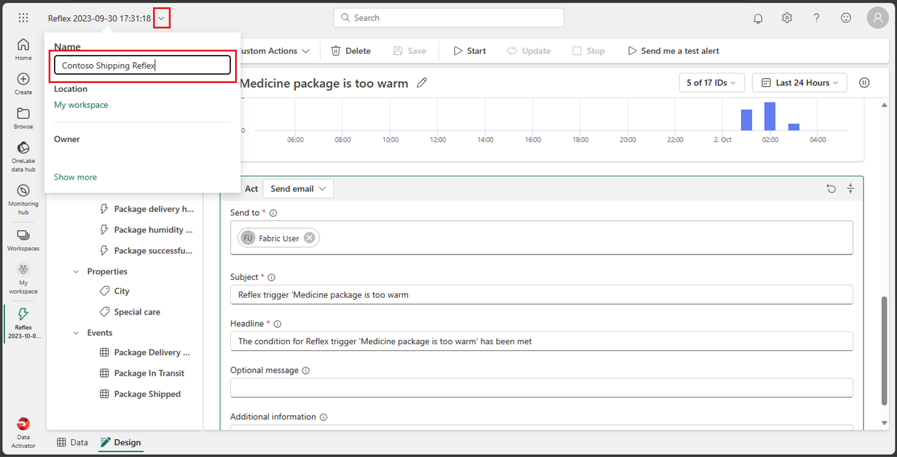
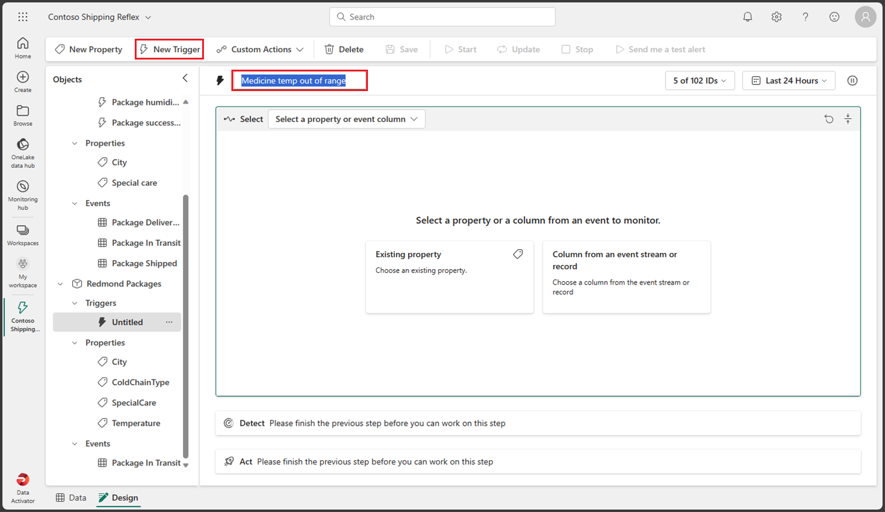
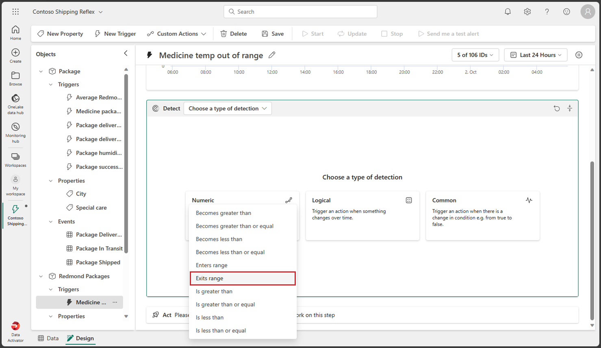
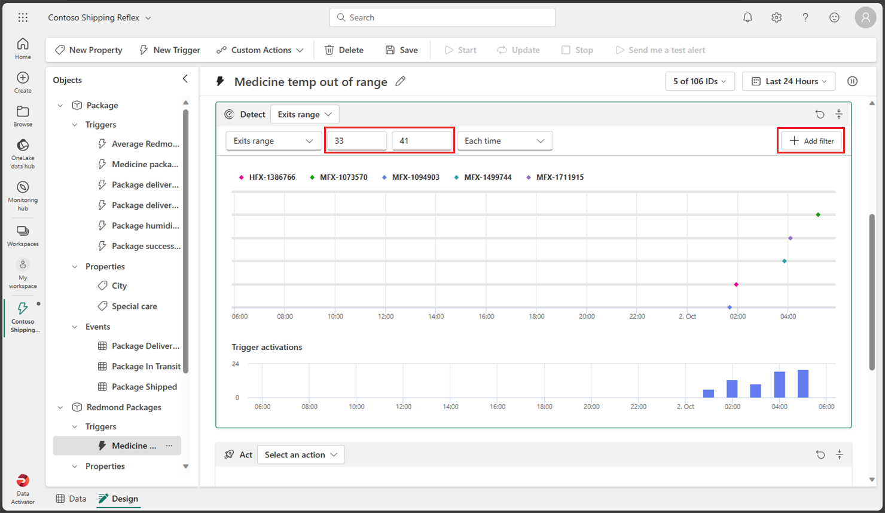
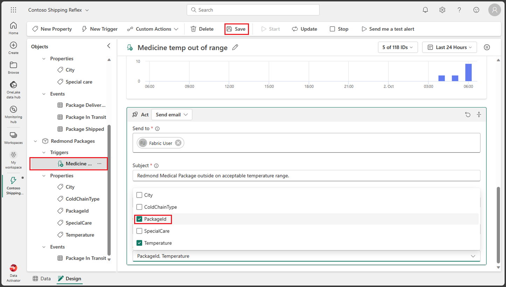

---
lab:
  title: 패브릭에서 데이터 활성화기 사용
  module: Get started with Data Activator in Microsoft Fabric
---

# 패브릭에서 데이터 활성화기 사용

Microsoft Fabric의 Data Activator는 데이터에서 발생하는 작업에 따라 작업을 수행합니다. 데이터 활성화기를 사용하면 데이터를 모니터링하고 데이터 변경에 대응하는 트리거를 만들 수 있습니다.

이 랩을 완료하는 데 약 **30**분이 소요됩니다.

> **참고**: 이 연습을 완료하려면 [Microsoft Fabric 평가판](https://learn.microsoft.com/fabric/get-started/fabric-trial)이 필요합니다.

## 작업 영역 만들기

패브릭에서 데이터를 사용하기 전에 패브릭 평가판을 사용하도록 설정된 작업 영역을 만듭니다.

1. Microsoft Fabric 홈페이지[에서 ](https://app.fabric.microsoft.com)데이터 활성화기를** 선택합니다**.
1. 왼쪽 메뉴 모음에서 **작업 영역**을 선택합니다(아이콘은 와 유사함).
1. Fabric 용량이 포함된 라이선스 모드(*평가판*, *프리미엄* 또는 *Fabric*)를 선택하여 원하는 이름으로 새 작업 영역을 만듭니다.
1. 새 작업 영역이 열리면 비어 있어야 합니다.

    

이 랩에서는 패브릭의 데이터 활성화기를 사용하여 반사를 *만듭니다*. 데이터 활성화기는 데이터 활성화자의 기능을 탐색하는 데 사용할 수 있는 샘플 데이터 세트를 편리하게 제공합니다. 이 샘플 데이터를 사용하여 일부 실시간 데이터를 분석하고 조건이 충족되면 이메일을 보내는 트리거를 만드는 반사*를 만듭니*다.

> **참고**: 데이터 활성화기 샘플 프로세스는 백그라운드에서 임의의 데이터를 생성합니다. 조건과 필터가 복잡할수록 트리거하는 데 더 많은 시간이 걸립니다. 그래프에 데이터가 표시되지 않으면 몇 분 정도 기다렸다가 페이지를 새로 고칩니다. 즉, 그래프에 데이터가 표시될 때까지 기다릴 필요가 없으며 랩을 계속 진행합니다.

## 시나리오

이 시나리오에서는 다양한 제품을 판매하고 제공하는 회사의 데이터 분석가입니다.  Redmond 시로의 모든 배송 및 판매 데이터에 대한 책임은 귀하에게 있습니다. 배달에 사용할 패키지를 모니터링하는 반사를 만들려고 합니다. 배송하는 제품의 한 가지 범주는 운송 중 특정 온도에서 냉장 보관해야 하는 의료 처방전입니다. 처방전이 포함된 패키지의 온도가 특정 임계값보다 높거나 낮은 경우 배송 부서에 이메일을 보내는 반사를 만들려고 합니다. 이상적인 온도는 33도에서 41도 사이여야 합니다. 리플렉스 이벤트에는 이미 유사한 트리거가 포함되어 있으므로 Redmond 시로 배송되는 패키지에 대해 특별히 트리거를 만듭니다. 그럼 시작하겠습니다.

## 반사 만들기

1. 오른쪽 아래에 있는 아이콘이 데이터 활성화기를 반영하는지 확인하여 데이터 활성화자 홈 화면에 있는지 확인합니다. 반사(미리 보기)** 단추를 선택하여 **새 반사를 만들어 보겠습니다.

    

1. 실제 프로덕션 환경에서는 사용자 고유의 데이터를 사용합니다. 그러나 이 랩의 경우 데이터 활성화기에서 제공하는 샘플 데이터를 사용합니다. **샘플 데이터** 사용 단추를 선택하여 반사 만들기를 완료합니다.

    

1. 기본적으로 Data Activator는 Reflex YYYY-MM-DD hh:mm:ss라는 이름으로 *반사를 만듭니다*. 작업 영역에 여러 반사가 있을 수 있으므로 기본 반사의 이름을 보다 설명적인 이름으로 변경해야 합니다. 왼쪽 위 모서리에 있는 현재 반사 이름 외에 풀다운을 선택하고 이 예제에서는 Contoso Shipping Reflex***로 이름을 ***변경합니다.

    

이제 반사가 만들어지고 트리거 및 작업을 추가할 수 있습니다.

## 리플렉스 홈 화면에 익숙해지세요.

리플렉스의 홈 화면은 디자인* 모드 데이터* 모드*인 *두 섹션으로 나뉩니다. 화면 왼쪽 아래에서 해당 탭을 선택하여 모드를 선택할 수 있습니다.  *디자인* 모드 탭에서는 트리거, 속성 및 이벤트를 사용하여 개체를 정의합니다. *데이터* 모드 탭에서는 데이터 원본을 추가하고 반사가 처리하는 데이터를 볼 수 있습니다. 반사를 만들 때 기본적으로 열어야 하는 디자인* 모드 탭을 살펴보겠습니다*.

### 디자인 모드

현재 디자인 모드가 *아닌 경우 화면 왼쪽 아래에 있는 디자인** 탭을 선택합니다**.*

디자인* 모드에 *익숙해지려면 화면, 트리거, 속성 및 이벤트의 다른 섹션을 선택합니다. 다음 섹션에서는 각 섹션을 자세히 설명합니다.

### 데이터 모드

현재 데이터 모드가 *아닌 경우 화면 왼쪽 아래에 있는 데이터** 탭을 선택합니다**.* 실제 예제에서는 Event스트림 및 Power BI 시각적 개체에서 사용자 고유의 데이터 원본을 여기에 추가합니다. 이 랩에서는 데이터 활성화기에서 제공하는 샘플 데이터를 사용합니다. 이 샘플은 패키지 배달 상태 모니터링하는 세 가지 이벤트스트림 이미 설정되어 있습니다.

각 이벤트를 선택하고 스트림에서 사용되는 데이터를 관찰합니다.

이제 리플렉션에 트리거를 추가해야 하지만 먼저 새 개체를 만들어 보겠습니다.

##  개체 만들기

실제 시나리오에서는 Data Activator 샘플에 Package*라는 *개체가 이미 포함되어 있으므로 이 반사에 대한 새 개체를 만들 필요가 없을 수 있습니다. 그러나 이 랩에서는 새 개체를 만들어 만드는 방법을 보여 줍니다. Redmond Packages라는 *새 개체를* 만들어 보겠습니다.

1. 현재 데이터 모드가 *아닌 경우 화면 왼쪽 아래에 있는 데이터** 탭을 선택합니다**.*

1. 전송*** 중인 ***패키지 이벤트를 선택합니다. PackageId, Temperature *, ColdChainType**, ** City* 및 *SpecialCare* 열의 값*에 주의*하세요. 이러한 열을 사용하여 트리거를 만듭니다.

1. *데이터* 할당 대화 상자가 오른쪽에 아직 열려 있지 않은 경우 화면 오른쪽에서 데이터** 할당 단추를 선택합니다**.

    

1. 데이터* 할당 대화 상자에서 *새 개체***에 ***할당 탭을 선택하고 다음 값을 입력합니다.

    - **개체 이름**: *Redmond 패키지*
    - **키 열** 할당: *PackageId*
    - **속성** 할당: *City, ColdChainType, SpecialCare, Temperature*

    

1. 저장을 선택한 **다음 저장을 선택하고 **디자인 모드**로** 이동합니다.

1. 이제 디자인* 모드로 *돌아가야 합니다. Redmond Packages라는 ***새 개체가*** 추가되었습니다. 이 새 개체를 선택하고, 해당 *이벤트를* 확장하고, 전송** 중인 **패키지 이벤트를 선택합니다.

    

트리거를 만드는 시간입니다.

## 트리거 만들기

트리거에서 수행할 작업을 검토해 보겠습니다. *처방전이 포함된 패키지의 온도가 특정 임계값보다 높거나 낮은 경우 배송 부서에 이메일을 보내는 반사를 만들려고 합니다. 이상적인 온도는 33도에서 41도 사이여야 합니다. 리플렉스 이벤트에는 이미 유사한 트리거가 포함되어 있으므로 Redmond* 시로 배송되는 패키지에 대해 특별히 트리거를 만듭니다.

1. Redmond Packages** 개체의 **전송* 중인 패키지 이벤트 내에서 위쪽 메뉴에서 새 트리거** 단추를 선택합니다**.* 새 트리거는 제목 없음의 *기본 이름으로 만들어지고, 트리거를 더 잘 정의하기 위해 ***이름을 Medicine temp의 범위를*** 벗어났*습니다.

    

1. 반사를 트리거하는 속성 또는 이벤트 열을 선택하는 시간입니다. 개체를 만들 때 여러 속성을 만들었으므로 기존 속성** 단추를 선택하고 **Temperature*** 속성을 선택합니다***. 

    

    이 속성을 선택하면 샘플 기록 온도 값이 있는 그래프가 반환됩니다.

    

1. 이제 이 속성에서 트리거할 조건 유형을 결정해야 합니다. 이 경우 온도가 41도 이상 또는 33도 미만일 때 반사를 트리거하려고 합니다. 숫자 범위를 찾고 있으므로 숫자 단추를 선택하고 **** 종료 범위** 조건을 선택합니다**.

    

1. 이제 조건에 대한 값을 입력해야 합니다. 범위 값으로 33***과 41***을 입력****** 합니다. 종료 숫자 범위* 조건을 선택*하므로 온도가 33*도 이하*이거나 41*도 이상*일 때 트리거가 발생합니다.

    

1. 지금까지 트리거를 실행하려는 속성과 조건을 정의했지만 필요한 매개 변수가 모두 포함되지는 않습니다. 당신은 여전히 트리거가 레드 몬드**의 도시와* 의학**의 **특별한 치료* 유형**에 대해서만 ** 발사 있는지 확인해야합니다. 계속 진행하여 해당 조건에 대한 몇 가지 필터를 추가해 보겠습니다.  **필터** 추가 단추를 선택하고, 속성을 City***로 ***설정하고, 관계를 같음***으로 ***설정하고, Redmond***를 값으로 입력***합니다. 그런 다음 SpecialCare*** 속성을 사용하여 새 필터를 ***추가하고 같음***으로 설정하고 약***을 ***값으로 입력***합니다.

    

1. 약이 냉장 보관되도록 필터를 하나 더 추가해 보겠습니다. **필터** 추가 단추를 선택하고 ColdChainType ****** 속성을 같음***으로 ***설정하고 값으로 냉장*** 입력***합니다.

    

1. 거의 완료되었습니다! 트리거가 실행되면 수행할 작업을 정의하기만 하면 됩니다. 이 경우 배송 부서로 전자 메일을 보내려고 합니다. **전자 메일** 단추를 선택합니다.

    

1. 전자 메일 작업에 대해 다음 값을 입력합니다.

    - **** 보내기: 현재 사용자 계정을 기본적으로 선택해야 합니다. 이 랩에서는 괜찮을 것입니다.
    - **주제**: *허용되는 온도 범위를 벗어난 Redmond 의료 패키지*
    - **헤드라인**: *온도가 너무 높거나 너무 낮음*
    - **추가 정보**: 검사box 목록에서 온도* 속성을 선택합니다*.

    

1. 저장**을 선택한 **다음 **상단 메뉴에서 시작**합니다.

이제 데이터 활성화기에서 트리거를 만들고 시작했습니다.

## 트리거 업데이트 및 중지

이 트리거의 유일한 문제는 트리거가 온도가 있는 이메일을 보냈지만 트리거가 패키지의 PackageId*를 *보내지 않았다는 것입니다. 계속 진행하여 PackageId*를 포함하도록 트리거를 *업데이트해 보겠습니다.

1. **Redmond Packages 개체에서 전송** 중인 **패키지** 이벤트를 선택하고 위쪽 메뉴에서 새 속성을** 선택합니다**.

    

1. 전송 중인 **패키지 이벤트에서 열을 *선택하여 PackageId** 속성을 추가해* 보겠습니다. 속성 이름을 제목 없는 파일에서 *PackageId*로 변경하는 것을 *잊지* 마세요.

    

1. 트리거 작업을 업데이트해 보겠습니다. 약 임시 **범위를** 벗어난 트리거를 선택하고 아래쪽의 **Act** 섹션으로 스크롤하여 추가 정보를** 선택하고 **PackageId** 속성을 추가**합니다. 저장** 단추를 아직 선택**하지 마세요.

    

1. 트리거를 업데이트했으므로 올바른 작업은 트리거를 업데이트하고 저장하지 않는 것이지만, 이 랩에서는 반대로 작업하고 업데이트** 단추 대신 **저장** 단추를 선택하여 **어떤 일이 발생하는지 확인합니다. 업데이트 단추를 선택*해야 하는 이유는 트리거를 업데이트*하도록 *선택하면 트리거를 저장하고 현재 실행 중인 트리거를 새 조건으로 업데이트하기 때문*입니다. 저장* 단추를 선택하면 트리거를 *업데이트하도록 선택할 때까지 현재 실행 중인 트리거가 새 조건을 적용하지 않습니다. 계속 진행하여 저장** 단추를 선택**해 보겠습니다.

1. 업데이트 대신 저장*하도록 *선택했기 때문에 사용할 수 있는 속성 업데이트가 있다는 메시지가 *표시됩니다.** 트리거가 화면 맨 위에 가장 최근의 변경 내용을* 표시하도록 지금 업데이트합니다. 또한 메시지에 업데이트 단추가 ** 있습니다. 계속 진행하여 업데이트** 단추를 선택**해 보겠습니다.

    

1. 위쪽 메뉴에서 중지 단추를 선택하여 **트리거를 중지** 합니다.

## 리소스 정리

이 연습에서는 데이터 활성화기에서 트리거를 사용하여 반사를 만들었습니다. 이제 데이터 활성화기 인터페이스와 반사를 만드는 방법과 개체, 트리거 및 속성을 잘 알고 있어야 합니다.

데이터 활성화기 반사 탐색을 완료한 경우 이 연습에 대해 만든 작업 영역을 삭제할 수 있습니다.

1. 왼쪽 막대에서 작업 영역의 아이콘을 선택하여 포함된 모든 항목을 봅니다.
2. 도구 모음의 **...** 메뉴에서 **작업 영역 설정**을 선택합니다.
3. **기타** 섹션에서 **이 작업 영역 제거**를 선택합니다.
