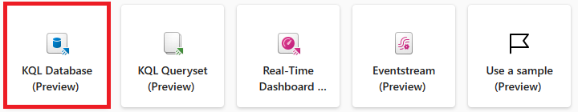
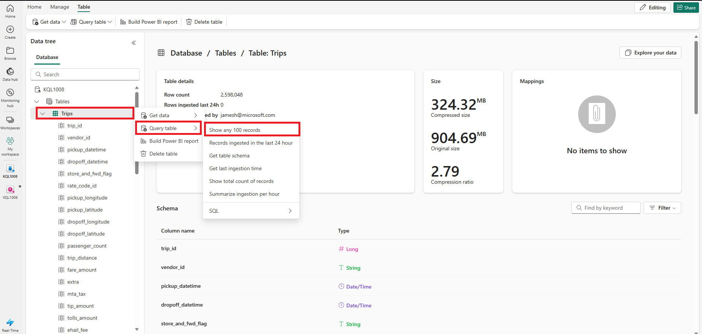
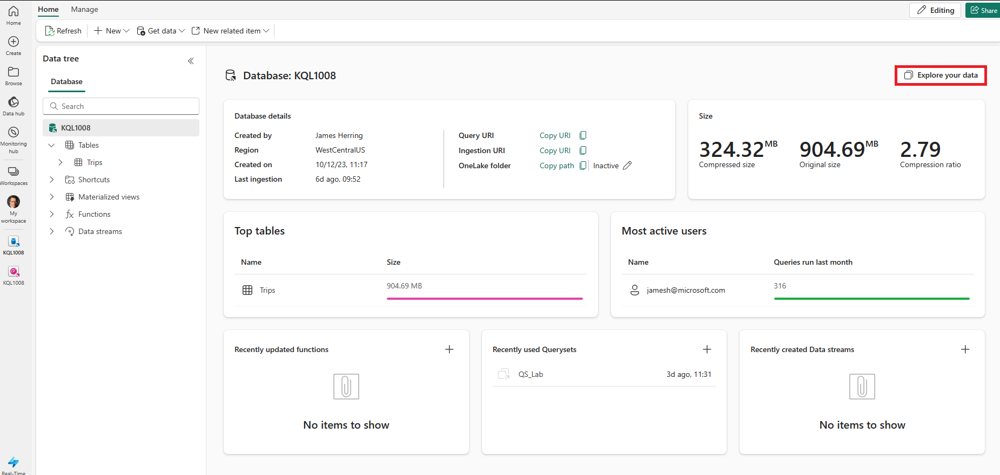

---
lab:
  title: KQL 데이터베이스에서 데이터 쿼리
  module: Query data from a Kusto Query database in Microsoft Fabric
---

# Microsoft Fabric에서 Kusto 데이터베이스 쿼리 시작

KQL 쿼리 세트는 KQL 데이터베이스에서 쿼리를 실행하고, 수정하고, 쿼리 결과를 표시할 수 있는 도구입니다. KQL 쿼리 세트의 각 탭을 다른 KQL 데이터베이스에 연결하고 나중에 사용할 쿼리를 저장하거나 데이터 분석을 위해 다른 사용자와 공유할 수 있습니다. 다른 데이터 원본의 쿼리 결과를 비교할 수 있도록 모든 탭에 대해 KQL 데이터베이스를 전환할 수도 있습니다.

이 연습에서는 패브릭 환경에서 데이터를 요약 통계(프로파일링)하는 원시 메트릭 NYC Taxicab 놀이기구의 샘플 데이터 세트를 쿼리하는 임무를 맡은 분석가의 역할을 수행합니다. KQL을 사용하여 이 데이터를 쿼리하고 정보를 수집하여 데이터에 대한 정보 정보를 얻습니다.

KQL 쿼리 세트는 많은 SQL 함수와 호환되는 Kusto 쿼리 언어를 사용하여 쿼리를 만듭니다. KQL(kusto 쿼리) 언어[에 대해 ](https://learn.microsoft.com/en-us/azure/data-explorer/kusto/query/?context=%2Ffabric%2Fcontext%2Fcontext)자세히 알아보려면

이 랩을 완료하는 데 약 **25** 분이 걸립니다.

> **참고**: 이 연습을 완료하려면 [Microsoft Fabric 평가판](https://learn.microsoft.com/fabric/get-started/fabric-trial)이 필요합니다.

## 작업 영역 만들기

패브릭에서 데이터를 사용하기 전에 패브릭 평가판을 사용하도록 설정된 작업 영역을 만듭니다.

1. Microsoft Fabric 홈페이지[에서 ](https://app.fabric.microsoft.com)실시간 분석을** 선택합니다**.
1. 왼쪽 메뉴 모음에서 **작업 영역**을 선택합니다(아이콘은 와 유사함).
1. Fabric 용량이 포함된 라이선스 모드(*평가판*, *프리미엄* 또는 *Fabric*)를 선택하여 원하는 이름으로 새 작업 영역을 만듭니다.
1. 새 작업 영역이 열리면 비어 있어야 합니다.

    

이 랩에서는 패브릭의 RTA(실시간 분석)를 사용하여 샘플 eventstream에서 KQL 데이터베이스를 만듭니다. 실시간 분석은 RTA의 기능을 탐색하는 데 사용할 수 있는 샘플 데이터 세트를 편리하게 제공합니다. 이 샘플 데이터를 사용하여 실시간 데이터를 분석하고 다운스트림 프로세스에서 다른 용도를 허용하는 KQL/SQL 쿼리 및 쿼리 세트를 만듭니다.

## KQL 데이터베이스 만들기

1. **실시간 분석** 내에서 KQL 데이터베이스** 상자를 선택합니다**.

   

1. KQL 데이터베이스의 이름을 지정**하라**는 메시지가 표시됩니다.

   

1. KQL 데이터베이스에 TaxiData와 같이 **기억해야 하는 이름을 지정하고 Create 키를 누릅니**다**.**

1. **데이터베이스 세부 정보** 패널에서 연필 아이콘을 선택하여 OneLake에서 가용성을 설정합니다.

   

   그런 다음 슬라이더를 사용하여 가용성을 켭니다.

   
   
1. 데이터를** 가져오면 시작 옵션***에서 샘플 데이터*** 상자를 선택합니다**.

   

   그런 다음 샘플 데이터에 대한 옵션에서 자동차 운영 분석** 상자를 선택합니다**.

   

1. 데이터 로드가 완료되면 KQL 데이터베이스가 채워지는지 확인할 수 있습니다.

   

1. 데이터가 로드되면 데이터가 KQL 데이터베이스에 로드되는지 확인합니다. 테이블 오른쪽에 있는 줄임표를 선택하고, 쿼리 테이블**로 이동하고**, 100개의 레코드** 표시를 **선택하여 이 작업을 수행할 수 있습니다.

    

   > **참고**: 처음 실행할 때 컴퓨팅 리소스를 할당하는 데 몇 초 정도 걸릴 수 있습니다.


    

## Kusto 쿼리 언어(KQL) 및 해당 구문 소개

KQL(Kusto 쿼리 언어)은 Azure Fabric의 일부인 Microsoft Azure Data Explorer에서 데이터를 분석하는 데 사용되는 쿼리 언어입니다. KQL은 간단하고 직관적으로 설계되어 초보자가 쉽게 배우고 사용할 수 있도록 합니다. 동시에 매우 유연하고 사용자 지정이 가능하므로 고급 사용자가 복잡한 쿼리 및 분석을 수행할 수 있습니다.

KQL은 SQL과 유사하지만 몇 가지 주요 차이점이 있는 구문을 기반으로 합니다. 예를 들어 KQL은 세미콜론(;) 대신 파이프 연산자(|)를 사용하여 명령을 구분하고 데이터를 필터링하고 조작하기 위해 다른 함수 및 연산자 집합을 사용합니다.

KQL의 주요 기능 중 하나는 대량의 데이터를 빠르고 효율적으로 처리할 수 있다는 것입니다. 이 기능을 사용하면 로그, 원격 분석 데이터 및 기타 유형의 빅 데이터를 분석하는 데 적합합니다. KQL은 구조화된 데이터와 구조화되지 않은 데이터를 비롯한 다양한 데이터 원본을 지원하므로 데이터 분석을 위한 다양한 도구입니다.

Microsoft Fabric의 컨텍스트에서 KQL을 사용하여 애플리케이션 로그, 성능 메트릭 및 시스템 이벤트와 같은 다양한 원본의 데이터를 쿼리하고 분석할 수 있습니다. 이렇게 하면 애플리케이션 및 인프라의 상태 및 성능에 대한 인사이트를 얻고 최적화를 위한 문제와 기회를 식별할 수 있습니다.

전반적으로 KQL은 Microsoft Fabric 또는 다른 데이터 원본을 사용하든 관계없이 빠르고 쉽게 데이터에 대한 인사이트를 얻는 데 도움이 되는 강력하고 유연한 쿼리 언어입니다. 직관적인 구문과 강력한 기능을 통해 KQL은 더 자세히 살펴볼 가치가 있습니다.

이 모듈에서는 KQL을 먼저 사용한 다음 T-SQL을 사용하여 KQL 데이터베이스에 대한 쿼리의 기본 사항에 집중합니다. 다음을 비롯한 쿼리에 사용되는 T-SQL 구문의 기본 요소에 초점을 맞춥니다.

**하나 이상의 테이블에서 데이터를 검색하는 데 사용되는 SELECT** 쿼리입니다. 예를 들어 SELECT 쿼리를 사용하여 회사의 모든 직원의 이름과 급여를 가져올 수 있습니다.

**WHERE** 쿼리는 특정 조건에 따라 데이터를 필터링하는 데 사용됩니다. 예를 들어 WHERE 쿼리를 사용하여 특정 부서에서 일하거나 급여가 일정 금액을 초과하는 직원의 이름을 가져올 수 있습니다.

**하나 이상의 열을 기준으로 데이터를 그룹화하고 집계 함수를 수행하는 데 사용되는 GROUP BY** 쿼리입니다. 예를 들어 GROUP BY 쿼리를 사용하여 부서 또는 국가별 직원의 평균 급여를 가져올 수 있습니다.

**오름차순 또는 내림차순으로 하나 이상의 열을 기준으로 데이터를 정렬하는 데 사용되는 ORDER BY** 쿼리입니다. 예를 들어 ORDER BY 쿼리를 사용하여 급여 또는 성을 기준으로 정렬된 직원의 이름을 가져올 수 있습니다.

   > **경고:** Power BI는 T-SQL을 데이터 원본으로 **지원하지 않으므로 T-SQL** 을 사용하여 쿼리 집합에서 Power BI 보고서를 만들 수 없습니다. **Power BI는 KQL을 쿼리 세트**에 대한 네이티브 쿼리 언어로만 지원합니다. T-SQL을 사용하여 Microsoft Fabric에서 데이터를 쿼리하려면 Microsoft SQL Server를 에뮬레이트하고 데이터에 대해 T-SQL 쿼리를 실행할 수 있도록 하는 T-SQL 엔드포인트를 사용해야 합니다. 그러나 T-SQL 엔드포인트에는 네이티브 SQL Server와 몇 가지 제한 사항 및 차이점이 있으며 Power BI에 보고서를 만들거나 게시하는 것은 지원되지 않습니다.

> **참고**: 앞에서 표시된 쿼리 창을 끌어오는 방법 외에도 기본 KQL 데이터베이스 패널에서 데이터** 탐색 단추를 항상 누**를 수 있습니다.

   

## `SELECT` KQL을 사용하여 샘플 데이터 세트의 데이터

1. 이 쿼리에서는 Trips 테이블에서 100개의 레코드를 가져옵니다. 키워드(keyword) 사용하여 `take` 엔진에 100 레코드를 반환하도록 요청합니다.

    ```kusto
    
    Trips
    | take 100
    ```

    > **참고:** 파이프 `|` 문자는 테이블 형식 식 문에서 쿼리 연산자를 구분하는 것을 포함하여 KQL의 두 가지 용도로 사용됩니다. 또한 정사각형 또는 둥근 대괄호 내에서 논리 OR 연산자로 사용되어 파이프 문자로 구분된 항목 중 하나를 지정할 수 있음을 나타냅니다.

1. 키워드(keyword) 사용하여 `project` 쿼리하려는 특정 특성을 추가한 다음, 키워드(keyword) 사용하여 `take` 엔진에 반환할 레코드 수를 알려 줍니다.

    > **참고:** Microsoft Fabric ***데이터*** 쿼리 도구에서 사용되는 주석을 사용합니다`//`.

    ```kusto
    
    // Use 'project' and 'take' to view a sample number of records in the table and check the data.
    Trips 
    | project vendor_id, trip_distance
    | take 10
    ```

1. 분석의 또 다른 일반적인 사례는 쿼리 세트의 열 이름을 변경하여 사용자 친화적으로 만드는 것입니다. 이 작업은 새 열 이름 뒤에 등호와 이름을 바꾸려는 열을 사용하여 수행할 수 있습니다.

    ```kusto
    
    Trips 
    | project vendor_id, ["Trip Distance"] = trip_distance
    | take 10
    ```

1. 또한 여정을 요약하여 얼마나 많은 마일이 여행되었는지 확인할 수 있습니다.

    ```kusto
    
    Trips
    | summarize ["Total Trip Distance"] = sum(trip_distance)
    ```

## `GROUP BY` KQL을 사용하여 샘플 데이터 세트의 데이터

1. 그런 다음 운영자와 `group by` 함께 `summarize` 수행하는 픽업 위치를 원할 수 있습니다. 출력에 `project` 포함할 열을 선택하고 이름을 바꿀 수 있는 연산자를 사용할 수도 있습니다. 이 경우 각 자치구에서 이동한 총 거리를 사용자에게 제공하기 위해 NY Taxi 시스템 내의 자치구별로 그룹화합니다.

```kusto

Trips
| summarize ["Total Trip Distance"] = sum(trip_distance) by pickup_boroname
| project Borough = pickup_boroname, ["Total Trip Distance"]
```

1. 이 경우 분석에 적합하지 않은 빈 값이 있으며 함수와 `isnull` 함께 `isempty` 함수를 사용하여 `case` 후속 작업을 위해 식별되지 않은*** 범주로 ***분류할 수 있습니다.

```kusto

Trips
| summarize ["Total Trip Distance"] = sum(trip_distance) by pickup_boroname
| project Borough = case(isempty(pickup_boroname) or isnull(pickup_boroname), "Unidentified", pickup_boroname), ["Total Trip Distance"]
```

## `ORDER BY` KQL을 사용하여 샘플 데이터 세트의 데이터

데이터를 더 이해하기 위해 일반적으로 열로 정렬하며, 이 프로세스는 KQL에서 a 또는 `order by` 연산자를 `sort by` 사용하여 수행되며 동일한 방식으로 작동합니다.
 
```kusto

// using the sort by operators
Trips
| summarize ["Total Trip Distance"] = sum(trip_distance) by pickup_boroname
| project Borough = case(isempty(pickup_boroname) or isnull(pickup_boroname), "Unidentified", pickup_boroname), ["Total Trip Distance"]
| sort by Borough asc 

// order by operator has the same result as sort by
Trips
| summarize ["Total Trip Distance"] = sum(trip_distance) by pickup_boroname
| project Borough = case(isempty(pickup_boroname) or isnull(pickup_boroname), "Unidentified", pickup_boroname), ["Total Trip Distance"]
| sort by Borough asc 
```

## `WHERE` 샘플 KQL 쿼리에서 데이터를 필터링하는 절

SQL과 달리 절 `WHERE` 은 KQL 쿼리에서 즉시 호출됩니다. where 절 내에서 논리 연산자와 `or` 논리 연산자를 계속 사용할 `and` 수 있으며 테이블에 대해 true 또는 false로 평가되며 여러 열, 연산자 및 함수를 포함할 수 있는 단순하거나 복잡한 식일 수 있습니다.

```kusto

// let's filter our dataset immediately from the source by applying a filter directly after the table.
Trips
| where pickup_boroname == "Manhattan"
| summarize ["Total Trip Distance"] = sum(trip_distance) by pickup_boroname
| project Borough = case(isempty(pickup_boroname) or isnull(pickup_boroname), "Unidentified", pickup_boroname), ["Total Trip Distance"]
| sort by Borough asc

```

## T-SQL을 사용하여 요약 정보 쿼리

KQL Database는 기본적으로 T-SQL을 지원하지 않지만 Microsoft SQL Server를 에뮬레이트하고 데이터에 대해 T-SQL 쿼리를 실행할 수 있는 T-SQL 엔드포인트를 제공합니다. 그러나 T-SQL 엔드포인트에는 네이티브 SQL Server와 몇 가지 제한 사항 및 차이점이 있습니다. 예를 들어 테이블 만들기, 변경 또는 삭제, 데이터 삽입, 업데이트 또는 삭제를 지원하지 않습니다. 또한 KQL과 호환되지 않는 일부 T-SQL 함수 및 구문을 지원하지 않습니다. KQL을 지원하지 않는 시스템에서 T-SQL을 사용하여 KQL 데이터베이스 내의 데이터를 쿼리할 수 있도록 하기 위해 만들어졌습니다. 따라서 KQL 데이터베이스는 T-SQL보다 더 많은 기능과 성능을 제공하므로 KQL을 KQL 데이터베이스의 기본 쿼리 언어로 사용하는 것이 좋습니다. 개수, 합계, 평균, 최소, 최대 등 KQL에서 지원하는 일부 SQL 함수를 사용할 수도 있습니다. 

## `SELECT` T-SQL을 사용하여 샘플 데이터 세트의 데이터

1. 이 쿼리에서는 절을 사용하여 테이블에서 처음 100개의 레코드 `Trips` 를 `TOP` 가져옵니다. 

    ```sql
    // We can use the TOP clause to limit the number of records returned
    
    SELECT TOP 100 * from Trips
    ```

1. KQL 데이터베이스 내의 데이터*** 탐색 도구에서 ***주석을 사용하는 `//` 경우 T-SQL 쿼리를 실행할 때 강조 표시할 수 없으며 표준 `--` SQL 주석 표기법을 사용해야 합니다. 또한 이 이중 하이픈은 Azure Data Explorer에서 T-SQL을 예상하도록 KQL 엔진에 지시합니다.

    ```sql
    -- instead of using the 'project' and 'take' keywords we simply use a standard SQL Query
    SELECT TOP 10 vendor_id, trip_distance
    FROM Trips
    ```

1. 다시 말하지만, 표준 T-SQL 기능은 trip_distance 이름을 좀 더 친숙한 이름으로 바꾸는 쿼리에서 제대로 작동한다는 것을 알 수 있습니다.

    ```sql
    
    -- No need to use the 'project' or 'take' operators as standard T-SQL Works
    SELECT TOP 10 vendor_id, trip_distance as [Trip Distance]
    from Trips
    ```

1. 또한 여정을 요약하여 얼마나 많은 마일이 여행되었는지 확인할 수 있습니다.

    ```sql
    Select sum(trip_distance) as [Total Trip Distance]
    from Trips
    ```
     >**참고:** T-SQL에서는 KQL 쿼리에 비해 따옴표를 사용할 필요가 없으며, `summarize` T-SQL에서는 명령과 `sort by` 명령을 사용할 수 없습니다.

## `GROUP BY` T-SQL을 사용하여 샘플 데이터 세트의 데이터

1. 그런 다음 운영자와 `group by` 함께 `GROUP BY` 수행하는 픽업 위치를 원할 수 있습니다. 출력에 `AS` 포함할 열을 선택하고 이름을 바꿀 수 있는 연산자를 사용할 수도 있습니다. 이 경우 각 자치구에서 이동한 총 거리를 사용자에게 제공하기 위해 NY Taxi 시스템 내의 자치구별로 그룹화합니다.

    ```sql
    SELECT pickup_boroname AS Borough, Sum(trip_distance) AS [Total Trip Distance]
    FROM Trips
    GROUP BY pickup_boroname
    ```

1. 이 경우 분석에 적합하지 않은 빈 값이 있으며 함수 및 빈 값과 `''` 함께 `IS NULL` 함수를 사용하여 `CASE` 후속 작업을 위해 식별되지 않은*** 범주로 ***분류할 수 있습니다. 

    ```sql
    
    SELECT CASE
             WHEN pickup_boroname IS NULL OR pickup_boroname = '' THEN 'Unidentified'
             ELSE pickup_boroname
           END AS Borough,
           SUM(trip_distance) AS [Total Trip Distance]
    FROM Trips
    GROUP BY CASE
               WHEN pickup_boroname IS NULL OR pickup_boroname = '' THEN 'Unidentified'
               ELSE pickup_boroname
             END;
    ```

## `ORDER BY` T-SQL을 사용하여 샘플 데이터 세트의 데이터

1. 데이터를 더 이해하기 위해 일반적으로 열을 통해 정렬하며 이 프로세스는 연산자를 사용하여 `ORDER BY` T-SQL에서 수행됩니다. T-SQL에는 SORT BY*** 연산자가 없습니다***.
 
    ```sql
    -- Group by pickup_boroname and calculate the summary statistics of trip_distance
    SELECT CASE
             WHEN pickup_boroname IS NULL OR pickup_boroname = '' THEN 'unidentified'
             ELSE pickup_boroname
           END AS Borough,
           SUM(trip_distance) AS [Total Trip Distance]
    FROM Trips
    GROUP BY CASE
               WHEN pickup_boroname IS NULL OR pickup_boroname = '' THEN 'unidentified'
               ELSE pickup_boroname
             END
    -- Add an ORDER BY clause to sort by Borough in ascending order
    ORDER BY Borough ASC;
    ```
    ## `WHERE` 샘플 T-SQL 쿼리에서 데이터를 필터링하는 절
    
1. KQL과 달리 절 `WHERE` 은 T-SQL 문의 끝에 있습니다. 그러나 이 경우 `GROUP BY` 문을 사용해야 `HAVING` 하는 절이 있으며, 이 경우 **Borough** 를 필터링할 열 이름으로 열의 새 이름을 사용합니다.

    ```sql
    -- Group by pickup_boroname and calculate the summary statistics of trip_distance
    SELECT CASE
             WHEN pickup_boroname IS NULL OR pickup_boroname = '' THEN 'unidentified'
             ELSE pickup_boroname
           END AS Borough,
           SUM(trip_distance) AS [Total Trip Distance]
    FROM Trips
    GROUP BY CASE
               WHEN pickup_boroname IS NULL OR pickup_boroname = '' THEN 'unidentified'
               ELSE pickup_boroname
             END
    -- Add a having clause due to the GROUP BY statement
    HAVING Borough = 'Manhattan'
    -- Add an ORDER BY clause to sort by Borough in ascending order
    ORDER BY Borough ASC;
    
    ```

## 리소스 정리

이 연습에서는 KQL 데이터베이스를 만들고 쿼리를 위한 샘플 데이터 세트를 설정했습니다. 그 후 KQL 및 SQL을 사용하여 데이터를 쿼리했습니다. KQL 데이터베이스 탐색을 마쳤으면 이 연습에 대해 만든 작업 영역을 삭제할 수 있습니다.
1. 왼쪽의 막대에서 작업 영역의 **아이콘** 을 선택합니다.
2. 안에... 도구 모음의 메뉴에서 작업 영역 설정을** 선택합니다**.
3. **기타** 섹션에서 **이 작업 영역 제거**를 선택합니다.
