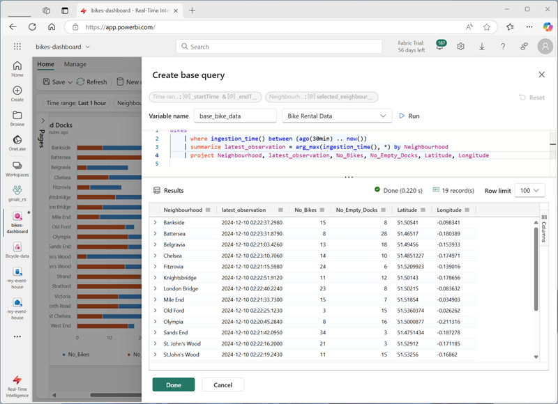

---
lab:
  title: Microsoft Fabric에서 실시간 대시보드 시작
  module: Get started with Real-Time Dashboards in Microsoft Fabric
---

# Microsoft Fabric의 실시간 대시보드 시작

Microsoft Fabric의 실시간 대시보드를 사용하면 KQL(Kusto 쿼리 언어)을 사용하여 스트리밍 데이터를 시각화하고 탐색할 수 있습니다.  이 연습에서는 실시간 데이터 원본을 기반으로 실시간 대시보드를 만들고 사용하는 방법을 살펴봅니다.

이 랩을 완료하는 데 약 **25**분이 소요됩니다.

> **참고**: 이 연습을 완료하려면 [Microsoft Fabric 테넌트](https://learn.microsoft.com/fabric/get-started/fabric-trial)가 필요합니다.

## 작업 영역 만들기

Fabric에서 데이터로 작업하기 전에, Fabric 용량을 사용하도록 설정된 테넌트에서 작업 영역을 만들어야 합니다.

1. [Microsoft Fabric 홈페이지](https://app.fabric.microsoft.com/home?experience=fabric)(`https://app.fabric.microsoft.com/home?experience=fabric`)에서 **실시간 인텔리전스**를 선택합니다.
1. 왼쪽 메뉴 모음에서 **작업 영역**을 선택합니다(아이콘은 와 유사함).
1. Fabric 용량이 포함된 라이선스 모드(*평가판*, *프리미엄* 또는 *Fabric*)를 선택하여 원하는 이름으로 새 작업 영역을 만듭니다.
1. 새 작업 영역이 열리면 비어 있어야 합니다.

    

## Eventhouse 만들기

이제 작업 영역이 있으므로 실시간 인텔리전스 솔루션에 필요한 Fabric 항목 만들기를 시작할 수 있습니다. 먼저 Eventhouse를 만들어 보겠습니다.

1. 왼쪽 메뉴 모음에서 **홈**을 선택한 다음 실시간 인텔리전스 홈 페이지에서 새 **Eventhouse**를 만들어, 원하는 고유한 이름을 지정합니다.
1. 빈 Eventhouse가 새로 표시될 때까지 표시되는 팁이나 프롬프트를 닫습니다.

    

1. 왼쪽 창의 Eventhouse에는 Eventhouse와 이름이 같은 KQL 데이터베이스가 포함되어 있습니다.
1. KQL 데이터베이스를 선택하여 확인합니다.

## Eventstream 만들기

현재 데이터베이스에는 테이블이 없습니다. Eventstream을 사용하여 실시간 원본의 데이터를 테이블로 로드합니다.

1. KQL 데이터베이스의 기본 페이지에서 **데이터 가져오기**를 선택합니다.
2. 데이터 원본에 대해 **Eventstream** > **새 Eventstream**을 선택합니다. Eventstream의 이름을 `Bicycle-data`(으)로 지정합니다.

    

    작업 영역에서 새 이벤트 스트림 만들기는 몇 분 안에 완료됩니다. 설정되면 Eventstream에 대한 데이터 원본을 선택하도록 자동으로 리디렉션됩니다.

1. **샘플 데이터 사용**을 선택합니다.
1. 원본 이름을 `Bicycles`(으)로 지정하고 **Bicycles** 샘플 데이터를 선택합니다.

    스트림이 매핑되고 **eventstream 캔버스**에 자동으로 표시됩니다.

   

1. **대상 추가** 드롭다운 목록에서 **Eventhouse**를 선택합니다.
1. **Eventhouse** 창에서 다음 설정 옵션을 구성합니다.
   - **데이터 수집 모드:**: 수집 전 이벤트 처리
   - **대상 이름:**`bikes-table`
   - **작업 영역:***이 연습의 시작 부분에서 만든 작업 영역 선택*
   - **Eventhouse**: *eventhouse 선택*
   - **KQL 데이터베이스:***KQL 데이터베이스 선택*
   - **대상 테이블:** 이름이 지정된 새 테이블 만들기 `bikes`
   - **입력 데이터 형식:** JSON

   

1. **Eventhouse** 창에서 **저장**을 선택합니다. 
1. **Bicycles-data** 노드의 출력을 **bikes-table** 노드에 연결한 다음 **게시**를 선택합니다.
1. 데이터 대상이 활성화될 때까지 잠시 1분 정도 기다립니다. 그런 다음, 디자인 캔버스에서 **bikes-table** 노드를 선택하고 아래의 **데이터 미리 보기** 창을 확인하여 수집된 최신 데이터를 확인합니다.

   

1. 몇 분 기다린 다음 **새로 고침** 버튼을 사용하여 **데이터 미리 보기** 창을 새로 고칩니다. 스트림이 영구적으로 실행되므로 새 데이터가 테이블에 추가되었을 수 있습니다.

## 실시간 대시보드 만들기

이제 Eventhouse의 테이블에 실시간 데이터 스트림을 로드했으므로 실시간 대시보드를 사용하여 시각화할 수 있습니다.

1. 왼쪽 메뉴 모음에서 **홈** 허브를 선택합니다. 그런 다음 홈페이지에서 `bikes-dashboard`(이)라는 이름의 **실시간 대시보드**를 새로 만듭니다.

    빈 대시보드가 새로 만들어집니다.


    

1. 도구 모음에서 **새 데이터 원본**을 선택하고 새 **OneLake 데이터 허브** 데이터 원본을 추가합니다. 그런 다음, Eventhouse를 선택하고 다음 설정을 사용하여 새 데이터 원본을 만듭니다.
    - **표시 이름**: `Bike Rental Data`
    - **데이터베이스**: *Eventhouse*의 기본 데이터베이스입니다.
    - **통과 ID**: *선택됨*

1. **데이터 원본** 창을 닫은 다음 대시보드 디자인 캔버스에서 **타일 추가**를 선택합니다.
1. 쿼리 편집기에서 **Bike Rental Data** 원본이 선택되었는지 확인하고 다음 KQL 코드를 입력합니다.

    ```kql
    bikes
        | where ingestion_time() between (ago(30min) .. now())
        | summarize latest_observation = arg_max(ingestion_time(), *) by Neighbourhood
        | project Neighbourhood, latest_observation, No_Bikes, No_Empty_Docks
        | order by Neighbourhood asc
    ```

1. 지난 30분 동안 각 지역에서 관찰된 자전거 수 및 빈 자전거 도크 수를 보여주는 쿼리를 실행합니다.
1. 변경 내용을 적용하여 대시보드의 타일에 있는 테이블에 표시된 데이터를 확인합니다.

   

1. 타일에서 **편집** 아이콘(연필 모양)을 선택합니다. 그런 다음 **시각적 개체 서식** 창에서 다음 속성을 설정합니다.
    - **타일 이름**: 자전거 및 도크
    - **시각적 개체 유형**: 막대형 차트
    - **시각적 개체 서식**: 누적 가로 막대형 차트
    - **Y 열**: No_Bikes, No-Empty_Docks
    - **X 열**: 지역
    - **계열 열**: 유추
    - **범례 위치**: 맨 아래

    편집된 시간은 다음과 같이 표시되어야 합니다.

   

1. 변경 내용을 적용한 대시보드 왼쪽의 전체 높이를 차지하도록 타일의 크기를 조정합니다.

1. 도구 모음에서 **새 타일**을 선택합니다.
1. 쿼리 편집기에서 **Bike Rental Data** 원본이 선택되었는지 확인하고 다음 KQL 코드를 입력합니다.

    ```kql
    bikes
        | where ingestion_time() between (ago(30min) .. now())
        | summarize latest_observation = arg_max(ingestion_time(), *) by Neighbourhood
        | project Neighbourhood, latest_observation, Latitude, Longitude, No_Bikes
        | order by Neighbourhood asc
    ```

1. 쿼리를 실행합니다. 이 쿼리는 지난 30분 동안 각 지역에서 관찰된 자전거의 위치와 수를 보여 줍니다.
1. 변경 내용을 적용하여 대시보드의 타일에 있는 테이블에 표시된 데이터를 확인합니다.
1. 타일에서 **편집** 아이콘(연필 모양)을 선택합니다. 그런 다음 **시각적 개체 서식** 창에서 다음 속성을 설정합니다.
    - **타일 이름**: 자전거 위치
    - **시각적 개체 유형**: 지도
    - **위치 정의 기준**: 위도 및 경도
    - **위도 열**: 위도
    - **경도 열**: 경도
    - **레이블 열**: 지역
    - **크기**: 표시
    - **크기 열**: No_Bikes

1. 변경 사항을 적용한 다음 대시보드에서 사용 가능한 공간의 오른쪽을 채우도록 지도 타일의 크기를 조정합니다.

   

## 기본 쿼리 만들기

대시보드에는 유사한 쿼리를 기반으로 하는 두 개의 시각적 개체가 포함되어 있습니다. 중복을 방지하고 대시보드를 더 쉽게 유지 관리하기 위해 공통 데이터를 단일 *기본 쿼리*로 통합할 수 있습니다.

1. 대시보드 도구 모음에서 **기본 쿼리**를 선택합니다. 그런 다음, **+ 추가**를 선택합니다.
1. 기본 쿼리 편집기에서 **변수 이름**을 `base_bike_data`(으)로 설정하고 **자전거 대여 데이터** 원본이 선택되어 있는지 확인합니다. 다음 쿼리를 입력합니다.

    ```kql
    bikes
        | where ingestion_time() between (ago(30min) .. now())
        | summarize latest_observation = arg_max(ingestion_time(), *) by Neighbourhood

1. Run the query and verify that it returns all of the columns needed for both visuals in the dashboard (and some others).

   

1. Select **Done** and then close the **Base queries** pane.
1. Edit the **Bikes and Docks** bar chart visual, and change the query to the following code:

    ```kql
    base_bike_data
    | project Neighbourhood, latest_observation, No_Bikes, No_Empty_Docks
    | order by Neighbourhood asc
    ```

1. 변경 내용을 적용하고 막대형 차트에 모든 지역의 데이터가 계속 표시되는지 확인합니다.

1. **자전거 위치** 지도 시각적 개체를 편집하고 쿼리를 다음 코드로 변경합니다.

    ```kql
    base_bike_data
    | project Neighbourhood, latest_observation, No_Bikes, Latitude, Longitude
    | order by Neighbourhood asc
    ```

1. 변경 내용을 적용하고 지도에 모든 지역의 데이터가 계속 표시되는지 확인합니다.

## 매개 변수 추가

대시보드에는 현재 모든 지역의 최신 자전거, 도크 및 위치 데이터가 표시됩니다. 이제 특정 지역을 선택할 수 있도록 매개 변수를 추가할 수 있습니다.

1. 대시보드 도구 모음의 **관리** 탭에서 **매개 변수**를 선택합니다.
1. 자동으로 생성된 기존 매개 변수(예: *시간 범위* 매개 변수)를 기록해 둡니다. 그런 다음 **삭제**합니다.
1. **+ 추가**를 선택합니다.
1. 다음 설정으로 매개 변수를 추가합니다.
    - **레이블:** `Neighbourhood`
    - **매개 변수 형식**: 다중 선택
    - **설명**: `Choose neighbourhoods`
    - **변수 이름**: `selected_neighbourhoods`
    - **데이터 형식**: 문자열
    - **페이지에 표시**: 모두 선택
    - **원본**: 쿼리
    - **데이터 원본**: 자전거 대여 데이터
    - **쿼리 편집**:

        ```kql
        bikes
        | distinct Neighbourhood
        | order by Neighbourhood asc
        ```

    - **값 열**: 지역
    - **레이블 열**: 값 선택 영역 일치
    - **"모두 선택" 값 추가**: *선택됨*
    - **"모두 선택"은 빈 문자열을 보냄**: *선택됨*
    - **기본값으로 자동 재설정**: 선택됨
    - **기본값**: 모두 선택

1. **완료**를 선택하여 매개 변수를 만듭니다.

    이제 매개 변수를 추가했으므로 기본 쿼리를 수정하여 선택한 지역에 따라 데이터를 필터링해야 합니다.

1. 도구 모음에서 **기본 쿼리**를 선택합니다. 그런 다음 **base_bike_data** 쿼리를 선택하고 다음 코드와 같이 **where** 절에 **and** 조건을 추가하여 선택한 매개 변수 값을 기준으로 필터링하도록 편집합니다.

    ```kql
    bikes
        | where ingestion_time() between (ago(30min) .. now())
          and (isempty(['selected_neighbourhoods']) or Neighbourhood  in (['selected_neighbourhoods']))
        | summarize latest_observation = arg_max(ingestion_time(), *) by Neighbourhood
    ```

1. **완료**를 선택하여 기본 쿼리를 저장합니다.

1. 대시보드에서 **지역** 매개 변수를 사용하여 선택한 지역을 기준으로 데이터를 필터링합니다.

   

1. **다시 설정**을 선택하면 선택한 매개 변수 필터를 제거할 수 있습니다.

## 페이지 추가

대시보드는 현재 단일 페이지로 구성됩니다. 더 많은 페이지를 추가하여 더 많은 데이터를 제공할 수 있습니다.

1. 대시보드 왼쪽에서 **페이지** 창을 확장하고 **+ 페이지 추가**를 선택합니다.
1. 새 페이지의 이름을 **페이지 2**로 지정합니다. 그런 다음 선택합니다.
1. 새 페이지에서 **+ 타일 추가**를 선택합니다.
1. 새 타일의 쿼리 편집기에서 다음 쿼리를 입력합니다.

    ```kql
    base_bike_data
    | project Neighbourhood, latest_observation
    | order by latest_observation desc
    ```

1. 변경 내용을 적용합니다. 그런 다음 타일의 크기를 조정하여 대시보드 높이를 채웁니다.

   

## 자동 새로 고침 구성

사용자는 대시보드를 수동으로 새로 고칠 수 있지만, 설정된 간격으로 데이터를 자동으로 새로 고치도록 설정하는 것이 유용할 수 있습니다.

1. 대시보드 도구 모음의 **관리** 탭에서 **자동 새로 고침**을 선택합니다.
1. **자동 새로 고침** 창에서 다음 설정을 구성합니다.
    - **활성화됨**: *선택됨*
    - **최소 시간 간격**: 모든 새로 고침 간격 허용
    - **기본 새로 고침 빈도**: 30분
1. 자동 새로 고침 설정을 적용합니다.

## 대시보드 저장 및 공유

이제 유용한 대시보드가 있으므로 대시보드를 저장하고 다른 사용자와 공유할 수 있습니다.

1. 대시보드 도구 모음에서 **저장**을 선택합니다.
1. 대시보드가 저장되면 **공유**를 선택합니다.
1. **공유** 대화 상자에서 **링크 복사**를 선택하고 대시보드의 링크를 클립보드에 복사합니다.
1. 새 브라우저 탭을 열고 복사한 링크를 붙여넣어 공유 대시보드로 이동합니다. 메시지가 표시되면 Fabric 자격 증명으로 다시 로그인합니다.
1. 대시보드를 탐색하여 도시 전역의 자전거 및 빈 자전거 도크에 대한 최신 정보를 확인합니다.

## 리소스 정리

대시보드 탐색을 마치면 이 연습을 위해 만든 작업 영역을 삭제할 수 있습니다.

1. 왼쪽 막대에서 작업 영역의 **아이콘**을 선택합니다.
2. 도구 모음에서 **작업 영역 설정**을 선택합니다.
3. **일반** 섹션에서 **이 작업 영역 제거**를 선택합니다.
