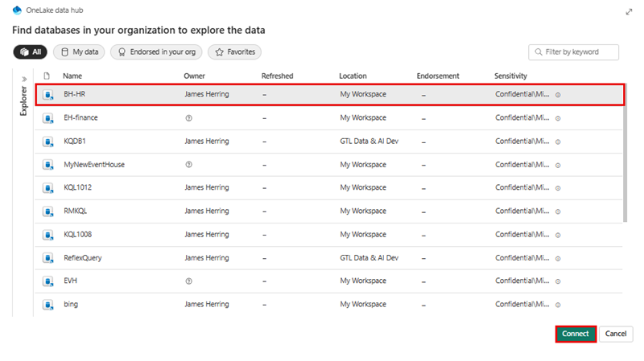
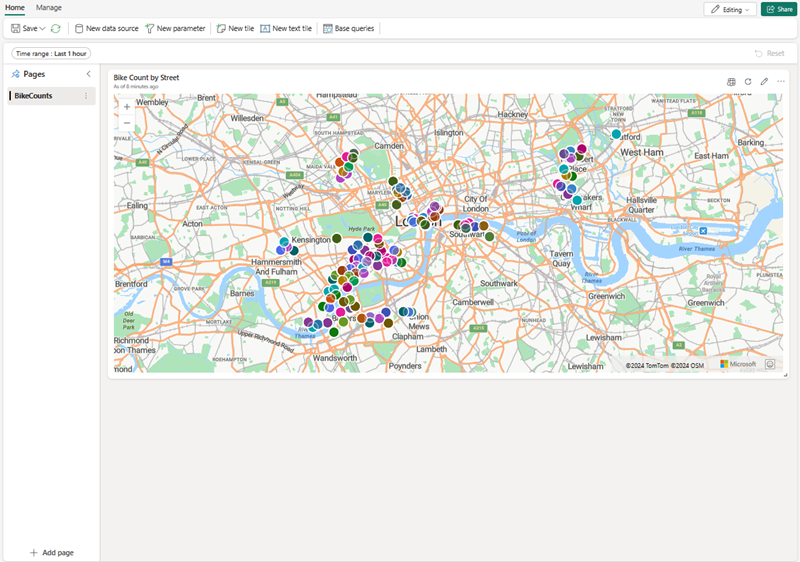
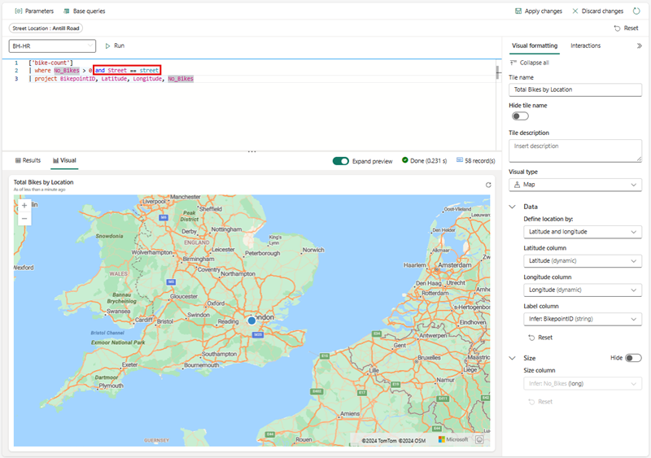

---
lab:
  title: Microsoft Fabric의 실시간 대시보드
  module: Get Started with Real-Time Dashboards in Microsoft Fabric
---

# Microsoft Fabric의 실시간 대시보드 시작

실시간 대시보드를 사용하면 KQL(Kusto 쿼리 언어)을 통해 Microsoft Fabric 내에서 인사이트를 수집하여 구조적 데이터와 비구조적 데이터를 모두 검색하고 Power BI 내의 슬라이서와 유사한 연결을 허용하는 패널 내에서 차트, 산점도, 테이블 등으로 렌더링할 수 있습니다. 

이 랩을 완료하는 데 약 **25**분이 소요됩니다.

> **참고**: [Microsoft Fabric 평가판](https://learn.microsoft.com/fabric/get-started/fabric-trial)이 필요합니다. 이 연습을 완료하려면

## 작업 영역 만들기

패브릭에서 데이터를 사용하기 전에 패브릭 평가판을 사용하도록 설정된 작업 영역을 만듭니다.

1. [Microsoft Fabric 홈페이지](https://app.fabric.microsoft.com/home?experience=fabric)(`https://app.fabric.microsoft.com/home?experience=fabric`)에서 **실시간 인텔리전스**를 선택합니다.
1. 왼쪽 메뉴 모음에서 **작업 영역**을 선택합니다(아이콘은 와 유사함).
1. Fabric 용량이 포함된 라이선스 모드(*평가판*, *프리미엄* 또는 *Fabric*)를 선택하여 원하는 이름으로 새 작업 영역을 만듭니다. 또는 기존 작업 영역을 사용하여 실시간 대시보드를 빌드할 수 있습니다.
1. 새 작업 영역이 열리면 비어 있어야 합니다.

    

이 랩에서는 Fabric의 실시간 인텔리전스를 사용하여 실시간 대시보드를 만듭니다. 실시간 인텔리전스는 실시간 인텔리전스의 기능을 탐색하는 데 사용할 수 있는 샘플 데이터 세트를 편리하게 제공합니다. 이 샘플 데이터를 사용하여 실시간 데이터를 분석하고 다운스트림 프로세스에서 다른 용도로 사용할 수 있는 KQL | SQL 쿼리 및 쿼리 세트를 만듭니다.

## 실시간 대시보드 만들기

1. **실시간 인텔리전스** 내에서 **실시간 대시보드** 상자를 선택합니다.

   

2. 실시간 대시보드의 **이름을 지정**하라는 메시지가 표시됩니다.

   

3. 기본 원본을 기반으로 하는 이름과 같이 기억하기 쉬운 이름을 실시간 대시보드에 지정하고 **만들기**를 누릅니다.

4. **데이터베이스 세부 정보** 패널에서 연필 아이콘을 선택하여 OneLake의 가용성을 활성화합니다.

   [ ](./Images/real-time-dashboard-details-large.png#lightbox)

## ‘데이터 원본 추가’

데이터 원본은 실시간 대시보드와 동일한 작업 영역 내에서 특정 데이터베이스 또는 쿼리에 대한 재사용 가능한 참조 역할을 하므로 다양한 타일에서 데이터 요구 사항에 따라 고유한 데이터 원본을 활용할 수 있습니다.

1. **관리** 탭을 선택한 다음 ***메뉴 모음***에서 **새 데이터 원본**을 선택합니다.
1. **데이터 원본** 창에서 **+ 추가** 단추를 선택합니다.

    [  ](./Images/add-data-source-to-real-time-dashboard-large.png#lightbox) 

1. **OneLake 데이터 허브** 또는 **Azure Data Explorer**의 두 가지 기본 옵션 중 하나를 선택합니다.

    

1. 사용자의 비즈니스 요구에 맞는 **데이터 원본**을 선택한 다음 **연결** 단추를 선택합니다.

    [  ](./Images/select-onelake-data-hub-large.png#lightbox) 

    > **참고** 데이터 원본에 연결하면 선택한 위치 내에서 추가 데이터 원본을 확인하고 만들 수 있습니다.

1. **새 데이터 원본 만들기** 창에서 **데이터 원본** 연결을 확인하고 **만들기**를 선택합니다.

    [  ](./Images/conected-now-create-datasource-large.png#lightbox) 

1. 이 시점에서 **페이지 n** 오른쪽에 있는 줄임표 **...** 를 선택하고 타일 용도에 적절한 이름으로 **페이지 이름 바꾸기**를 선택합니다.
1. **+ 타일 추가** 선택

    [  ](./Images/rename-page-add-tile-large.png#lightbox) 

1. 매개 변수를 추가하고 타일을 지원하기 위한 기본 쿼리를 끌어올 수 있는 **타일 쿼리 창**으로 리디렉션됩니다. 

    [  ](./Images/write-query-for-tile-large.png#lightbox) 

    > **참고** 동일한 창의 드롭다운 창에 새 데이터 원본을 추가할 수 있는 옵션이 있습니다. 이 원본은 개인 작업 영역 내에 있거나 액세스 가능한 Evenhouse 내에 다른 KQL 데이터베이스가 저장된 작업 영역 내에 있을 수도 있습니다.

## 쿼리 작성

실시간 대시보드 타일은 Kusto 쿼리 언어 코드 조각을 사용하여 데이터를 검색하고 시각적 개체를 렌더링합니다. 각 타일/쿼리에서 단일 시각적 개체를 지원할 수 있습니다.

1. 각 타일 내에서 새 타일이나 기존 타일에 고정하기로 선택한 경우 **Copilot**에서 쓰거나 붙여넣은 다음 필요에 맞게 수정할 수 있습니다. 간단한 쿼리만으로 자전거 수에 따라 맵의 크기를 사용하는 맵 시각화를 만들 수 있습니다.

```kusto

['Bike-count']
BikepointID, Latitude, Longitude, No_Bikes

```

## 시각화 만들기

시각화가 만족스러우면 **변경 내용 적용**을 선택한 다음 실시간 대시보드를 지원하기 위해 추가 시각화를 추가하거나 **매개 변수** 또는 **일정**과 같은 추가 단계를 수행합니다.

   [  ](./Images/create-visual-in-tiles-large.png#lightbox) 

변경 내용이 적용되면 데이터가 표시되며 사용자의 가독성과 이해를 위해 조정할 수 있습니다.

   [  ](./Images/first-published-visual-large.png#lightbox) 

사용자 커뮤니티가 쉽게 이해할 수 있도록 테이블 정보와 시각화 정보가 포함된 **새 타일**을 계속 만들 수 있습니다. 앞서 설명한 것처럼 **페이지 추가**, **새 데이터 원본** 기능도 있습니다. 다음으로 사용자에게 표시되는 정보의 양을 탐색하고 줄이는 데 도움이 되는 매개 변수를 추가하는 데 중점을 둘 것입니다.

## 매개 변수 추가
매개 변수는 대시보드 렌더링의 효율성을 향상시키고 쿼리 프로세스의 초기 단계에서 필터 값을 활용할 수 있도록 합니다. 타일에 연결된 쿼리에 매개 변수를 포함하면 필터링 기능이 활성화됩니다. 매개 변수는 대시보드 전체에서 활용될 수 있으며 여러 매개 변수는 테이블을 포함한 기본 시각화에 표시된 데이터를 필터링할 수 있습니다.

매개 변수 만들기는 다음과 같이 쉽게 시작됩니다. 

1. 상단 메뉴에서 새 매개 변수 단추를 선택합니다. 매개 변수 창이 열립니다.
1. 오른쪽 창 상단에 있는 + 추가 단추를 선택합니다.

    [  ](./Images/add-new-parameter-large.png#lightbox) 

1. 매개 변수에 대한 관련 속성을 입력합니다.

    [  ](./Images/configure-parameter-large.png#lightbox) 

1. 매개 변수의 가장 중요한 기능 중 하나는 **쿼리를 추가**하여 기본 정보와 관련된 옵션만 사용자에게 제공하는 기능입니다.

    

1. 완료를 선택하여 매개 변수를 만듭니다.

    [  ](./Images/complete-parameter-settings-large.png#lightbox) 

### 매개 변수 속성

| 필드            | Description |
|------------------|-------------|
| **Label**        | 대시보드 또는 편집 카드에 표시되는 매개 변수의 이름입니다. |
| **매개 변수 형식** | 다음 형식 중 하나: <ul><li>단일 선택: 필터에서 매개 변수에 대한 입력으로 하나의 값만 선택할 수 있습니다.</li><li>다중 선택: 매개 변수에 대한 입력으로 필터에서 하나 이상의 값을 선택할 수 있습니다.</li><li>시간 범위: 시간을 기준으로 쿼리 및 대시보드를 필터링하기 위한 추가 매개 변수 만들기를 사용하도록 설정합니다. 모든 대시보드에는 기본 시간 범위 선택기가 있습니다.</li><li>자유 텍스트: 사용자가 값을 미리 채우지 않고 필터 필드에 값을 입력하거나 붙여넣고 최근에 사용한 값을 보존할 수 있습니다.</li></ul> |
| **설명**  | 매개 변수에 대한 선택적 설명입니다. |
| **변수 이름** | 쿼리 내 매개 변수에 사용되는 이름입니다. |
| **데이터 형식**    | 매개 변수 값이 나타내는 데이터 형식입니다. |
| **페이지에 표시** | 모든 페이지를 선택하는 옵션과 함께 매개 변수가 표시되는 페이지입니다. |
| **Source**       | 매개 변수 값의 원본은 다음과 같습니다. <ul><li>고정 값: 수동으로 입력한 정적 필터 값입니다.</li><li>쿼리: KQL 쿼리를 사용하여 도입된 동적 값입니다.</li></ul> |
| **"모두 선택" 값 추가** | 단일 및 다중 선택 매개 변수 형식에 적용할 수 있는 이 옵션은 모든 매개 변수 값에 대한 데이터를 검색하며 기능을 위해 쿼리에 통합되어야 합니다. |
| **기본값** | 대시보드의 초기 렌더링 시 설정되는 필터의 기본값입니다. |

6. 타일 내의 각 쿼리에 매개 변수를 추가했는지 확인한 다음 **변경 내용 적용**을 선택합니다.

**KQL 쿼리 전**
```kusto
//Add the street parameter to each tile's query
['bike-count']
| where No_Bikes > 0
| project BikepointID, Latitude, Longitude, No_Bikes

```

**KQL 쿼리 후**
```kusto
//Add the street parameter to each tile's query
['bike-count']
| where No_Bikes > 0 and Street == street
| project BikepointID, Latitude, Longitude, No_Bikes

```
   [  ](./Images/update-each-query-large.png#lightbox) 

## 자동 새로 고침 사용

자동 새로 고침은 수동으로 페이지를 다시 로드하거나 새로 고침 단추를 누를 필요 없이 대시보드 데이터를 자동으로 업데이트할 수 있는 기능입니다. 초기 자동 새로 고침 빈도는 데이터베이스 편집기로 구성할 수 있습니다. 편집자와 뷰어 모두 대시보드를 보는 동안 실제 자동 새로 고침 빈도를 편집할 수 있습니다. 데이터베이스 편집자는 클러스터의 과도한 로드를 완화하기 위해 최소 새로 고침 빈도를 설정할 권한이 있습니다. 이 최소 속도가 설정되면 데이터베이스 사용자는 지정된 최솟값보다 낮은 새로 고침 빈도를 선택하는 것이 제한됩니다. 이렇게 하면 리소스에 과도한 부담을 주지 않고 시스템 성능이 유지됩니다.

1. 관리 탭 > 자동 새로 고침을 선택합니다.

    [  ](./Images/enable-auto-refresh-large.png#lightbox) 

1. 자동 새로 고침이 사용이 되도록 옵션을 전환합니다.
1. 최소 시간 간격 및 기본 새로 고침 빈도에 대한 값을 선택합니다.
1. 적용을 선택한 다음, 대시보드를 저장합니다.

    [  ](./Images/enable-and-configure-refresh-rate-large.png#lightbox) 

## 리소스 정리

이 연습에서는 KQL 데이터베이스를 만들고 쿼리하기 위해 샘플 데이터 세트를 설정했습니다. 그런 다음 KQL 및 SQL을 사용하여 데이터를 쿼리했습니다. KQL 데이터베이스 탐색을 마쳤으면 이 연습을 위해 만든 작업 영역을 삭제할 수 있습니다.
1. 왼쪽 막대에서 작업 영역의 **아이콘**을 선택합니다.
2. 도구 모음의 ... 메뉴에서 **작업 영역 설정**을 선택합니다.
3. **일반** 섹션에서 **이 작업 영역 제거**를 선택합니다.

