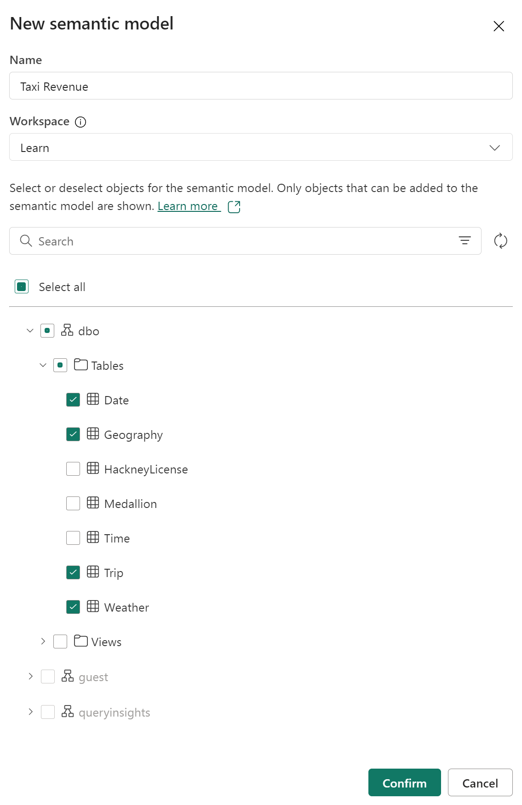
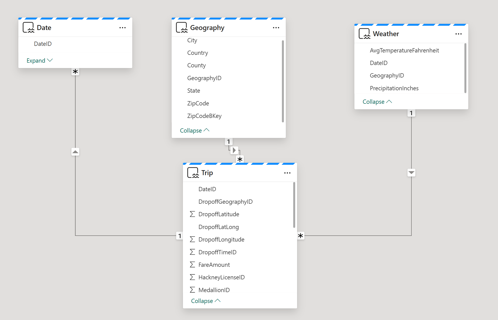

---
lab:
  title: 의미 체계 모델 만들기 및 탐색
  module: Understand scalability in Power BI
---

# 의미 체계 모델 만들기 및 탐색

이 연습에서는 Microsoft Fabric을 사용하여 데이터 웨어하우스의 샘플 NY Taxi 데이터에 대한 데이터 모델을 개발합니다.

연습할 내용은 다음과 같습니다.

- Fabric 데이터 웨어하우스에서 사용자 지정 의미 체계 모델을 만듭니다.
- 관계를 만들고 모델 다이어그램을 구성합니다.
- Fabric에서 직접 의미 체계 모델의 데이터를 탐색합니다.

이 랩을 완료하는 데 약 **30**분이 소요됩니다.

> **참고**: 이 연습을 완료하려면 [Microsoft Fabric 평가판](https://learn.microsoft.com/fabric/get-started/fabric-trial)이 필요합니다.

## 작업 영역 만들기

패브릭에서 데이터를 사용하기 전에 패브릭 평가판을 사용하도록 설정된 작업 영역을 만듭니다.

1. [Microsoft Fabric 홈페이지](https://app.fabric.microsoft.com/home?experience=fabric)(`https://app.fabric.microsoft.com/home?experience=fabric`)에서 **Synapse 데이터 엔지니어링**을 선택합니다.
1. 왼쪽 메뉴 모음에서 **작업 영역**을 선택합니다(아이콘은 와 유사함).
1. Fabric 용량이 포함된 라이선스 모드(*평가판*, *프리미엄* 또는 *Fabric*)를 선택하여 원하는 이름으로 새 작업 영역을 만듭니다.
1. 새 작업 영역이 열리면 비어 있어야 합니다.

## 데이터 웨어하우스 만들기 및 샘플 데이터 로드

작업 영역이 있으므로 이제 데이터 웨어하우스를 만들어야 합니다. Synapse Data Warehouse 홈페이지에는 새 웨어하우스를 만들기 위한 바로 가기가 포함되어 있습니다.

1. **Synapse Data Warehouse** 홈페이지에서 원하는 이름으로 새 **웨어하우스**를 만듭니다.

    1분 정도 지나면 새 웨어하우스가 만들어집니다.
    
    

1. 데이터 웨어하우스 사용자 인터페이스의 가운데에는 웨어하우스에 데이터를 로드하는 몇 가지 방법이 표시됩니다. **샘플 데이터**를 선택하여 NYC Taxi 데이터를 데이터 웨어하우스에 로드합니다. 이 작업에 몇 분 정도가 소요됩니다.

1. 샘플 데이터가 로드된 후 왼쪽의 **탐색기** 창을 사용하여 샘플 데이터 웨어하우스에 이미 있는 테이블과 뷰를 확인합니다.

1. 리본 메뉴의 **보고** 탭을 선택하고 **새 의미 체계 모델**을 선택합니다. 이를 통해 데이터 팀과 비즈니스에서 보고서를 빌드하는 데 사용할 데이터 웨어하우스의 특정 테이블 및 뷰만 사용하여 새 의미 체계 모델을 만들 수 있습니다.

1. 의미 체계 모델의 이름을 **Taxi Revenue**로 지정하고, 방금 만든 작업 영역에 있는지 확인한 후 다음 테이블을 선택합니다.
   - 날짜
   - 여행
   - Geography
   - 날씨
     
   
     
## 테이블 간에 관계 만들기

이제 테이블 간의 관계를 만들어 데이터를 계산하고 시각화합니다. Power BI 데스크톱에서 관계를 만드는 데 익숙하다면 이 작업이 편하게 느껴질 것입니다.

1. 작업 영역으로 돌아가서 새 의미 체계 모델인 Taxi Revenue가 표시되는지 확인합니다. 데이터 웨어하우스를 만들 때 자동으로 만들어지는 **의미 체계 모델(기본값)** 과 달리 항목 종류는 **의미 체계 모델**입니다.

     *참고: 기본 의미 체계 모델은 Microsoft Fabric에서 웨어하우스 또는 SQL 분석 엔드포인트를 만들 때 자동으로 만들어지고 부모 Lakehouse 또는 Warehouse에서 비즈니스 논리를 상속합니다. 여기서 수행한 대로 직접 만드는 의미 체계 모델은 특정 요구 사항 및 기본 설정에 따라 디자인하고 수정할 수 있는 사용자 지정 모델입니다. Power BI Desktop, Power BI 서비스 또는 Microsoft Fabric에 연결하는 다른 도구를 사용하여 사용자 지정 의미 체계 모델을 만들 수 있습니다.*

1. **리본에서 데이터 모델 열기**를 선택합니다.

    이제 테이블 간에 관계를 만듭니다. Power BI 데스크톱에서 관계를 만드는 데 익숙하다면 이 작업이 편하게 느껴질 것입니다.

    *별모양 스키마 개념을 검토하면서 모델의 테이블을 팩트 테이블과 차원 테이블로 구성해 보겠습니다. 이 모델에서 **Trip** 테이블은 팩트 테이블이며 차원은 **Date**, **Geography** 및 **Weather**입니다.*

1. **DateID** 열을 사용하여 **Date** 테이블과 **Trip** 테이블 간의 관계를 만듭니다.

    **Date** 테이블에서 **DateID 열을 선택**하고 *Trip 테이블의 DateID 열 위에 끌어서 놓습니다*.

    관계가 **Date** 테이블에서 **Trip** 테이블에 이르는 **일대다** 관계인지 확인합니다.

1. 다음과 같이 **Trip** 팩트 테이블에 대한 관계를 두 개 더 만듭니다.

   - **Geography [GeographyID]** to **Trip [DropoffGeographyID]**(일대다)
   - **Weather [GeographyID]** to **Trip [DropoffGeographyID]**(일대다)

    > **참고**: 두 관계 모두에 대해 관계 기본 카디널리티를 **일대다**로 변경해야 합니다.

1. **Trip** 팩트 테이블이 다이어그램의 아래쪽에 있고 차원 테이블인 나머지 테이블은 팩트 테이블 주위에 배치되도록 테이블을 위치로 끌어옵니다.

    

    이제 별모양 스키마 모델 만들기가 완료되었습니다. 계층 구조 추가, 계산 및 열 표시 유형과 같은 속성 설정 등 적용할 수 있는 모델링 구성이 많이 있습니다.**

    > **팁**: 창의 속성 창에서 *카드 상단에 관련 필드 고정*을 설정/해제합니다. 이렇게 하면 사용자(및 이 모델에서 보고하는 다른 사용자)가 관계에서 사용되는 필드를 한눈에 확인할 수 있습니다. 속성 창을 사용하여 테이블의 필드와 상호 작용할 수도 있습니다. 예를 들어 데이터 형식이 제대로 설정되었는지 확인하려면 필드를 선택하고 속성 창에서 형식을 검토하면 됩니다.

     

## 데이터 탐색

이제 보고에 필요한 관계가 설정된 웨어하우스에서 빌드된 의미 체계 모델이 있습니다. **데이터 탐색** 기능을 사용하여 데이터를 살펴보겠습니다.

1. 작업 영역으로 돌아가서 **Taxi Revenue 의미 체계 모델**을 선택합니다.

1. 창의 리본에서 **이 데이터 탐색**을 선택합니다. 여기서는 테이블 형식으로 데이터를 살펴보겠습니다. 이렇게 하면 완전한 Power BI 보고서를 작성하지 않고도 데이터를 집중적으로 탐색할 수 있는 환경이 제공됩니다.

1. **YearName** 및 **MonthName**을 행에 추가하고, 값 필드에서 **평균 승객 수**, **평균 여행 금액** 및 **평균 여행 기간**을 살펴봅니다.

    *탐색 창에 숫자 필드를 끌어서 놓으면 기본적으로 숫자가 요약되어 표시됩니다. 집계를 **Summarize**에서 **Average**로 변경하려면 필드를 선택하고 팝업 창에서 집계를 변경합니다.*

    

1. 이 데이터를 행렬이 아닌 시각적 개체로 보려면 창 아래쪽에서 **Visual**을 선택합니다. 막대형 차트를 선택하여 이 데이터를 빠르게 시각화합니다.

   *막대형 차트가 이 데이터를 보는 가장 좋은 방법인 것은 아닙니다. 화면 오른쪽에 있는 데이터 창의 "데이터 다시 정렬" 섹션에 표시된 다양한 시각적 개체와 필드를 사용해 보세요.*

1. 이제 왼쪽 위 모서리에 있는 **저장** 단추를 클릭하여 이 탐색 보기를 작업 영역에 저장할 수 있습니다. 또한 오른쪽 위 모서리에서 **공유**를 선택하여 보기를 **공유**할 수 있습니다. 이렇게 하면 동료와 데이터 탐색을 공유할 수 있습니다.

1. 탐색을 저장한 후 작업 영역으로 다시 이동하여 데이터 웨어하우스, 기본 의미 체계 모델, 만든 의미 체계 모델 및 탐색을 확인합니다.

    
