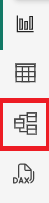
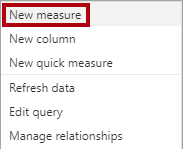
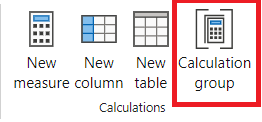

---
lab:
  title: 확장 가능한 의미 체계 모델 디자인
  module: Design scalable semantic models
---

# 확장 가능한 의미 체계 모델 디자인

이 연습에서는 DAX 함수를 사용하여 특히 계산 그룹 및 필드 매개 변수와 같은 기능을 통해 데이터 모델의 유연성과 효율성을 향상시킵니다. 이러한 기능을 함께 사용하면 여러 시각적 개체 또는 복잡한 DAX 식 없이도 대화형 보고서를 작성하여 매우 유연하고 확장 가능한 의미 체계 모델을 만들 수 있습니다.

이 연습에서는 다음 작업을 수행하는 방법을 알아봅니다.

- 관계 동작을 수정하는 DAX 함수를 사용합니다.
- 계산 그룹을 만들고 동적 시간 인텔리전스 계산에 적용합니다.
- 필드 매개 변수를 만들어 다른 필드와 측정값을 동적으로 선택하고 표시합니다.

이 랩을 완료하는 데 약 **30**분이 소요됩니다.

## 시작하기 전에

1. [Sales Analysis starter 파일](https://github.com/MicrosoftLearning/mslearn-fabric/raw/main/Allfiles/Labs/15/15-scalable-semantic-models.zip)을 `https://github.com/MicrosoftLearning/mslearn-fabric/raw/main/Allfiles/Labs/15/15-scalable-semantic-models.zip`에서 다운로드하여 기억할 위치에 저장합니다.

2. **C:\Users\Student\Downloads\15-scalable-semantic-models** 폴더로 폴더를 추출합니다.

3. **15-Starter-Sales Analysis.pbix** 파일을 엽니다.

    > *변경 내용 취소*를 선택하지 말고, 변경 내용을 적용하라는 경고를 무시하고 닫습니다.

## 관계에 대한 작업

이 작업에서는 미리 개발된 Power BI Desktop 솔루션을 열고 데이터 모델에 대해 알아봅니다. 그런 다음 활성 모델 관계의 동작을 탐색합니다.

1. Power BI Desktop의 왼쪽에서 **모델** 보기로 전환합니다.

    

2. 모델 다이어그램을 사용하여 모델 디자인을 검토합니다.

    

3. **Date** 테이블과 **Sales** 테이블 간에는 3가지 관계가 있습니다.

    

    > **Date** 테이블의 **Date** 열은 관계 중 "하나"의 측면을 나타내는 고유한 열입니다. **Date** 테이블의 모든 열에 적용된 필터는 관계 중 하나를 사용하여 **Sales** 테이블에 전파됩니다.*

4. 각각의 세 가지 관계 위에 커서를 놓아 **Sales** 테이블의 “여러” 측면 열을 강조 표시합니다.

5. **Date**와 **OrderDate** 간의 관계는 활성 상태입니다. 현재 모델 디자인은 **Date** 테이블이 롤플레잉 차원임을 나타냅니다. 이 차원은 주문 날짜, 기한 또는 배송 날짜의 역할을 수행할 수 있습니다. 어떤 역할은 보고서의 분석 요구 사항에 따라 달라집니다.

> 나중에 DAX를 사용하여 다른 테이블을 만들지 않고 이러한 비활성 관계를 사용하여 서로 다른 날짜 열에 대해 두 개의 활성 관계를 가져옵니다.

### 날짜별 판매 데이터 시각화

이 작업에서는 연도별 총 매출을 시각화하고 비활성 관계를 사용합니다.

1. **보고서** 보기로 전환합니다.

    

2. 테이블 시각적 개체를 추가하려면 **시각화** 창에서 **테이블** 시각적 개체 아이콘을 선택합니다.

    

3. 테이블 시각적 개체에 열을 추가하려면 먼저 (오른쪽에 있는) **데이터** 창에서 **Date** 테이블을 확장합니다.

4. **Year** 열을 끌어 테이블 시각적 개체에 가져다 놓습니다.

5. **Sales** 테이블을 열고 **Total Sales** 열을 테이블 시각적 개체로 끌어서 놓습니다.

6. 테이블 시각적 개체를 검토합니다.


> 테이블 시각적 개체는 연도별로 그룹화된 **Total Sales** 열의 합계를 보여줍니다. 하지만 **Year**는 무엇을 의미할까요? **OrderDate** 열에 대한 **Date** 테이블과 **Sales** 테이블 간에 활성 관계가 있으므로 **Year**는 주문이 이루어진 회계 연도를 의미합니다.

### 비활성 관계 사용

이 작업에서는 `USERELATIONSHIP` 함수를 사용하여 비활성 관계를 활성화합니다.

1. **데이터** 창에서 **Sales** 테이블을 마우스 오른쪽 단추로 클릭한 다음 **새 측정값**을 선택합니다.

    

2. 리본 아래에 있는 수식 입력줄에서 텍스트를 다음 측정값 정의로 바꾼 다음 **Enter** 키를 누릅니다.

    ```DAX
    Sales Shipped =
    CALCULATE (
    SUM ('Sales'[Sales]),
    USERELATIONSHIP('Date'[Date], 'Sales'[ShipDate])
    )
    ```

    > 이 수식은 CALCULATE 함수를 사용하여 필터 컨텍스트를 수정합니다. 이 측정값에 대해서만 **ShipDate** 관계를 활성화하는 것은 USERELATIONSHIP 함수입니다.

3. 테이블 시각적 개체에 **Sales Shipped** 측정값을 추가합니다.

4. 모든 열이 전부 표시되도록 테이블 시각적 개체를 확대합니다. **Total** 행은 동일하지만 **Total Sales**와 **Sales Shipped**의 매년 판매량은 다릅니다. 이러한 차이는 지정 연도에 접수된 주문이 다음 해에만 배송이 되거나 아직 배송되지 않았기 때문에 발생한 것입니다.


> 일시적으로 관계를 활성으로 설정하는 측정값을 만드는 것은 롤플레잉 차원을 사용하는 한 가지 방법입니다. 그러나 많은 측정값에 대한 롤플레잉 버전을 만들어야 할 때 지루해질 수 있습니다. 예를 들어 판매 관련 측정값이 10개이고 롤플레잉 날짜가 3개인 경우 30개의 측정값을 만드는 것을 의미할 수 있습니다. 계산 그룹을 사용하여 만들면 프로세스가 더 쉬워집니다.

## 계산 그룹 만들기

이 작업에서는 시간 인텔리전스 분석을 위한 계산 그룹을 만듭니다.

1. **모델** 보기로 전환합니다.

2. 모델 뷰에서 **계산 그룹**을 선택하여 새 계산 그룹 테이블, 그룹 열 및 항목을 만듭니다. 경고 창이 나타나면 **예**를 선택하여 계산 그룹 만들기를 확인합니다.

   

    > 참고: 암시적 측정값은 보고서 뷰에서 시각적 개체에 직접 Data 창의 Data 열을 사용할 때 발생합니다. 시각적 개체를 사용하여 SUM, AVERAGE, MIN, MAX 또는 암시적 측정값이 되는 기타 기본 집계로 집계할 수 있습니다. 계산 그룹을 만든 후에는 Power BI Desktop에서 더 이상 암시적 측정값을 만들지 않으므로 Data 열을 집계하기 위해 측정값을 명시적으로 만들어야 합니다.

3. 계산 그룹의 이름을 *Time Calculations*으로 바꾸고 계산 열의 이름을 *Yearly Calculations*으로 바꿉니다.

4. **Data** 창의 **Model** 탭에서 계산 그룹을 통해 자동으로 만들어진 계산 항목을 선택합니다.

5. 항목의 수식을 다음으로 바꾸고 커밋합니다.

    ```DAX
   Year-to-Date (YTD) = CALCULATE(SELECTEDMEASURE(), DATESYTD('Date'[Date]))
    ```

6. **Calculation items** 필드를 마우스 오른쪽 단추로 클릭하고 **New calculation item**을 선택합니다.

7. 새 항목에 대해 다음 DAX 수식을 사용합니다.

    ```DAX
   Previous Year (PY) = CALCULATE(SELECTEDMEASURE(), PREVIOUSYEAR('Date'[Date]))
    ```

8. 다음 DAX 수식을 사용하여 세 번째 항목을 만듭니다.

    ```DAX
   Year-over-Year (YoY) Growth = 
   VAR MeasurePriorYear =
   CALCULATE(
       SELECTEDMEASURE(),
       SAMEPERIODLASTYEAR('Date'[Date])
   )
   RETURN
   DIVIDE(
       (SELECTEDMEASURE() - MeasurePriorYear),
       MeasurePriorYear
   )
    ```

마지막 계산 항목은 백분율로만 값을 반환해야 하므로 영향을 미치는 측정값의 형식을 변경하려면 동적 서식 문자열이 필요합니다.

9. YoY 항목의 **Properties** 창에서 **동적 서식 문자열** 기능을 사용하도록 설정합니다.

10. DAX 수식 입력줄에서 왼쪽 필드가 **Format**으로 설정되어 있는지 확인하고 다음 형식 문자열을 씁니다.`"0.##%"`

11. 계산 그룹이 다음과 같이 표시되는지 확인합니다.

    

### 측정값에 계산 그룹 적용

이 작업에서는 계산 항목이 시각적 개체의 측정값에 미치는 영향을 시각화합니다.

1. **보고서** 보기로 전환합니다.

2. 캔버스 아래쪽에서 **개요** 탭을 선택합니다.

3. 캔버스에서 이미 만든 행렬 시각적 개체를 선택하고 **Data** 창의 **Yearly Calculations** 계산 열을 **Visualizations** 창의 **Columns** 필드로 끌어 옵니다.

    

4. 이제 행렬에 각 계산 항목에 대한 Sales Figures 집합이 있음을 확인합니다. 

   

> 이 모든 정보를 한 번에 하나의 시각적 개체에 저장하면 읽기 어려울 수 있으므로 시각적 개체를 한 번에 하나의 판매 수치로 제한하는 것이 편리합니다. 이를 위해 필드 매개 변수를 사용할 수 있습니다.

## 필드 매개 변수 만들기

이 작업에서는 시각적 개체를 변경하는 필드 매개 변수를 만듭니다.

1. 위쪽 리본에서 **모델링** 탭을 선택한 다음 **새 매개 변수** 단추를 확장하고 **필드**를 선택합니다.

    

2. 매개 변수 창에서 매개 변수 이름을 **Sales Figures**로 바꾸고, **이 페이지에 슬라이서 추가** 옵션이 선택되어 있는지 확인하고, **Sales** 테이블에서 다음 필드를 추가합니다.

   - 총 판매 수
   - Profit
   - Profit Margin
   - 주문

    

3. **만들기**를 실행합니다.

4. 슬라이서가 만들어지면 행렬을 선택하고 Visualizations 창의 **Values**에서 모든 필드를 제거하고 대신 Sales Figures 필드 매개 변수를 추가할 수 있습니다.

    

5. 슬라이서의 다양한 Sales Figures와 행렬을 선택할 때 행렬이 어떻게 변경되는지 확인합니다.

6. Sales Figures 필드 매개 변수에 대한 슬라이서를 사용하여 Profit 필드를 선택하는 방법을 확인합니다. 위의 행렬과 동일하므로 세 가지 계산 항목(PY, YoY, YTD)을 볼 수 있지만 슬라이서 때문에 Profit에만 적용됩니다.

    

### 필드 매개 변수 편집

이 작업에서는 해당 DAX 식을 직접 수정하여 **Sales Figures** 필드 매개 변수를 편집합니다.

1. 캔버스 아래쪽에서 **Salesperson Performance** 탭을 선택합니다. 묶은 가로 막대형 차트는 월별 매출과 월별 목표 간에 차트를 전환합니다.

    > 책갈피 단추를 만들면 각 옵션을 사용하여 시각적 개체 유형을 변경할 수 있지만, 여러 측정값 간에 전환해야 하는 경우 각 측정값에 대한 책갈피 단추를 만들어야 하며 시간이 많이 걸릴 수 있습니다. 대신 분석하려는 모든 측정값과 함께 필드 매개 변수를 사용하여 필드 매개 변수를 빠르게 전환할 수 있습니다.

    

2. 막대형 차트 시각적 개체를 선택하고 **X축**의 **Total Sales** 필드를 **Sales Figures** 필드 매개 변수로 바꿉니다.

3. **슬라이서** 시각적 개체를 만들고 **Sales Figures** 매개 변수를 **필드** 영역으로 끌어 옵니다.

이 시각적 개체의 경우 필드 매개 변수에 없는 월별 목표를 평가해야 합니다.

4. Data 창에서 **Sales Figures** 매개 변수를 선택하고 아래와 같이 매개 변수의 DAX 식에 Target 필드를 추가합니다.

    ```DAX
   Sales Figures = {
    ("Total Sales", NAMEOF('Sales'[Total Sales]), 0),
    ("Profit", NAMEOF('Sales'[Profit]), 1),
    ("Profit Margin", NAMEOF('Sales'[Profit Margin]), 2),
    ("Orders", NAMEOF('Sales'[Orders]), 3),
    ("Target", NAMEOF('Targets'[Target]), 4)
   }
    ```

5. 변경 내용을 커밋하고 다른 Sales Figures를 선택하면 시각적 개체가 변경되는지 확인합니다.

6. 책갈피 단추를 삭제하고 보고서 페이지의 최종 상태를 확인합니다.

    

## 랩 완료

연습을 완료하려면 Power BI Desktop을 닫습니다. 파일을 저장할 필요가 없습니다.
