---
lab:
  title: 모델 관계 작업
  module: Design and build tabular models
---

# 모델 관계 작업

이 연습에서는 특히 모델 관계를 사용하여 롤플레잉 차원의 필요성을 해결합니다. 활성 및 비활성 관계, 그리고 관계 동작을 수정하는 DAX(Data Analysis Expressions) 함수도 사용됩니다.

이 연습에서는 다음 작업을 수행하는 방법을 알아봅니다.

- 모델 다이어그램에서 관계 속성을 해석합니다.
- 관계 속성을 설정합니다.
- 관계 동작을 수정하는 DAX 함수를 사용합니다.

이 랩을 완료하는 데 약 **45** 분이 걸립니다.

> **참고**: 이 연습을 완료하려면 [Microsoft Fabric 평가판](https://learn.microsoft.com/fabric/get-started/fabric-trial)이 필요합니다.

## 모델 관계 살펴보기

이 연습에서는 미리 개발된 Power BI Desktop 솔루션을 열고 데이터 모델에 대해 알아봅니다. 그런 다음 활성 모델 관계의 동작을 탐색합니다.

### 시작 파일 다운로드

1. [판매 분석 시작 파일을](https://aka.ms/fabric-relationships-starter) `https://aka.ms/fabric-relationships-starter` 다운로드하여 로컬 컴퓨터(모든 폴더)에 저장합니다.

1. 다운로드한 파일로 이동하여 Power BI Desktop에서 엽니다.
    >참고: 변경 내용을 적용하라는 경고를 무시하고 닫습니다.

### 데이터 모델 검토

1. Power BI Desktop의 왼쪽에서 **모델** 보기로 전환합니다.

    
2. 모델 다이어그램을 사용하여 모델 디자인을 검토합니다.

    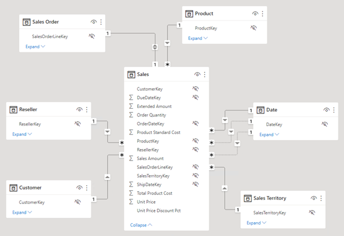

    이 모델은 여섯 개의 차원 테이블과 한 개의 팩트 테이블로 구성됩니다. **Sales** 팩트 테이블에는 판매 주문 세부 정보가 저장됩니다. 이 테이블은 표준 별모양 스키마 디자인입니다.**

3. **Date** 테이블과 **Sales** 테이블 간에는 3가지 관계가 있습니다.

    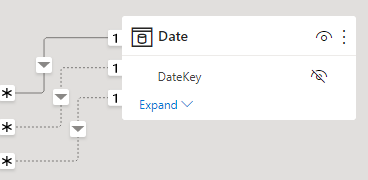

    **Date** 테이블의 **DateKey** 열은 관계의 “한가지” 측면을 나타내는 고유한 열입니다. **Date** 테이블의 열에 적용된 필터는 관계 중 하나를 사용하여 **Sales** 테이블에 전파됩니다.**

4. 각각의 세 가지 관계 위에 커서를 놓아 **Sales** 테이블의 “여러” 측면 열을 강조 표시합니다.

5. **OrderDateKey** 열에 대한 관계는 실선이고 다른 관계는 점선으로 표시됩니다.

    실선은 활성 관계를 나타냅니다. 두 모델 테이블 사이에는 활성 관계 경로가 하나만 있을 수 있으며 이 경로는 기본적으로 테이블 간에 필터를 전파하는 데 사용됩니다. 반대로 점선은 비활성 관계를 나타냅니다. 비활성 관계는 DAX 수식에서 명시적으로 호출되는 경우에만 사용됩니다.**

    현재 모델 디자인은 **Date** 테이블이 롤플레잉 차원임을 나타냅니다. 이 차원은 주문 날짜, 기한 또는 배송 날짜의 역할을 수행할 수 있는데, 보고서의 분석 요구 사항에 따라 달라지는 역할입니다.**

    이 랩에서는 롤플레잉 차원을 지원하도록 모델을 디자인하는 방법을 알아봅니다.**

### 날짜 데이터 시각화

이 작업에서는 날짜별로 판매 데이터를 시각화하고 관계의 활성 상태를 전환합니다.

1. **보고서** 보기로 전환합니다.

    

2. 테이블 시각적 개체를 추가하려면 **시각화** 창에서 **테이블** 시각적 개체 아이콘을 선택합니다.

    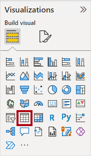

3. 테이블 시각적 **** 개체에 열을 추가하려면 데이터 창(오른쪽에 있음)에서 먼저 날짜** 테이블을 확장**합니다.

    

4. **Fiscal Year** 열을 끌어 테이블 시각적 개체에 놓습니다.

    

5. **Sales** 테이블을 열고 **Sales Amount** 열을 테이블 시각적 개체로 끌어서 놓습니다.

    

6. 테이블 시각적 개체를 검토합니다.

    

    테이블 시각적 개체는 연도별로 그룹화된 **Sales Amount** 열의 합계를 보여줍니다. 그러나 **Fiscal Year**는 무엇을 의미합니까? **OrderDateKey** 열에 **Date** 테이블과 **Sales** 테이블 간에 활성 관계가 있으므로 **Fiscal Year**는 주문이 이루어진 회계 연도를 의미합니다.**

    회계 연도를 명확히 하려면 시각적 개체 필드의 이름을 바꾸거나 시각적 개체에 제목을 추가하는 것이 좋습니다.**

7. 테이블 시각적 개체에 대한 **시각화** 창의 **값** 웰 내부에서 아래쪽 화살표를 선택한 다음 **이 시각적 개체 이름 바꾸기**를 선택합니다.

    

8. 텍스트를 **Order Year**로 바꾸고 **Enter**를 누릅니다.

    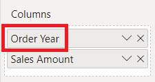

    *참고: 이름을 두 번 클릭하여 시각적 필드의 이름을 더 빠르게 바꿀 수 있습니다.*

9. 테이블 시각적 열 머리글이 새 이름으로 업데이트됩니다.

    

### 관계의 활성 상태 수정

이 작업에서는 두 관계의 활성 상태를 수정합니다.

1. **모델링** 리본에서 **관계 관리**를 선택합니다.

    

2. **관계 관리** 창에서 **OrderDateKey** 열(목록의 세 번째 항목)에 대한 **Sales** 테이블과 **Date** 테이블 간의 관계에 대해 **활성** 확인란의 선택을 취소합니다.

    

3. **ShipDateKey** 열(목록의 마지막 항목)의 **Sales** 테이블과 **Date** 테이블 간의 관계에 대한 **활성** 확인란을 선택합니다.

    

4. **닫기**를 선택합니다.

    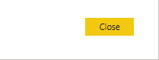

    이러한 구성은 **Date** 테이블과 **Sales** 테이블 간의 활성 관계를 **ShipDateKey** 열로 전환했습니다.**

5. 이제 배송 연도별로 그룹화된 판매액을 보여주는 테이블 시각적 개체를 검토합니다.

    

6. 첫 번째 열의 이름을 **Ship Year**로 바꿉니다.

    

    일부 주문이 아직 배송되지 않았기 때문에 첫 번째 행은 빈 그룹을 나타냅니다. 즉, **Sales** 테이블의 **ShipDateKey** 열의 값이 BLANK입니다.**

7. **관계 관리** 창에서 다음 단계를 사용하여 **OrderDateKey** 관계를 다시 활성으로 되돌립니다.

    - **관계 관리** 대화 상자를 엽니다.

    - **ShipDateKey** 관계(목록의 마지막 항목)에 대해 **활성** 확인란을 선택 취소합니다.

    - **OrderDateKey** 관계(목록의 세 번째 항목)에 대해 **활성** 확인란을 선택합니다.

    - **관계 관리** 창을 닫습니다.

    - 테이블 시각적 개체의 첫 번째 시각적 개체 필드 이름을 **Order Year**로 바꿉니다.

    

    다음 연습에서는 DAX 수식에서 관계를 활성화하는 방법을 알아봅니다.**

## 비활성 관계 사용

이 연습에서는 DAX 수식에서 관계를 활성화하는 방법을 알아봅니다.

### 비활성 관계 사용

이 작업에서는 USERELATIONSHIP 함수를 사용하여 비활성 관계를 활성화합니다.

1. 데이터 창에서 Sales** 테이블을 마우스 오른쪽 단추로 **클릭한 다음 새 측정값**을 선택합니다**.** ** 

    

2. 리본 아래에 있는 수식 입력줄에서 텍스트를 다음 측정값 정의로 바꾼 다음 **Enter** 키를 누릅니다.

    ```DAX
    Sales Shipped =
    CALCULATE (
    SUM ( 'Sales'[Sales Amount] ),
    USERELATIONSHIP ( 'Date'[DateKey], 'Sales'[ShipDateKey] )
    )
    ```

    이 수식은 CALCULATE 함수를 사용하여 필터 컨텍스트를 수정합니다. 이 계산을 위해 USERELATIONSHIP 함수가 **ShipDateKey** 관계를 활성화합니다.**

3. **측정값 도구** 상황별 리본의 **서식** 그룹에서 소수 자릿수를 **2**로 설정합니다.

    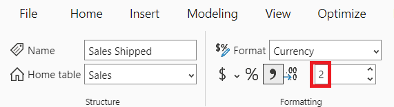

4. 테이블 시각적 개체에 **Sales Shipped** 측정값을 추가합니다.

    

5. 모든 열이 전부 표시되도록 테이블 시각적 개체를 확대합니다.

    

    일시적으로 관계를 활성으로 설정하는 측정값을 만드는 것은 역할 재생 차원을 사용하는 한 가지 방법입니다. 그러나 많은 측정값에 대한 롤플레잉 버전을 만들어야 하는 경우 번거로워질 수 있습니다. 예를 들어 판매 관련 측정값이 10개이고 롤플레잉 날짜가 3개인 경우 30개의 측정값을 만들어야 함을 의미할 수 있습니다. 계산 그룹을 사용하여 만들면 프로세스가 더 쉬워질 수 있습니다.**

    또 다른 방법은 각 롤플레잉 차원에 대해 다른 모델 테이블을 만드는 것입니다. 이 방법은 다음 연습에서 수행해 보겠습니다.**

6. 테이블 시각적 개체에서 측정값을 제거하려면 **시각화** 창의 **값** 웰 내부에서 **Sales Shipped** 필드에 해당하는 **X**를 누릅니다.

    

## 다른 날짜 테이블 추가

이 연습에서는 배송 날짜 분석을 지원하기 위해 날짜 테이블을 추가합니다.

### 비활성 관계 제거

이 작업에서는 **ShipDateKey** 열에 대한 기존 관계를 제거합니다.

1. **모델** 보기로 전환합니다.

    

2. 모델 다이어그램에서 **ShipDateKey** 관계를 마우스 오른쪽 단추로 클릭한 다음 **삭제**를 선택합니다.

    

3. 삭제를 확인할지 묻는 메시지가 표시되면 **예**를 선택합니다.

    관계를 삭제하면 **Sales Shipped** 측정값에 오류가 발생합니다. 이 랩의 뒷부분에서 측정값 수식을 다시 작성할 것입니다.**

### 관계 옵션을 사용하지 않도록 설정

이 작업에서는 두 가지 관계 옵션을 사용하지 않도록 설정합니다.

1. **파일** 리본 탭에서 **옵션 및 설정**을 선택한 다음 **옵션**을 선택합니다.

    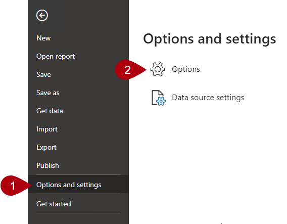

2. **옵션** 창의 왼쪽 아래에 있는 **CURRENT FILE** 그룹에서 **데이터 로드**를 선택합니다.

    

3. **관계** 섹션에서 사용하도록 설정된 두 옵션을 선택 취소합니다.

    

    일반적으로 일상적인 작업에서는 이러한 옵션을 사용하도록 설정하는 것이 좋습니다. 그러나 이 랩을 진행하기 위해 여기서는 명시적으로 관계를 만듭니다.**

4. **확인**을 선택합니다.

    

### 다른 날짜 테이블 추가

이 작업에서는 모델에 다른 날짜 테이블을 추가하는 쿼리를 만듭니다.

1. 홈 리본 탭의 ****쿼리** 그룹 내에서 데이터** 변환 아이콘을 **선택하여 Power Query 편집기** 엽니다**.**

    

    *연결 **방법을 지정하라는 메시지가 표시되면 자격 증명**을 편집합니다.*

    

    *Windows의 기본 연결 설정에 "내 현재 자격 증명 사용"**을 그대로 두고 커넥트**.*

     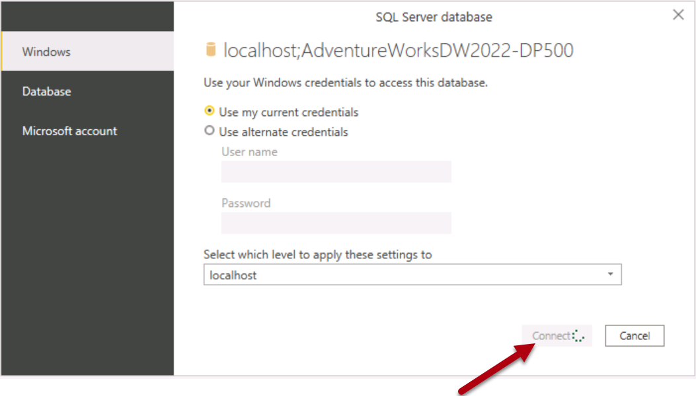*선택 **예**, 경고 메시지를 닫습니다.*

2. **Power Query 편집기** 창의 (왼쪽에 있는) **쿼리** 창에서 **Date** 쿼리를 마우스 오른쪽 단추로 클릭한 다음 **참조**를 선택합니다.

    

    참조 쿼리는 다른 쿼리를 원본으로 사용하는 쿼리입니다. 따라서 이 새 쿼리는 **Date** 쿼리에서 날짜를 가져옵니다.**

3. (오른쪽에 있는) **쿼리 설정** 창의 **이름** 상자에서 텍스트를 **Ship Date**로 바꿉니다.

    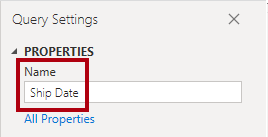

4. **DateKey** 열의 이름을 바꾸려면 **DateKey** 열 머리글을 두 번 클릭합니다.

5. 텍스트를 **ShipDateKey**로 바꾸고 **Enter**를 누릅니다.

    

6. 또한 **Fiscal Year** 열의 이름을 **Ship Year**로 바꿉니다.

    *가능하면 모든 열의 이름을 변경하여 그들이 플레이하는 역할을 설명하는 것이 좋습니다. 이 랩에서는 작업을 단순하게 유지하기 위해 두 개의 열만 이름을 바꿉니다.*

7. 테이블을 모델로 로드하려면 **홈** 리본 탭에서 **닫기&amp;적용** 아이콘을 선택합니다.

    

8. 테이블이 모델에 추가되면 관계를 만들기 위해 **Ship Date** 테이블의 **ShipDateKey** 열을 **Sales** 테이블의 **ShipDateKey** 열로 끌어옵니다.

    

9. 이제 **Ship Date** 테이블과 **Sales** 테이블 사이에 활성 관계가 있습니다.

### 배송 날짜 데이터 시각화

이 작업에서는 새 테이블 시각적 개체에서 배송 날짜 데이터를 시각화합니다.

1. **보고서** 보기로 전환합니다.

    

2. 테이블 시각적 개체를 복제하려면 먼저 시각적 개체를 선택합니다.

3. **홈** 리본 탭의 **클립보드** 그룹 내에서 **복사**를 선택합니다.

    

4. 복사한 시각적 개체를 붙여 넣으려면 **홈** 리본 탭의 **클립보드** 그룹 내에서 **붙여넣기**를 선택합니다.

    팁: **Ctrl+C** 및 **Ctrl+V** 바로 가기를 사용할 수도 있습니다.**

    

5. 새 테이블 시각적 개체를 기존 테이블 시각적 개체의 오른쪽으로 이동합니다.

6. 새 테이블 시각적 개체를 선택한 다음 **시각화** 창의 **값** 웰 내부에서 **Order Year** 필드를 제거합니다.

    

7. **데이터** 창에서 배송 날짜** 테이블을 엽니다**.

8. 새 테이블 시각적 개체에 새 필드를 추가하려면 **Ship Date** 테이블에서 **Ship Year** 필드를 **Sales Amount** 필드 위의 **값** 웰로 끌어옵니다.

    

9. 새 테이블 시각적 개체에 배송 연도별로 그룹화된 판매액이 표시되는지 확인합니다.

    

    이제 모델에는 각각 **Sales** 테이블과 활성 관계가 있는 두 개의 날짜 테이블이 있습니다. 이 디자인 방식의 이점은 유연하다는 것입니다. 이제 각각의 날짜 테이블과 함께 모든 측정값 및 요약 가능한 필드를 사용할 수 있습니다.**

    그러나 몇 가지 단점이 있습니다. 각 롤플레잉 테이블은 더 큰 모델 크기에 기여하지만 차원 테이블은 일반적으로 행 측면에서 크지는 않습니다. 또한 각 롤플레잉 테이블에는 날짜 테이블 표시, 계층 구조 만들기 및 기타 설정과 같은 중복 모델 구성이 필요합니다. 또한 추가 테이블은 엄청난 수의 필드에 영향을 줍니다. 따라서 사용자가 필요한 모델 리소스를 찾기가 더 어려울 수 있습니다.**

    마지막으로, 하나의 시각적 개체에서 필터 조합을 달성할 수 없습니다. 예를 들어 측정값을 만들지 않으면 동일한 시각적 개체로 제공되는 주문 판매액 및 배송 판매액을 결합할 수 없습니다. 다음 연습에서 이러한 측정값을 만듭니다.**

## 다른 관계 함수 살펴보기

이 연습에서는 다른 DAX 관계 함수를 사용합니다.

### 다른 관계 함수 살펴보기

이 작업에서는 CROSSFILTER 및 TREATAS 함수를 사용하여 계산 중에 관계 동작을 수정합니다.

1. 데이터** 창의 **Sales 테이블 내에서 **Sales** Shipped 측정값을 **** 선택합니다.

    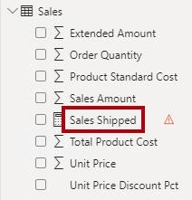

2. 수식 베이스에서 텍스트를 다음 정의로 바꿉니다.

    ```dax
    Sales Shipped =
    CALCULATE (
    SUM ( 'Sales'[Sales Amount] ),
    CROSSFILTER ( 'Date'[DateKey], 'Sales'[OrderDateKey], NONE ),
    TREATAS (
    VALUES ( 'Date'[DateKey] ),
    'Ship Date'[ShipDateKey]
        )
    )
    ```

    이 수식은 CALCULATE 함수 및 수정된 관계 동작을 사용하여 **Sales Amount** 열의 합계를 계산합니다. CROSSFILTER 함수는 **OrderDateKey** 열에 대한 활성 관계를 사용하지 않도록 설정합니다(이 함수는 필터 방향을 수정할 수도 있음). TREATAS 함수는 **ShipDateKey** 열에 상황에 맞는 **DateKey** 값을 적용하여 가상 관계를 만듭니다.**

3. 수정된 **Sales Shipped** 측정값을 첫 번째 테이블 시각적 개체에 추가합니다.

    

4. 첫 번째 테이블 시각적 개체를 검토합니다.

    

5. BLANK 그룹이 없습니다.

    **OrderDateKey** 열에 BLANK가 없으므로 BLANK 그룹이 생성되지 않았습니다. 발송되지 않은 판매액을 표시하려면 다른 방법이 필요합니다.**

### 발송되지 않은 판매액 표시

이 작업에서는 발송되지 않은 판매액을 표시하는 측정값을 만듭니다.

1. 다음 정의를 사용하여 Sales 테이블에서 Sales** Unshipped **** 라는 **측정값을 만듭니다.

    ```DAX
    Sales Unshipped =
    CALCULATE (
    SUM ( 'Sales'[Sales Amount] ),
    ISBLANK ( 'Sales'[ShipDateKey] )
    )
    ```

    이 수식은 **ShipDateKey** 열이 BLANK인 **Sales Amount** 열을 합산합니다.**

2. 측정값의 서식을 소수점 이하 두 자리로 지정합니다.

3. 페이지에 새 시각적 개체를 추가하려면 먼저 보고서 페이지의 빈 영역을 선택합니다.

4. **시각화** 창에서 **카드** 시각적 개체 아이콘을 선택합니다.

    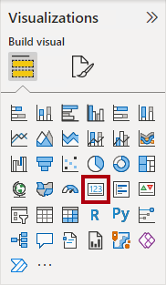

5. **Sales Unshipped** 측정값을 카드 시각적 개체로 끕니다.

    

6. 최종 보고서 페이지 레이아웃이 다음과 같은지 확인합니다.

    

### 완료

연습을 완료하려면 Power BI Desktop을 닫습니다. 파일을 저장할 필요가 없습니다.
