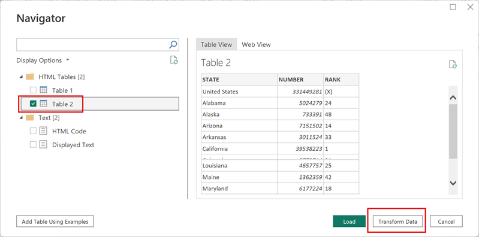
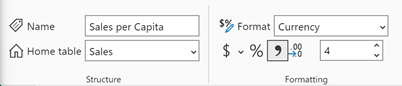

---
lab:
  title: 재사용 가능한 Power BI 자산 만들기
  module: Create reusable Power BI assets
---

# 재사용 가능한 Power BI 자산 만들기

이 연습에서는 의미 체계 모델 및 보고서 개발을 지원하기 위해 재사용 가능한 에셋을 만듭니다. 이러한 자산에는 Power BI 프로젝트 및 템플릿 파일과 공유 의미 체계 모델이 포함됩니다. 마지막에는 이러한 항목이 Power BI 서비스에서 서로 어떻게 관련되어 있는지 계보 보기를 통해 살펴봅니다.

   > 참고: 이 연습에서는 Fabric 라이선스가 필요하지 않으며 Power BI 또는 Microsoft Fabric 환경에서 완료할 수 있습니다.

이 연습을 완료하는 데 약 **30**분 정도 소요됩니다.

## 시작하기 전에

이 연습을 시작하려면 먼저 웹 브라우저를 열고 다음 URL을 입력하여 zip 폴더를 다운로드해야 합니다.

`https://github.com/MicrosoftLearning/mslearn-fabric/raw/refs/heads/main/Allfiles/Labs/16b/16-reusable-assets.zip`

해당 폴더를 **C:\Users\Student\Downloads\16-reusable-assets** 폴더에 압축을 풉니다.

## Power BI 서비스에 보고서 게시

이 작업에서는 기존 보고서를 사용하여 다른 보고서를 개발하는 데 재사용할 수 있는 공유 의미 체계 모델을 만듭니다.

1. 웹 브라우저에서 Fabric 서비스([https://app.fabric.microsoft.com](https://app.fabric.microsoft.com))로 이동하여 로그인합니다.
1. Power BI 환경으로 이동하여 원하는 고유한 이름으로 새 작업 영역을 만듭니다.

    

1. 새 작업 영역의 상단 리본에서 **업로드 > 찾아보기**를 선택합니다.
1. 새 파일 탐색기 대화 상자에서 시작 *.pbix* 파일로 이동하여 선택하고 **열기**를 선택하여 업로드합니다.
1. 이제 작업 영역에 이름이 같은 두 개의 서로 다른 항목이 생겼음을 알 수 있습니다.

    - 보고서
    - 의미 체계 모델

1. 보고서를 열고 사용된 색 테마를 확인합니다. *이후 작업에서 이를 변경합니다.*
1. 이제 웹 브라우저를 닫을 수 있습니다.

> Power BI *.pbix* 파일에는 의미 체계 모델과 보고서 시각적 개체가 모두 포함되어 있습니다. 서비스에 보고서를 게시하면 이러한 항목이 분리됩니다. 이러한 분리는 나중에 다시 볼 수 있습니다.

## 새 Power BI 프로젝트 만들기

이 작업에서는 게시된 의미 체계 모델에 연결하여 보고서를 만들고 이를 Power BI 프로젝트 파일(*.pbip*)로 저장합니다. Power BI 프로젝트 파일은 소스 제어와 함께 작동하는 플랫 파일에 보고서 및 의미 체계 모델 세부 정보를 저장합니다. Visual Studio Code를 사용하여 이러한 파일을 수정하거나 Git을 사용하여 변경 사항을 추적할 수 있습니다.

1. 데스크톱에서 Power BI Desktop 앱을 열고 빈 보고서를 만듭니다.

    > 메시지가 표시되면 Fabric 서비스에서 사용한 것과 동일한 계정으로 로그인합니다.

1. **파일** > **옵션 및 설정** > **옵션** > **기능 미리 보기**를 선택하고 **TMDL 형식을 사용하여 의미 체계 모델 저장** 옵션과 **확인**을 선택합니다.

    > 이렇게 하면 현재 미리 보기 기능인 TMDL(테이블 형식 모델 정의 언어)을 사용하여 의미 체계 모델을 저장하는 옵션이 사용 설정됩니다.

1. Power BI Desktop을 다시 시작하라는 메시지가 표시되면 연습을 계속하기 전에 다시 시작합니다.

    

1. **다른 이름으로 저장**을 선택하고 파일 이름을 지정할 때 드롭다운 메뉴에서 화살표를 선택하여 파일 형식을 선택합니다.
1. **.pbip** 파일 확장자를 선택한 다음, 보고서의 이름을 선택하고 기억할 수 있는 폴더에 저장합니다.

    

1. Power BI Desktop 창 상단에서 보고서 이름 옆에 **(Power BI 프로젝트)** 가 표시되는 것을 확인합니다.
1. 홈 리본에서 **데이터 가져오기 > Power BI 의미 체계 모델**로 이동하여 게시된 의미 체계 모델에 연결합니다.

    

1. 연결되면 데이터 창에 9개의 테이블이 표시됩니다.
1. 파일을 다시 **저장**합니다.

### Power BI 프로젝트 파일 세부 정보 검토

Power BI Desktop의 변경 사항이 .tmdl 파일에 어떻게 반영되는지 살펴보겠습니다.

1. 데스크톱에서 파일 탐색기를 사용하여 **.pbip** 파일을 저장한 폴더로 이동합니다.
1. 다음 항목이 표시됩니다.

    - YourReport.pbip 파일
    - YourReport.Report 폴더
    - YourReport.SemanticModel 폴더
    - .gitignore Git 소스 파일 무시

## 보고서에 새 테이블 추가

이 작업에서는 의미 체계 모델에 필요한 데이터가 모두 포함되어 있지 않으므로 새 테이블을 추가합니다.

1. Power BI Desktop에서 **데이터 가져오기 > 웹**으로 이동하여 새 데이터를 추가합니다.
1. DirectQuery 연결이 필요하다는 메시지가 표시됩니다. **로컬 모델 추가**를 선택하여 계속 진행합니다.
1. 새 대화 상자에 선택할 수 있는 데이터베이스와 테이블이 표시됩니다. 모두 선택하고 **제출**합니다.

    > 의미 체계 모델은 SQL Server Analysis Server 데이터베이스로 취급되고 있습니다.

1. 웹 연결 대화 상자가 됩니다. 기본 라디오 단추를 선택한 상태로 유지합니다. URL 경로로 다음 파일 경로를 입력합니다.

    `C:\Users\Student\Downloads\16-reusable-assets\us-resident-population-estimates-2020.html`

1. **HTML 테이블 > 테이블 2** 상자를 선택한 다음 **데이터 변환**을 선택하여 계속 진행합니다.

    

1. 테이블 2 데이터 미리 보기와 함께 새 Power Query 편집기 창이 열립니다.
1. **테이블 2**의 이름을 *미국 인구*로 변경합니다.
1. STATE 이름을 **상태**로, NUMBER 이름을 **인구**로 변경합니다.
1. RANK 열을 제거합니다.
1. **닫기 및 적용**을 선택하여 변환된 데이터를 의미 체계 모델에 로드합니다.
1. *잠재적 보안 위험*에 대한 대화 상자가 표시되면 **확인**을 선택합니다.
1. 파일을 **저장**합니다.
1. 메시지가 표시되면 Power BI 보고서 향상된 형식으로 **업그레이드하지 않음**을 선택합니다.

### Power BI 프로젝트 파일 세부 정보 검토

이 작업에서는 Power BI Desktop에서 보고서를 변경하고 플랫 .tmdl 파일에서 변경 사항을 확인합니다.

1. 파일 탐색기에서 ***YourReport*.SemanticModel** 파일 폴더를 찾습니다.
1. 정의 폴더를 열고 다양한 파일을 확인합니다.
1. 메모장에서 **relationships.tmdl** 파일을 열면 9개의 관계가 나열되어 있는 것을 확인할 수 있습니다.  파일을 닫습니다.
1. Power BI Desktop으로 돌아가서 리본의 **모델링** 탭으로 이동합니다.
1. **관계 관리**를 선택하면 9개의 관계가 표시됩니다.
1. 다음과 같이 새 관계를 만듭니다.
    - **출처**: 주-도를 키 열로 사용하는 재판매인
    - **대상**: 주를 키 열로 사용하는 
    - **카디널리티**: 다대일(*:1)
    - **교차 필터 방향**: 모두

    

1. 파일을 **저장**합니다.
1. **relationships.tmdl** 파일을 다시 확인하면 새 관계가 추가된 것을 확인할 수 있습니다.

> 플랫 파일의 이러한 변경 사항은 바이너리 파일인 *.pbix* 파일과 달리 소스 제어 시스템에서 추적할 수 있습니다.

## 보고서에 측정값 및 시각적 개체 추가

이 작업에서는 측정값과 시각적 개체를 추가하여 의미 체계 모델을 확장하고 시각적 개체에서 측정값을 사용합니다.

1. Power BI Desktop에서 데이터 창으로 이동하여 판매 테이블을 선택합니다.
1. 상황에 맞는 테이블 도구 리본에서 **새 측정값**을 선택합니다.
1. 수식 표시줄에서 다음 코드를 입력하고 커밋합니다.

    ```DAX
    Sales per Capita =
    DIVIDE(
        SUM(Sales[Sales]),
        SUM('US Population'[Population])
    )
    ```

1. 새 **1인당 판매** 측정값을 찾아 캔버스로 끌어옵니다.
1. **판매 \| 판매**, **미국 인구 \|주**, **미국 인구 \| 인구** 필드를 동일한 시각적 개체로 끌어옵니다.

   > 랩에서는 약식 표기법을 사용하여 필드를 참조합니다. 다음과 같이 표시됩니다. **Sales \| Unit Price**. 이 예에서 **Sales**는 테이블 이름이고 **Unit Price**는 필드 이름입니다.

1. 시각적 개체를 선택하고 **테이블**로 변경합니다.
1. 1인당 판매 및 인구 데이터의 서식이 일관되지 않은 것을 확인할 수 있습니다.
1. 데이터 창에서 각 필드를 선택하고 형식과 소수점 이하 자릿수를 변경합니다.
    - 1인당 판매: 통화 \| 소수점 이하 4자리
    - 인구: 정수 \| 쉼표로 구분된 \| 소수점 이하 0자리

    

    > 팁: 실수로 잘못된 테이블에 측정값을 만든 경우 이전 이미지에 표시된 것처럼 홈 테이블을 쉽게 변경할 수 있습니다.

1. 파일을 저장합니다.

> 표는 4개의 열과 올바른 형식의 숫자가 있는 다음 이미지와 같아야 합니다.


## Power BI 템플릿(.pbit) 파일 구성

이 작업에서는 다른 사람들과 가벼운 파일을 공유하여 더 나은 협업을 할 수 있도록 템플릿 파일을 만들 것입니다.

1. Power BI Desktop의 리본에서 삽입 탭으로 이동하여 **이미지**를 선택합니다. 다운로드 폴더로 이동하여 `AdventureWorksLogo.jpg` 파일을 선택합니다.
1. 이 이미지를 왼쪽 상단에 배치합니다.
1. 새 시각적 개체를 선택하고 **판매 \| 이익 ** 및 **제품 \| 범주**를 추가합니다.

    > 다음 스크린샷에는 도넛형 차트를 사용했습니다.

    

1. 범례에 4가지 색상이 있다는 것을 알 수 있습니다.
1. 리본의 **보기** 탭으로 이동합니다.
1. **테마** 옆의 화살표를 선택하여 확장하고 모든 선택 항목을 확인합니다.
1. 이 보고서에 적용하려면 **액세스할 수 있는 테마** 중 하나를 선택합니다.

    > 이러한 테마는 보고서 뷰어의 접근성을 높이기 위해 특별히 만들어졌습니다.

1. 테마를 다시 확장하고 **현재 테마 사용자 지정**을 선택합니다.

    

1. 사용자 지정 테마 창에서 **텍스트** 탭으로 이동합니다. 각 섹션의 글꼴 패밀리를 Segoe UI 글꼴로 변경합니다.

    

1. 변경 사항이 완료되면 **적용**합니다.
1. 새 테마가 적용된 시각적 개체의 다른 색을 확인합니다.

    

1. **파일 > 다른 이름으로 저장**을 선택하여 *.pbit* 파일을 만듭니다.
1. 파일 형식을 *.pbit*로 변경하고 *.pbip* 파일과 같은 위치에 저장합니다.
1. 사용자가 이 템플릿을 사용할 때 기대할 수 있는 기능에 대한 설명을 입력하고 확인을 선택합니다.
1. 파일 탐색기로 돌아가서 *.pbit* 파일을 열면 *.pbip* 파일과 동일하게 보이는지 확인합니다.

    > 이 연습에서는 의미 체계 모델이 없는 표준 보고서 테마 템플릿만 필요합니다.

1. 동일한 새 파일에서 캔버스에 있는 시각적 개체 두 개를 삭제합니다.
1. 홈 리본에서 **데이터 변환**을 선택합니다.
1. Power Query 편집기에서 **미국 인구** 쿼리를 선택하고 마우스 오른쪽 단추로 클릭하여 삭제합니다.
1. 리본에서 데이터 원본 설정을 선택하고 **DirectQuery to AS - Power BI 의미 체계 모델** 데이터 원본을 삭제한 다음 **닫기**를 선택합니다.
1. **닫기 및 적용**
1. 테마로 돌아가서 수정되고 액세스할 수 있는 테마가 보고서에 계속 적용되는지 확인합니다.
1. 데이터 창에는 *아직 데이터를 로드하지 않음*이라는 메시지가 표시됩니다.
1. **다른 이름으로 저장**을 선택하고 이전에 사용한 이름과 동일한 이름으로 *.pbit* 파일을 저장하여 파일을 덮어씁니다.
1. 제목 없는 파일은 저장하지 않고 닫습니다. 다른 *.pbip* 파일은 여전히 열려 있어야 합니다.

> 이제 미리 로드된 데이터 없이 일관된 테마의 템플릿이 생겼습니다.

## 자산 게시 및 탐색

이 작업에서는 Power BI 프로젝트 파일을 게시하고 서비스에서 계보 보기를 사용하여 관련 항목을 살펴봅니다.

> 중요: HTML 데이터 원본을 추가할 때 로컬 DirectQuery 모델을 만들었습니다. 게시된 보고서에는 온-프레미스 데이터에 액세스하기 위한 게이트웨이가 필요하므로 오류가 발생합니다. 이 작업의 가치에는 영향을 미치지 않지만 혼란스러울 수 있습니다.

1. Power BI 프로젝트 파일에서 **게시**를 선택합니다.
1. 메시지가 표시되면 파일을 **저장**합니다.
1. 메시지가 표시되면 *PBIR* 버전을 **업그레이드하지 않습니다**.
1. 이 연습의 시작 부분에 만든 작업 영역을 선택합니다.
1. 파일이 게시되었지만 연결이 끊어졌다는 메시지가 표시되면 Power BI에서 **'YourReport.*.pbip*' 열기**를 선택합니다.

    

1. 작업 영역에 있으면 이전 의미 체계 모델 및 보고서와 새 의미 체계 모델 및 보고서를 볼 수 있습니다.
1. 작업 영역 설정 아래 오른쪽 모서리에서 **계보 보기**를 선택하여 새 보고서가 다른 데이터 원본에 어떻게 의존하는지 확인합니다.

    

> 의미 체계 모델이 다른 의미 체계 모델과 관련된 경우 이를 이라고 합니다. 이 랩에서 시작 의미 체계 모델은 새로 만든 의미 체계 모델에 연결되어 특수 용도로 다시 사용할 수 있습니다.

## 정리

이 연습을 성공적으로 완료했습니다. Power BI 프로젝트 및 템플릿 파일과 특수 의미 체계 모델 및 보고서를 만들었습니다. 작업 영역 및 모든 로컬 자산을 안전하게 삭제할 수 있습니다.
