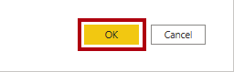
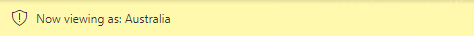
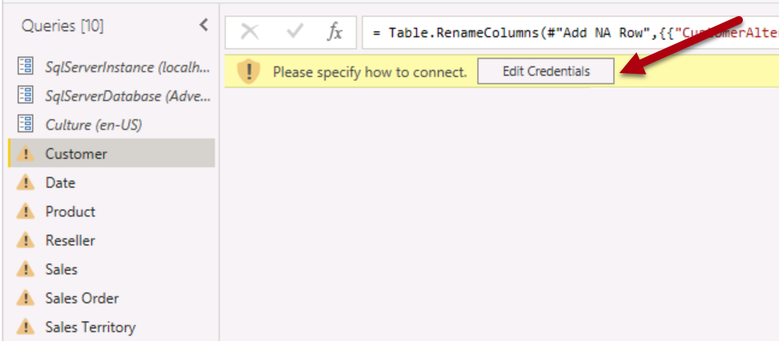
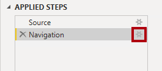

---
lab:
  title: 의미 체계 모델 보안 적용
  module: Design and build tabular models
---

# 모델 보안 강화

이 연습에서는 미리 개발된 데이터 모델을 업데이트하여 보안을 적용합니다. 특히 Adventure Works 회사의 영업 사원은 할당된 판매 지역과 관련된 판매 데이터만 볼 수 있어야 합니다.

이 연습에서는 다음 작업을 수행하는 방법을 알아봅니다.

- 정적 역할을 만듭니다.
- 동적 역할을 만듭니다.
- 역할을 확인합니다.
- 보안 주체를 의미 체계 모델 역할에 매핑합니다.

이 랩을 완료하는 데 약 **45** 분이 걸립니다.

> **참고**: 이 연습을 완료하려면 [Microsoft Fabric 평가판](https://learn.microsoft.com/fabric/get-started/fabric-trial)이 필요합니다.

## 시작하기

이 연습에서는 환경을 준비합니다.

### Power BI 시작 파일 다운로드

1. [판매 분석 시작 파일을](https://aka.ms/fabric-security-starter) `https://aka.ms/fabric-security-starter` 다운로드하여 로컬 컴퓨터(모든 폴더)에 저장합니다.

1. 다운로드한 파일로 이동하여 Power BI Desktop에서 엽니다.

1. 메시지가 표시되면 회사 또는 학교 계정으로 로그인합니다.

### Power BI 서비스에 로그인

이 작업에서는 Power BI 서비스에 로그인하고, 평가판 라이선스를 시작하여 작업 영역을 만듭니다.

1. 웹 브라우저에서 `https://app.powerbi.com/`로 이동합니다.

2. Power BI Desktop에서 사용되는 것과 동일한 계정으로 로그인 프로세스를 완료합니다.

    중요: Power BI Desktop에서 로그인하는 데 사용한 것과 동일한 자격 증명을 사용해야 합니다.**

    팁: Power BI 웹 브라우저 환경은 **Power BI 서비스**라고 알려져 있습니다.**

### 작업 영역 만들기

이 작업에서는 작업 영역을 만듭니다.

1. Power BI 서비스 작업 영역을 **만들려면 탐색** 창(왼쪽)에서 작업 영역을** 선택한 **다음 + 새 작업 영역을** 선택합니다**.

2. 오른쪽**에 **있는 작업 영역** 만들기 창의 이름** 상자에 작업 영역의 이름을 입력합니다.

    작업 영역 이름은 테넌트 내에서 고유해야 합니다.**

3. **적용**을 선택합니다.

    *일단 만들어지면 작업 영역이 열립니다. 이후 연습에서는 이 작업 영역에 의미 체계 모델을 게시합니다.*

### 데이터 모델 검토

이 작업에서는 데이터 모델을 검토합니다.

1. Power BI Desktop의 왼쪽에서 **모델** 보기로 전환합니다.

    

2. 모델 다이어그램을 사용하여 모델 디자인을 검토합니다.

    

    이 모델은 여섯 개의 차원 테이블과 한 개의 팩트 테이블로 구성됩니다. **Sales** 팩트 테이블에는 판매 주문 세부 정보가 저장됩니다. 표준 별모양 스키마 디자인입니다.**

3. **Sales Territory** 테이블을 확장하여 엽니다.

    

4. 테이블에 **Region** 열이 포함되어 있습니다.

    **Region** 열에는 Adventure Works 판매 지역이 저장됩니다. 이 조직에서는 영업 사원이 할당된 판매 지역과 관련된 데이터만 볼 수 있습니다. 이 랩에서는 데이터 권한을 적용하는 두 가지 행 수준 보안 기술을 구현합니다.**

## 정적 역할 만들기

이 연습에서는 정적 역할을 만들고 유효성을 검사한 다음 보안 주체를 의미 체계 모델 역할에 매핑하는 방법을 확인합니다.

### 정적 역할 만들기

이 작업에서는 두 개의 정적 역할을 만듭니다.

1. **보고서** 보기로 전환합니다.

    

2. 누적 세로 막대형 차트 시각적 개체의 범례에서는 현재 여러 지역을 볼 수 있습니다.

    

    지금은 차트가 지나치게 복잡해 보이는데, 이는 모든 지역이 표시되기 때문입니다. 솔루션이 행 수준 보안을 적용하면 보고서 소비자는 한 지역만 볼 수 있습니다.**

3. 보안 역할을 추가하려면 **모델링** 리본 탭의 **보안** 그룹 내에서 **역할 관리**를 선택합니다.

    

4. **역할 관리** 창에서 **만들기**를 선택합니다.

    

5. 역할의 이름을 지정하려면 선택한 텍스트를 **Australia**로 바꾼 다음 **Enter** 키를 누릅니다.

    

6. **테이블** 목록에서 **Sales Territory** 테이블에 해당하는 줄임표를 선택한 다음 **필터 추가** > **[Region]** 을 선택합니다.

    

7. **테이블 필터 DAX 식** 상자에서 **Value**를 **Australia**로 바꿉니다.

    

    이 식은 **Region** 열을 값 **Australia**로 필터링합니다.**

8. 다른 역할을 만들려면 **만들기**를 누릅니다.

    

9. 이 작업의 단계를 반복하여 **Canada**를 기준으로 **Region** 열을 필터링하는 **Canada**라는 역할을 만듭니다.

    

    이 랩에서는 역할을 두 개만 만듭니다. 그러나 실제 솔루션에서는 11개 Adventure Works 지역 각각에 대한 역할을 만들어야 합니다.**

10. **저장**을 선택합니다.

    

### 정적 역할의 유효성 검사

이 작업에서는 정적 역할 중 한 가지 역할의 유효성을 검사합니다.

1. **모델링** 리본 탭의 **보안** 그룹 내에서 **표시 방법**을 선택합니다.

    

2. **역할로 보기** 창에서 **Australia** 역할을 선택합니다.

    

3. **확인**을 선택합니다.

    

4. 보고서 페이지에서 누적 세로 막대형 차트 시각적 개체가 오스트레일리아에 대한 데이터만 표시합니다.

    

5. 보고서 위쪽에서 적용된 역할을 확인하는 노란색 배너가 있습니다.

    

6. 역할을 사용하여 보기를 중지하려면 노란색 배너 오른쪽에서 **보기 중지**를 선택합니다.

    

### 보고서 게시

이 태스크에서는 보고서를 게시합니다.

1. Power BI Desktop 파일을 저장합니다. 보류 중인 변경 내용을 적용하라는 메시지가 표시되면 나중에** 적용을 선택합니다**.

    

2. 보고서를 게시하려면 **홈** 리본 탭에서 **게시**를 선택합니다.

    

3. **Power BI에 게시** 창에서 작업 영역을 선택한 다음, **선택**을 선택합니다.

    

4. 게시에 성공하면 **가져오기**를 선택합니다.

    

### 행 수준 보안 구성(*선택 사항*)

이 작업에서는 Power BI 서비스에서 행 수준 보안을 구성하는 방법을 살펴봅니다.

이 작업은 작업 중인 테넌트에 **Salespeople_Australia** 보안 그룹이 있는지 여부에 따라 달라집니다. 이 보안 그룹은 테넌트에 자동으로 존재하지 않습니다. 테넌트에 대한 권한이 있는 경우 아래 단계를 수행할 수 있습니다. 교육에서 제공한 테넌트를 사용하는 경우 보안 그룹을 만들 수 있는 적절한 권한이 없습니다. 작업 내용을 읽어보세요. 보안 그룹이 없으면 작업을 완료할 수 없습니다. **읽은 후 정리 작업으로 진행합니다.**

1. Power BI 서비스(웹 브라우저)로 전환합니다.

2. 작업 영역 방문 페이지에서 **판매 분석 - 모델 보안** 의미 체계 모델 적용을 확인합니다.

    

3. 의미 체계 모델 위에 커서를 놓고 줄임표가 나타나면 줄임표를 선택한 다음 보안을** 선택합니다**.

    

    ***보안** 옵션은 보안 그룹 및 사용자를 포함하는 Microsoft Azure AD(Azure Active Director) 보안 주체 매핑을 지원합니다.*

4. 왼쪽에는 역할 목록이 있고 **Australia**가 선택되어 있습니다.

    

5. **멤버** 상자에서 **Salespeople_Australia** 입력을 시작합니다.

    5~8단계는 Salespeople_Australia 보안 그룹의 생성 또는 존재에 따라 달라지기 때문에 데모용으로만 사용됩니다. 보안 그룹을 만들 수 있는 권한과 지식이 있는 경우 자유롭게 진행하세요. 그렇지 않으면 정리 작업을 계속 진행합니다.**

    

6. **추가**를 선택합니다.

    

7. 역할 매핑을 완료하려면 **저장**을 선택합니다.

    

    이제 **Salespeople_Australia** 보안 그룹의 모든 멤버가 **Australia** 역할에 매핑되어 데이터 액세스가 호주 판매만 볼 수 있도록 제한됩니다.**

    실제 솔루션에서 각 역할은 보안 그룹에 매핑되어야 합니다.**

    *이 디자인 접근 방식은 각 지역에 대해 보안 그룹이 있을 때 간단하고 효과적입니다. 그러나 단점이 있습니다. 만들기 및 설정에 더 많은 노력이 필요합니다. 또한 새 지역이 온보딩될 때 의미 체계 모델을 업데이트하고 다시 게시해야 합니다.*

    다음 연습에서는 데이터 기반 동적 역할을 만듭니다. 이 디자인 방식은 이러한 단점을 해결하는 데 도움이 될 수 있습니다.**

8. 작업 영역 방문 페이지로 돌아가려면 **탐색** 창에서 작업 영역을 선택합니다.

### 솔루션 정리

이 작업에서는 의미 체계 모델 및 모델 역할을 제거하여 솔루션을 클린.

1. 의미 체계 모델을 제거하려면 의미 체계 모델 위에 커서를 놓고 줄임표가 나타나면 줄임표를 선택한 다음 삭제**를 선택합니다**.

    

    *다음 연습에서는 수정된 의미 체계 모델을 다시 게시합니다.*

2. 삭제를 확인할지 묻는 프롬프트가 표시되면 **삭제**를 선택합니다.

    

3. Power BI Desktop으로 전환합니다.

4. 보안 역할을 삭제하려면 **모델링** 리본 탭의 **보안** 그룹 내에서 **역할 관리**를 선택합니다.

    

5. **역할 관리** 창에서 첫 번째 역할을 제거하려면 **삭제**를 선택합니다.

    

6. 삭제를 확인하라는 메시지가 표시되면 **예, 삭제합니다**를 누릅니다.

    

7. 또한 두 번째 역할을 제거합니다.

8. **저장**을 선택합니다.

    

## 동적 역할 만들기

이 연습에서는 모델에 테이블을 추가하고, 동적 역할을 만들고 유효성을 검사한 다음, 보안 주체를 의미 체계 모델 역할에 매핑합니다.

### Salesperson 테이블 추가

이 작업에서는 모델에 **Salesperson** 테이블을 추가합니다.

1. **모델** 보기로 전환합니다.

    

2. **홈** 리본 탭의 **쿼리** 그룹 내에서 **데이터 변환**을 선택합니다.

    

    연결 방법을 지정하라는 메시지가 표시되면 **자격 증명 편집**을 클릭하고 로그인 방법을 지정합니다.**

    

    **연결**을 선택합니다.**

     

    ***암호화 지원** 페이지에서 확인을** 선택합니다**.*

3. **Power Query 편집기** 창의 (왼쪽에 있는) **쿼리** 창에서 **Customer** 쿼리를 마우스 오른쪽 단추로 클릭한 다음 **중복**을 선택합니다.

    

    **Customer** 쿼리에는 데이터 웨어하우스를 연결하는 단계가 이미 포함되어 있으므로 복제하는 것이 새 쿼리 개발을 시작하는 효율적인 방법입니다.**

4. 오른쪽에 있는 **쿼리 설정** 창의 **이름** 상자에서 텍스트를 **Salesperson**으로 바꿉니다.

    

5. **적용된 단계** 목록에서 **제거된 다른 열** 단계(세 번째 단계)를 마우스 오른쪽 단추로 클릭한 다음 **끝까지 삭제**를 선택합니다.

    

6. 단계 삭제를 확인하라는 메시지가 표시되면 **삭제**를 선택합니다.

    

7. 다른 데이터 웨어하우스 테이블에서 데이터를 가져오려면 **적용된 단계** 목록의 **탐색** 단계(두 번째 단계)에서 (오른쪽에 있는) 기어 아이콘을 선택합니다.

    

8. **탐색** 창에서 **DimEmployee** 테이블을 선택합니다.

    

9. **확인**을 선택합니다.

    

10. 불필요한 열을 제거하려면 **홈** 리본 탭의 **열 병합** 그룹에서 **열 선택** 아이콘을 선택합니다.

    

11. **열 선택** 창에서 **(모든 열 선택)** 항목을 선택 취소합니다.

    

12. 다음 세 개의 열을 선택합니다.

    - EmployeeKey

    - SalesTerritoryKey

    - EmailAddress

13. **확인**을 선택합니다.

    

14. **EmailAddress** 열의 이름을 바꾸고 **EmailAddress** 열 머리글을 두 번 클릭합니다.

15. 텍스트를 **UPN**으로 바꾸고 **Enter** 키를 누릅니다.

    UPN은 사용자 계정 이름의 약어입니다. 이 열의 값은 Azure AD 계정 이름과 일치합니다.**

    

16. 테이블을 모델로 로드하려면 **홈** 리본 탭에서 **닫기&amp;적용** 아이콘을 선택합니다.

    

17. 모델에 테이블이 추가되면 **Sales Territory** 테이블과의 관계가 자동으로 생성됩니다.

### 관계 구성

이 작업에서는 새 관계의 속성을 구성합니다.

1. **Salesperson** 테이블과 **Sales Territory** 테이블 간의 관계를 마우스 오른쪽 단추로 클릭한 다음 **속성**을 선택합니다.

    

2. **관계 편집** 창의 **교차 필터 방향** 드롭다운 목록에서 **모두**를 선택합니다.

3. **보안 필터 양방향으로 적용** 확인란을 선택합니다.

    

    **Sales Territory** 테이블에서 **Salesperson** 테이블로 일대다 관계가 있으므로 필터는 **Sales Territory** 테이블에서 **Salesperson** 테이블로만 전파됩니다. 다른 방향으로 강제로 전파하려면 교차 필터 방향을 둘 다로 설정해야 합니다.**

4. **확인**을 선택합니다.

    

5. 테이블을 숨기려면 **Salesperson** 테이블의 오른쪽 위에서 눈 모양 아이콘을 선택합니다.

    

    **Salesperson** 테이블의 용도는 데이터 권한을 적용하는 것입니다. 숨겨지면 보고서 작성자와 Q&A 환경에 테이블이나 필드가 표시되지 않습니다.**

### 동적 역할 만들기

이 작업에서는 모델의 데이터에 따라 사용 권한을 적용하는 동적 역할을 만듭니다.

1. **보고서** 보기로 전환합니다.

    

2. 보안 역할을 추가하려면 **모델링** 리본 탭의 **보안** 그룹 내에서 **역할 관리**를 선택합니다.

    

3. **역할 관리** 창에서 **만들기**를 선택합니다.

    

4. 역할의 이름을 지정하려면 선택한 텍스트를 **Salespeople**로 바꿉니다.

    

    이번에는 역할을 하나만 만들어야 합니다.**

5. **Salesperson** 테이블의 **UPN** 열에 필터를 추가합니다.

    

6. **테이블 필터 DAX 식** 상자에서 "값"**을 .로 바`USERPRINCIPALNAME()`꿉**니다.

    

    이 식은 인증된 사용자의 UPN(사용자 계정 이름)을 반환하는 USERPRINCIPALNAME 함수를 사용하여 **UPN** 열을 필터링합니다.**

    UPN은 **Salesperson** 테이블을 필터링할 때 **Sales Territory** 테이블을 필터링하고 이 테이블은 차례로 **Sales** 테이블을 필터링합니다. 이렇게 하면 인증된 사용자에게 할당된 지역에 대한 판매 데이터만 표시됩니다.**

7. **저장**을 선택합니다.

    

### 동적 역할 유효성 검사

이 작업에서는 동적 역할의 유효성을 검사합니다.

1. **모델링** 리본 탭의 **보안** 그룹 내에서 **표시 방법**을 선택합니다.

    

2. **역할**로 보기 창에서 다른 사용자를** 검사 **다음 해당 상자에 다음을 입력`michael9@adventure-works.com`합니다.

    

    테스트를 위해 **다른 사용자**는 USERPRINCIPALNAME 함수에서 반환되는 값입니다. 이 영업 사원은 **북동부** 지역에 할당됩니다.**

3. **Salespeople** 역할을 확인합니다.

    

4. **확인**을 선택합니다.

    

5. 보고서 페이지에서 누적 세로 막대형 차트 시각적 개체가 북동부에 대한 데이터만 표시합니다.

    

6. 보고서 위쪽에서 적용된 역할을 확인하는 노란색 배너가 있습니다.

    

7. 역할을 사용하여 보기를 중지하려면 노란색 배너 오른쪽에서 **보기 중지**를 선택합니다.

    

### 디자인 완료

이 작업에서는 보고서를 게시하고 보안 그룹을 역할에 매핑하여 디자인을 마무리합니다.

이 작업의 단계는 의도적으로 매우 간략하게 설명했습니다. 전체 단계 세부 정보는 이전 연습의 작업 단계를 참조하세요.**

1. Power BI Desktop 파일을 저장합니다.

2. 랩의 시작 시 만든 작업 영역에 보고서를 게시합니다.

3. Power BI Desktop을 닫습니다.

4. Power BI 서비스(웹 브라우저)로 전환합니다.

5. 판매 분석 - 모델 보안 의미 체계 모델 적용에 대한 **보안** 설정으로 이동합니다.

6. **Salespeople** 보안 그룹을 **Salespeople** 역할에 매핑합니다.

    

    이제 **Salespeople** 보안 그룹의 모든 멤버가 **Salespeople** 역할에 매핑됩니다. 인증된 사용자가 **Salesperson** 테이블에 행으로 표시되면 할당된 판매 영역이 판매 테이블을 필터링하는 데 사용됩니다.**

    이 디자인 방식은 데이터 모델이 사용자 계정 이름 값을 저장하는 경우 간단하고 효과적입니다. 영업 사원이 추가 또는 제거되거나 다른 판매 지역에 할당되는 경우 이 디자인 방식은 간단하게 작동합니다.**
