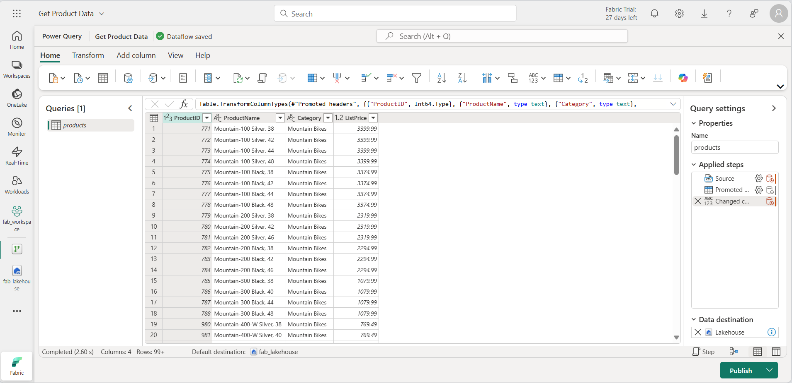

---
lab:
  title: 모니터링 허브에서 패브릭 작업 모니터링
  module: Monitoring Fabric
---

# 모니터링 허브에서 패브릭 작업 모니터링

Microsoft Fabric의 *모니터링 허브*는 활동을 모니터링할 수 있는 중앙 위치를 제공합니다. 모니터링 허브를 사용하여 보기 권한이 있는 항목과 관련된 이벤트를 검토할 수 있습니다.

이 랩을 완료하는 데 약 **30**분이 소요됩니다.

> **참고**: 이 연습을 완료하려면 [Microsoft Fabric 테넌트](https://learn.microsoft.com/fabric/get-started/fabric-trial)에 액세스해야 합니다.

## 작업 영역 만들기

Fabric에서 데이터로 작업하기 전에, Fabric 용량을 사용하도록 설정된 테넌트에서 작업 영역을 만듭니다.

1. [Microsoft Fabric 홈페이지](https://app.fabric.microsoft.com/home?experience=fabric)(`https://app.fabric.microsoft.com/home?experience=fabric`)에서 ** 데이터 엔지니어링**을 선택합니다.
1. 왼쪽 메뉴 모음에서 **작업 영역**을 선택합니다(아이콘은 와 유사함).
1. 선택한 이름으로 새 작업 영역을 만들고 패브릭 용량(*평가판*, *프리미엄* 또는 *패브릭*)이 포함된 **고급** 섹션에서 라이선스 모드를 선택합니다.
1. 새 작업 영역이 열리면 비어 있어야 합니다.

    

## 레이크하우스 만들기

이제 작업 영역이 있으므로 데이터를 위한 데이터 레이크하우스를 만들어야 합니다.

1. **데이터 엔지니어링** 홈페이지에서 원하는 이름의 새 **레이크하우스**를 만듭니다.

    1분 정도 지나면 새 레이크하우스가 만들어집니다.

    

1. 새 레이크하우스를 보고 왼쪽의 **레이크하우스 탐색기** 창을 통해 레이크하우스의 테이블과 파일을 찾아볼 수 있습니다.

    현재 레이크하우스에는 테이블이나 파일이 없습니다.

## 데이터 흐름 만들기 및 모니터링

Microsoft Fabric에서는 데이터 흐름(Gen2)을 사용하여 다양한 원본에서 데이터를 수집할 수 있습니다. 이 연습에서는 데이터 흐름을 사용하여 CSV 파일에서 데이터를 가져와 레이크하우스의 테이블에 데이터를 로드합니다.

1. 레이크하우스의 **홈** 페이지에 있는 **데이터 가져오기** 메뉴에서 **새 데이터 흐름 Gen2**를 선택합니다.

   **데이터 흐름 1**이라는 새 데이터 흐름이 생성되고 열립니다.

    

1. 데이터 흐름 페이지의 왼쪽 상단에서 **데이터 흐름 1**을 선택하여 세부 정보를 확인하고 데이터 흐름의 이름을 **제품 데이터 가져오기**로 변경합니다.
1. 데이터 흐름 디자이너에서 **텍스트/CSV 파일에서 가져오기**를 선택합니다. 다음으로 데이터 가져오기 마법사를 완료하고 익명 인증을 사용하여 `https://raw.githubusercontent.com/MicrosoftLearning/dp-data/main/products.csv`에 연결함으로 데이터 연결을 만듭니다. 마법사를 완료하면 데이터 흐름 디자이너에 다음과 같은 데이터 미리 보기가 표시됩니다.

    

1. 데이터 흐름을 게시합니다.
1. 왼쪽 탐색 모음에서 **모니터**를 선택하여 모니터링 허브를 보고 데이터 흐름이 진행 중인지 확인합니다(그렇지 않은 경우 보기를 새로 고침하여 확인할 때까지 기다립니다).

    

1. 몇 초간 기다린 다음 데이터 흐름의 상태가 **성공**이 될 때까지 페이지를 새로 고침합니다.
1. 탐색 창에서 레이크하우스를 선택합니다. 그런 다음 **테이블** 폴더를 확장하여 데이터 흐름에 의해 **제품**이라는 테이블이 생성되고 로드되었는지 확인합니다(**테이블** 폴더를 새로 고쳐야 할 수 있음).

    

## Spark 노트북 만들기 및 모니터링

Microsoft Fabric에서는 Notebooks을 사용하여 Spark 코드를 실행할 수 있습니다.

1. 탐색 허브에서 **홈**을 선택합니다. 데이터 엔지니어링 홈 페이지에서 새 **Notebook**을 만듭니다.

    **Notebook 1**이라는 새 Notebook이 생성되고 열립니다.

    

1. Notebook 왼쪽 상단에서 **Notebook 1**을 선택해 세부 정보를 확인하고, 이름을 **제품 쿼리**로 변경합니다.
1. Notebook 편집기의 **탐색기** 창에서 **레이크하우스**를 선택하고 이전에 만든 레이크하우스를 추가합니다.
1. **제품** 테이블의 **...** 메뉴에서 **데이터 로드** > **Spark**를 선택합니다. 그러면 다음과 같이 Notebook에 새 코드 셀이 추가됩니다.

    

1. **&#9655; 모두 실행** 버튼을 사용해 Notebook의 모든 셀을 실행합니다. Spark 세션을 시작하는 데 잠시 시간이 소요되며 쿼리 결과가 코드 셀 아래에 표시됩니다.

    

1. 도구 모음에서 **&#9723;**(*세션 중지*) 버튼을 사용하여 Spark 세션을 중지합니다.
1. 탐색 모음에서 **모니터**를 선택해 모니터링 허브를 확인하고 Notebook 활동이 나열되어 있는지 확인합니다.

    

## 항목에 대한 기록 모니터링

작업 영역의 일부 항목은 여러 번 실행될 수 있습니다. 모니터링 허브를 사용하여 실행 기록을 볼 수 있습니다.

1. 탐색 모음에서 작업 영역의 페이지로 돌아갑니다. 그런 다음 **&#8635;**(*지금 새로 고침*) 버튼을 **제품 데이터 가져오기** 데이터 흐름에 사용하여 다시 실행합니다.
1. 탐색 창에서 **모니터** 페이지를 선택하여 모니터링 허브를 보고 데이터 흐름이 진행 중인지 확인합니다.
1. **제품 데이터 가져오기** 데이터 흐름의 **...** 메뉴에서 **실행 기록**을 선택하여 데이터 흐름의 실행 기록을 확인합니다:

    

1. 모든 기록 실행의 **...** 메뉴에서 **세부 정보 보기**를 선택하면 실행의 세부 정보를 볼 수 있습니다.
1. **세부 정보** 창을 닫고 **기본 보기로 돌아가기** 버튼을 사용하여 기본 모니터링 허브 페이지로 돌아갑니다.

## 모니터링 허브 보기 사용자 지정

이 연습에서는 몇 가지 활동만 실행했으므로 모니터링 허브에서 이벤트를 찾는 것은 상당히 쉬운 일입니다. 하지만 실제 환경에서는 수많은 이벤트를 검색해야 할 수도 있습니다. 필터 및 기타 보기 사용자 지정을 사용하면 이 작업을 더 쉽게 수행할 수 있습니다.

1. 모니터링 허브에서 **필터** 버튼을 사용하여 다음 필터를 적용합니다.
    - **상태**: 성공
    - **항목 종류**: 데이터 흐름 Gen2

    필터를 적용하면 데이터 흐름의 성공적인 실행만 나열됩니다.

    

1. **열 옵션** 버튼을 사용하여 보기에 다음 열을 포함합니다(변경 사항을 적용하려면 **적용** 버튼 사용).
    - 작업 이름
    - 상태
    - 항목 유형
    - 시작 시간
    - 제출한 사람
    - 위치
    - 종료 시간
    - 기간
    - 새로 고침 유형

    모든 열을 보려면 가로로 스크롤해야 할 수도 있습니다.

    

## 리소스 정리

이 연습에서는 레이크하우스, 데이터 흐름 및 Spark Notebook을 만들었으며 모니터링 허브를 사용하여 항목 활동을 확인했습니다.

레이크하우스 탐색을 마쳤으면 이 연습을 위해 만든 작업 영역을 삭제할 수 있습니다.

1. 왼쪽 막대에서 작업 영역의 아이콘을 선택하여 포함된 모든 항목을 봅니다.
2. 도구 모음의 **...** 메뉴에서 **작업 영역 설정**을 선택합니다.
3. **일반** 섹션에서 **이 작업 영역 제거**를 선택합니다.
