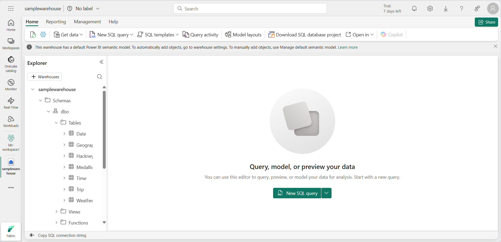

---
lab:
  title: Microsoft Fabric에서 안전한 데이터 액세스
  module: Secure data access in Microsoft Fabric
---

# Microsoft Fabric에서 안전한 데이터 액세스

Microsoft Fabric은 데이터 액세스를 관리하기 위한 다중 계층 보안 모델을 제공합니다. 전체 작업 영역, 개인별 항목 혹은 각 Fabric 엔진의 세분화된 사용 권한을 통해 보안을 설정하실 수 있습니다. 이 연습에서는 작업 영역 및 항목 액세스 제어 및 OneLake 데이터 액세스 역할을 사용하여 데이터를 보호합니다.

이 랩을 완료하는 데 약 **45**분이 소요됩니다.

## 작업 영역 만들기

패브릭에서 데이터를 사용하기 전에 패브릭 평가판을 사용하도록 설정된 작업 영역을 만듭니다.

1. [Microsoft Fabric 홈페이지](https://app.fabric.microsoft.com/home?experience=fabric)(`https://app.fabric.microsoft.com/home?experience=fabric`)에서 **데이터 웨어하우스**를 선택합니다.
1. 왼쪽 메뉴 모음에서 **작업 영역**을 선택합니다(아이콘은 와 유사함).
1. Fabric 용량이 포함된 라이선스 모드(*평가판*, *프리미엄* 또는 *Fabric*)를 선택하여 원하는 이름으로 새 작업 영역을 만듭니다.
1. 새 작업 영역이 열리면 비어 있어야 합니다.

    

> **참고**: 작업 영역을 만들면 자동으로 작업 영역 관리자 역할의 멤버가 됩니다. 

## 데이터 웨어하우스 만들기

그 다음, 생성한 작업 영역에 데이터 웨어하우스를 만듭니다.

1. 데이터 웨어하우스 홈페이지에서 **샘플 웨어하우스** 바로 가기를 선택하여 원하는 이름으로 새 웨어하우스를 만듭니다.  

    1분 정도 지나면 새 웨어하우스가 만들어집니다.

    

## Lakehouse 만들기
그 다음, 생성한 작업 영역에 레이크 하우스를 만듭니다.

1. 왼쪽 메뉴 모음에서 **작업 영역**을 선택합니다(🗇 아이콘과 유사한 모양).
2. 생성한 작업 영역을 선택합니다.
3. 작업 영역에서 **+ 새로 항목** 버튼을 선택한 다음, **레이크하우스**를 선택합니다. 새 레이크하우스를 원하는 이름으로 만듭니다.

   1분 정도 지나면 새 레이크하우스가 만들어집니다.

    

4. **샘플 데이터로 시작** 타일을 선택합니다. 1분 정도 지나면 레이크하우스가 데이터로 채워집니다.

## 작업 영역 액세스 제어 적용

작업 영역 역할은 작업 영역 및 작업 영역 내 콘텐츠에 대한 액세스를 제어하는 데 사용됩니다. 작업 영역 역할은 사용자가 작업 영역에서 모든 항목을 확인해야 하거나, 작업 영역 액세스를 관리하거나, 새 Fabric 항목을 만들어야 하거나, 작업 영역에서 콘텐츠를 보거나 수정하거나 공유할 수 있는 특정 권한이 필요할 때 할당할 수 있습니다.  

이 연습에서는 작업 영역 역할에 사용자를 추가하고, 사용 권한을 적용하고, 각 사용 권한 집합이 적용될 때 볼 수 있는 항목을 확인합니다. 두 개의 브라우저를 열고 다른 사용자로 로그인합니다. 한 브라우저에서는 **작업 영역 관리자**가 되고 다른 브라우저에서는 권한이 낮은 두 번째 사용자로 로그인합니다. 한 브라우저에서 작업 영역 관리자는 두 번째 사용자에 대한 사용 권한을 변경하고 두 번째 브라우저에서는 사용 권한 변경으로 인한 결과를 볼 수 있습니다.  

1. 왼쪽 메뉴 모음에서 **작업 영역**을 선택합니다(아이콘은 와 유사함).
2. 그 다음, 앞에서 만든 작업 영역을 선택합니다.
3. 화면 위쪽 메뉴에서 **액세스 관리**를 선택합니다.

> **참고**: 사용자가 작업 영역을 만들었기 때문에 **작업 영역 관리자** 역할의 멤버인 로그인한 사용자가 표시됩니다. 다른 사용자에게는 아직 해당 작업 영역에 대한 액세스 권한이 할당되지 않았습니다.

4. 다음으로, 해당 작업 영역에 대한 권한이 없는 사용자가 볼 수 있는 항목이 표시됩니다. 브라우저에서 InPrivate 창을 엽니다. Microsoft Edge 브라우저에서 오른쪽 위 모서리에 있는 줄임표를 선택하고 **새 InPrivate 창**을 선택합니다.
5. https://app.fabric.microsoft.com을 입력하고 테스트에 사용하는 두 번째 사용자로 로그인합니다.  
6. 화면의 왼쪽 아래 모서리에서 **Microsoft Fabric**을 선택한 다음, **데이터 웨어하우스**를 선택합니다. 다음으로, **작업 영역**을 선택합니다(&#128455; 아이콘과 유사).  

> **참고:** 두 번째 사용자는 작업 영역에 액세스할 수 없으므로 볼 수 없습니다.

7. 다음으로, 두 번째 사용자에게 **작업 영역 뷰어** 역할을 할당하고 해당 역할이 해당 작업 영역의 웨어하우스 읽기 권한을 부여하는지 확인합니다.  
8. 해당 작업 영역 관리자로 로그인한 브라우저 창으로 돌아, 앞서 만든 작업 영역이 표시된 페이지에 아직도 있는지 확인해야 합니다. 새 작업 영역 항목과 샘플 웨어하우스 및 레이크하우스가 페이지 맨 아래에 나열되어 있어야 합니다.
9. 화면 위쪽 메뉴에서 **액세스 관리**를 선택합니다.
10. **사람 또는 그룹 추가**를 선택합니다. 테스트 중인 두 번째 사용자의 이메일을 입력합니다. **추가**를 선택하여 작업 영역 **뷰어** 역할에 사용자를 할당합니다. 
11. 두 번째 사용자로 로그인한 InPrivate 브라우저 창으로 돌아가 브라우저에서 새로 고침 버튼을 선택하여 두 번째 사용자에게 할당된 세션 사용 권한을 새로 고칩니다.
12. 왼쪽 메뉴 모음에서 **작업 영역** 아이콘(&#128455; 아이콘과 유사)을 선택하고 해당 작업 영역 관리 사용자로 만든 작업 영역 이름을 선택합니다. 이제 두 번째 사용자는 **작업 영역 뷰어** 역할이 할당되었으므로 해당 작업 영역의 모든 항목을 볼 수 있습니다.

    

13. 웨어하우스를 선택하고 엽니다.
14. **날짜** 테이블을 선택하고 행이 로드될 때까지 기다립니다. 작업 영역 뷰어 역할의 멤버로서 웨어하우스 내 테이블에 대한 CONNECT 및 ReadData 사용 권한이 있으므로 행을 볼 수 있습니다. 작업 영역 뷰어 역할에 부여된 사용 권한에 대한 자세한 내용은 [작업 영역 역할](https://learn.microsoft.com/en-us/fabric/data-warehouse/workspace-roles)을 참조합니다.
15. 다음으로, 왼쪽 메뉴 모음에서 **작업 영역** 아이콘을 선택한 다음, 해당 레이크하우스를 선택합니다.
16. 레이크하우스가 열리면 **레이크하우스**라고 쓰여있는 화면의 오른쪽 위 모서리에 있는 드롭다운 상자를 클릭하고 **SQL 분석 엔드포인트**를 선택합니다.
17. **publicholidays** 테이블을 선택하고 데이터가 표시될 때까지 기다립니다. 레이크하우스 테이블의 데이터는 사용자가 SQL 분석 엔드포인트 읽기 권한을 부여하는 작업 영역 뷰어 역할의 멤버이기 때문에 SQL 분석 엔드포인트에서 읽을 수 있습니다.

## 항목 액세스 제어 적용

항목 사용 권한은 웨어하우스, 레이크하우스 및 의미 체계 모델과 같은 작업 영역 내의 개별 Fabric 항목에 대한 액세스를 제어합니다. 이 연습에서는 이전 연습에서 적용된 **작업 영역 뷰어** 권한을 제거한 다음, 권한이 적은 사용자가 레이크하우스 데이터가 아닌 웨어하우스 데이터만 볼 수 있도록 웨어하우스에 대한 항목 수준 권한을 적용합니다.

1. 작업 영역 관리자로 로그인한 브라우저 창으로 돌아가 왼쪽 탐색 창에서 **작업 영역**을 선택합니다. 
2. 앞서 만든 작업 영역을 선택하여 엽니다.
3. 화면 위쪽의 메뉴에서 **액세스 관리**를 선택합니다.
4. 두 번째 사용자의 이름 아래에서 **뷰어**라는 단어를 선택합니다. 나타나는 메뉴에서 **제거**를 선택합니다.

   

5. **액세스 관리** 섹션을 닫습니다.
6. 작업 영역에서 해당 웨어하우스의 이름을 마우스로 가리키면 줄임표(**...**)가 표시됩니다. 줄임표를 선택하고 **사용 권한 관리**를 선택합니다.

7. **사용자 추가**를 선택하고 두 번째 사용자의 이름을 입력합니다. 
8. 표시되는 상자의 **추가 권한**에서 **SQL을 사용하여 모든 데이터 읽기(ReadData)** 를 선택하고 다른 모든 확인란의 선택을 취소합니다.

    

9. **권한 부여**를 선택합니다.

10. 두 번째 사용자로 로그인한 브라우저 창으로 돌아갑니다. 브라우저 뷰를 새로 고칩니다.  

11. 두 번째 사용자는 더 이상 작업 영역에 액세스할 수 없으며 대신 웨어하우스에만 액세스할 수 있습니다. 더 이상 왼쪽 탐색 창에 있는 작업 영역을 검색하여 웨어하우스를 찾을 수 없습니다. 왼쪽 탐색 메뉴에서 **OneLake**를 선택하여 웨어하우스를 찾습니다. 

12. 해당 웨어하우스를 선택합니다. 표시되는 화면의 위쪽 메뉴 모음에서 **열기**를 선택합니다.

13. 웨어하우스 뷰가 나타나면 **날짜** 테이블을 선택하여 테이블 데이터를 봅니다. 사용자가 해당 웨어하우스에 대한 항목 권한을 사용하여 ReadData 사용 권한을 적용했기 때문에 사용자가 여전히 해당 웨어하우스에 대한 읽기 권한을 가지고 있어서 행을 볼 수 있습니다.

## 레이크하우스에서 OneLake 데이터 액세스 역할 적용

OneLake 데이터 액세스 역할을 사용하면 Lakehouse 내에서 사용자 지정 역할을 만들고 지정한 폴더에 읽기 권한을 부여할 수 있습니다. OneLake 데이터 액세스 역할은 현재 미리 보기 기능입니다.

이 연습에서는 항목 권한을 할당하고 OneLake 데이터 액세스 역할을 만들고 함께 작동하는 방법을 실험하여 레이크하우스 내의 데이터에 대한 액세스를 제한합니다.  

1. 두 번째 사용자로 로그인한 브라우저를 계속 열어 둡니다.  
2. 왼쪽 탐색 모음에서 **OneLake**를 선택합니다. 두 번째 사용자에게 레이크하우스가 표시되지 않습니다.  
3. 작업 영역 관리자로 로그인한 브라우저로 돌아갑니다.
4. 왼쪽 메뉴에서 **작업 영역**을 선택하고 해당 작업 영역을 선택합니다. 해당 레이크하우스의 이름을 마우스로 가리킵니다.  
5. 줄임표 오른쪽의 줄임표(**...**)를 선택하고 **사용 권한 관리**를 선택합니다.

      

6. 표시된 화면에서 **사용자 추가**를 선택합니다. 
7. 레이크하우스에 두 번째 사용자를 할당하고 사용자에게 **액세스 권한 부여** 창의 확인란이 선택되어 있지 않은지 확인합니다.  

      

8. **권한 부여** 를 선택하세요. 이제 두 번째 사용자에게 해당 레이크하우스에 대한 읽기 권한이 있습니다. 읽기 권한은 사용자가 해당 레이크하우스에 대한 메타데이터를 보는 것을 허용하지만 기본 데이터는 볼 수 없습니다. 다음으로 유효성을 검사합니다.
9. 두 번째 사용자로 로그인한 브라우저로 돌아갑니다. 브라우저를 새로 고칩니다.
10. 왼쪽 탐색 창에서 **OneLake**를 선택합니다.  
11. 해당 레이크하우스를 선택하고 엽니다. 
12. 위쪽 메뉴 모음에서 **열기**를 선택합니다. 읽기 권한이 부여된 경우에도 테이블 또는 파일을 확장할 수 없습니다. 다음으로, OneLake 데이터 액세스 권한을 사용하여 특정 폴더에 대한 두 번째 사용자 액세스 권한을 부여합니다.
13. 작업 영역 관리자로 로그인한 브라우저로 돌아갑니다.
14. 왼쪽 탐색 모음에서 **작업 영역**을 선택합니다.
15. 해당 작업 영역의 이름을 선택합니다.
16. 해당 레이크하우스를 선택합니다.
1. 레이크하우스가 열리면 상단 메뉴 모음에서 **OneLake 데이터 액세스 관리**를 선택하고 **계속** 버튼을 클릭하여 해당 기능을 사용하도록 설정합니다.

      

14. 표시되는 **OneLake 데이터 액세스 관리(미리 보기)** 화면에서 새 역할을 선택합니다.
  
      

15. 아래 스크린샷과 같이 publicholidays 폴더에만 액세스할 수 있는 **publicholidays**라는 새 역할을 만듭니다.

      

16. 역할 만들기가 완료되면 **역할 할당**을 선택하고 두 번째 사용자에게 역할을 할당한 다음, **추가**를 선택하고 **저장**을 선택합니다.
 
       

17. 두 번째 사용자로 로그인한 브라우저로 돌아갑니다. 여전히 레이크하우스가 열려 있는 페이지에 있는지 확인합니다. 브라우저를 새로 고칩니다.  
18. **publicholidays** 테이블을 선택하고 데이터가 로드되기를 기다립니다. 사용자가 사용자 지정 OneLake 데이터 액세스 역할에 할당되었으므로 publicholidays 테이블 내의 데이터에만 액세스할 수 있습니다. 해당 역할은 publicholidays 테이블 내의 데이터만 볼 수 있도록 허용하며 다른 테이블, 파일 또는 폴더의 데이터는 볼 수 없습니다.

       

## 리소스 정리

이 연습에서는 작업 영역 액세스 제어, 항목 액세스 제어 및 OneLake 데이터 액세스 역할을 사용하여 데이터를 보호했습니다.

1. 왼쪽 탐색 모음에서 작업 영역 아이콘을 선택하면 포함된 모든 항목을 볼 수 있습니다.
2. 상단 도구 모음 메뉴에서 **작업 영역 설정**을 선택합니다.
3. **일반** 섹션에서 **이 작업 영역 제거**를 선택합니다.
