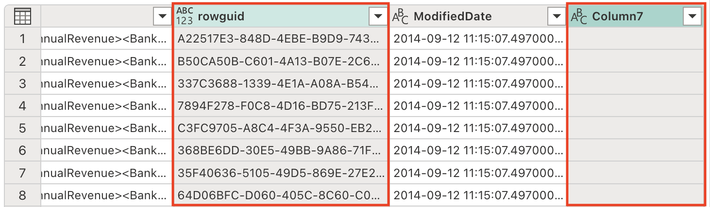
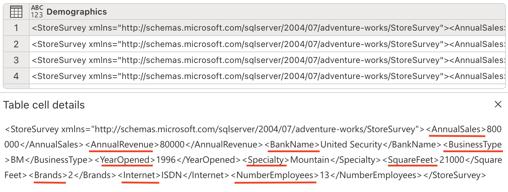
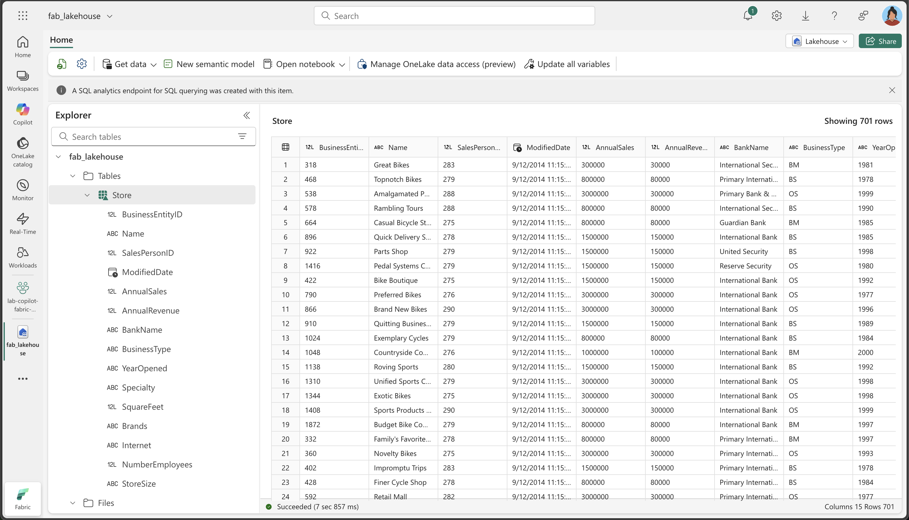

---
lab:
  title: Microsoft Fabric Dataflow Gen2용 Copilot을 사용하여 더 스마트하게 작업
  module: Get started with Copilot in Fabric for data engineering
---

# Microsoft Fabric Dataflow Gen2용 Copilot을 사용하여 더 스마트하게 작업

Microsoft Fabric에서 데이터 흐름(Gen2)은 다양한 데이터 원본에 연결하고 Power Query 온라인에서 변환을 수행합니다. 그런 다음 데이터 파이프라인에서 데이터를 레이크하우스 또는 기타 분석 저장소로 수집하거나 Power BI 보고서에 대한 데이터 세트를 정의하는 데 사용할 수 있습니다. 이 랩에서는 복잡한 엔터프라이즈 솔루션 빌드에 초점을 맞추기보다는 Dataflows(Gen2)에서의 Copilot을 소개해 보겠습니다.

이 연습을 완료하는 데 약 **30**분 정도 소요됩니다.

## 학습할 내용

이 랩을 완료하면 다음과 같은 내용을 수행하게 됩니다.

- Microsoft Fabric Dataflow Gen2에서 Copilot을 활용하여 데이터 변환 작업을 가속화하는 방법을 이해합니다.
- Copilot의 지원을 통해 Power Query Online을 사용하여 데이터를 수집, 정화, 변환하는 방법을 알아봅니다.
- 열 이름 변경, 불필요한 문자 제거, 적절한 데이터 형식 설정 등 데이터 품질을 위한 모범 사례를 적용합니다.
- 데이터 흐름 내에서 XML 데이터를 구문 분석하고 확장하는 경험을 쌓습니다.
- 분석을 위해 연속 데이터를 의미 있는 그룹으로 분류합니다.
- 변환된 데이터를 레이크하우스에 게시하고 그 결과의 유효성을 검사합니다.
- 생산성과 데이터 품질을 개선하기 위한 AI 지원 데이터 엔지니어링의 가치를 인식합니다.

## 시작하기 전에

이 연습을 완료하려면 Copilot이 사용하도록 설정된 [Microsoft Fabric Capacity(F2 이상)](https://learn.microsoft.com/fabric/fundamentals/copilot-enable-fabric)가 필요합니다.

## 연습 시나리오

글로벌 소매 회사인 Contoso는 Microsoft Fabric을 활용해 데이터 인프라를 현대화하고 있습니다. 데이터 엔지니어는 분석을 위해 매장 정보를 준비하는 임무를 맡게 됩니다. 원시 데이터는 CSV 파일 형식으로 저장되며 내장된 XML 필드, 일관되지 않은 열 이름, 불필요한 문자가 포함되어 있습니다. Dataflow Gen2에서 Copilot을 활용하여 이 데이터를 수집하고, 정화하고, 변환 및 보강하여 레이크하우스에서 보고 및 분석할 수 있도록 준비하는 것이 목표입니다. 이 실습 연습에서는 과정을 각 단계별로 안내하며, Copilot이 일반적인 데이터 엔지니어링 작업을 얼마나 빠르고 쉽게 수행할 수 있도록 하는지 방법을 보여 줍니다.

## 작업 영역 만들기

Fabric에서 데이터를 사용하기 전에, 먼저 Fabric이 활성화된 작업 영역을 만듭니다. 작업 영역은 모든 Fabric 항목의 컨테이너 역할을 하며, 팀을 위한 협업 기능을 제공합니다.

1. 브라우저에서 [Microsoft Fabric 홈페이지](https://app.fabric.microsoft.com/home?experience=fabric)(`https://app.fabric.microsoft.com/home?experience=fabric`)로 이동하고 Fabric 자격 증명을 사용해 로그인합니다.

1. 왼쪽 메뉴 모음에서 **작업 영역**을 선택합니다(아이콘은 와 유사함).

1. Fabric 용량이 포함된 라이선스 모드(*Premium* 또는 *Fabric*)를 선택하여 원하는 이름으로 새 작업 영역을 만듭니다. *평가판*은 지원되지 않습니다.

    > **중요**: Fabric의 Copilot 기능을 사용하려면 유료 용량(F2 이상)이 필요합니다. 평가판 작업 영역에서는 Copilot 기능을 지원하지 않습니다.

1. 새 작업 영역이 열리면 비어 있어야 합니다.

    

## 레이크하우스 만들기

이제 작업 영역이 있으므로 데이터를 수집할 데이터 레이크하우스를 만들 차례입니다.

1. 왼쪽 메뉴 모음에서 **만들기**를 선택합니다. *새* 페이지의 *데이터 엔지니어링* 섹션에서 **레이크하우스**를 선택합니다. 원하는 고유한 이름.

    >**참고**: **만들기** 옵션이 사이드바에 고정되지 않은 경우 먼저 줄임표(**...**) 옵션을 선택해야 합니다.

    1분 정도 지나면 빈 레이크하우스가 새로 만들어집니다.

    

## 데이터를 수집하기 위한 데이터 흐름(Gen2) 만들기

이제 레이크하우스가 있으므로 여기에 일부 데이터를 수집해야 합니다. 이를 수행하는 한 가지 방법은 ETL(*추출, 변환 및 로드*) 프로세스를 캡슐화하는 데이터 흐름을 정의하는 것입니다.

1. 작업 영역 홈페이지에서, **데이터 가져오기** > **새 데이터 흐름 Gen2**를 선택합니다. 몇 초 후에 여기에 표시된 대로 새 데이터 흐름에 대한 Power Query 편집기가 열립니다.

    

1. **텍스트/CSV 파일에서 가져오기**를 선택하고 다음 설정으로 새 데이터 원본을 만듭니다.

   - **파일에 연결**: *선택*
   - **파일 경로 또는 URL**: `https://raw.githubusercontent.com/MicrosoftLearning/mslearn-fabric/refs/heads/main/Allfiles/Labs/22a/Store.csv`
   - **연결**: 새 연결 만들기
   - **데이터 게이트웨이**:(없음)
   - **인증 종류**: 익명
   - **개인 정보 수준**: 없음

1. **다음**을 선택하여 파일 데이터를 미리 본 후 데이터 원본을 **만듭니다**. Power Query 편집기에는 다음과 같이 데이터 원본과 데이터 형식을 지정하는 초기 쿼리 단계 집합이 표시됩니다.

    

1. **홈** 리본 탭의 **Insights** 그룹 내부에서 다음과 같이 **Copilot**을 선택합니다.
    
    

1. 열 이름은 현재 너무 일반적이고 의미가 불분명합니다(Column1, Column2 등으로 표시됨). 의미 있는 열 이름은 데이터 이해 및 다운스트림 처리에 매우 중요합니다. 다음 프롬프트를 사용하여 열 이름을 구체화하고, 의도된 정보를 정확하게 전달할 수 있도록 합니다.

    ```copilot-prompt
    Rename columns to BusinessEntityID, Name, SalesPersonID, Demographics, rowguid, ModifiedDate
    ```

    이제 열 이름이 명확하고 의미를 잘 전달하도록 개선되었습니다. 또한, Copilot이 백그라운드에서 Power Query M 코드를 자동으로 생성했음을 보여 주는 추가 단계가 ‘적용된 단계’ 목록에 포함된 것을 확인할 수 있습니다.
    
    

1. 특정 열에는 텍스트 값의 끝에 '+' 문자가 포함되어 있습니다. 이는 일반적인 데이터 품질 문제로, 다운스트림의 데이터 분석 및 처리에 영향을 줄 수 있습니다. 

    
    
    다음 프롬프트를 사용하여 이러한 불필요한 문자를 제거해 보겠습니다.
    
    ```copilot-prompt
    Delete the last character from the columns Name, Demographics, rowguid
    ```
    
    **중요한 이유**: 불필요한 문자를 제거하면 데이터 일관성이 보장되고, 나중에 문자열 작업이나 데이터 조인을 수행할 때 문제가 발생하는 것을 방지할 수 있습니다.

1. 현재 테이블에는 데이터 세트를 간소화하고 처리 효율성을 개선하기 위해 제거해야 하는 중복 열이 포함되어 있습니다. 다음 프롬프트를 사용하여 데이터를 적절하게 구체화합니다.

    
    
    ```copilot-prompt
    Remove the rowguid and Column7 columns
    ```
    
    **참고**: `rowguid` 열은 일반적으로 내부 데이터베이스 작업에 사용되며 분석에는 필요하지 않습니다. `Column7`은 비어 있거나 관련이 없는 열로, 데이터 세트에 아무런 값을 추가하지 않습니다.
    
1. Demographics 열에는 XML 데이터 구문 분석을 방해하는 보이지 않는 유니코드 문자인 BOM(바이트 순서 표시) \ufeff가 포함되어 있습니다. 정상적인 처리를 위해 이 문자를 제거해야 합니다. Copilot 창에서 다음 프롬프트를 입력합니다.

    ```copilot-prompt
    Remove the Byte Order Mark (BOM) \ufeff from the Demographics column
    ```
    
    **BOM 이해하기**: 바이트 순서 표시는 텍스트 인코딩의 바이트 순서를 나타내기 위해 텍스트 파일의 시작 부분에 나타날 수 있는 유니코드 문자입니다. 파일 인코딩을 감지하는 데는 유용하지만, XML과 같은 구조화된 데이터를 구문 분석할 때 문제가 발생할 수 있습니다.
    
    문자를 제거하기 위해 생성된 수식을 확인해 보세요.
    
    
    
1. 이제 XML 데이터를 구문 분석하고, 이를 별도의 열로 확장할 준비가 되었습니다. Demographics 열에는 연간 매출, 매장 면적, 기타 비즈니스 지표와 같은 중요한 매장 정보가 XML 형식의 데이터로 포함되어 있습니다.

    
    
    Copilot 창에서 다음 프롬프트를 입력합니다.
    
    ```copilot-prompt
    Parse this XML and expand it's columns
    ```
    
    **XML 구문 분석 이해**: XML(Extensible Markup Language)은 계층적 정보를 저장하는 데 일반적으로 사용되는 구조화된 데이터 형식입니다. XML을 구문 분석하고 확장하여, 중첩된 데이터를 분석하기 쉬운 평평한 테이블 형식 구조로 변환할 수 있습니다.
    
    새로운 열이 테이블에 추가된 것을 확인하세요. 오른쪽으로 스크롤해야 볼 수 있습니다.
    
    

1. 모든 중요한 정보를 별도의 열로 추출해 두었으므로, 더 이상 필요하지 않은 Demographics 열은 제거합니다. Copilot 창에서 다음 프롬프트를 입력합니다.

    ```copilot-prompt
    Remove the Demographics column.
    ```

    **이 열을 제거하는 이유**: 이제 XML을 구문 분석하고 각 정보에 대한 개별 열을 만들었으므로, 원시 XML을 포함하고 있는 원래 Demographics 열은 중복되었습니다. 데이터 세트를 깔끔하게 유지하기 위해 안전하게 제거할 수 있습니다.

1. ModifiedDate 열의 값 끝에는 앰퍼샌드(&)가 있습니다. 데이터 처리를 제대로 하려면 구문 분석 전에 제거해야 합니다.

    
    
    Copilot 창에서 다음 프롬프트를 입력합니다.
    
    ```copilot-prompt
    Remove the last character from the ModifiedDate
    ```

1. 이제 적절한 날짜/시간 작업 및 분석을 위해 데이터 형식을 DateTime으로 변환할 준비가 되었습니다. Copilot 창에서 다음 프롬프트를 입력합니다.

    ```copilot-prompt
    Set the data type to DateTime
    ```

    **데이터 형식 중요도**: 다운스트림 분석에서 적절한 정렬, 필터링, 날짜 기반 계산을 위해서는 올바른 데이터 형식으로 변환하는 것이 매우 중요합니다.

    ModifiedDate 데이터 형식이 DateTime으로 변경되었습니다.
    
    
    
1. 여러 열의 데이터 형식을 숫자 값으로 조정하여 수학 연산과 적절한 집계를 활성화합니다. Copilot 창에서 다음 프롬프트를 입력합니다.

    ```copilot-prompt
    Set the data type to whole number for the following columns: AnnualSales, AnnualRevenue, SquareFeet, NumberEmployee
    ```
    
    **숫자로 변환하는 이유**: 숫자 데이터 형식을 사용하면 텍스트 기반 데이터에서는 불가능한 정확한 수학 계산, 집계(합계, 평균 등), 통계 분석이 가능합니다.
    
1. SquareFeet 필드에는 6,000에서 80,000까지의 숫자 값이 포함됩니다. 연속적인 숫자 데이터에서 범주형 그룹을 만드는 것은 데이터를 보다 쉽게 해석하고 분석할 수 있도록 하는 일반적인 분석 기술입니다.

    
    
    매장 규모를 분류하기 위해 새 열을 생성해 보겠습니다. Copilot 창에서 다음 프롬프트를 입력합니다.
    
    ```copilot-prompt
    Add a column StoreSize, based on the SquareFeet:
        0 - 10000: Small
        10001 - 40000: Medium
        40001 - 80000: Large
    ```
    
    SquareFeet 열을 기반으로 하는 수식을 사용하여 StoreSize라는 새 열이 추가된 것을 확인할 수 있습니다. 또한 열 프로필에는 다음과 같은 3개의 고유한 값이 있습니다. 세 가지 크기(소형, 중형 및 대형) 중에서 선택할 수 있습니다.
    
    
    
1. 현재 지정된 형식이 없는 열의 데이터 형식을 수정합니다. Copilot 창에서 다음 프롬프트를 입력합니다.

    ```copilot-prompt
    Set the datatype of the following columns to text: Name, BankName, BusinessType, YearOpened, Specialty, Brands, Internet, StoreSize
    ```
    
    **데이터 형식 일관성**: 데이터 형식을 명시적으로 설정하면 다운스트림 프로세스에서 예측 가능한 동작이 보장되고 예기치 못한 결과가 발생할 수 있는 자동 형식 추론을 방지할 수 있습니다.
    
## 코드 설명

1. 여러 변환 작업을 수행했습니다. Copilot에게 우리가 수행한 단계를 요약해 달라고 요청해 보겠습니다.

    ```copilot-prompt
    Describe this query
    ```
    
    결과가 Copilot 창에 나타나는 것을 확인해 보세요. 아래는 제공된 설명의 예시입니다. AI가 생성한 콘텐츠에는 오류가 있을 수 있으므로 결과가 약간 다를 수 있습니다.
    
    
    
    ***매장**에 대한 설명: CSV 파일을 로드하여 변환하고, XML 데이터를 구문 분석하며, 매장 크기에 따라 분류합니다.*
    
    - _**원본**: 파이프 구분 기호와 특정 인코딩을 사용하여 URL에서 CSV 파일을 로드합니다._
    - _**변경된 열 유형**: 열의 데이터 형식을 변경합니다._
    - _**열 이름 바꾸기**: 열 이름을 의미 있는 이름으로 바꿉니다._
    - _**사용자 지정**: "Name", "Demographics", "rowguid" 열의 마지막 문자를 제거합니다._
    - _**열 제거**: "rowguid" 및 "Column7" 열을 제거합니다._
    - _**사용자 지정 1**: "Demographics" 열의 앞부분에 있는 특수 문자를 제거합니다._
    - _**사용자 지정 2**: "Demographics" 열을 XML로 구문 분석하고 여러 개의 열로 확장합니다._
    - _**열 제거 1**: 원래 "Demographics" 열을 제거합니다._
    - _**열 변환**: "ModifiedDate" 열의 마지막 문자를 제거합니다._
    - _**열 변환 1**: "ModifiedDate" 열을 날짜/시간 형식으로 변환합니다._
    - _**형식 변경**: "AnnualSales", "AnnualRevenue", "SquareFeet", "NumberEmployees" 열의 데이터 형식을 정수로 변경합니다._
    - _**조건 열**: "SquareFeet" 값을 기준으로 "StoreSize"라는 새 열을 추가하고 매장을 "Small", "Medium", "Large"로 분류합니다._
    - _**형식 변경 1**: 여러 열의 데이터 형식을 텍스트로 변경합니다._
    
## 데이터 흐름의 데이터 대상 추가

1. 도구 모음 리본에서 **홈** 탭을 선택합니다. 그런 다음 **데이터 대상 추가** 드롭다운 메뉴에서 **레이크하우스**를 선택합니다.

    > **참고:** 이 옵션이 회색으로 표시되면 이미 데이터 대상이 설정되어 있을 수 있습니다. Power Query 편집기 오른쪽의 쿼리 설정 창 하단에서 데이터 대상을 확인합니다. 대상이 이미 설정되어 있는 경우 기어를 이용해 변경할 수 있습니다.

1. **데이터 대상에 연결** 대화 상자에서 연결을 편집하고 Power BI 조직 계정을 사용하여 로그인하여 데이터 흐름이 레이크하우스에 액세스하는 데 사용하는 ID를 설정합니다.

    

1. **다음**을 선택하고 사용 가능한 작업 영역 목록에서 작업 영역을 찾고 이 연습을 시작할 때 만든 레이크하우스를 선택합니다. 그런 다음, **Store**라는 새 테이블을 지정합니다.

    

1. **다음**을 선택하고 **대상 설정 선택** 페이지에서 **자동 설정 사용** 옵션을 사용하지 않도록 설정하고 **추가**를 선택한 다음, **설정을 저장합니다**.

    > **참고:** 데이터 형식을 업데이트하려면 *파워 쿼리* 편집기를 사용하는 것이 좋지만 원하는 경우 이 페이지에서 수행할 수도 있습니다.

    

1. **저장 및 실행**을 선택하여 데이터 흐름을 게시합니다. 그런 다음 작업 영역에 **Dataflow 1** 데이터 흐름이 만들어질 때까지 기다립니다.

## 작업 유효성 검사

이제 데이터 흐름에서 ETL 프로세스의 유효성을 검사하고 모든 변환이 올바르게 적용되었는지 확인해야 합니다.

1. 작업 영역으로 돌아가서 이전에 만든 레이크하우스를 엽니다.

1. 레이크하우스에서 **Store** 테이블을 찾아 엽니다. (데이터 흐름이 데이터를 처리하는 동안 데이터가 채워질 때까지 몇 분 정도 기다려야 할 수도 있습니다.)

1. 변환된 데이터의 주요 사항을 다음과 같이 확인합니다.

   - **열 이름**: 지정한 의미 있는 이름(BusinessEntityID, Name, SalesPersonID 등)이 일치하는지 확인합니다.
   - **데이터 형식**: 숫자 열은 숫자 형식으로, DateTime 열은 날짜/시간 형식으로, 텍스트 열은 텍스트 형식으로 표시되는지 확인합니다.
   - **데이터 품질**: 원치 않는 문자(+, &)가 제거되었는지 확인합니다.
   - **XML 확장**: 원래 XML 인구 통계 데이터에서 추출된 개별 열을 확인합니다.
   - **StoreSize 분류**: SquareFeet 값을 기준으로 Small/Medium/Large 범주가 올바르게 생성되었는지 확인합니다.
   - **데이터 완성도**: 변환 프로세스 중에 중요한 데이터가 손실되지 않았는지 확인합니다.

   

    **중요한 이유**: 마지막 테이블에는 의미 있는 열 이름, 적절한 데이터 형식, 새 StoreSize 범주 열이 있는 깔끔하고 잘 구조화된 데이터가 포함되어야 합니다. 이는 Copilot이 어떻게 원시적이고 복잡한 데이터를 분석 준비가 완료된 깔끔한 데이터 세트로 변환할 수 있는지 보여줍니다.

## 리소스 정리

Microsoft Fabric에서 데이터 흐름 탐색을 마쳤으면 이 연습을 위해 만든 작업 영역을 삭제할 수 있습니다.

1. 브라우저에서 Microsoft Fabric으로 이동합니다.
1. 왼쪽 막대에서 작업 영역의 아이콘을 선택하여 포함된 모든 항목을 봅니다.
1. **작업 영역 설정**을 선택하고 **일반** 섹션에서 아래로 스크롤하여 **이 작업 영역 제거**를 선택합니다.
1. **삭제**를 선택하여 작업 영역을 삭제합니다.

