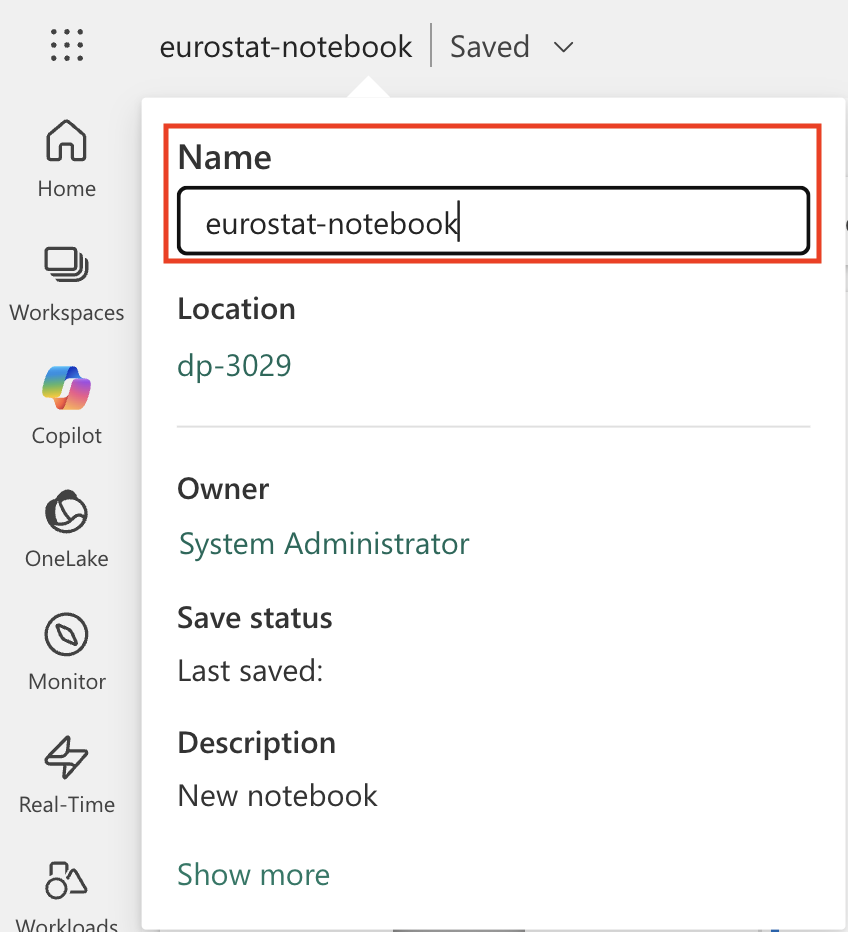
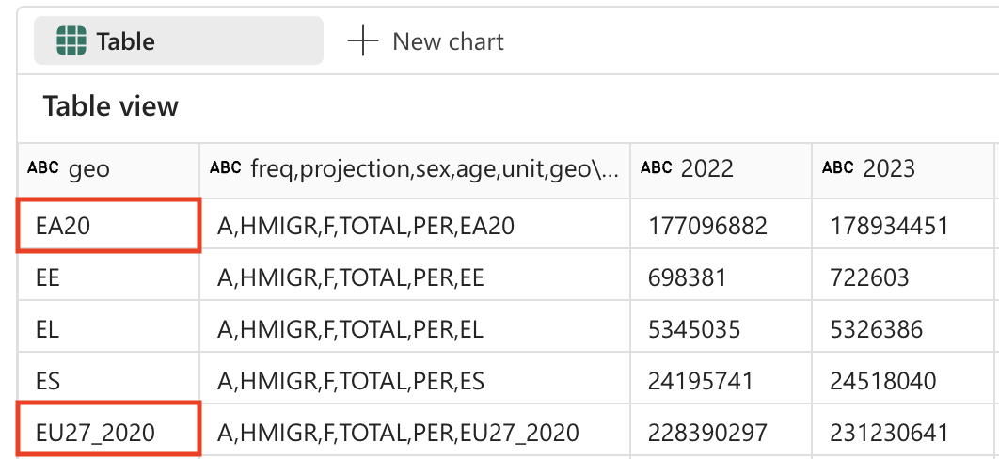

---
lab:
  title: Microsoft Fabric Notebook에서 Apache Spark 및 Copilot을 사용하여 데이터 분석
  module: Get started with Copilot in Fabric for data engineering
---

# Microsoft Fabric Notebook에서 Apache Spark 및 Copilot을 사용하여 데이터 분석

이 랩에서는 전자 필기장에서 Fabric Data Engineering용 Copilot을 사용하여 레이크하우스에 데이터를 로드, 변환, 저장해 보세요. 전자 필기장은 코드, 시각화, 설명 텍스트를 하나의 문서에 통합하는 대화형 환경을 제공합니다. 이 형식을 통해 작업 흐름을 쉽게 문서화하고, 추론을 설명하며, 결과를 다른 사용자와 공유할 수 있습니다. 전자 필기장을 활용하면 코드를 반복적으로 개발하고 테스트하며, 각 단계의 데이터를 시각화하고, 분석 프로세스를 명확하게 기록할 수 있습니다. 이러한 접근 방식은 협업, 재현성, 이해를 더욱 향상시켜 전자 필기장을 데이터 엔지니어링 및 분석 작업에 이상적인 도구로 만들어 줍니다.

일반적으로 데이터 엔지니어링을 위해 전자 필기장을 사용하려면 Python 또는 Scala와 같은 언어로 코드를 작성해야 하고, Apache Spark 및 pandas와 같은 프레임워크 및 라이브러리를 확실하게 이해해야 합니다. 프로그래밍을 처음 접하거나 이러한 도구에 익숙하지 않은 사용자에게는 어려울 수 있습니다. Fabric 전자 필기장의 Copilot을 활용하면 자연어로 데이터 작업을 설명하는 것만으로 Copilot이 필요한 코드를 생성하여 기술적 복잡성을 줄이고 분석에 더욱 집중할 수 있습니다.

이 연습을 완료하는 데 약 **30**분 정도 소요됩니다.

## 학습할 내용

이 랩을 마치면 다음과 같은 역량을 갖추게 됩니다.

- 데이터 엔지니어링 작업을 위한 Microsoft Fabric 작업 영역 및 레이크하우스를 만들고 구성할 수 있습니다.
- Fabric 전자 필기장에서 Copilot을 활용해 자연어 프롬프트를 기반으로 코드를 생성할 수 있습니다.
- Apache Spark 및 Copilot 지원 워크플로를 사용하여 데이터를 수집, 정화, 변환할 수 있습니다.
- 데이터 형식을 분할, 필터링, 변환하여 분석을 위해 통계 데이터 세트를 정규화하고 준비할 수 있습니다.
- 다운스트림 분석을 위해 변환된 데이터를 레이크하우스의 테이블로 저장합니다.
- Copilot을 활용해 데이터 탐색 및 유효성 검사를 위한 쿼리와 시각화를 생성할 수 있습니다.
- Microsoft Fabric의 데이터 정화, 변환, 협업 분석에 대한 모범 사례를 이해할 수 있습니다.

## 시작하기 전에

이 연습을 완료하려면 Copilot이 사용하도록 설정된 [Microsoft Fabric Capacity(F2 이상)](https://learn.microsoft.com/fabric/fundamentals/copilot-enable-fabric)가 필요합니다.

> **참고**: 편의를 위해 이 연습에 대한 모든 프롬프트가 있는 전자 필기장을 다음 위치에서 다운로드할 수 있습니다.

`https://github.com/MicrosoftLearning/mslearn-fabric/raw/refs/heads/main/Allfiles/Labs/22b/Starter/eurostat-notebook.ipynb`

## 연습 시나리오

여러 전문 진료과를 보유한 병원 네트워크인 Contoso Health는 EU 내 서비스 확장을 계획하고 있고, 이를 위해 향후 인구 데이터를 분석하려고 합니다. 이 예제에서는 [Eurostat](https://ec.europa.eu/eurostat/web/main/home)(유럽 연합의 통계청)의 인구 예측 데이터 세트를 사용합니다.

원본: EUROPOP2023 연령, 성별, 예측 유형별 1월 1일 기준 인구 [[proj_23np](https://ec.europa.eu/eurostat/databrowser/product/view/proj_23np?category=proj.proj_23n)], 마지막 업데이트 2023년 6월 28일

## 작업 영역 만들기

Fabric에서 데이터를 사용하기 전에, 먼저 Fabric이 활성화된 작업 영역을 만듭니다. Microsoft Fabric의 작업 영역은 레이크하우스, 전자 필기장, 데이터 세트를 비롯한 모든 데이터 엔지니어링 아티팩트를 구성하고 관리할 수 있는 협업 환경 역할을 합니다. 데이터 분석에 필요한 모든 리소스가 들어 있는 프로젝트 폴더라고 생각하면 됩니다.

1. 브라우저에서 [Microsoft Fabric 홈페이지](https://app.fabric.microsoft.com/home?experience=fabric)(`https://app.fabric.microsoft.com/home?experience=fabric`)로 이동하고 Fabric 자격 증명을 사용해 로그인합니다.

1. 왼쪽 메뉴 모음에서 **작업 영역**을 선택합니다(아이콘은 와 유사함).

1. Fabric 용량이 포함된 라이선스 모드(*Premium* 또는 *Fabric*)를 선택하여 원하는 이름으로 새 작업 영역을 만듭니다. *평가판*은 지원되지 않습니다.
   
    > **중요한 이유**: Copilot을 사용하려면 유료 Fabric 용량이 필요합니다. 이를 통해 이 랩 전반에서 코드 생성에 도움이 되는 AI 기반 기능에 액세스할 수 있습니다.

1. 새 작업 영역이 열리면 비어 있어야 합니다.

    

## 레이크하우스 만들기

이제 작업 영역이 있으므로 데이터를 수집할 레이크하우스를 만들 차례입니다. 레이크하우스는 데이터 레이크의 이점(다양한 형식의 원시 데이터 저장)과 데이터 웨어하우스의 이점(분석에 최적화된 구조화된 데이터)을 결합합니다. 이는 원시 인구 데이터의 스토리지 위치이자 잘 정리되고 변환된 데이터 세트의 대상 역할을 모두 수행합니다.

1. 왼쪽 메뉴 모음에서 **만들기**를 선택합니다. *새* 페이지의 *데이터 엔지니어링* 섹션에서 **레이크하우스**를 선택합니다. 원하는 고유한 이름.

    >**참고**: **만들기** 옵션이 사이드바에 고정되지 않은 경우 먼저 줄임표(**...**) 옵션을 선택해야 합니다.


1분 정도 지나면 빈 레이크하우스가 새로 만들어집니다.


## Notebook 만들기

이제 데이터를 사용하여 작업할 Fabric Notebook을 만들 수 있습니다. 전자 필기장은 코드를 작성하고, 실행하고, 결과를 시각화하고, 데이터 분석 프로세스를 문서화할 수 있는 대화형 환경을 제공합니다. 전자 필기장은 탐색적 데이터 분석 및 반복적인 개발 작업에 매우 적합하며, 각 단계의 결과를 즉시 확인할 수 있습니다.

1. 왼쪽 메뉴 모음에서 **만들기**를 선택합니다. *새* 페이지의 *데이터 엔지니어링* 섹션에서 **Notebook**을 선택합니다.

    **Notebook 1**이라는 새 Notebook이 생성되고 열립니다.

    

1. Fabric은 만든 Notebook마다 이름을 할당합니다(예: Notebook 1, Notebook 2 등). 메뉴의 **홈** 탭 위에 있는 이름 패널을 클릭하여 보다 내용을 잘 알 수 있는 이름으로 변경할 수 있습니다.

    

1. 첫 번째 셀(현재 코드 셀)을 선택한 다음 오른쪽 위에 있는 도구 모음에서 **M↓** 버튼을 사용하여 셀을 Markdown 셀로 변환합니다. 그러면 셀에 포함된 텍스트가 서식이 지정된 텍스트로 표시됩니다.

    > **Markdown 셀을 사용하는 이유**: Markdown 셀을 사용하면 분석 내용을 서식 있는 텍스트로 문서화하여 다른 사용자(또는 나중에 내가 다시 볼 때)가 전자 필기장을 더 쉽게 읽고 이해할 수 있습니다.

    

1. 🖉(편집) 버튼을 사용하여 셀을 편집 모드로 전환한 후 다음과 같이 markdown을 수정합니다.

    ```md
    # Explore Eurostat population data.
    Use this notebook to explore population data from Eurostat
    ```
    
    
    
    완료한 다음에는 Notebook의 셀 외부 아무 곳이나 클릭하여 편집을 중지합니다.

## 전자 필기장에 레이크하우스 연결하기

전자 필기장에서 레이크하우스의 데이터로 작업하려면 레이크하우스를 전자 필기장에 연결해야 합니다. 이 연결을 통해 전자 필기장에서 레이크하우스 스토리지를 읽고 쓸 수 있게 되므로, 분석 환경과 데이터 스토리지가 원활하게 통합될 수 있습니다.

1. 왼쪽 표시줄에서 새 작업 영역을 선택합니다. 레이크하우스와 notebook 등 작업 영역에 포함된 항목 목록이 표시됩니다.

1. 탐색기 창을 표시하기 위해 레이크하우스를 선택하세요.

1. 위쪽 메뉴에서 **Notebook 열기**, **기존 notebook**을 선택한 다음 앞에서 만든 notebook을 엽니다. 이제 탐색기 창 옆에 notebook이 열려 있어야 합니다. 레이크하우스를 확장하고 파일 목록을 확장합니다. 전자 필기장 편집기 옆에 아직 테이블이나 파일이 나열되어 있지 않습니다.

    

    > **표시되는 내용**: 왼쪽의 탐색기 창에 레이크하우스 구조가 표시됩니다. 현재는 비어 있지만 데이터를 로드하고 처리하면 **파일** 섹션에 파일이 표시되고 **테이블** 섹션에 테이블이 표시됩니다.


## 데이터 로드

이제 Copilot을 사용하여 Eurostat API에서 데이터를 다운로드할 수 있습니다. Python 코드를 처음부터 작성하는 대신, 자연어로 진행하려는 작업을 설명하면 Copilot이 적절한 코드를 생성해 줍니다. 이는 AI 지원 코딩의 주요 이점 중 하나를 보여 줍니다. 즉, 기술적 구현 세부 사항이 아닌 비즈니스 논리에 집중할 수 있다는 것입니다.

1. 전자 필기장에 새 셀을 만들고 다음 지침을 복사해 넣으세요. Copilot이 코드를 생성하도록 지정하려면 셀의 첫 번째 지침에 `%%code`를 사용합니다. 

    > **`%%code` 매직 명령** 정보: 이 특별한 명령은 자연어 설명을 기반으로 Python 코드를 생성하도록 Copilot에게 지시합니다. Copilot과 보다 효과적으로 상호 작용하는 데 도움이 되는 몇 가지 "매직 명령" 중 하나입니다.

    ```copilot-prompt
    %%code
    
    Download the following file from this URL:
    
    https://ec.europa.eu/eurostat/api/dissemination/sdmx/2.1/data/proj_23np$defaultview/?format=TSV
     
    Then write the file to the default lakehouse into a folder named temp. Create the folder if it doesn't exist yet.
    ```
    
1. 셀 왼쪽에 있는 ▷ **셀 실행**을 선택하여 코드를 실행합니다.

    Copilot은 사용자 환경과 Copilot의 최신 업데이트에 따라 약간 다를 수 있는 다음 코드를 생성합니다.
    
    
    
    > **Copilot 작동 방식**: Copilot이 자연어 요청을 작동 가능한 Python 코드로 변환하는 방식을 확인해 보세요. Copilot은 여러분이 HTTP 요청을 보내고, 파일 시스템을 처리하며, 데이터를 레이크하우스의 특정 위치에 저장해야 한다는 의미를 이해합니다.
    
    실행 중 예외가 발생할 경우를 대비해 편의를 위해 전체 코드를 다음과 같이 정리했습니다.
    
    ```python
    #### ATTENTION: AI-generated code can include errors or operations you didn't intend. Review the code in this cell carefully before running it.
    
    import requests
    import os
    
    # Define the URL and the local path
    url = "https://ec.europa.eu/eurostat/api/dissemination/sdmx/2.1/data/proj_23np$defaultview/?format=TSV"
    local_path = "/lakehouse/default/Files/temp/"
    file_name = "proj_23np.tsv"
    file_path = os.path.join(local_path, file_name)
    
    # Create the temporary directory if it doesn't exist
    if not os.path.exists(local_path):
        os.makedirs(local_path)
    
    # Download the file
    response = requests.get(url)
    response.raise_for_status()  # Check that the request was successful
    
    # Write the content to the file
    with open(file_path, "wb") as file:
        file.write(response.content)
    
    print(f"File downloaded and saved to {file_path}")
    ```

1. 코드를 실행하고 출력을 관찰하려면 셀 왼쪽의 ▷ **셀 실행**을 선택하세요. 파일을 다운로드하여 레이크하우스의 임시 폴더에 저장해야 합니다.

    > **참고**: 세 개의 점을 선택하여 레이크하우스 파일을 새로 고쳐야 할 수도 있습니다.
    
    

1. 이제 레이크하우스에 원시 데이터 파일이 있으므로 이를 분석하고 변환할 수 있도록 Spark DataFrame에 로드해야 합니다. 전자 필기장에 새 셀을 만들고 다음 지침을 복사해 넣으세요.

    > **정보**: DataFrame은 데이터베이스 또는 스프레드시트의 테이블과 유사하게 이름이 지정된 열로 구성된 분산 데이터 컬렉션입니다.

    ```copilot-prompt
    %%code
    
    Load the file 'Files/temp/proj_23np.tsv' into a spark dataframe.
    
    The fields are separated with a tab.
    
    Show the contents of the DataFrame using display method.
    ```

1. 코드를 실행하고 출력을 관찰하려면 셀 왼쪽의 ▷ **셀 실행**을 선택하세요. DataFrame에는 TSV 파일의 데이터가 포함되어야 합니다. 아래는 생성된 코드의 예시입니다.

    ```python
    #### ATTENTION: AI-generated code can include errors or operations you didn't intend. Review the code in this cell carefully before running it.
    
    # Load the file 'Files/temp/proj_23np.tsv' into a spark dataframe.
    # The fields have been separated with a tab.
    file_path = "Files/temp/proj_23np.tsv"
    
    spark_df = spark.read.format("csv").option("delimiter", "\t").option("header", "true").load(file_path)
    
    # Show the contents of the DataFrame using display method
    display(spark_df)
    ```

다음은 출력의 모양에 대한 예입니다.

| freq,projection,sex,age,unit,geo\TIME_PERIOD |      2022  |      2023  |   ...  |      2100  |
| -------------------------------------------- | ---------- | ---------- | ------ | ---------- |
|                         A,BSL,F,TOTAL,PER,AT |   4553444  |   4619179  |   ...  |   4807661  |
|                         A,BSL,F,TOTAL,PER,BE |   5883978  |   5947528  |   ...  |   6331785  |
|                         A,BSL,F,TOTAL,PER,BG |   3527626  |   3605059  |   ...  |   2543673  |
|                                          ... |       ...  |       ...  |   ...  |   5081250  |
|                         A,BSL,F,TOTAL,PER,CY |    463622  |    476907  |   ...  |    504781  |

> **데이터 구조 이해**: 첫 번째 열에는 쉼표로 구분된 여러 값(빈도, 프로젝션 유형, 성별, 연령, 단위, 지리적 위치)이 포함되어 있고, 나머지 열은 인구 값이 포함된 연도를 나타냅니다. 이러한 구조는 통계 데이터 세트에서 흔히 볼 수 있으나, 효과적인 분석을 위해서는 정리가 필요합니다.

## 데이터 변환: 필드 분할

이제 데이터를 변환해 보겠습니다. 첫 번째 필드가 별도의 열로 분할되어 있는지 확인해야 합니다. 또한, 올바른 데이터 형식을 사용하고 필터링을 적용해야 합니다. 

> **필드 분할이 필요한 이유**: 첫 번째 열에는 여러 정보(빈도, 프로젝션 유형, 성별, 연령 그룹, 단위, 지리적 코드)가 함께 연결되어 있습니다. 적절한 분석을 위해서는 이러한 각 정보가 별도의 열에 있어야 합니다. 이 프로세스를 데이터 구조의 "정규화"라고 합니다.

1. 전자 필기장에 새 셀을 만들고 다음 지침을 복사해 넣으세요.


    ```copilot-prompt
    %%code
    
    From the currently loaded DataFrame, split the first field 'freq,projection,sex,age,unit,geo\TIME_PERIOD' using a comma into 6 separate fields.
    ```

1. 코드를 실행하고 출력을 관찰하려면 셀 왼쪽의 ▷ **셀 실행**을 선택하세요. 다음은 출력의 모양에 대한 예입니다.

    ```python
    #### ATTENTION: AI-generated code can include errors or operations you didn't intend. Review the code in this cell carefully before running it.
    
    from pyspark.sql.functions import split, col
    
    # Split the first field 'freq,projection,sex,age,unit,geo\TIME_PERIOD' into 6 separate fields
    spark_df = spark_df.withColumn("freq", split(col("freq,projection,sex,age,unit,geo\\TIME_PERIOD"), ",").getItem(0)) \
                       .withColumn("projection", split(col("freq,projection,sex,age,unit,geo\\TIME_PERIOD"), ",").getItem(1)) \
                       .withColumn("sex", split(col("freq,projection,sex,age,unit,geo\\TIME_PERIOD"), ",").getItem(2)) \
                       .withColumn("age", split(col("freq,projection,sex,age,unit,geo\\TIME_PERIOD"), ",").getItem(3)) \
                       .withColumn("unit", split(col("freq,projection,sex,age,unit,geo\\TIME_PERIOD"), ",").getItem(4)) \
                       .withColumn("geo", split(col("freq,projection,sex,age,unit,geo\\TIME_PERIOD"), ",").getItem(5))
    
    # Show the updated DataFrame
    display(spark_df)
    ```

1. 셀 왼쪽에 있는 ▷ **셀 실행**을 선택하여 코드를 실행합니다. 테이블에 추가된 새 필드를 보려면 테이블을 오른쪽으로 스크롤해야 할 수도 있습니다.

    

## 데이터 변환: 필드 제거

테이블의 일부 필드는 단 하나의 고유 항목만 포함하고 있으므로 의미 있는 값을 제공하지 않습니다. 모범 사례로 데이터 세트에서 이러한 필드를 제거해야 합니다.

> **데이터 정화 원칙**: 고유한 값이 하나만 있는 열은 분석 값을 제공하지 않으며 데이터 세트를 불필요하게 복잡하게 만들 수 있습니다. 이 열을 제거하면 데이터 구조가 간단해지고 성능도 향상됩니다. 이 경우 'freq'(빈도), 'age'(모든 레코드가 TOTAL을 표시함), 'unit'(모든 레코드가 인구의 PER 표시)은 모든 행에서 일정합니다.

1. 전자 필기장에 새 셀을 만들고 다음 지침을 복사해 넣으세요.

    ```copilot-prompt
    %%code
    
    From the currently loaded DataFrame, remove the fields 'freq', 'age', 'unit'.
    ```

1. 코드를 실행하고 출력을 관찰하려면 셀 왼쪽의 ▷ **셀 실행**을 선택하세요. 다음은 출력의 모양에 대한 예입니다.

    ```python
    #### ATTENTION: AI-generated code can include errors or operations you didn't intend. Review the code in this cell carefully before running it.
    
    # Remove the fields 'freq', 'age', 'unit'
    spark_df = spark_df.drop("freq", "age", "unit")
    
    # Show the updated DataFrame
    display(spark_df)
    ```

1. 셀 왼쪽에 있는 ▷ **셀 실행**을 선택하여 코드를 실행합니다.

## 데이터 변환: 필드 위치 변경

가장 중요한 식별자 열을 먼저 배치하면 데이터를 더 쉽게 읽고 이해할 수 있습니다. 데이터 분석에서는 범주/차원 열(예: 프로젝션 형식, 성별, 지리적 위치)을 숫자/측정값 열(연도별 인구 값) 앞에 배치하는 것이 일반적입니다.

1. 전자 필기장에 새 셀을 만들고 다음 지침을 복사해 넣으세요.

    ```copilot-prompt
    %%code
    
    From the currently loaded DataFrame, the fields 'projection', 'sex', 'geo' should be positioned first.
    ```

1. 코드를 실행하고 출력을 관찰하려면 셀 왼쪽의 ▷ **셀 실행**을 선택하세요. 다음은 출력의 모양에 대한 예입니다.

    ```python
    #### ATTENTION: AI-generated code can include errors or operations you didn't intend. Review the code in this cell carefully before running it.
    
    # Reorder the DataFrame with 'projection', 'sex', 'geo' fields first
    new_column_order = ['projection', 'sex', 'geo'] + [col for col in spark_df.columns if col not in {'projection', 'sex', 'geo'}]
    spark_df = spark_df.select(new_column_order)
    
    # Show the reordered DataFrame
    display(spark_df)
    ```

1. 셀 왼쪽에 있는 ▷ **셀 실행**을 선택하여 코드를 실행합니다.

## 데이터 변환: 값 바꾸기

프로젝션 필드에는 현재 사용자에게 친숙하지 않은 암호화 코드가 포함되어 있습니다. 가독성 및 분석을 향상하기 위해 이러한 코드를 각 프로젝션 시나리오가 무엇을 나타내는지 명확하게 설명하는 이름으로 대체하겠습니다.

> **프로젝션 시나리오 이해**: 통계 기관에서는 향후 인구 변화를 모델링하기 위해 종종 다양한 시나리오를 사용합니다. 기준선은 가장 가능성이 큰 시나리오를 나타내며, 민감도 테스트는 출산율, 사망률 및 이주 패턴에 대한 다양한 가정 하에서 인구가 어떻게 변화할 수 있는지를 보여 줍니다.

1. 전자 필기장에 새 셀을 만들고 다음 지침을 복사해 넣으세요.


    ```copilot-prompt
    %%code
    
    The 'projection' field contains codes that should be replaced with the following values:
        _'BSL' -> 'Baseline projections'.
        _'LFRT' -> 'Sensitivity test: lower fertility'.
        _'LMRT' -> 'Sensitivity test: lower mortality'.
        _'HMIGR' -> 'Sensitivity test: higher migration'.
        _'LMIGR' -> 'Sensitivity test: lower migration'.
        _'NMIGR' -> 'Sensitivity test: no migration'.
    ```

1. 코드를 실행하고 출력을 관찰하려면 셀 왼쪽의 ▷ **셀 실행**을 선택하세요. 다음은 출력의 모양에 대한 예입니다.

    ```python
    #### ATTENTION: AI-generated code can include errors or operations you didn't intend. Review the code in this cell carefully before running it.
    
    from pyspark.sql.functions import when
    
    # Replace projection codes
    spark_df = spark_df.withColumn("projection", 
                                   when(spark_df["projection"] == "BSL", "Baseline projections")
                                   .when(spark_df["projection"] == "LFRT", "Sensitivity test: lower fertility")
                                   .when(spark_df["projection"] == "LMRT", "Sensitivity test: lower mortality")
                                   .when(spark_df["projection"] == "HMIGR", "Sensitivity test: higher migration")
                                   .when(spark_df["projection"] == "LMIGR", "Sensitivity test: lower migration")
                                   .when(spark_df["projection"] == "NMIGR", "Sensitivity test: no migration")
                                   .otherwise(spark_df["projection"]))
    
    # Display the updated DataFrame
    display(spark_df)
    ```

1. 셀 왼쪽에 있는 ▷ **셀 실행**을 선택하여 코드를 실행합니다.

    
    
## 데이터 변환: 데이터 필터링

인구 프로젝션 표에는 존재하지 않는 국가에 대한 2개의 행이 포함되어 있습니다. EU27_2020(*유럽 연합 총합 - 27개국*) 및 EA20(*유로 지역 - 20개국*)입니다. 가장 세분화된 수준의 데이터만 유지하고자 하므로, 이 두 행은 제거해야 합니다.

> **데이터 세분성 원칙**: 정밀한 분석을 위해서는 가능한 가장 세분화된 수준의 데이터를 사용하는 것이 중요합니다. 집계 값(예: EU 합계)은 필요할 때 언제든지 계산할 수 있지만, 이러한 값이 기본 데이터 세트에 포함되어 있으면 중복 계산되거나 분석상의 혼란을 초래할 수 있습니다.



1. 전자 필기장에 새 셀을 만들고 다음 지침을 복사해 넣으세요.

    ```copilot-prompt
    %%code
    
    Filter the 'geo' field and remove values 'EA20' and 'EU27_2020' (these are not countries).
    ```

1. 코드를 실행하고 출력을 관찰하려면 셀 왼쪽의 ▷ **셀 실행**을 선택하세요. 다음은 출력의 모양에 대한 예입니다.

    ```python
    #### ATTENTION: AI-generated code can include errors or operations you didn't intend. Review the code in this cell carefully before running it.
    
    # Filter out 'geo' values 'EA20' and 'EU27_2020'
    spark_df = spark_df.filter((spark_df['geo'] != 'EA20') & (spark_df['geo'] != 'EU27_2020'))
    
    # Display the filtered DataFrame
    display(spark_df)
    ```

1. 셀 왼쪽에 있는 ▷ **셀 실행**을 선택하여 코드를 실행합니다.

    인구 프로젝트 테이블에는 다음과 같은 고유 값이 포함된 'sex' 필드도 포함되어 있습니다.
    
    - M: Male
    - F: Female
    - T: 합계(남성 + 여성)

    다시 말하지만 합계를 제거해야 하므로 데이터를 가장 낮은 수준의 세부 정보로 유지합니다.다시 말해, 가장 낮은 디테일 수준의 데이터를 유지하기 위해 합계는 제거해야 합니다.

    > **합계를 제거하는 이유**: 지리적 집계와 마찬가지로, 성별에서도 개별 범주(남성과 여성)만 유지하고 총계 값은 제외하는 것이 좋습니다. 이렇게 하면 훨씬 유연한 분석이 가능합니다. 남성과 여성 값을 더해서 합계를 구할 수는 있지만, 합계에서 남성과 여성 값을 다시 나누는 것은 불가능하기 때문입니다.

1. 전자 필기장에 새 셀을 만들고 다음 지침을 복사해 넣으세요.

    ```copilot-prompt
    %%code
    
    Filter the 'sex' field and remove 'T' (these are totals).
    ```

1. 코드를 실행하고 출력을 관찰하려면 셀 왼쪽의 ▷ **셀 실행**을 선택하세요. 다음은 출력의 모양에 대한 예입니다.

    ```python
    #### ATTENTION: AI-generated code can include errors or operations you didn't intend. Review the code in this cell carefully before running it.
    
    # Filter out 'sex' values 'T'
    spark_df = spark_df.filter(spark_df['sex'] != 'T')
    
    # Display the filtered DataFrame
    display(spark_df)
    ```

1. 셀 왼쪽에 있는 ▷ **셀 실행**을 선택하여 코드를 실행합니다.

## 데이터 변환: 공백 제거

인구 프로젝션 테이블의 일부 필드 이름 끝에 공백이 있습니다. 이러한 필드의 이름에 공백 제거 작업을 적용해야 합니다.

> **데이터 품질 우려**: 열 이름에 불필요한 공백이 있으면 데이터를 쿼리하거나 시각화를 만들 때 문제가 발생할 수 있습니다. 이는 특히 외부 소스에서 데이터를 가져오거나 다른 시스템에서 내보낼 때 흔히 발생하는 데이터 품질 문제입니다. 공백을 제거하면 데이터의 일관성을 보장하고 추후 디버그를 어렵게 만드는 문제를 예방할 수 있습니다.

1. 전자 필기장에 새 셀을 만들고 다음 지침을 복사해 넣으세요.

    ```copilot-prompt
    %%code
    
    Strip spaces from all field names in the dataframe.
    ```

1. 코드를 실행하고 출력을 관찰하려면 셀 왼쪽의 ▷ **셀 실행**을 선택하세요. 다음은 출력의 모양에 대한 예입니다.

    ```python
    #### ATTENTION: AI-generated code can include errors or operations you didn't intend. Review the code in this cell carefully before running it.
    
    from pyspark.sql.functions import col
    
    # Strip spaces from all field names
    spark_df = spark_df.select([col(column).alias(column.strip()) for column in spark_df.columns])
    
    # Display the updated DataFrame
    display(spark_df)
    ```

1. 셀 왼쪽에 있는 ▷ **셀 실행**을 선택하여 코드를 실행합니다.

## 데이터 변환: 데이터 형식 변환

나중에 데이터를 올바르게 분석하려면(예: Power BI 또는 SQL을 사용하여), 데이터 형식(예: 숫자 및 날짜/시간)이 올바르게 설정되어 있는지 확인해야 합니다. 

> **올바른 데이터 형식의 중요성**: 텍스트 파일에서 데이터를 로드하면 모든 열은 처음에 문자열로 처리됩니다. 연도 열을 정수로 변환하면 수학적 연산(예: 계산 및 집계)이 가능해지고, 정렬이 제대로 이루어집니다. 이 단계는 다운스트림 분석 및 시각화 도구에 매우 중요합니다.

1. 전자 필기장에 새 셀을 만들고 다음 지침을 복사해 넣으세요.

    ```copilot-prompt
    %%code
    
    Convert the data type of all the year fields to integer.
    ```

1. 코드를 실행하고 출력을 관찰하려면 셀 왼쪽의 ▷ **셀 실행**을 선택하세요. 다음은 출력의 모양에 대한 예입니다.

    ```python
    #### ATTENTION: AI-generated code can include errors or operations you didn't intend. Review the code in this cell carefully before running it.
    
    from pyspark.sql.functions import col
    
    # Convert the data type of all the year fields to integer
    year_columns = [col(column).cast("int") for column in spark_df.columns if column.strip().isdigit()]
    spark_df = spark_df.select(*spark_df.columns[:3], *year_columns)
    
    # Display the updated DataFrame
    display(spark_df)
    ```
    
1. 셀 왼쪽에 있는 ▷ **셀 실행**을 선택하여 코드를 실행합니다. 아래는 출력 결과의 예시입니다(간결성을 위해 열과 행 제거).

|          프로젝션(projection)|sex|geo|    2022|    2023|     ...|    2100|
|--------------------|---|---|--------|--------|--------|--------| 
|기본 프로젝션|  F| AT| 4553444| 4619179|     ...| 4807661|
|기본 프로젝션|  F| BE| 5883978| 5947528|     ...| 6331785|
|기본 프로젝션|  F| BG| 3527626| 3605059|     ...| 2543673|
|...                 |...|...|     ...|     ...|     ...|     ...|
|기본 프로젝션|  F| LU|  320333|  329401|     ...|  498954|

>[!TIP]
> 테이블을 오른쪽으로 스크롤해야 모든 열을 볼 수 있습니다.

## 데이터 저장

다음으로, 변환된 데이터를 레이크하우스에 저장하려고 합니다. 

> **변환된 데이터를 저장하는 이유**: 모든 데이터 정화 및 변환 작업을 마친 후, 결과를 저장하고 싶습니다. 레이크하우스에 데이터를 테이블로 저장하면 변환 프로세스를 반복하지 않고도 다양한 분석 시나리오에 이 정화된 데이터 세트를 사용할 수 있습니다. 또한, Microsoft Fabric 에코시스템의 다른 도구(예: Power BI, SQL 분석 엔드포인트, Data Factory)가 이 데이터를 사용할 수 있도록 합니다.

1. 전자 필기장에 새 셀을 만들고 다음 지침을 복사해 넣으세요.

    ```copilot-prompt
    %%code
    
    Save the dataframe as a new table named 'Population' in the default lakehouse.
    ```
    
1. 셀 왼쪽에 있는 ▷ **셀 실행**을 선택하여 코드를 실행합니다. Copilot은 사용자 환경과 Copilot의 최신 업데이트에 따라 약간 다를 수 있는 코드를 생성합니다.

    ```python
    #### ATTENTION: AI-generated code can include errors or operations you didn't intend. Review the code in this cell carefully before running it.
    
    spark_df.write.format("delta").saveAsTable("Population")
    ```

1. 셀 왼쪽에 있는 ▷ **셀 실행**을 선택하여 코드를 실행합니다.

## 유효성 검사: 질문하기

이제 데이터 분석을 위해 Copilot의 강력한 기능을 살펴보겠습니다. 복잡한 SQL 쿼리나 시각화 코드를 처음부터 작성하는 대신, 자연어로 데이터를 묻는 질문을 Copilot에게 하면, Copilot이 그에 맞는 코드를 자동으로 생성해 줍니다.

1. 데이터가 올바르게 저장되었는지 확인하려면 Lakehouse에서 테이블을 확장하고 내용을 확인합니다(세 개의 점을 선택하여 테이블 폴더를 새로 고쳐야 할 수 있습니다.).데이터가 올바르게 저장되었는지 확인하려면, 레이크하우스에서 테이블을 확장하고 내용을 확인하세요(세 개의 점(...)을 선택하여 테이블 폴더를 새로 고쳐야 할 수도 있습니다). 

    

1. 홈 리본에서 Copilot 옵션을 선택합니다.

    > **Copilot Chat 인터페이스**: Copilot 패널은 자연어로 데이터를 묻고 답할 수 있는 대화형 인터페이스를 제공합니다. 이 인터페이스는 분석을 위한 코드 생성, 시각화 작성, 데이터 세트의 패턴 탐색에 도움이 될 수 있습니다.

    

1. 다음 프롬프트를 입력합니다.

    ```copilot-prompt
    What are the projected population trends for geo BE  from 2020 to 2050 as a line chart visualization. Make sure to sum up male and female numbers. Use only existing columns from the population table. Perform the query using SQL.
    ```

    > **이 프롬프트 내용**: 이 프롬프트는 컨텍스트(Population 테이블)를 이해하고, SQL 쿼리를 생성하며, 시각화를 만드는 Copilot의 기능을 보여 줍니다. 특히 강력한 점은 데이터 쿼리와 시각화를 하나의 요청으로 결합할 수 있다는 점입니다.

1. 생성된 출력을 살펴보세요. 사용자 환경과 Copilot의 최신 업데이트에 따라 약간 다를 수 있습니다. 코드 조각을 새 셀에 복사합니다.

    ```python
    #### ATTENTION: AI-generated code can include errors or operations you didn't intend. Review the code in this cell carefully before running it.
    
    import plotly.graph_objs as go
    
    # Perform the SQL query to get projected population trends for geo BE, summing up male and female numbers
    result = spark.sql(
        """
        SELECT projection, sex, geo, SUM(`2022`) as `2022`, SUM(`2023`) as `2023`, SUM(`2025`) as `2025`,
               SUM(`2030`) as `2030`, SUM(`2035`) as `2035`, SUM(`2040`) as `2040`,
               SUM(`2045`) as `2045`, SUM(`2050`) as `2050`
        FROM Population
        WHERE geo = 'BE' AND projection = 'Baseline projections'
        GROUP BY projection, sex, geo
        """
    )
    df = result.groupBy("projection").sum()
    df = df.orderBy("projection").toPandas()
    
    # Extract data for the line chart
    years = df.columns[1:].tolist()
    values = df.iloc[0, 1:].tolist()
    
    # Create the plot
    fig = go.Figure()
    fig.add_trace(go.Scatter(x=years, y=values, mode='lines+markers', name='Projected Population'))
    
    # Update the layout
    fig.update_layout(
        title='Projected Population Trends for Geo BE (Belgium) from 2022 to 2050',
        xaxis_title='Year',
        yaxis_title='Population',
        template='plotly_dark'
    )
    
    # Display the plot
    fig.show()
    ```

1. 셀 왼쪽에 있는 ▷ **셀 실행**을 선택하여 코드를 실행합니다. 

    생성된 차트를 살펴보세요.
    
    
    
    > **성과**: Copilot을 사용하여 벨기에의 인구 추세를 시간에 따라 보여 주는 시각화를 성공적으로 생성했습니다. 이는 AI 지원을 통해 진행된 데이터 수집, 변환, 스토리지, 분석 등의 엔드투엔드 데이터 엔지니어링 워크플로를 보여 줍니다.

## 리소스 정리

이 연습에서는 Copilot 및 Spark를 사용하여 Microsoft Fabric의 데이터로 작업하는 방법을 알아보았습니다.

데이터 탐색을 마쳤으면 Spark 세션을 종료하고 이 연습을 위해 만든 작업 영역을 삭제할 수 있습니다.

1.  Notebook 메뉴에서 **세션 중지**를 선택하여 Spark 세션을 종료합니다.
1.  왼쪽 막대에서 작업 영역의 아이콘을 선택하여 포함된 모든 항목을 봅니다.
1.  **작업 영역 설정**을 선택하고 **일반** 섹션에서 아래로 스크롤하여 **이 작업 영역 제거**를 선택합니다.
1.  **삭제**를 선택하여 작업 영역을 삭제합니다.
