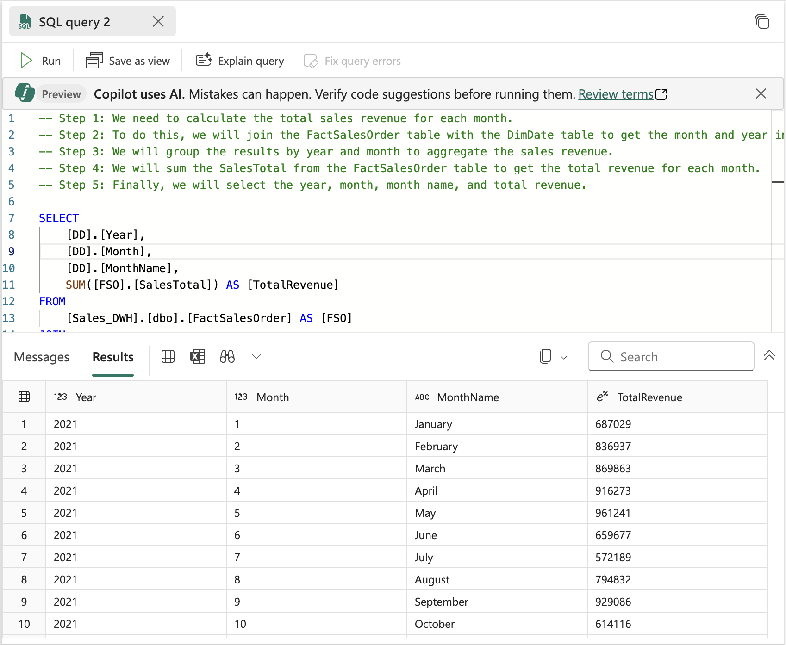

---
lab:
  title: Microsoft Fabric의 Data Warehouse에서 Copilot 사용
  module: Get started with Copilot in Fabric for Data Warehouse
---

# Microsoft Fabric의 Data Warehouse에서 Copilot 사용

Microsoft Fabric에서 데이터 웨어하우스는 대규모 분석을 위한 관계형 데이터베이스를 제공합니다. 레이크하우스에 정의된 테이블에 대한 기본 읽기 전용 SQL 엔드포인트와 달리 데이터 웨어하우스는 전체 SQL 의미 체계를 제공합니다. 여기에 테이블에 데이터를 삽입, 업데이트 및 삭제하는 기능이 포함됩니다. 이 랩에서는 Copilot을 활용하여 SQL 쿼리를 만드는 방법을 살펴봅니다.

이 연습을 완료하는 데 약 **30**분 정도 소요됩니다.

## 학습할 내용

이 랩을 마치면 다음과 같은 역량을 갖추게 됩니다.

- Microsoft Fabric에서 데이터 웨어하우스의 역할을 이해합니다.
- Fabric에서 작업 영역 및 데이터 웨어하우스를 만들고 구성합니다.
- SQL을 사용하여 샘플 데이터를 로드하고 탐색합니다.
- Copilot에서 자연어 프롬프트를 사용하여 SQL 쿼리를 생성 및 구체화하고 문제 해결을 진행합니다.
- AI 지원 SQL 생성을 활용하여 뷰를 만들고 고급 데이터 분석을 수행합니다.
- Copilot의 기능을 적용하여 데이터 탐색과 분석 작업을 가속화합니다.

## 시작하기 전에

이 연습을 완료하려면 Copilot이 사용하도록 설정된 [Microsoft Fabric Capacity(F2 이상)](https://learn.microsoft.com/fabric/fundamentals/copilot-enable-fabric)가 필요합니다.

## 연습 시나리오

이 연습에서는 소매 회사의 데이터 분석가로서 Microsoft Fabric을 사용하여 판매 성과를 더 잘 이해해 보려고 합니다. 최근 팀에서 Fabric의 데이터 웨어하우스 기능을 채택했고, 데이터 탐색 및 보고를 가속화하기 위해 Copilot을 활용하는 데 관심을 갖기 시작했습니다. 새로운 데이터 웨어하우스를 만들고, 샘플 소매 판매 데이터를 로드한 후, Copilot을 사용하여 SQL 쿼리를 생성하고 구체화합니다. 랩을 마치면 AI를 사용하여 판매 추세를 분석하고, 재사용 가능한 뷰를 만들고, 고급 데이터 분석을 수행하는 과정을 Fabric 환경 내에서 직접 경험해 볼 수 있습니다.

## 작업 영역 만들기

Fabric에서 데이터를 사용하기 전에, 먼저 Fabric이 활성화된 작업 영역을 만듭니다. Microsoft Fabric의 작업 영역은 레이크하우스, 전자 필기장, 데이터 세트를 비롯한 모든 데이터 엔지니어링 아티팩트를 구성하고 관리할 수 있는 협업 환경 역할을 합니다. 데이터 분석에 필요한 모든 리소스가 들어 있는 프로젝트 폴더라고 생각하면 됩니다.

1. 브라우저에서 [Microsoft Fabric 홈페이지](https://app.fabric.microsoft.com/home?experience=fabric)(`https://app.fabric.microsoft.com/home?experience=fabric`)로 이동하고 Fabric 자격 증명을 사용해 로그인합니다.

1. 왼쪽 메뉴 모음에서 **작업 영역**을 선택합니다(아이콘은 와 유사함).

1. Fabric 용량이 포함된 라이선스 모드(*Premium* 또는 *Fabric*)를 선택하여 원하는 이름으로 새 작업 영역을 만듭니다. *평가판*은 지원되지 않습니다.
   
    > **중요한 이유**: Copilot을 사용하려면 유료 Fabric 용량이 필요합니다. 이를 통해 이 랩 전반에서 코드 생성에 도움이 되는 AI 기반 기능에 액세스할 수 있습니다.

1. 새 작업 영역이 열리면 비어 있어야 합니다.


## 데이터 웨어하우스 만들기

작업 영역이 있으므로 이제 데이터 웨어하우스를 만들어야 합니다. Microsoft Fabric의 데이터 웨어하우스는 분석 워크로드에 최적화된 관계형 데이터베이스입니다. 트랜잭션 작업을 위해 설계된 기존 데이터베이스와 달리 데이터 웨어하우스는 대량의 데이터와 복잡한 쿼리를 효율적으로 처리하도록 구조화되어 있습니다. 새로운 웨어하우스를 만드는 바로 가기 키 찾기:

1. 왼쪽 메뉴 모음에서 **만들기**를 선택합니다. *새* 페이지의 *데이터 웨어하우스* 섹션에서 **웨어하우스**를 선택합니다. 원하는 고유한 이름. 이 이름은 작업 영역 내에서 데이터 웨어하우스를 식별하는 데 사용되므로 용도를 반영하는 설명이 포함된 항목을 선택하는 것이 좋습니다.

    >**참고**: **만들기** 옵션이 사이드바에 고정되지 않은 경우 먼저 줄임표(**...**) 옵션을 선택해야 합니다.

    1분 정도 지나면 새 웨어하우스가 만들어집니다. 프로비전 프로세스는 기본 인프라를 설정하고 분석 데이터베이스에 필요한 구성 요소를 만듭니다.

    

## 테이블 만들기 및 데이터 삽입

웨어하우스는 테이블과 기타 개체를 정의할 수 있는 관계형 데이터베이스입니다. Copilot의 기능을 보여 주려면 작업할 샘플 데이터가 필요합니다. 차원 테이블(고객, 날짜, 제품) 및 팩트 테이블(판매 주문)을 포함하여 일반적인 소매 판매 스키마를 만들어 보겠습니다. 이는 스타 스키마라고 하는 데이터 웨어하우징의 일반적인 패턴입니다.

1. **홈** 메뉴 탭에서 **새 SQL 쿼리** 단추를 사용하여 새 쿼리를 만듭니다. 이렇게 하면 Transact-SQL 명령을 작성하고 실행할 수 있는 SQL 편집기가 열립니다. 그런 다음 `https://raw.githubusercontent.com/MicrosoftLearning/mslearn-fabric/refs/heads/main/Allfiles/Labs/22c/create-dw.txt`의 Transact-SQL 코드를 복사하여 새 쿼리 창에 붙여넣습니다. 이 스크립트에는 샘플 데이터 세트를 빌드하는 데 필요한 모든 CREATE TABLE 및 INSERT 문이 포함되어 있습니다.

1. 간단한 데이터 웨어하우스 스키마를 만들고 일부 데이터를 로드하는 쿼리를 실행합니다. 스크립트를 실행하는 데 약 30초가 걸립니다. 이 과정 동안 데이터베이스 엔진은 테이블 구조를 만들고 샘플 소매 판매 데이터를 채웁니다.

1. 보기를 새로 고치려면 도구 모음의 **새로 고침** 단추를 사용합니다. 그런 다음 **탐색기** 창에서 데이터 웨어하우스의 **dbo** 스키마에 이제 다음 4개의 테이블이 포함되어 있는지 확인합니다.
   
    - **DimCustomer** - 이름과 주소를 포함한 고객 정보 포함
    - **DimDate** - 달력 정보가 있는 날짜 차원 테이블(연도, 월, 일 이름 등)
    - **DimProduct** - 범주, 이름, 가격 정보가 포함된 제품 카탈로그
    - **FactSalesOrder** - 차원 테이블에 대한 외래 키가 있는 판매 트랜잭션을 포함하는 중앙 팩트 테이블

    > **팁**: 스키마를 로드하는 데 시간이 걸리면 브라우저 페이지를 새로 고칩니다. 탐색기 창에는 데이터베이스 구조가 표시되며 테이블 및 기타 데이터베이스 개체를 쉽게 찾아볼 수 있도록 해줍니다.

## 데이터 웨어하우스 테이블 쿼리

데이터 웨어하우스는 관계형 데이터베이스이므로 SQL을 사용하여 해당 테이블을 쿼리할 수 있습니다. 그러나 복잡한 SQL 쿼리를 처음부터 작성하면 시간이 많이 걸리고 오류가 발생하기 쉽습니다. Copilot을 사용하면 SQL 쿼리를 더욱 빠르게 생성할 수 있습니다! Copilot은 인공 지능을 사용하여 자연어 요청을 이해하고 이를 적절한 SQL 구문으로 변환하여 데이터 분석에 더욱 쉽게 접근할 수 있도록 합니다.

1. 현재 **SQL 쿼리 1**을 닫습니다. 이렇게 하면 작업 영역이 지워지므로 Copilot을 사용하여 쿼리를 생성하는 데 집중할 수 있습니다.

1. 홈 리본에서 Copilot 옵션을 선택합니다. 그러면 AI와 상호 작용하여 쿼리를 생성할 수 있는 Copilot 도우미 창이 열립니다.

    

1. Copilot이 무엇을 할 수 있는지부터 먼저 살펴보겠습니다. `What can Copilot do?`라는 레이블이 지정된 제안을 클릭하고 프롬프트를 전송해 보세요.

    출력을 읽고 Copilot이 현재 미리 보기 단계에 있으며 브레인스토밍, SQL 쿼리 생성, 쿼리 설명, 수정 등에 도움을 줄 수 있는지 확인하세요.
    
    
    
1. 월별 매출을 분석하는 것을 목표로 하고 있습니다. 이는 일반적인 비즈니스 요구 사항입니다. 시간에 따른 매출 추세를 이해하면 계절적 패턴, 성장 추세, 성과 지표를 파악하는 데 도움이 됩니다. 다음 프롬프트를 입력하고 전송합니다.

    ```copilot-prompt
    /generate-sql Calculate monthly sales revenue
    ```

1. 생성된 출력을 검토하세요. 사용자 환경과 Copilot의 최신 업데이트에 따라 약간 다를 수 있습니다. Copilot이 요청을 어떻게 해석하고 팩트 테이블과 차원 테이블 간에 적절한 JOIN 문을 만들어 월별 판매 데이터를 집계하는지 살펴보세요.

1. 쿼리의 오른쪽 상단에 있는 **코드 삽입** 아이콘을 선택하세요. 이렇게 하면 Copilot 창에서 생성된 SQL이 SQL 편집기로 전송되어 실행할 수 있습니다.

    

1. 쿼리 위의 ▷ **실행** 옵션을 선택하여 쿼리를 실행하고 출력을 관찰합니다. 각 기간별로 판매 데이터가 어떻게 집계되는지 보여 주는 월별 매출 총액을 확인해야 합니다.

    

1. **새 SQL 쿼리**를 만들고 결과에 월 이름과 판매 지역도 포함하도록 후속 질문을 하세요. 이는 Copilot에서 이전 요청을 기반으로 보다 자세한 분석을 만들어 쿼리를 반복적으로 구체화하는 방법을 보여 줍니다.

    ```copilot-prompt
    /generate-sql Retrieves sales revenue data grouped by year, month, month name and sales region
    ```

1. **코드 삽입** 아이콘을 선택하고 ▷ 쿼리를 **실행**합니다. 반환되는 출력을 관찰해 보세요. Copilot이 핵심 수익 계산 논리를 유지하면서 추가 차원을 포함하도록 쿼리를 어떻게 조정하는지 살펴보세요.

1. Copilot에게 다음 질문을 하여 이 쿼리에서 뷰를 만들어 보겠습니다. 뷰는 쿼리 논리를 저장하는 가상 테이블로, 복잡한 쿼리를 더 쉽게 재사용하고 보고 및 분석을 위해 일관된 데이터 액세스 패턴을 제공하기 쉽게 도와줍니다.

    ```copilot-prompt
    /generate-sql Create a view in the dbo schema that shows sales revenue data grouped by year, month, month name and sales region
    ```

1. **코드 삽입** 아이콘을 선택하고 ▷ 쿼리를 **실행**합니다. 생성하는 출력을 검토하세요. 

    SQL 문에 데이터베이스 이름이 접두사로 포함되어 있기 때문에 쿼리가 성공적으로 실행되지 않습니다. 이는 데이터 웨어하우스에서 뷰를 정의할 때 허용되지 않습니다. 이는 다양한 데이터베이스 플랫폼에서 작업할 때 흔히 발생하는 구문 오류로, 한 환경에서는 잘 작동하는 것이 다른 환경에서는 조정이 필요할 수도 있습니다.

1. **쿼리 오류 수정** 옵션을 선택하세요. Copilot이 쿼리를 어떻게 수정하는지 살펴보세요. 이는 Copilot의 강력한 기능 중 하나를 보여 줍니다. 쿼리를 생성할 수 있을 뿐만 아니라 구문 오류를 자동으로 해결하고 수정할 수도 있습니다.

    
    
    다음은 수정된 쿼리의 예입니다. 변경된 내용을 설명하는 `Auto-Fix` 주석을 살펴보세요.
    
    ```sql
    -- Auto-Fix: Removed the database name prefix from the CREATE VIEW statement
    CREATE VIEW [dbo].[SalesRevenueView] AS
    SELECT 
        [DD].[Year],
        [DD].[Month],
        [DD].[MonthName],
        -- NOTE: I couldn't find SalesRegion information in your warehouse schema
        SUM([FS1].[SalesTotal]) AS [TotalRevenue]
    FROM 
        [dbo].[FactSalesOrder] AS [FS1] -- Auto-Fix: Removed the database name prefix
    JOIN 
        [dbo].[DimDate] AS [DD] ON [FS1].[SalesOrderDateKey] = [DD].[DateKey] -- Auto-Fix: Removed the database name prefix
    -- NOTE: I couldn't find SalesRegion information in your warehouse schema
    GROUP BY 
        [DD].[Year],
        [DD].[Month],
        [DD].[MonthName]; 
    ```
    
    Copilot이 구문 오류를 수정했을 뿐만 아니라 변경 내용을 설명하고 현재 스키마에서 판매 지역 정보를 사용할 수 없다는 점을 알려주는 유용한 주석을 제공했다는 점에 주목하세요.

1. 범주별로 구성된 자세한 제품 목록을 검색하는 다른 프롬프트를 입력해 보세요. 이 쿼리는 그룹 내의 데이터 순위를 지정하기 위한 윈도우 함수와 같은 고급 SQL 기능을 보여 줍니다. 각 제품 범주별로 판매 가능한 제품과 그 가격을 표시하고, 각 범주 내에서 가격에 따라 순위를 지정해야 합니다. 

    ```copilot-prompt
    /generate-sql Retrieve a detailed product listing, organized by category. For each product category, it should display the available products along with their list prices and rank them within their respective categories based on price. 
    ```

1. **코드 삽입** 아이콘을 선택하고 ▷ 쿼리를 **실행**합니다. 반환되는 출력을 관찰해 보세요. 

    이렇게 하면 동일한 범주 내의 제품을 쉽게 비교할 수 있으므로 가장 비싼 제품과 가장 저렴한 제품을 파악하는 데 도움이 됩니다. 순위 기능은 제품 관리, 가격 분석, 재고 결정에 특히 유용합니다.

## 요약

이 연습에서는 여러 테이블이 포함된 데이터 웨어하우스를 만들었습니다. Copilot를 사용하여 SQL 쿼리를 생성하고 데이터 웨어하우스의 데이터를 분석했습니다. AI가 복잡한 SQL 쿼리를 작성하는 프로세스를 가속화하고, 오류를 자동으로 수정하고, 데이터를 보다 효율적으로 탐색하는 데 어떻게 도움이 되는지 경험해 보셨을 것입니다.

이 랩을 통해 다음 내용을 배웠습니다.
- 자연어 프롬프트를 활용하여 SQL 쿼리 생성
- Copilot의 오류 수정 기능을 사용하여 구문 문제 해결
- AI 지원을 통해 뷰 및 복잡한 분석 쿼리 만들기
- 데이터 분석을 위해 순위 함수 및 그룹화 적용

## 리소스 정리

Microsoft Fabric 데이터 웨어하우스에서 Copilot 탐색을 마쳤다면 이 연습을 위해 만든 작업 영역을 삭제할 수 있습니다.

1. 브라우저에서 Microsoft Fabric으로 이동합니다.
1. 왼쪽 막대에서 작업 영역의 아이콘을 선택하여 포함된 모든 항목을 봅니다.
1. **작업 영역 설정**을 선택하고 **일반** 섹션에서 아래로 스크롤하여 **이 작업 영역 제거**를 선택합니다.
1. **삭제**를 선택하여 작업 영역을 삭제합니다.


