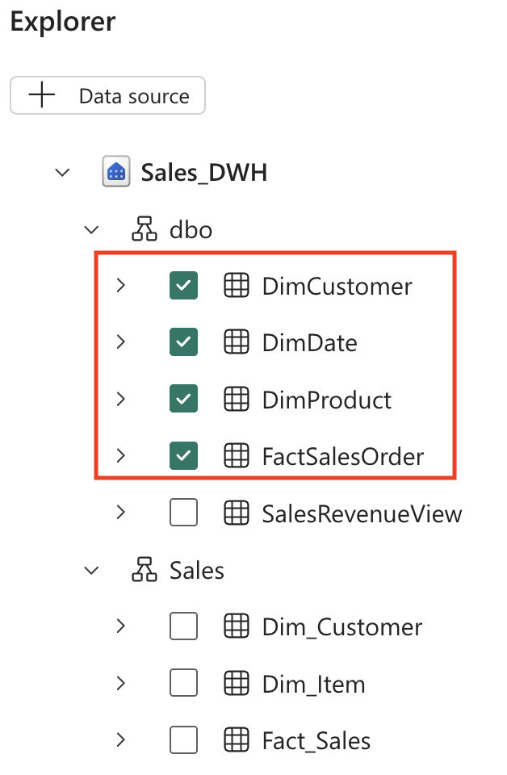

---
lab:
  title: Microsoft Fabric 데이터 에이전트를 사용하여 데이터와 채팅
  module: Implement Fabric Data Agents
---

# Microsoft Fabric 데이터 에이전트를 사용하여 데이터와 채팅

Microsoft Fabric 데이터 에이전트를 사용하면 일반 영어로 질문을 하고 사람이 읽을 수 있는 구조화된 응답을 받을 수 있으므로 데이터와 자연스럽게 상호 작용할 수 있습니다. 데이터 에이전트는 SQL(구조적 쿼리 언어), DAX(Data Analysis Expressions), KQL(Kusto 쿼리 언어)과 같은 쿼리 언어를 이해할 필요가 없도록 함으로써 기술적 수준에 관계없이 조직 전체에서 데이터 인사이트에 액세스할 수 있도록 합니다.

이 연습을 완료하는 데 약 **30**분 정도 소요됩니다.

## 학습할 내용

이 랩을 완료하면 다음과 같은 내용을 수행하게 됩니다.

- 자연어 데이터 분석을 위한 Microsoft Fabric 데이터 에이전트의 목적과 이점을 알아보세요.
- Fabric 작업 영역 및 데이터 웨어하우스를 만들고 구성하는 방법을 알아봅니다.
- 스타 스키마 판매 데이터 세트를 로드하고 탐색하는 실습 경험 기회를 얻어 보세요.
- 데이터 에이전트가 일반 영어 질문을 SQL 쿼리로 변환하는 방법을 알아보세요.
- 효과적인 분석적 질문을 하고 AI가 생성한 결과를 해석하는 기술을 개발하세요.
- AI 도구를 활용하여 데이터 액세스 및 인사이트를 대중화하는 데 자신감을 쌓으세요.

## 시작하기 전에

이 연습을 완료하려면 Copilot이 사용하도록 설정된 [Microsoft Fabric Capacity(F2 이상)](https://learn.microsoft.com/fabric/fundamentals/copilot-enable-fabric)가 필요합니다.

## 연습 시나리오

이 연습에서는 판매 데이터 웨어하우스를 만들고, 일부 데이터를 로드한 다음, Fabric 데이터 에이전트를 만듭니다. 그런 다음, 다양한 질문을 하고 데이터 에이전트가 어떻게 자연어를 SQL 쿼리로 변환하여 인사이트를 제공하는지 살펴보겠습니다. 이 실습 접근 방식은 심층적인 SQL 지식 없이도 AI 지원 데이터 분석의 기능을 보여 줍니다. 이제 시작해 보겠습니다!

## 작업 영역 만들기

Fabric에서 데이터를 사용하기 전에, 먼저 Fabric이 활성화된 작업 영역을 만듭니다. Microsoft Fabric의 작업 영역은 레이크하우스, 전자 필기장, 데이터 세트를 비롯한 모든 데이터 엔지니어링 아티팩트를 구성하고 관리할 수 있는 협업 환경 역할을 합니다. 데이터 분석에 필요한 모든 리소스가 들어 있는 프로젝트 폴더라고 생각하면 됩니다.

1. 브라우저에서 [Microsoft Fabric 홈페이지](https://app.fabric.microsoft.com/home?experience=fabric)(`https://app.fabric.microsoft.com/home?experience=fabric`)로 이동하고 Fabric 자격 증명을 사용해 로그인합니다.

1. 왼쪽 메뉴 모음에서 **작업 영역**을 선택합니다(아이콘은 와 유사함).

1. Fabric 용량이 포함된 라이선스 모드(*Premium* 또는 *Fabric*)를 선택하여 원하는 이름으로 새 작업 영역을 만듭니다. *평가판*은 지원되지 않습니다.
   
    > **중요한 이유**: Copilot을 사용하려면 유료 Fabric 용량이 필요합니다. 이를 통해 이 랩 전반에서 코드 생성에 도움이 되는 AI 기반 기능에 액세스할 수 있습니다.

1. 새 작업 영역이 열리면 비어 있어야 합니다.


## 데이터 웨어하우스 만들기

작업 영역이 있으므로 이제 데이터 웨어하우스를 만들어야 합니다. 데이터 웨어하우스는 다양한 출처에서 가져온 구조적 데이터를 저장하는 중앙 집중식 리포지토리로, 분석 쿼리와 보고를 위해 최적화되어 있습니다. 이번 실습에서는 데이터 에이전트 상호 작용의 기반이 될 간단한 판매 데이터 웨어하우스를 만들어 보겠습니다. 새로운 웨어하우스를 만드는 바로 가기 키 찾기:

1. 왼쪽 메뉴 모음에서 **만들기**를 선택합니다. *새* 페이지의 *데이터 웨어하우스* 섹션에서 **웨어하우스**를 선택합니다. 원하는 고유한 이름.

    >**참고**: **만들기** 옵션이 사이드바에 고정되지 않은 경우 먼저 줄임표(**...**) 옵션을 선택해야 합니다.

    1분 정도 지나면 새 웨어하우스가 만들어집니다.

    

## 테이블 만들기 및 데이터 삽입

웨어하우스는 테이블과 기타 개체를 정의할 수 있는 관계형 데이터베이스입니다. 데이터 에이전트를 유용하게 만들려면 샘플 판매 데이터를 채워 넣어야 합니다. 실행할 스크립트는 차원 테이블(설명적 특성 포함) 및 팩트 테이블(측정 가능한 비즈니스 이벤트 포함)이 있는 일반적인 데이터 웨어하우스 스키마를 만듭니다. 이 스타 스키마 디자인은 데이터 에이전트가 생성할 분석 쿼리에 최적화되어 있습니다.

1. **홈** 메뉴 탭에서 **새 SQL 쿼리** 단추를 사용하여 새 쿼리를 만듭니다. 그런 다음 `https://raw.githubusercontent.com/MicrosoftLearning/mslearn-fabric/refs/heads/main/Allfiles/Labs/22d/create-dw.txt`의 Transact-SQL 코드를 복사하여 새 쿼리 창에 붙여넣습니다.

    > **이 스크립트의 기능**: 이 스크립트는 고객 정보, 제품 세부 정보, 날짜 차원, 판매 트랜잭션을 포함하는 완전한 판매 데이터 웨어하우스를 생성합니다. 이 현실적인 데이터 세트를 사용하여 데이터 에이전트에게 의미 있는 비즈니스 질문을 할 수 있습니다.

1. 간단한 데이터 웨어하우스 스키마를 만들고 일부 데이터를 로드하는 쿼리를 실행합니다. 스크립트를 실행하는 데 약 30초가 걸립니다.

1. 보기를 새로 고치려면 도구 모음의 **새로 고침** 단추를 사용합니다. 그런 다음 **탐색기** 창에서 데이터 웨어하우스의 **dbo** 스키마에 이제 다음 4개의 테이블이 포함되어 있는지 확인합니다.
   
    - **DimCustomer** - 이름, 위치, 연락처 세부 정보를 포함한 고객 정보
    - **DimDate** - 시간 기반 분석을 위한 회계 연도, 분기, 월과 같은 날짜 관련 특성 포함
    - **DimProduct** - 이름, 범주, 가격 등의 제품 정보 포함
    - **FactSalesOrder** - 고객, 제품, 날짜를 연결하는 실제 판매 트랜잭션 포함

    > **팁**: 스키마를 로드하는 데 시간이 걸리면 브라우저 페이지를 새로 고칩니다.

## Fabric 데이터 에이전트 만들기

Fabric 데이터 에이전트는 데이터에 대한 자연어 질문을 이해하고, 이에 답하기 위한 적절한 쿼리를 자동으로 생성할 수 있는 AI 기반 도우미입니다. 이를 통해 사용자는 SQL, KQL, DAX 구문을 알 필요 없이 정확한 데이터 기반의 인사이트를 얻을 수 있습니다. 데이터 에이전트를 만들고 구성해 보겠습니다.

1. 새 데이터 에이전트를 만듭니다.
   
    

1. **`sales-data-agent`** 와 같은 이름을 지정하세요.

    > **이름 지정의 중요성**: 설명적인 이름은 이 데이터 에이전트의 목적과 범위를 이해하는 데 도움이 됩니다. 특히 서로 다른 데이터 도메인에 대해 여러 에이전트를 관리할 때 유용합니다.
    
    

1. **데이터 원본 추가**를 선택합니다. 

    

1. 이전에 만든 데이터 웨어하우스를 선택하세요.

    > **데이터에 연결하기**: 스키마와 관계를 이해하려면 데이터 에이전트가 테이블에 액세스해야 합니다. 이렇게 하면 질문에 따라 정확한 SQL 쿼리를 생성할 수 있습니다.

1. 데이터 웨어하우스를 확장하고 **DimCustomer**, **DimDate**, **DimProduct**, **FactSalesOrder**를 확인합니다.

    > **테이블 선택 전략**: 네 개의 테이블을 모두 선택하면 데이터 에이전트에게 전체 데이터 모델에 대한 액세스 권한을 부여하게 됩니다. 이를 통해 고객 위치별 매출 추세나 시간 경과에 따른 제품 성과 등 여러 테이블에 걸친 복잡한 질문에 답할 수 있게 됩니다.

    

## 질문하기

이제 실험을 시작하고 데이터 에이전트에 질문을 할 때입니다. 이 섹션에서는 자연어를 SQL 쿼리로 변환하여 기술적인 SQL 지식이 없는 사용자도 데이터 분석에 액세스할 수 있도록 하는 방법을 보여 줍니다. 각 질문에는 생성된 답변과 기본 쿼리가 모두 표시됩니다.

1. 다음 프롬프트를 입력하여 질문해 보세요. 

    ```copilot-prompt
    How many products did we sell by fiscal year?
    ```

    그 결과 나온 답변은 다음과 같습니다. 2021 회계 연도에는 총 12,630개의 제품을 판매하였고, 2022 회계 연도에는 13,336개의 제품을 판매하였습니다.

1. 완료된 단계와 해당 하위 단계를 확장합니다. 이렇게 하면 데이터 에이전트가 질문에 답하기 위해 생성한 SQL 쿼리를 보여 줍니다.

    > **학습 기회**: 생성된 SQL을 검토하면 데이터 에이전트가 질문을 어떻게 해석했는지 이해하고 기본 데이터 관계에 대해 알아볼 수 있습니다. 이러한 투명성은 AI에서 생성된 결과에 대한 신뢰를 구축합니다.
    
    
    
    Copilot은 사용자 환경과 Copilot의 최신 업데이트에 따라 약간 다를 수 있는 다음 SQL 코드를 생성합니다.
    
    ```sql
    SELECT d.Year, SUM(f.Quantity) AS TotalProductsSold
    FROM dbo.FactSalesOrder f
    JOIN dbo.DimDate d ON f.SalesOrderDateKey = d.DateKey
    GROUP BY d.Year
    ORDER BY d.Year;
    ```

    > **SQL 설명**: 이 쿼리에서는 팩트 테이블(FactSalesOrder)을 날짜 차원(DimDate)과 조인하여 연간 매출을 그룹화하고 수량을 합산합니다. 데이터 에이전트가 "판매된 제품"이 수량 필드를 의미하고 "회계 연도"가 날짜 차원의 연도 필드에 매핑된다는 것을 자동으로 이해한 방식에 주목하세요.

1. 다음 질문을 계속 진행하세요. 

    ```copilot-prompt
    What are the top 10 most popular products all time?
    ```

    > **예상되는 결과**: 이 질문은 데이터 에이전트가 어떻게 순위를 지정하고, 판매 데이터와 제품 정보를 결합하여 베스트셀러를 식별할 수 있는지를 보여 줍니다.

1. 다음 질문: 

    ```copilot-prompt
    What are the historical trends across all my data?
    ```

    > **고급 분석**: 이 광범위한 질문은 데이터 에이전트가 어떻게 여러 차원에 걸쳐 추세 분석을 제공할 수 있는지를 보여 줍니다. 판매, 고객 행동, 제품 성능의 시간 기반 패턴을 포함될 수 있습니다.

1. 추가적으로 데이터의 다른 측면을 탐색하는 질문 던지기:

    ```copilot-prompt
    In which countries are our customers located?
    ```
    
    ```copilot-prompt
    How many products did we sell in the United States?
    ```
    
    ```copilot-prompt
    How much revenue did we make in FY 2022?
    ```
    
    ```copilot-prompt
    How much was our total sales revenue, by fiscal year, fiscal quarter and month name?
    ```

    > **전문가 팁**: 이러한 각 질문은 지리적 분석, 필터링된 집계, 수익 계산, 계층적 시간 분석과 같은 다양한 분석 시나리오를 대상으로 합니다. 다양한 질문 스타일에 데이터 에이전트가 어떻게 적응하는지 확인하려면 다양한 변형을 실험해 보세요.

## 데이터 구조 이해

질문을 실험할 때 다음과 같은 데이터 특성을 염두에 두면 더욱 구체적인 질문을 할 수 있습니다.

- **회계 연도 타이밍**: 회계 연도는 7월(7번째 달)에 시작됩니다. 따라서 1분기는 7월~9월, 2분기는 10월~12월, 3분기는 1월~3월, 4분기는 4월~6월입니다.

- **고객 ID**: CustomerAltKey 필드에는 고객의 메일 주소가 포함되어 있으며, 이는 고객별 쿼리에 유용할 수 있습니다.

- **통화**: 모든 정가 및 판매 합계는 GBP(영국 파운드)로 표시됩니다.

- **데이터 관계**: FactSalesOrder 테이블은 외래 키를 통해 고객, 제품, 날짜를 ​​연결하여 복잡한 다차원 분석을 가능하게 합니다.

> **추가 실험**: "2022년 회계 연도 1분기 매출은 얼마였나요?"와 같이 이러한 요소를 결합하는 질문을 해보세요. 또는 "영국에서 가장 비싼 제품을 구매한 고객은 누구였을까요?" 데이터 에이전트는 이러한 질문에 대답하는 데 필요한 복잡한 조인 및 계산을 자동으로 처리합니다.

## 요약

축하합니다! 다음을 성공적으로 수행했습니다.

- 실제 판매 데이터 세트를 사용하여 **Fabric 작업 영역**과 데이터 웨어하우스를 생성했습니다.
- **데이터 에이전트를 구축하고 구성**하여 자연어로 데이터를 질문할 수 있도록 했습니다.
- **AI 기반 데이터 분석**을 통해 일반적인 영어로 질문을 던지고, 그 질문이 SQL 쿼리로 변환되는 방식을 경험했습니다.
- **다양한 유형의 분석 질문**을 탐색하여 단순한 집계부터 복잡한 추세 분석까지 진행했습니다.

### 핵심 내용

- **데이터 액세스 대중화**: 데이터 에이전트는 사용자의 SQL 지식에 관계없이 분석에 액세스할 수 있도록 합니다.
- **투명성과 신뢰**: 생성된 SQL을 검사하여 질문에 어떻게 답변하는지 항상 이해할 수 있습니다.
- **자연어 유연성**: AI는 질문의 문구 변형과 사소한 오타까지도 처리할 수 있습니다.
- **복잡한 쿼리 생성**: 에이전트는 자연어 입력에 따라 조인, 집계, 필터를 자동으로 처리합니다.

### 다음 단계

다음을 살펴보는 것이 좋습니다.

- **사용자 지정 지침**: 데이터 에이전트의 응답을 개선하기 위해 비즈니스별 컨텍스트 추가
- **추가 데이터 원본**: 더 많은 테이블이나 데이터 세트를 연결하여 에이전트의 지식 확장
- **고급 질문**: 여러 기간, 고객 세그먼트, 제품 범주와 관련된 더 복잡한 분석 시나리오 시도
- **통합**: 보고서, 대시보드, 비즈니스 애플리케이션에 데이터 에이전트 인사이트 포함

Fabric 데이터 에이전트는 조직 전반에 걸친 데이터 인사이트를 실제로 활용할 수 있도록 하는 데 중요한 역할을 하며, 데이터와 의사 결정 간의 격차를 해소합니다.
